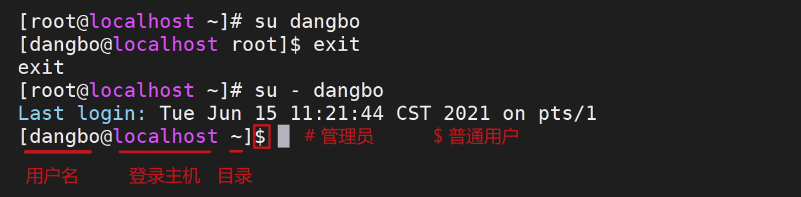
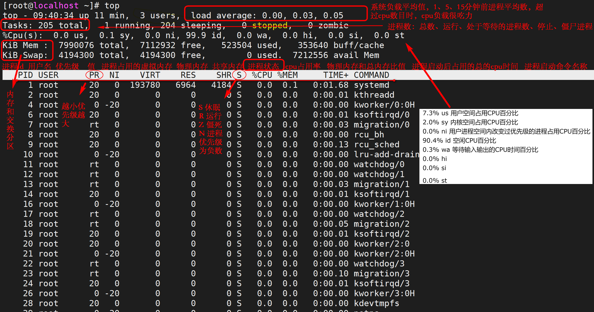

# Linux(CentOS)

## 1. 常用命令

### 1.1 基础命令

```sh
################################ 文件、目录 ##################################

ls -al              # 查看文件， -h 显示大小
drwxr-xr-x          # 第一个字符 d-目录，-代表文件，l代表软链接line file， 所有者：同组用户：其他用户
umask -S 			# 查看或设置文件默认权限，-S是以rwx形式显示新建文件缺省权限 文件666 目录777，默认情况中，文件是没有可执行（x）权限，缺省创建的文件是没有可执行权限x的

cat nl more tac     # 查看文件，tac倒叙，nl显示行号，more分页查看，向下看一行enter，分页空格
less                # 和more差不多，但是可以往前翻页，空格和上下键分页，q退出，向下搜索 /字符串 向上搜索 ?字符串，n搜索下一个，N上一个
cat /etc/passwd | cut -d : -f 1          #  查看系统中的所有用户
head -n 20          # 输出前20行
tail -f -n 20       # -f 滚动输出 tail -n 10 显示最后10行 tail -n +10  从第10行开始，显示10行以后的

scp local_file remote_username@remote_ip:remote_folder      # 远程复制 -r 复制目录 -p 保留文件属性(复制的文件修改时间与原文件相同)
rsync               # 增量同步工具，支持断点续传、差异传输，适合大文件或频繁更新的场景。需要单独安装。
                    # 默认情况下，rsync 使用 mtime + 文件大小 来判断文件是否需要同步
                    # -a：归档模式（递归并保留几乎所有属性）。
                    # -v：详细输出。
                    # -z：压缩传输。
                    # --no-times：不保留远程时间戳。
                    # --no-perms：不保留权限。
                    # --no-owner：不保留所有者。
                    # --no-group：不保留所属组。
                    # -h：以人类可读的格式显示传输进度。
                    # --delete：删除目标目录中源目录不存在的文件（保持完全同步）。
                    # --exclude=PATTERN：排除匹配模式的文件。
                    # --progress：显示传输进度。
                    # --files-from="$RSYNC_FILE_LIST"  从文件列表中读取要传输的文件路径。
                    # --relative 保留源文件的相对路径结构。
rsync -avzh --progress --delete local_file remote_username@remote_ip:remote_folder  
cp
mv                  # 移动，也可以修改文件名称
mkdir               # 创建文件夹，-p父目录不存在，则会创建
touch               # 创建文件
echo                # 控制台输出，也可以输出到文件中

vim                 # 文本编辑器，如果不存在，则创建，存在则修改 q退出、w保存 常用:wq、:wq!、:q、:q!
                    # 三种模式：底线模式、命令模式、编辑（输入）模式
                    #   :数字+enter光标定位到第几行  :set nu 设置行号 :set ic 忽略大小写  G最后一行 gg第一行 $ 行尾  0 行首
                    #   x 删除光标所在处字符、dG 删除光标所在行到文件末尾 D 删除光标所在位置到行尾
                    #   r 取代光标所在字符  R从光标位置开始替换字符，ESC结束
                    dd yy p粘贴在行下 u恢复上一次操作  :9,15 copy(cp\mv) 16
                    #   搜索 ？/ 。 /表示向下（从光标到文件末尾），?表示向上，n表示沿当前搜索方向继续查找，N表示沿相反方向查找
                    #   dd删除一整行
                    #   :%s/old/new/g 全文替换字符串     :n1,n2s/old/new/g   在一定范围内替换字符串
                    #   r ！命令 # 导入命令执行结果
                    #   定义快捷键：map 快捷键 触发命令  永久生效：/root/.vimrc
                    #   插入： A 行尾 I 行首  i字符前面 a字符后边 o光标下插入新行

date                # 查看时间，date +%F yyyy-MM-dd   date + '%F %T' yyyy-MM-dd HH:mm:ss   -d  将date以字符串显示，没有的话为当前时间
date +%s            # 当前时间的秒值
date +%s -d "$datetime"       # 指定时间的秒值，将日期格式转换为秒
date +%F -d "1970-01-01 UTC $time2 seconds"   # 将时间戳转换为日期


find  path -name    # -name 按照名称搜索 -i 忽略大小写
                    # -size +204800（此处为100MB，单位为数据块0.5KB） + - 不写 大于小于等于
                    # -a 与、-o 或
                    # -cmin 查找30分钟内被修改过属性的文件和目录 -mmin 文件内容 modify -amin 访问时间 access
                    # -type 根据文件类型查找 f文件d目录l软链接 单独使用的时候不能加搜索文件的名
                    # -exec/-ok 命令 {} \; 对搜索到的结果执行命令操作，注意点：中括号后边需要增加空格，结束的分号必须写，要不然\当作换行
                    # -newermt "$LAST_PUSH_TIME" 只返回修改时间（Modification Time）晚于 $LAST_PUSH_TIME 的文件
find . -inum 917817 -exec rm {} \;
如果搜索报错find: paths must precede expression: xxxx，搜索的字段添加引号，或者注意选项和路径的顺序
find . -type f -name "*.xlsx" | wc -l
find . -type f -mtime +365 -exec rm -f {} \;
find . -type f -newermt "$LAST_PUSH_TIME"
stat aa.txt        # 显示文件状态
locate             # 在文件资料库中查找文件（速度快，类似与windows的everything），但是需要同步updatedb，且locate不对tmp临时目录中的文件与目录进行查找
which               # 搜索命令所在目录以及别名信息
whereis             # 搜索命令所在目录以及帮助文档路径，其中 xxx.1 表示命令的帮助、xxx.5表示配置文件的帮助

whatis              # 查看命令是什么，简短信息。  whatis 等同于 man -f
apropos             # 查看关键字的简短信息描述，和whatis是差不多的，正则匹配关键字，比较全！ man -k 命令  等同apropos
man                 # 帮助查询linux内置命令，也可以查询linux外部命令，q退出

info
help                # 获得Shell内置命令（umask、cd）的帮助信息，找不到命令路径的命令都是Shell内置命令
--help              # 显示可执行程序自带的信息，是嵌入到程序本身的，所以--help信息较简短
type                # 判断命令shell内置命令还是外置命令。 type -a
enable              # 判断命令shell内置命令还是外置命令。 enable -a 查看所有内置命令

w                   # 查看登录用户的详细信息
who                 # 查看登录用户
last                # 列出目前与过去登入系统的用户信息
lastlog             # 检查某特定用户上次登录的时间 -u 特定登录用户的记录信息
traceroute          # 显示数据包到主机间的路径（跟踪路径）？

################################ 用户、用户组、密码 ##################################
useradd             # 添加用户，-g组，-s登录命令，-d家目录，如 useradd -g sftp -s /sbin/nologin sftpuser
userdel -r          # 删除用户
usermod             # 修改用户信息
usermod -d /home/<username> <username>    # 修改用户的家目录路径

groupadd            # 添加用户组
groupdel
groupmod

passwd              # 修改自身的密码
passwd userName     # root修改密码
sudo passwd         # 修改 root 密码
echo 123|passwd --stdin userName    # 修改用户密码为123

id username         # 判断用户是否存在
id -u               # 等于0表示admin
# 查询dangbo用户是否存在，$?表示上一条命令执行后返回的状态；0表示执行正常，非0表示执行异常或错误
cat /etc/passwd | cut -d : -f 1 | grep 'dangbo'; echo $?

wirte               # 给用户发信息，以ctrl+D保存结束，ctrl+backspace 进行删除
mail root           # 发邮件，以ctrl+D保存结束，ctrl+backspace 进行删除；echo "system date failed" |mail -s 'check system date'  root@localhost
mail                # 在目标用户中进行接收，之后输入 1 进行邮件具体内容查看，d 1 进行邮件删除，q 退出
wall 'message'      # 发广播信息

ping -c 3 19.168.100.19    # 只进行ping三次

shutdown                # 关机重启 -c 取消前一个关机命令 -h 关机  -h row -r重启
logout                  # 退出登录
halt/init 0/poweroff    # 关机
reboot/init 6           # 重启，init改变操作系统的运行级别；查看系统运行级别：cat /etc/inittab  # 默认是3。

|                                # 管道符
wget                             # 下载链接
sudo                             # 以系统管理者的身份执行指令

ls -h &>> xx.txt
ls -h >> xx.txt 2>&1		         # 将输出结果保存到文件
ls -h >>						         # 正确结果保存到文件
ls -h 2>>						      # 错误结果保存到文件
>                                    # 覆盖（文件会自动创建）
>>                                   # 追加（文件会自动创建）
read ip < xx.txt                     # 输入

sort 		            # 升序排序，将文件的每一行作为一个单位，从首字符向后，依次按ASCII码值进行比较。
    -u ：去除重复行
    -r ：降序排列，默认是升序
    -o : 将排序结果输出到文件中,类似重定向符号>
    -n ：以数字排序，默认是按字符排序
    -t ：分隔符
    -k ：以第N列作为排序条件
    -b ：忽略前导空格。
    -R ：随机排序，每次运行的结果均不同

uniq  		     # 用于去除连续的重复行，-i 忽略大小写，-c 在每列旁边显示该行重复出现的次数， -d 只展示重复行  -u 仅显示出一次的行列    当重复的行不相邻时，uniq 命令是不起作用的，所以经常和sort一起使用
tee		         # 从标准输入读取并写入到标准输出和文件，即：双向覆盖重定向（屏幕输出|文本输入） -a 双向追加重定向
echo hello world|tee file1

diff 选项 文件1 文件2 		 # 用于逐行比较文件的不同，
                           # -b不检查空格 -B不检查空白行 -i不检查大小写 -w忽略所有的空格 --normal正常格式显示(默认) -c上下文格式显示       -u合并格式显示
paste		       # 用于合并文件行  -d 自定义间隔符，默认tab、 -s 串行处理，非并行
tr		          # 字符转换，替换和删除；主要用于删除文件中控制字符或进行字符转换，

history	       # 查看历史命令
ctrl+r 	       # 搜索历史命令

wc 统计行号    line=`wc -l $path |cut -d' ' -f1`    #

setup          # ip配置
```



### 1.2 firewalld、iptables

iptables：Linux 系统的防火墙：IP 信息包过滤系统，它实际上由两个组件 netfilter 和 iptables 组成。主要工作在网络层，针对 IP 数据包。体现在对包内的 IP 地址、端口等信息的处理上。

firewalld：Centos7 系统默认的防火墙管理工具，取代了之前的 iptables 防火墙，也是工作在网络层，属于包过滤防火墙。

**区别**

firewalld 和 iptables 都是用来管理防火墙的工具(属于用户态)来定义防火墙的各种规则功能，内部结构都指向 netfilter 网络过滤子系统(属于内核态)来实现包过滤防火墙功能。

1. iptables 主要是基于接口，来设置规则，从而判断网络的安全性。firewalld 是基于区域，根据不同的区域来设置不同的规则，从而保证网络的安全，与硬件防火墙的设置相类似。
2. iptables 在 /etc/sysconfig/iptables 中储存配置，firewalld 将配置储存在 /etc/firewalld/ （优先加载）和 /usr/lib/firewalld/ (默认的配置文件) 中的各种 XML 文件里。
3. iptables 防火墙类型为静态防火墙；firewalld 防火墙类型为动态防火墙。

```sh

# firewalld 查看服务状态、启动、关闭、重启
service firewalld start    systemctl start firewalld
service firewalld stop     systemctl stop firewalld
service firewalld restart  systemctl restart firewalld
systemctl status firewalld

# 查看防火墙规则
firewall-cmd --list-all          # 查看全部信息
firewall-cmd --list-ports        # 查看所有开启的端口，如果是阿里云，需要配置安全组规则！
firewall-cmd --state             # 查看防火墙状态
firewall-cmd --reload            # 更新/重启防火墙规则
firewall-cmd --zone=public --remove-port=3306/tcp --permanent  # 关闭端口命令

# redhat 7/8
# 开启端口
firewall-cmd --zone=public --add-port=8080/tcp --permanent   # 开端口命令，--zone作用域，--add-port=80/tcp添加端口，格式为：端口/通讯协议，--permanent永久生效，没有此参数重启后失效
firewall-cmd --reload                                        # 重启防火墙

# 安装，CentOS 7默认使用firewalld防火墙，没有安装iptables，若想使用iptables防火墙。必须先关闭firewalld防火墙，再安装iptables
yum -y install iptables iptables-services
iptables -L

# redhat 6
# 添加端口
## 方式一：修改系统文件，永久更改，需重启防火墙服务
vi /etc/sysconfig/iptables
-A INPUT -p tcp -m tcp --dport 5236 -j ACCEPT   # 添加 5236 端口到防火墙
service iptables save                           # 保存设置
service iptables restart                        # 重启防火墙

##方式二：命令行添加端口，永久更改，需重启防火墙服务
iptables -A INPUT -s 0.0.0.0/0.0.0.0 -p tcp --dport 5236 -j ACCEPT
service iptables save                           # 保存设置
service iptables restart                        # 重启防火墙

# 输出结果分析
[root@localhost ~]# iptables -L
# 处理进入主机流量的链。默认策略是 ACCEPT，这意味着如果没有匹配的规则，流量会被允许通过。
Chain INPUT (policy ACCEPT)
target     prot opt source               destination

# 处理转发流量的链（即流量从一个接口流向另一个接口）。默认策略是 ACCEPT，即转发流量没有被限制。
Chain FORWARD (policy ACCEPT)
# 特定的规则：
target     prot opt source               destination
DOCKER-USER  all  --  anywhere             anywhere
DOCKER-ISOLATION-STAGE-1  all  --  anywhere             anywhere
ACCEPT     all  --  anywhere             anywhere             ctstate RELATED,ESTABLISHED
DOCKER     all  --  anywhere             anywhere
ACCEPT     all  --  anywhere             anywhere
ACCEPT     all  --  anywhere             anywhere

# 处理出站流量的链，默认策略同样是 ACCEPT，允许所有流量从主机发出。
Chain OUTPUT (policy ACCEPT)
target     prot opt source               destination
# 为不同的 Docker 容器提供了特定的端口访问规则。
Chain DOCKER (1 references)
target     prot opt source               destination
ACCEPT     tcp  --  anywhere             172.17.0.2           tcp dpt:redis
ACCEPT     tcp  --  anywhere             172.17.0.3           tcp dpt:13306
ACCEPT     tcp  --  anywhere             172.17.0.4           tcp dpt:padl2sim

Chain DOCKER-ISOLATION-STAGE-1 (1 references)
target     prot opt source               destination
DOCKER-ISOLATION-STAGE-2  all  --  anywhere             anywhere
RETURN     all  --  anywhere             anywhere

Chain DOCKER-ISOLATION-STAGE-2 (1 references)
target     prot opt source               destination
DROP       all  --  anywhere             anywhere
RETURN     all  --  anywhere             anywhere

Chain DOCKER-USER (1 references)
target     prot opt source               destination
RETURN     all  --  anywhere             anywhere
```

### 1.3 telnet

<span style="color:red">经常用于测试网络及端口占用情况，默认端口为 23。</span>

Telnet 协议是 TCP/IP 协议家族中的一员，是 Internet 远程登陆服务的标准协议和主要方式。它为用户提供了在本地计算机上完成远程主机工作的能力。在终端使用者的电脑上使用 telnet 程序，用它连接到服务器。要开始一个 telnet 会话，必须输入用户名和密码来登录服务器。Telnet 是常用的远程控制 Web 服务器的方法。

使用 Telnet 协议进行远程登录时需要满足以下条件：

- 在本地计算机上必须装有包含 Telnet 协议的客户端程序；
- 必须知道远程主机的 Ip 地址或域名；
- 必须知道登录标识与口令。

虽然 Telnet 较为简单实用也很方便，但是在格外注重安全的现代网络技术中，Telnet 并不被重用。原因在于 Telnet 是一个明文传送协议，它将用户的所有内容，包括用户名和密码都明文在互联网上传送，具有一定的安全隐患，因此许多服务器都会选择禁用 Telnet 服务。

```sh
# 使用
telnet <ip> port     # 连接
ctrl + ]             # 回到telnet命令界面
quit                 # 退出telnet
telnet --help        # 联机求助
```

### 1.4 grep sed cut awk(print) seq

`在文件中搜索符合条件的内容；grep和sed是对行进行过滤提取，cut和awk是对列进行提取`

```sh
1. grep
grep                       # -i忽略大小写 -v显示不匹配的行（取非） -n显示行号 -^匹配开头行首 -E正则匹配 --color=auto
grep -v ^# /etc/inittab    # 在 inittab 文件中排除指定字串#开头的行

2. sed `流编辑器：Stream Editor。首先sed读取文件中的一行内容，把其保存在一个临时缓存区中（也称为模式空间）；然后根据需求处理临时缓冲区中的行，完成后把该行发送到屏幕上`
sed [选项] [动作] 文件名
                  -n       # 把匹配的行输出到屏幕，仅显示script处理后的结果，通常与p一起使用
                  -i       # 会直接修改源文件，要慎用
                  -e       # 以选项中指定的script来处理输入的文本文件，可以执行多条动作

                  a        # 新增，a后面接字符串，这些字符串会在新的一行出现（当前的下一行）
                  c        # 取代，c后面接字符串，这些字符串可以取代n1,n2之间的行
                  d        # 删除
                  i        # 插入，i后面接字符串，这些字符串会在新的一行出现（目前的上一行）
                  p        # 打印，以行为单位进行查询，将某个选择的数据显示。通过和-n 一起使用
                  s        # 取代，通常s的动作可以搭配正规表示；例如 1,20s/old/new/g

                           # 利用脚本的指令来处理、编辑文本文件，主要用来自动编辑一个或多个文件、简化对文件的反复操作、编写转换程序(不推荐)
sed -n '2,5p' /etc/passwd     <=>  cat /etc/passwd | sed -n '2,5p'
sed -e 4a/newLine testfile.txt               # 在testfile.txt中的四行后边插入newLine
sed -i '$a # This is a test'  testfile.txt   # 在最后一行加入# This is a test，$代表的是最后一行，而a的动作是新增
sed -i "N,Md" testfile.txt                   # 删除N-M行
sed -i "/xxx/d" testfile.txt                 # 删除包含特定字符的行
nl /etc/passwd | sed '2a drink tea'          # 第二行后(亦即是加在第三行)加上drink tea
nl /etc/passwd | sed '2i drink tea'          # 第二行前(亦即是加在第一行)加入drink tea
nl /etc/passwd | sed '2,5d'                  # 删除2-5行内容
nl /etc/passwd | sed '3,$d'                  # 删除第三行到最后一行
nl /etc/passwd | sed '2,5c No 2-5 number'    # 替换2-5行内容为 No 2-5 number
nl /etc/passwd | sed -n '5,7p'			      # 查看5-7行的内容
nl /etc/passwd | sed -n '/root/p'		      # 只输出匹配到的行，不加-n会显示所有的数据
nl /etc/passwd | sed '2a Drink tea or  ..\'  # 每一行之间都必须要以反斜杠\来进行新行的添加或者使用\n换行
nl /etc/passwd | sed -n '/root/{s/bash/blueshell/;p;q}'	# 搜索/etc/passwd,找到root对应的行，执行后面花括号中的一组命令，每个命令之间用分号分隔，这里把bash替换为blueshell，再输出这行，最后q退出
sed 's/要被取代的字串/新的字串/g'               # s表示search搜索；斜杠/表示分隔符;动作一般是打印p和全局替换g

3. cut
cut                        # -d指定分割符 -f指定截取区域 -c以字符单位进行分割；不加-d选项，默认为制表符，不是空格；一般-d和-f一起使用

4. awk
awk [选项] '命令部分' 文件名     # -F 分隔符，默认为空格 -v 定义变量并赋值,awk中调用定义的变量不需要加$
               BEGIN    	# 在读取所有行内容前就开始执行，常常被用于修改内置变量的值
	            FS    		# BEGIN时定义分割符
	            END 		   # 结束的时候执行   （在最后的时刻才会执行）
               NF 代表一行有多少个域 （也就是一行有多少个单词）
               $NF代表最后一个域 （也就是最后一个单词）
   正则(命令部分)：
   'root/{awk 语句}'   等价于sed中的   -n 'root/p'
   'NR=1,NR=5{awk 语句}'              -n '1,5/p'
   '/^root/,/^ftp/{awk 语句}'         -n '/^root/, /^ftp/p'

cat /etc/passwd | awk 'BEGIN{print "所有用户名："} BEGIN{FS=":"} {printf $1 "  "} END{print "执行结束"}'    # 查看所有用户名
df -h | grep /dev/sad1 | awk 'BEGIN{printf "/dev/sda1的使用率是： "} {print $5}'       # 查询某个盘的使用率

4.1 print 和 printf  格式化输出
# 加双引号和不加双引号的区别在于，如果入参多了，不加双引号，则原样输出，如果加了双引号，多出的入参会按照同样的格式输出；
# 如果没有arguments，那么%s用NULL代替，%d用0代替

printf 		    # 格式化输出，不会自动换行
print		    # 默认会自动换行
	%ns 字符串类型，n个字符         # %-10s 指一个宽度为10个字符（-表示左对齐，没有则表示右对齐）任何字符都会被显示在10个字符宽的字符内，如果不足则自动以空格填充，超过也会将内容全部显示出来
	%ni	整型，n个数字
    %d  # 如果以%d的格式来显示字符串，那么会有警告，提示无效的数字，此时默认置为 0
    %%  # 输出一个%
	%.nf	浮点型，n代表小数位数
	\t 制表符 tab键、\n 换行符
	$1 第一列 $0 一整行 $2 第二列
	NR 行号   df -h | awk 'NR==2 {print $5}'


5. seq               # squeue  是一个序列的缩写，主要用来输出序列化的东西
seq [选项]... 尾数   /   seq [选项]... 首数 尾数 / seq [选项]... 首数 增量 尾数     # 以指定增量从首数开始打印数字到尾数
            # -f使用printf样式的浮点格式 -s使用指定字符串分隔数字(默认：\n换行) -w在列前添加0 使得宽度相同【自动补位】
seq -s "  " 0 2 20
seq 1 4 | xargs -I{} echo {} > h.txt      # 间隔输出，且写入文件 【默认的间隔符是换行】
seq -w 1 10             # 前面补0
```

### 1.5 tar zip bzip gzip

解压缩常用命令

```sh
# 六种格式
.gz                  # 压缩gzip  解压gunzip  特点：不保留源文件，只能用来压缩文件，不能压缩目录
.zip                 # 压缩zip -r xxx.zip  解压unzip -d 
.tar                 # 压缩tar -cvf xxx.tar 文件目录；解压tar -xvf     常用于备份文件；-c打包  -x解包  -v显示详细信息  -f指定文件名 -C 指定文件目录
.tar.gz  常用        # 压缩tar -zcvf  解压 tar -zxvf， -z解压缩，等同于gzip xxx.tar
.bz2                 # 压缩：bzip2 -k 文件目录     解压 bunzip2 -k xxx.bz2    -k 产生压缩文件后保留源文件
.tar.bz2             #                             解压 tar -xjf xxx.tar.bz2
```

### 1.6 ps pgrep pstree

```sh
ps --help               # 帮助，根据提示可以使用 'ps --help <simple|list|output|threads|misc|all>' 或 'ps --help <s|l|o|t|m|a>' 进一步获取帮助。
ps                      # 查看当前系统中正在执行的各种进程信息。
ps -l                   # 以长格式显示进程信息，包括进程的优先级（PRI）、调度策略（NI）等信息。
ps -ef                  # 显示所有进程的详细信息，包括进程的所有者、启动时间、命令行等。输出格式通常包括用户（UID）、进程 ID（PID）、父进程 ID（PPID）、启动时间（STIME）、终端（TTY）、命令（CMD）等列。
ps -ef | grep java
ps -aux                 # 与-ef类似，也用于显示所有进程的详细信息，但在输出格式和内容上略有不同。它会显示进程的资源使用情况，如 CPU 使用率（% CPU）、内存使用率（% MEM）等。
ps -aux | grep mysql
ps -eLf | grep '容器名' | wc -l     # 找到项目的所占的线程数
ps -p <pid> -o etime               # 查看指定进程的运行时长

pstree -pu                         # 进程树
kill -9 pid                        # 杀死进程


pgrep命令：以名称为依据从运行进程队列中查找进程，并显示查找到的进程id
                选项
                -o：仅显示找到的最小（起始）进程号;
                -n：仅显示找到的最大（结束）进程号；
                -l：显示进程名称；
                -P：指定父进程号；pgrep -p 4764  查看父进程下的子进程id
                -g：指定进程组；
                -t：指定开启进程的终端；
                -u：指定进程的有效用户ID。
```

## 2. 常用配置文件，文件修改后需要 source 命令重新加载或退出重新登录

1. /etc/passwd 账号信息
2. /etc/group 账户组信息
3. /etc/shadow 密码信息
4. /etc/rc.d/init.d/ 自启动配置
5. /etc/profile 环境变量
6. /etc/bashrc 别名 Umask 函数
7. /etc/sysconfig/network-scripts 网络配置目录
8. /etc/redhat-replease /etc/os-release 系统版本
9. source /etc/profile 重启配置文件

- /bin：是 binary 的缩写，存放最经常使用的命令
- /etc：用来存放所有的系统管理所需要的配置文件和子目录
- /home：用户的主目录，在 linux 中，每个用户都有一个自己的目录，一般该用户是以用户的账号命令的
- /opt：主机额外安装软件的目录，默认为空
- /root：该目录为系统管理员，也称作超级权限者的用户目录
- /tmp：存放临时文件的，用完即丢，可以放安装包
- /usr：系统级的目录，存放用户的应用目录和文件，类似于 windows 下的 C:/Windows/System32 目录
- /var：存放在不断扩充着的东西，比如日志文件， 习惯将经常修改的目录放在这个目录。

## SELinux

SELinux 组件可用来加强系统安全性。在 Linux 中，SELinux 凌驾于 root 权限之上，设置了很多额外的配置项。如果了解这些配置项，可以进行相应设置，但如果不了解，那么 SELinux 可能不仅没有一些实际性的帮助，反而会带来很多不确定因素。

SELinux 有 3 种模式，分别是 Enforcing，Permissive 和 Disabled 状态。

1. Enforcing：强制模式。代表 SELinux 在运行中，且已经开始限制 domain/type 之间的验证关系；
2. Permissive：宽容模式。代表 SELinux 在运行中，不会限制 domain/type 之间的验证关系，即使验证不正确，进程仍可以对文件进行操作，但会发出警告。
3. Disabled：关闭模式。SELinux 并没有实际运行。

可以通过 setenforce 命令来设置前面两种状态，而如果想修改为 disable 状态，需要修改配置文件，同时重启系统。Enforcing 状态的值是 1，permissive 状态是 0，因此设置为 permissive，命令为：setenforce 0|1。

```sh
# 临时关闭 SELinux
setenforce 0
# 临时开启 SELinux
setenforce 1
# 查看当前状态命令
getenforce
# 永久关闭 SELinux 需修改配置文件：/etc/selinux/config，修改 SELINUX=disabled
cat /etc/selinux/config
# 修改 SELinux 永久关闭，必须重启服务器，才能生效。且永久关闭后，不能通过 setenforce 1 命令临时打开。
```

## 6. 安装软件

> 默认安装在 /usr/local 用户级的程序目录下，可以理解为 C:/Progrem Files，用户自己编译的软件默认会安装到这个目录下。

> /opt：用户级的程序目录，可以理解为 D:/Software，一般三方大型软件安装在该目录下。

RPM(Red Hat Package Manager)，是基于 Red hat 的 Linux Distribution 的包管理系统。

rpm 包主要用于 redhat 及分支如 redhat，centos，Fedora 等，而 deb 包主要用于 debian 及分支如 debian，ubuntu 等。

```sh
# 1. 使用压缩包安装
tar -zxvf xxx.tar.gz
./configure --prefix=/usr/local/xxx # 配置安装路径，默认安装在/usr/local/bin/
make                                # 编译，将人类可读的源代码（如 C/C++ 代码）转换为计算机可执行的二进制文件。
make install                        # 安装， make install PREFIX=/usr/local/xxx可以替代./configure命令

# 2. yum在线安装
/etc/yum.repos.d/CentOS-Base.repo       # 镜像源地址
yum -y install xxx # yum install 安装命令: -y所有的提示都为y，--installroot指定安装路径，--downloadonly只下载，不安装，默认下载路径：/var/cache/yum/x86_64/7/base/packages/，list查看所有安装列表，search搜索关键字对应的包
yum -y update 包名							 # 升级
yum list                                # 查询所有可用软件包列表
yum grouplist                           # 列出所有可用的软件组列表
yum list installed                      # 仅列出已安装的包
yum clean all     # 清理缓存
yum makecache     # 重新生成yum缓存文件
yum update        # 升级更新包
yum remove -y gcc-c++    # 卸载，需要删除残留文件，执行：find / -name "*gcc-c++*" 2>/dev/null

# 更换镜像源
mv /etc/yum.repos.d/CentOS-Base.repo /etc/yum.repos.d/CentOS-Base.repo.backup             # 备份
mv /etc/yum.repos.d/CentOS-Linux-Base.repo /etc/yum.repos.d/CentOS-Linux-Base.repo.backup # 备份，CentOS8中的原始镜像，还需要备份CentOS-Linux-AppStream.repo
wget -O /etc/yum.repos.d/CentOS-Base.repo https://mirrors.aliyun.com/repo/Centos-7.repo                 # 下载镜像源 CentOS7
wget -O /etc/yum.repos.d/CentOS-Base.repo https://mirrors.aliyun.com/repo/Centos-vault-8.5.2111.repo    # 下载镜像源
curl -o /etc/yum.repos.d/CentOS-Base.repo https://mirrors.aliyun.com/repo/Centos-vault-8.5.2111.repo    # 下载镜像源
yum clean all                                                                             # 清理缓存
yum makecache                                                                             # 生成缓存

# 3. 使用rpm包安装
wget              # 获取rpm包，
rpm -ivh --prefix=/usr/local/xxx 二进制软件包         # i安装 v详细信息 h显示进度  --nodeps 不检测依赖性  --prefix 安装到指定目录
rpm -uvh xx.rpm 	 # 升级
rpm -e --nodeps			 # 卸载
rpm -qa 			    # 查询所有安装的rpm
rpm -qi -qip		 # information软件信息  p package
rpm -ql -qlp  		 # 查询(未)文件安装位置
rpm -qf				 # f 查询系统文件命令属于哪个软件包
rpm -qR	 -qRp		 # R查询软件包的依赖性requires
校验是否修改过文件  rpm -V  验证内容中的信息的具体内容
rpm2cpio 包全名 | cpio -idv .文件绝对路径   # 换行时加上\
```

## 7. 链接

> 硬链接和软链接(符号链接)

1. 硬链接：A->B，假设 B 是 A 的硬链接，那么他们两个指向了同一个文件！允许一个文件拥有多个路径，用户可以通过这种机制建立硬链接到一些重要文件上，防止误删！只能用于文件，不能用于目录，不能跨文件系统操作
2. 软链接：类似 Window 下的快捷方式，删除源文件，快捷方式也访问不了！软链接：lrwxrwxrwx
3. 硬链接和复制的区别：inode 号不同，
4. 命令

```shell
ln [-s] 		# symbolic make symbolic links instead of hard links 使用符号链接代表软链接
ls -i       # 查询inode号
```

## 9. CPU、内存、硬盘

### 9.1 CPU

nproc 命令：用于快速查看当前可用的 CPU 核心数量（包括物理核心和逻辑核心，如超线程生成的虚拟核心）
lscpu 命令：用于显示详细的 CPU 架构信息（型号、缓存等）

```sh
lscpu                     # 显示有关CPU架构的信息

nproc                     # CPU核心数
nproc --all               # 查看系统总核心数
```

### 9.2 内存

- free 命令：显示系统内存使用信息，提供有关物理内存（RAM）和交换空间（swap）的详细统计数据，包括总内存、已使用内存、空闲内存等。
- pmap 命令：显示一个或多个进程的内存映射信息，包括进程所使用的内存区域、每个区域的起始地址、大小、权限以及对应的文件等。这对于调试内存相关问题、分析进程的内存使用情况以及优化程序性能都非常有帮助。

```sh
free -h                   # -k单位为k，-m单位为M，-g单位为G，-h表示输出是可读的，即单位是直接转换之后的
free -ht                  # -t表示total，RAM + swap之和
free -s 5 -c 3		        # 每5s执行一次，输出三次。-c表示输出次数，-s表示每隔几秒执行一次

pmap -x <pid>             # 显示详情信息，提供更多的详细数据，如 RSS（驻留集大小）、脏页数量等。
pmap -d <pid>             # 显示设备格式的内存映射信息。
pmap -q <pid>             # 不显示标题和摘要信息，只输出内存映射的具体内容
```

### 9.3 硬盘

- lsblk 命令：以树状列出所有块设备，包括查看磁盘挂载信息。
- df 命令：disk free 缩写，用于显示文件系统的磁盘使用统计信息。包括文件系统的总容量、已使用容量、可用容量、挂载点等。
- du 命令：disk usage 缩写，用于检查磁盘使用情况。

磁盘分区管理工具:

| 特性           | fdisk                      | parted                                           | GParted                                        |
| -------------- | -------------------------- | ------------------------------------------------ | ---------------------------------------------- |
| 交互模式       | 纯命令行交互               | 支持命令行和脚本                                 | 纯图形化界面（GUI）                            |
| 支持的分区表   | 仅支持 MBR                 | GPT/MBR 均支持                                   | GPT/MBR 均支持                                 |
| 支持的磁盘容量 | 最大 2TB（MBR 限制）       | 无限制（支持 >2TB 的 GPT 磁盘）                  | 无限制（支持 >2TB 的 GPT 磁盘）                |
| 大磁盘支持     | 需用 gdisk 替代            | 原生支持 GPT 分区表                              | 原生支持 GPT 分区表                            |
| 文件系统操作   | 仅管理分区表               | 可调整分区大小（需配合 resize2fs 等）            | 可视化调整分区大小/格式化文件系统              |
| 操作简便性     | 基础分区操作               | 功能全面，适用于复杂分区需求、调整分区大小等操作 | 图形界面直观，操作简单，能快速完成各种分区操作 |
| 适用场景       | 适用于小容量磁盘或较旧系统 | 适用于大容量磁盘、新系统，复杂分区管理需求       | 适用于对命令行不熟悉的用户                     |

```sh
lsblk                     # 以树状列出所有块设备，包括查看磁盘挂载信息。

df -h                     # 显示文件系统的磁盘使用统计信息

du -h -x --max-depth=1 /  # 检查根目录各个磁盘使用大小
du -sh -x /               # 检查根目录的总大小
du -sm                    # 检查当前目录的总大小，以兆字节为单位。
# -h 可读格式的打印尺寸（例如1K 234M 2G）
# -x 跳过不同文件系统上的目录。有挂载在当前目录下的其他磁盘分区或网络文件系统，将不会统计这些挂载点内的文件和目录大小。
# --max-depth=1 限制统计的目录深度为1层。只会统计当前目录下的直接子目录和文件的磁盘使用量，而不会递归统计子目录的大小。
# -s 只显示每个参数指定的文件或目录的总磁盘使用量，而不会显示子目录和文件的详细使用情况。
# -m 指定了以兆字节（MB）为单位来显示磁盘使用量。

mount <targetFile> <sourceFile>  # 挂载
mount -a                         # 挂载所有在文件系统表（通常是 /etc/fstab 文件）中定义的设备。系统启动过程中自动执行 mount -a 进行挂载，当修改/etc/fstab文件后，通过 mount -a 测试配置是否正确，无需重启系统。
umount -f                        # 强制卸载

fidsk -l                         # 查看所有盘符信息，明确盘符使用是否正确
blkid /dev/sda                   # 查看盘符 uuid
cat /etc/fstab                   # 查看盘符故障点，应通过盘符 uuid 进行挂载


fdisk -l                         # 查看分区
fdisk /dev/sdb                   # 更改分区表。交互时输入命令：p查看分区表，n创建新分区，d删除分区，t更改现有分区的类型，w将所有更改保存到磁盘分区表中，q退出fdisk而不保存任何更改。
# 然后按照一下步骤操作：
# 输入 m 命令，查看帮助
# 输入 p 命令，查看分区表
# 输入 n 命令，创建新分区
# 输入 p ，选择主分区
# 输入 1 ，选择分区号
# 按 Enter ，使用默认的起始扇区
# 再按 Enter ，使用默认的结束扇区
# 再输入 p 命令，查看分区表
# 输入 w 命令，写入分区表并退出
partprobe /dev/sdb               # 分区完成后，运行以下命令让内核重新加载分区表
mkfs.ext4 /dev/sdb1              # 对新建的分区进行格式化
mkfs.xfs /dev/sdb1               # 如果希望使用 XFS 文件系统对新建的分区进行格式化
mkdir -p /mnt/data
mount /dev/sdb1 /mnt/data        # 挂载
df -h                            # 验证是否挂载成功
```

### 9.4 top 命令详解

top 命令用于实时显示系统中各个进程的资源占用情况。cpu 和内存使用率，P 占用最大。



```sh
top -d 5 -n 10    # 每5s刷新一次，只运行10次更新后就结束
top -Hp <pid>     # 定位某个进程的具体线程，-p指定监控的进程ID，-H用于开启线程模式，当使用-H参数时，top命令将显示进程中的各个线程信息，而不是默认的进程信息。
```

## 10. 网络

### 10.1 常用命令

```sh

tracert -d ip     # 用来检测网络出现故障的位置，即在哪个环节上出现了问题。
## -d：防止tracert试图将中间路由器的IP地址解析为它们的名称。这样可以加速显示tracert的结果。

```

### 10.2 配置网络地址的工具

配置网络地址的工具，常用的包括：

- network-scripts
- NetworkManager（nmtui 是文本图形界面，nmcli 是命令行界面）
- systemd-networkd
- Wired Connected 图形界面配置

#### 10.2.1 network-scripts

network-scripts 是一种传统的网络配置工具，它是 **Red Hat 系列（如 CentOS、RHEL、Fedora）** 中用于配置网络的脚本集。这个工具通过 `/etc/sysconfig/network-scripts/` 目录下的配置文件来控制网络接口的设置，比如 `ifcfg-eth0`（或其他接口名称）文件。

配置文件：/etc/sysconfig/network-scripts/ifcfg-<接口名称> 每个网络接口都有一个对应的配置文件，用于配置该接口的网络参数。

配置固定 IP

```conf
BOOTPROTO=static
ONBOOT=yes
IPADDR=192.168.101.129
NETMASK=255.255.252.0
GATEWAY=192.168.100.1
DNS1=114.114.114.114
```

CentOS 8 的网络服务名称，已经由原来的 network 改为 NetworkManager

#### 10.2.2 NetworkManager

NetworkManager 是一种更为现代化的工具，能够自动检测和配置网络接口。它也支持通过图形界面或命令行工具（如 nmcli 和 nmtui ）来配置网络。

使用 NetworkManager，你不会再依赖 network-scripts。不过，/etc/sysconfig/network-scripts/ 目录中的配置文件仍然存在，部分旧版本的 network-scripts 配置文件可能会被 NetworkManager 使用（特别是对于静态 IP 配置）。

许多现代 Linux 发行版（包括 Fedora 和 Ubuntu）默认使用 NetworkManager。

**nmtui**

在命令行中输入 nmtui 就可以进去文本图形界面了，这里面只有方向上下键、回车键、Tab 键和空格键可用。

- 方向上下键用来选择
- 回车键用来确定
- Tab 键用来切换区域的选项范围
- 空格键用来勾选选项

#### 10.2.3 systemd-networkd

systemd-networkd 是另一种现代的网络配置工具，特别适用于不依赖图形界面的服务器。它使用 .network 文件和 .netdev 文件进行配置，通常存放在 /etc/systemd/network/ 目录下。

对于使用 systemd 的发行版，使用 systemd-networkd，管理网络。

```sh
systemctl status network
systemctl restart NetworkManager
```

#### 10.2.4 Wired Connected

在我们主界面的右上角点击一个电源图标，然后再点击 Wired Connected，在里面找到 Wire Settings 后打开进行设置。设置完记得通过点击开关进行重启生效。

## 11. 服务管理

### 11.1 systemctl

> systemd 有系统和用户区分；系统（/usr/lib/systemd/system/）、用户（/etc/lib/systemd/user/）
>
> 一般系统管理员手工创建的单元文件建议存放在/etc/systemd/system/目录下面
>
> 利用服务文件只需调用 systemctl

systemctl 是系统服务管理器指令，主要负责控制 systemd 系统和服务管理器。实际上 systemctl 是 service 和 chkconfig 的集合和代替。

- service ：systemd 是一个系统管理守护进程、工具和库的集合；主要操作有系统服务启动、停止、重启、关闭、显示状态；
- chkconfig：是管理系统服务(service)的命令行工具。所谓系统服务(service)，就是随系统启动而启动，随系统关闭而关闭的程序。


```sh
# 1、检查某个单元是否启动
systemctl is-enabled httpd.service
# 检查某个服务运行状态
systemctl status httpd.service      # 状态
systemctl restart httpd.service     # 重启
systemctl stop httpd.service        # 停止
systemctl reload httpd.service      # 重载
# 列出所有服务
systemctl list-unit-files --type=service
# 查询服务是否激活，和配置是否开机启动
systemctl is-active httpd
systemctl disable httpd
systemctl enable httpd
# 杀死服务
systemctl kill httpd

# 重新加载systemd管理器配置
systemctl daemon-reload

```

### 11.2 sysctl

sysctl 被用于在内核运行时动态地修改内核的运行参数，可用的内核参数在目录/proc/sys 中。它包含一些 TCP/IP 堆栈和虚拟内存系统的高级选项，这可以让有经验的管理员提高引人注目的系统性能。

```sh
sysctl -a                     # 显示全部配置信息
sysctl -p                     # 使配置 /etc/sysctl.conf 生
sysctl net.ipv4.ip_forward    # 查看是否开启路由ip转发
```

### 11.3 journalctl

是 Linux 系统（使用 systemd 作为初始化系统）的日志管理工具，用于查询和显示系统日志。

```sh
journalctl -h               # 帮助
journalctl -u httpd         # -u 表示按服务单元（unit）过滤日志
journalctl -u httpd -f      # -f 表示实时刷新
journalctl -u httpd -n 100  # -n 表示最近 100 行日志
journalctl -u httpd --since "2023-01-01" --until "2023-01-02"   # 按时间过滤
journalctl -u httpd -p err  # -p 表示日志优先级，err为仅显示错误日志
```

## 12 常用命令及工具包

### 12.1 netstat

netstat 显示协议统计信息和当前 TCP/IP 网络连接，是一个监控 TCP/IP 网络的非常有用的工具

-a 或--all：显示所有连线中的 Socket；
-l 或--listening：显示监控中的服务器的 Socket；
-n 或--numeric：直接使用 ip 地址，而不通过域名服务器；
-p 或--programs：显示正在使用 Socket 的程序识别码和程序名称；

```sh
netstat -lnp | grep 3306
```

### 12.2 bridge-utils

Linux 桥接网络设备的工具。Linux 桥接是一种将两个或多个网络接口连接起来的方式，使它们在逻辑上表现为单个网络接口。这在虚拟化环境和网络配置中很常见。

```sh
yum install -y bridge-utils      # 安装
brctl show                       # 显示 Linux 桥接设备状态的命令
```

### 12.3 dos2unix

linux 运行 sh 脚本的时候，出现了如下错误：

$'\r': 未找到命令

未预期的符号 `$'{\r'' 附近有语法错误

```sh
sudo apt-get install dos2unix
dos2unix hello.sh
```

## 13. 实战案例

### 13.1 查看用户、查看文件

```sh
# 输出所有用户
cat /etc/passwd | cut -d : -f 1
cat /etc/passwd | awk 'BEGIN{FS=":"} {print $1}'
cat /etc/passwd |
# 只输出文件的某几行
cat /etc/passwd | head -n 20 | tail -n 5    # 输出16-20行
cat /etc/passwd | head -n 20 | tail -n +16  # 输出16-20行
sed -n '16,20p' /etc/passwd   <=> cat /etc/passwd | sed -n '16,20p'
```

### 13.2 配置自启动

#### 13.2.1

> 直接在脚本/etc/rc.d/rc.local (和/etc/rc.local 是同一个文件，软链)末尾添加自己的脚本，然后增加脚本执行权限；适合 linux 用户手动配置自启动程序。

```sh
chmod +x /etc/rc.d/rc.local
```

#### 13.2.2

> 在/etc/rc[0-6].d/目录建立软链接，软链接指向/etc/init.d/目录下的控制脚本
>
> 查看级别：runlevel
>
> /etc/rc[0-6].d 目录下文件的命名规则：S|K + nn + script；S 开头命名的是开机要执行的脚本，K 开头命名的是关机要执行的脚本、 nn 取值 0-100，数字越大，优先级越低、script 是软链接指向的脚本的文件名

```sh
chmod +x /etc/rc.d/rc.local
```

#### 13.2.3 crontab 定时执行和自启动脚本

> 区别：
> 使用命令 crontab -e 直接编辑定时脚本，这样执行以后，属于用户自定义的，会被写到/var/spool/cron 目录下，生成一个和用户名一致的文件，文件内容就是编辑的定时脚本；用户级别的
> 使用命令 vim /etc/crontab 编辑定时脚本，做系统配置，会直接配置到/etc/crontab；系统级别的

```sh
# 编辑
crontab -e
# 进入文件编辑模式：文件位置：/var/spool/cron/$USER
@reboot /home/user/test.sh    # 自启动脚本
* 21 * * * /sbin/shutdown -h now    #  每晚九点自动重启

# 重启服务
sudo service cron restart

# 查看
crontab -l
```

#### 13.2.4 服务文件 systemd

设置服务自启动
systemctl enable docker

#### 13.2.5 登录时执行脚本

> 在用户登录的时候执行 sh 脚本的顺序：每次登录的时候都会完全执行的
> /etc/profile.d/file
> /etc/profile
> /etc/bashrc
> /root/.bashrc
> /root/.bash_profile

#### 13.2.5 软件设置自启动

### 13.3.1 jdk

OpenJDK 是 JDK 的开放源码版本，也就是在 09 年的时候 Sun 公司由于各种原因被 Oracle 收购，即将被收购时 Sun 公司将 JDK 开源于是就出现了 OpenJDK，现在 Oracle 公司发布新版的 jdk 时会发布两个版本，一个是加了一些自己 Oracle 公司的商业技术的 JDK (就类似在一个纯净的软件上加了一些自己的插件等) ，另一个是 OpenJDK（也就是一般没有加任何其他插件的纯净版的 JDK）。即便是这样 JDK 与 OpenJDK 源代码差距也微乎其微，几乎也可以认为是一模一样。

Linux 默认安装了 Open JDK，如果使用 JDK 时，需要先卸载 Open JDK，或者更改默认配置。

```shell
# 1. 查看JDK是否安装
java -version			               # 查看版本，查看是否安装jdk
rpm -qa|grep jdk                    # 如果使用rpm方式安装，使用命令卸载：rpm -e --nodeps ***
yum list installed | grep "nginx"   # 如果是使用yum安装，使用命令卸载：yum -y remove ***
which java                          # 如果使用解压缩安装的话，使用which java查看安装路径并手动卸载
# 2. 安装jdk（压缩包、yum、rpm），推荐路径：/usr/local/jdk
rpm -ivh xxx.rpm
tar -zxvf xxx.tag.gz
# 3. 配置环境变量
vim /etc/profile 			# 在文件的最后面增加java的配置和 window安装环境变量一样！
source /etc/profile		# 配置文件生效

#set java environment
JAVA_HOME=/usr/local/db-soft/jdk1.8.0_311
PATH=$JAVA_HOME/bin:$PATH
CLASSPATH=.:$JAVA_HOME/lib/dt.jar:$JAVA_HOME/lib/tools.jar     # .: 很重要
export JAVA_HOME PATH CLASSPATH
```

### 13.3.2 nginx

安装 nginx 需要先将官网下载的源码进行编译，因此需要安装一些依赖环境：

1.  gcc：编译依赖 gcc 环境
2.  pcre：PCRE(Perl Compatible Regular Expressions) 是一个 Perl 库，包括 perl 兼容的正则表达式库，nginx 的 http 模块使用 pcre 来解析正则表达式
3.  pcre-devel：pcre-devel 是使用 pcre 开发的一个二次开发库
4.  zlib：zlib 库提供了很多种压缩和解压缩的方式， nginx 使用 zlib 对 http 包的内容进行 gzip、
5.  OpenSSL：OpenSSL 是一个强大的安全套接字层密码库，囊括主要的密码算法、常用的密钥和证书封装管理功能及 SSL 协议，nginx 不仅支持 http 协议，还支持 https（即在 ssl 协议上传输 http）

```shell
# 1. 检查是否安装
rpm -qa | grep "nginx"
yum list installed | grep "nginx"
# 2. 安装插件
yum -y install gcc pcre‐devel openssl‐devel zlib‐devel
# 3. 安装编译
tar -zxvf /usr/local/nginx/nginx-1.18.0.tar.gz  # 解压
cd /usr/local/nginx/nginx-1.18.0
./configure --prefix=/usr/local/nginx  # 编译安装(默认安装在/usr/local/nginx)
make && make install
# 4. 启动
/usr/local/nginx/sbin/nginx
# 5. 浏览器访问
# 6. 常用命令
./nginx -t    # 测试检查配置文件语法
./nginx       # 启动
./nginx -s stop/quit   # 停止
./nginx -s reload      # 重启
ps -ef | grep nginx  # 查看进程命令
kill -HUP pid        # 平滑重启

# 7. 增加配置
1. 在conf目录下新建目录，在目录下新建一个以.conf结尾的配置文件；
2. 编写该配置文件
3. 修改主配置文件nginx.conf，在http节点下添加内容：include xxx/*.conf
```

### 13.3.3 ftp、sftp、vsftpd

**ftp**

文件传输协议（File Transfer Protocol），是网络上进行文件传输的一套标准协议，默认端口 21；vsftp 是 ftp 服务器软件，vsftpd 是 vsftp 软件的守护进程。

**sftp**

安全文件传输协议（Secure File Transfer Protocol），使用 SSH 协议进行 FTP 传输的协议叫 SFTP，默认端口 22；

- 线上服务器提供在线服务，对用户需要控制，只能让用户在自己的 home 目录下活动；
- 用户只能使用 sftp，不能 ssh 到服务器进行操作；

常用命令

```sh
# 登录
# sftp [选项] [用户名@]主机名
sftp -P 2922 sftpuser@192.168.100.129
sftp -i /path/to/private_key username@example.com    # 使用密钥登录
# 退出
exit 或 bye 或 quit                                  # 退出会话

# 文件下载（远程 → 本地）
get remote_file [local_file]             # 下载单个文件
get -r remote_dir                        # 递归下载目录

# 文件上传（本地 → 远程）
put local_file [remote_file]             # 上传单个文件
put -r local_dir                         # 递归上传目录


# 查看目录内容
ls [remote_dir]       # 查看远程目录
lls [local_dir]       # 查看本地目录

# 切换目录
cd remote_dir         # 切换远程目录
lcd local_dir         # 切换本地目录

# 创建/删除目录
mkdir remote_dir      # 创建远程目录
rmdir remote_dir      # 删除远程空目录
```
**ssh**

一组协议（Secure Shell），在进行数据传输之前，ssh 先对联机数据包通过加密技术处理，加密后再进行数据传输，确保了传递的数据安全；在默认状态下，SSH 服务主要提供 2 个服务功能：

- 提供类似 telnet 远程联机服务的服务；

- 类似 FTP 服务的 sftp-server，借助 SSH 协议来传输数据的，提供更安全的 SFTP；

所以 ssh 服务本身就可以提供 SFTP 服务，Linux 下自带的 ssh 服务器端软件为 openssh，sshd 是 ssh 服务（openssh）的守护进程。

### 13.3.4 LNMP

### 13.3.5 httpd apache tomcat

> 是 Apache 超文本传输协议（HTTP）服务器的主程序。被设计为一个独立运行的后台进程，他会建立一个处理请求的子进程或线程的池；通常，httpd 不应该被直接调用
>
> Apache HTTP Server（简称 Apache）是 Apache 软件基金会的一个开放源代码的网页服务器软件

1. 安装

```sh
# 1. 安装前准备：先查看是否安装
rpm -qa | grep httpd    /    yum list httpd
# 2. 安装
yum install -y httpd
# 3. 修改主配置
vim /etc/httpd/conf/httpd.conf
# 4. 检查配置文件语法是否有误：httpd -t
httpd -t /etc/httpd/conf/httpd.conf
# 4. 启动
systemctl start httpd.service
systemctl status httpd
# 5. 浏览器访问
```

2. 其他配置说明

   - 服务目录：/etc/httpd
     - ServerRoot 服务目录
     - ServerAdmin 管理员邮箱
     - User 运行服务的用户
     - Group 运行服务的用户组
     - ServerName 网站服务器的域名
     - DocumentRoot 网站数据目录
     - Listen 监听的 IP 地址与端口号
     - DirectoryIndex 默认的索引页页面
     - ErrorLog 错误日志文件
     - CustomLog 访问日志文件
     - Timeout 网页超时时间,默认为 300 秒.
     - Include 需要加载的其他文件
   - 主配置文件：/etc/httpd/conf/httpd.conf
   - 网站数据目录：/var/www/html
   - 访问日志：/var/log/httpd/access_log
   - 错误日志：/var/log/httpd/error_log

3. 如果 httpd 提供的网站服务要去获取普通用户家目录中的数据，这个行为出发 SELinux 服务的监管项目。因此需要关闭 SELinux 状态

   - 查看，SELinux status 参数为 enabled 即为开启状态：/usr/sbin/sestatus -v
   - 临时关闭，不用重启机器：setenforce 0 （修改当前模式为 permissive 模式）
   - 永久关闭，修改配置文件：vim /etc/selinux/config，第 7 行代码：SELINUX=enforcing 修改成：SELINUX=disabled

4. apache 和 httpd 区别：

   - 仅仅从 web 服务器使用者的角度说的话，它们是同一个东西。都是提供 Web 服务的，只是一个早期版，一个新的版本模式。
   - httpd 是 apache 开源项目的一部分，如果只需要 web 服务器，现在只需安装 httpd2.\*就可以了

5. httpd 和 tomcat 区别：
   - 都是 apache 组织开发的，都有 HTTP 服务的功能，都是免费的
   - Apache 是专门用了提供 HTTP 服务的，以及相关配置的（例如虚拟主机、URL 转发等等）；Tomcat 是 Apache 组织在符合 J2EE 的 JSP、Servlet 标准下开发的一个 JSP 服务器
   - apache 支持静态页，tomcat 支持动态的，比如 servlet 等。一般使用 apache+tomcat 的话，apache 只是作为一个转发，对 jsp 的处理是由 tomcat 来处理的。
   - apache 是 web 服务器，tomcat 是应用（java）服务器，它只是一个 servlet(jsp 也翻译成 servlet)容器，可以认为是 apache 的扩展，但是可以独立于 apache 运行。

### 13.4 调整 home 分区，扩大 root 分区

> 把/home 内容备份，然后将/home 文件系统所在的逻辑卷删除，扩大/root 文件系统，新建/home ，恢复/home 内容
> 将/home 文件夹备份，删除/home 文件系统所在的逻辑卷，增大/文件系统所在的逻辑卷，增大/文件系统大小，最后新建/home 目录，并恢复/home 文件夹下的内容

`步骤:`

```sh
# 1. 查看分区
df -h
# 2. 备份 home 分区文件
tar -cvf /tmp/home.tar /home
# 3.卸载/home，如果无法卸载，先终止使用/home 文件系统的进程
fuser -km /home/     # 终止所有使用/home文件系统的进程，注意不要在/home目录下执行下面的操作
umount /home         # 卸载
# 4. 删除/home 所在的逻辑卷 lv
lvremove /dev/mapper/centos-home  # 选择y
# 5. 扩展/root 所在的逻辑卷 lv，增加 800G
lvextend -L +800G /dev/mapper/centos-root
# 6. 扩展/root 文件系统
xfs_growfs /dev/mapper/centos-root
# 7. 重建/home文件系统所需要的逻辑卷
lvcreate -L 2.5T -n/dev/mapper/centos-home
# 8. 创建文件系统
mkfs.xfs /dev/mapper/centos-home
# 9. 将新建的文件系统挂载到/home目录下
mount/dev/mapper/centos-home
# 10. home 文件恢复
tar -xvf /tmp/home.tar -C /
# 11. 删除备份
rm -rf /tmp/home.tar
```

常用命令及技巧
1、date：打印或者设置系统的日期和时间
2、stty-a：可以查看或者打印控制字符（Ctrl-C、Ctrl-D、Ctrl-Z 等）
3、passwd：用 passwd-h 查看
4、login、 logout ： shell 的登录和注销命令
5、more，less，head tail：显示或部分显示文件内容
6、lp/lpstat/cancel，lpr/lpq/lprm：打印文件
7、chmod u+x：更改文件权限
8、rm -fr dir：删除非空目录
9、cp -R dir：拷贝目录
10、fg jobid：可以将一个后台进程放到前台
11、kill 的作用：send a signal to a process、eg：kill-9 发送的是 SIG_KILL 信号，具体发送什么信号可以通过 man kill 查看、
12、ps 的用法，ps-e 或 ps-o pid，ppid，session，tpgid，comm（其中 session 显示的 sessionid，tpgid 显示前台进程组 id，comm 显示命令名称）
13 ip a 查看 ip 地址信息的命令
14 zcat /proc/config.gz (尖号) config 到内核配置文件
