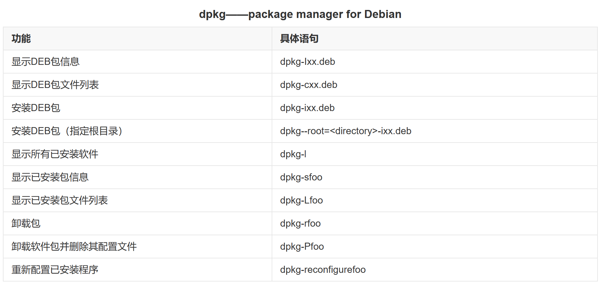

## 安装

```sh
# apt-get update只是更新了apt的资源列表，没有真正的对系统执行更新。如果需要，要使用apt-get upgrade来更新。
apt-get update              # 同步 /etc/apt/sources.list 和 /etc/apt/sources.list.d 中列出的源的索引，这样才能获取到最新的软件包。
apt-get upgrade
apt install net-tools       # 安装网络工具包，解决ifconfig命令找不到问题
```


## 软件管理

### APT 常见用法


### dpkg 常见用法




### APT 常见用法

