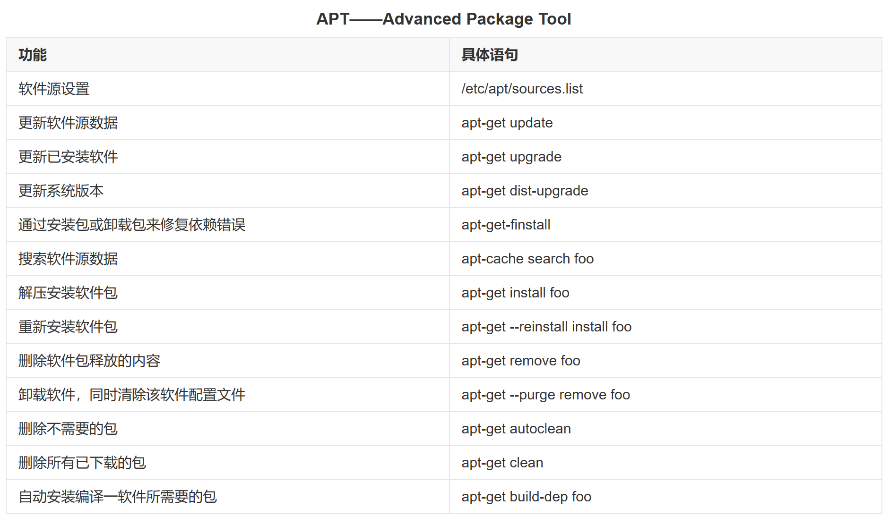

## 软件管理

DEB 是 Debian 软件包格式的文件扩展名，跟 Debian 的命名一样，DEB 也是因 Debra Murdock 而得名，她是 Debian 创始人 Ian Murdock 的太太。

dpkg 和 apt 比较：

相同点：都是ubuntu下的软件包管理工具

不同点：
- dpkg只安装本地的软件包，安装的时候不会安装依赖包也不会解决依赖问题。
- apt会从默认的远程仓库搜索包的名字并且下载安装，尝试解决依赖问题。

### apt



```sh
# apt-get update只是更新了apt的资源列表，没有真正的对系统执行更新。如果需要，要使用apt-get upgrade来更新。
apt-get update              # 同步 /etc/apt/sources.list 和 /etc/apt/sources.list.d 中列出的源的索引，这样才能获取到最新的软件包。
apt-get upgrade
sudo apt install net-tools       # 安装网络工具包，解决ifconfig命令找不到问题
sudo apt install vim             # 安装网络工具包，解决ifconfig命令找不到问题
sudo apt install ssh             # 安装ssh，解决无法ssh登录，如果root无法ssh登录，修改配置配置/etc/ssh/sshd_config的属性PermitRootLogin为yes

vim /etc/apt/sources.list   # 更换源

# 清华源
# 默认注释了源码仓库，如有需要可自行取消注释
deb https://mirrors.tuna.tsinghua.edu.cn/ubuntu/ jammy main restricted universe multiverse
# deb-src https://mirrors.tuna.tsinghua.edu.cn/ubuntu/ jammy main restricted universe multiverse
deb https://mirrors.tuna.tsinghua.edu.cn/ubuntu/ jammy-updates main restricted universe multiverse
# deb-src https://mirrors.tuna.tsinghua.edu.cn/ubuntu/ jammy-updates main restricted universe multiverse
deb https://mirrors.tuna.tsinghua.edu.cn/ubuntu/ jammy-backports main restricted universe multiverse
# deb-src https://mirrors.tuna.tsinghua.edu.cn/ubuntu/ jammy-backports main restricted universe multiverse
deb https://mirrors.tuna.tsinghua.edu.cn/ubuntu/ jammy-security main restricted universe multiverse
# deb-src https://mirrors.tuna.tsinghua.edu.cn/ubuntu/ jammy-security main restricted universe multiverse

sudo apt update             # 更新源
```

### dpkg

“dpkg ”是“Debian Packager ”的简写。为 “Debian” 专门开发的套件管理系统，方便软件的安装、更新及移除。所有源自“Debian”的“Linux ”发行版都使用 “dpkg”，例如 “Ubuntu”、“Knoppix ”等。

```sh
dpkg -l xx.deb                        # 显示DEB包信息
dpkg -l                               # 显示所有已安装的软件
dpkg -s 软件包名                       # 显示已安装包信息
dpkg -c xx.deb                        # 显示DEB包文件列表
dpkg -i xx.deb                        # 安装
dpkg --root=<directory> -i xx.deb     # 安装DEB包，指定根目录
dpkg -r 软件包名                       # 卸载
dpkg -P 软件包名                       # 卸载软件包并删除其配置文件
dpkg -S 文件路径                       # 查找文件属于哪个软件包
dpkg-reconfigure 软件包名              # 重新配置已安装程序
apt-get install -f                    # 解决依赖关系问题

```


## 创建的桌面快捷方式不能启动，提示不被信任

创建linux桌面快捷启动方式启动提示”untrusted application launcher“，且无信任确认。

原因分析：用户权限的问题，新版本的Gnome桌面快捷方式如果默认是root，则不让启动。

解决方案：把文件权限设置为普通用户权限，启动时使用root密码确认即可解决。需要注意，桌面快捷方式和源文件都需要改权限。