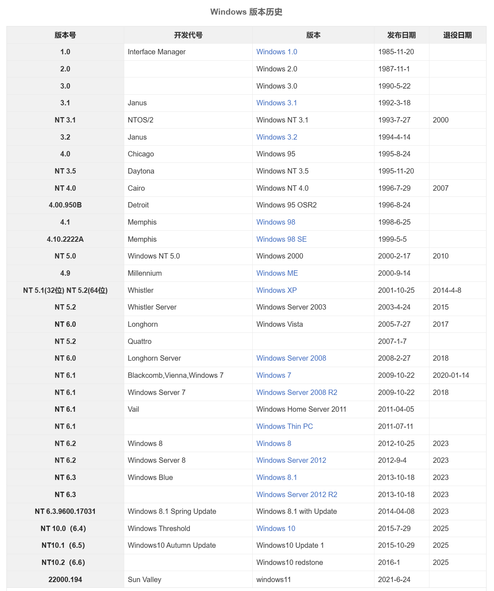
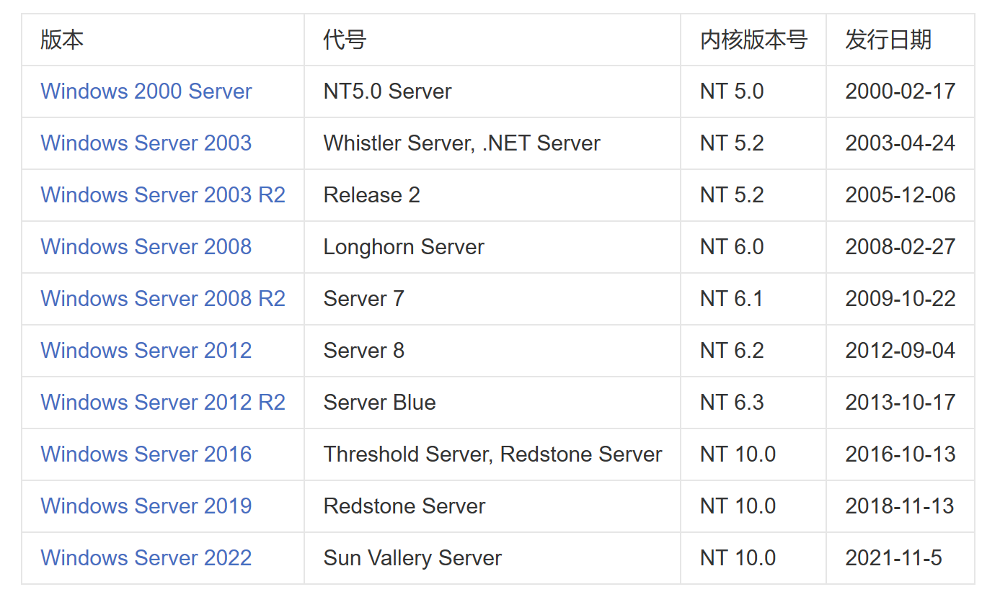
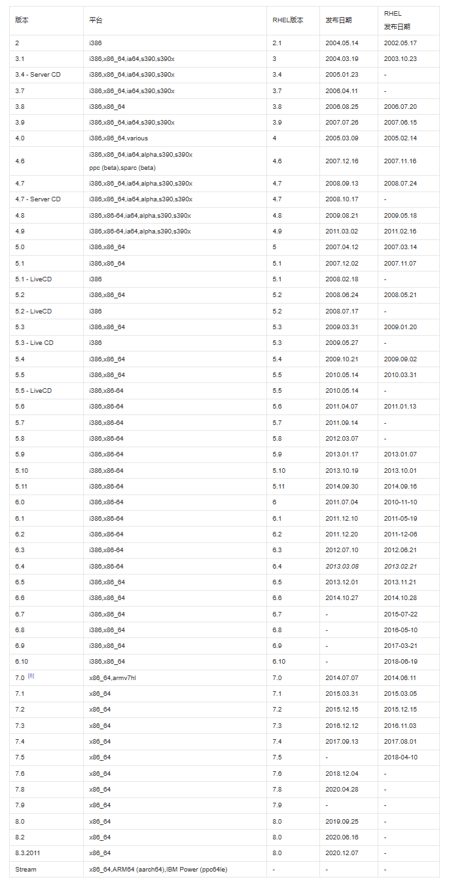
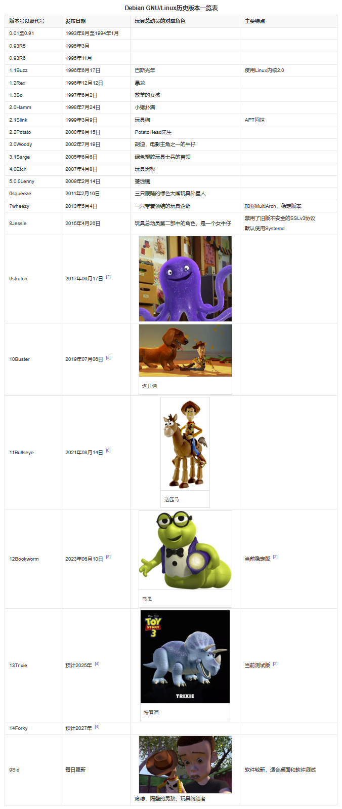
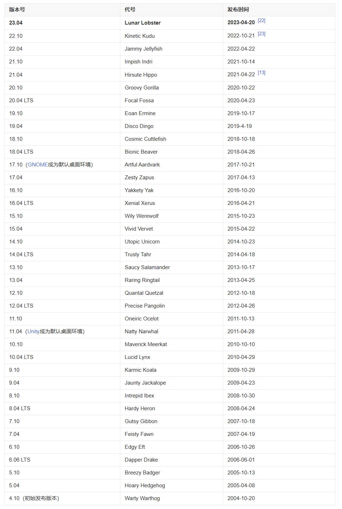
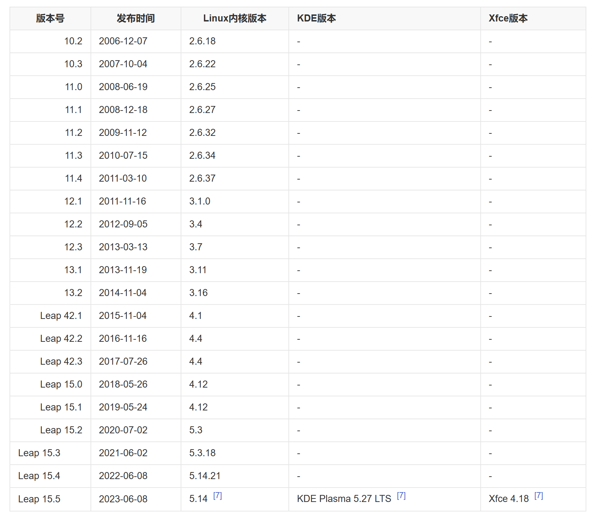
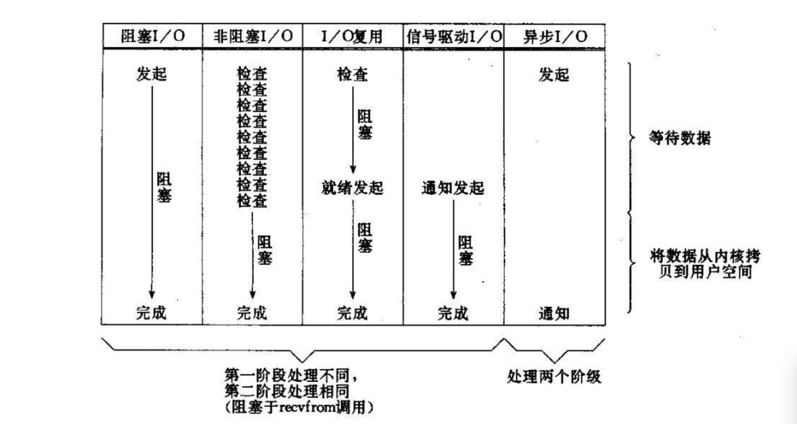

# 操作系统

## 1. OS 操作系统 

计算机操作系统是管理计算机硬件和软件资源的系统软件，它为用户和应用程序提供了一个接口，使它们能够与计算机硬件进行交互和利用系统资源。

### 1.1 Windows

Microsoft Windows 是美国微软公司研发的一套操作系统，它问世于1985年，起初仅仅是 Microsoft-DOS 模拟环境，后续的系统版本由于微软不断的更新升级，不但易用，也慢慢的成为家家户户人们最喜爱的操作系统。

Windows 采用了图形化模式 GUI，比起从前的 DOS 需要键入指令使用的方式更为人性化。随着电脑硬件和软件的不断升级，微软的 Windows 也在不断升级，从架构的16位、16+32位混合版（Windows9x）、32位再到64位， 系统版本从最初的 Windows 1.0 到大家熟知的 Windows 95、Windows 98、Windows ME、Windows 2000、Windows 2003、Windows XP、Windows Vista、Windows 7、Windows 8、Windows 8.1、Windows 10、Windows 11和 Windows Server 服务器企业级操作系统，不断持续更新，微软一直在致力于 Windows 操作系统的开发和完善。

**版本历史**

**Windows Server**

Windows Server 在2003年4月24日推出的 Windows 的服务器操作系统，其核心是 Microsoft Windows Server System（WSS）。

每个 Windows Server 都与其家用（工作站）版对应（2003 R2除外），从Windows Server 2008 R2开始，Windows Server不再提供32位版本。

**Windows server 和 Windows 区别**

1. 针对目标对象不同：
   - Windows Server主要是面向服务器，是微软的一个服务器操作系统。
   - Windows系统主要面向个人用户，如：PC电脑、笔记本电脑、平板电脑，家庭及商业工作环境、多媒体中心等。
2. 安全性不同
   - Windows Server作为一个服务器的操作系统，储存装置的控管变得更加安全，同时更完善了其自身的安全性能，定期更新系统补丁能有效保障服务器的安全。
   - Windows其安全性能主要针对个人用户，需要用户自身使用一些保护软件或者杀毒软件来保障系统的安全。
3. 支持系统位数不同
   - Windows Server 2008 R2 只支持64位的操作系统。
   - Windows 7 不仅支持64位的操作系统，同时还支持32位的操作系统。
4. 系统配置要求不同   

### 1.2 macOS

macOS 是一套由苹果开发的运行于 Macintosh 系列电脑上的操作系统。

macOS 可以被分成操作系统的两个系列：

一个是老旧且已不被支持的 “Classic” Mac OS（系统搭载在1984年销售的首部 Mac 与其后代上，终极版本是 Mac OS 9）。采用 Mach 作为内核，在 MacOS 7.6 以前用 “System x.xx” 来称呼。

新的 Mac OS X 结合 BSD Unix、OpenStep和Mac OS 9 的元素。它的最底层建基于 Unix 基础，其代码被称为 Darwin，实行的是部分开放源代码。

Mac OS X 有一个兼容层负责执行老旧的 Ma 应用程序，名为 Classic 环境（也就是程序员所熟知的“蓝盒子”[the blue box]）。它把老的 Mac OS 9.x 系统的完整拷贝作为 Mac OS X 里一个程序执行，但执行应用程序的兼容性只能保证程序在写得很好的情况里在当前的硬件下不会产生意外。

2011年7月20日 Mac OS X 已经正式被苹果改名为 OS X。2016年，OS X 改名为 macOS，与 iOS、tvOS、watchOS 相照应。

**版本**

System 1
System 2
System 3
System 4
System 5
System 6
System 7
Mac OS 8
Mac OS 9
Mac OS X 10.0 “Cheetah”
Mac OS X 10.1 "Puma"
Mac OS X 10.2 "Jaguar"
Mac OS X 10.3 "Panther"
Mac OS X 10.4 "Tiger"
Mac OS X 10.5 "Leopard"
Mac OS X 10.6 "Snow Leopard"
Mac OS X 10.7 "Lion"
OS X 10.8 "Mountain Lion"（去掉久远的Mac，体现Mac与iOS的融合）
OS X 10.9 “Mavericks”
OS X 10.10 “Yosemite”
OS X 10.11 “El Capitan”
macOS 10.12 “Sierra”
macOS 10.13 “High Sierra”
macOS 10.14 "Mojave"
macOS 10.15 "Catalina"
macOS 11 “Big Sur”
macOS 12 “Monterey”
macOS 13 “Ventura”
macOS 14 “Sonoma”

### 1.3 Linux

Linux 是一类 Unix 计算机操作系统的统称。也是自由软件和开放源代码发展中最著名的例子。严格来讲，Linux 这个词本身只表示 Linux 内核，而单独的 Linux 内核并不可直接使用，一般需要搭配 GNU 套件，因此在实际应用中，人们习惯将其用于指代整个操作系统，即基于 Linux 内核并使用 GNU 工具的系统（通常称为 GNU/Linux）。所有的发行版本都是基于 Linux内核 + GNU 软件，必须遵循 GNU 的 GPL 协定。

Linux 其内核由林纳斯·本纳第克特·托瓦兹（Linus Benedict Torvalds）于1991年10月5日首次发布，它主要受到 Minix 和 Unix 思想的启发，是一个基于 POSIX 的多用户、多任务、支持多线程和多 CPU 的操作系统。它支持32位和64位硬件，能运行主要的 Unix 工具软件、应用程序和网络协议。

Linux 发行版为许多不同的目的而制作，包括对不同计算机结构的支持，对一个具体区域或语言的本地化，实时应用，和嵌入式系统，甚至许多版本故意地只加入免费软件。可以大体分为两类，一类是商业公司维护的发行版本，一类是社区组织维护的发行版本，前者以著名的 Redhat（RHEL）为代表，后者以 Debian 为代表。

本质区别就是继承不同版本的内核、库、程序的组成。采用的包管理器不同 SLES、Fedora、openSUSE、centos、RHEL 使用 rmp 包管理系统，包文件以 RPM 为扩展名；Ubuntu系列、Debian系列使用基于 DPKG 包管理系统，包文件以 deb 为扩展名。

#### 1.3.1 Redhat

Redhat，应该称为 Redhat 系列，包括：

- Redhat Enterprise Linux（RHEL），也就是所谓的 Redhat Advance Server（RED HAT AS）收费版本，
- FedoraCore（由原来的 Redhat 桌面版本发展而来，免费版本）
- CentOS（RHEL的社区克隆版本，免费）。

Redhat 系列的包管理方式采用的是基于 RPM 包的 YUM 包管理方式，包分发方式是编译好的二进制文件。稳定性方面 RHEL 和 CentOS 的稳定性非常好，适合于服务器使用，但是 Fedora Core 的稳定性较差，最好只用于桌面应用。

RedHat Enterprise Linux，是 Red Hat 公司发布的面向企业用户的 Linux 操作系统，于2007年发行。

##### 1.3.1.1 CentOS

CentOS（Community Enterprise Operating System，中文意思是社区企业操作系统）是 Linux 发行版之一，是免费的、开源的、可以重新分发的开源操作系统。也是企业 Linux 发行版 Red Hat Enterprise Linux（RHEL）的再编译版本（是一个再发行版本），而且在 RHEL 的基础上修正了不少已知的 Bug ，相对于其他 Linux 发行版，其稳定性值得信赖。它主要用于服务器环境。
 
CentOS Linux 发行版是一个稳定的，可预测的，可管理的和可复现的平台，源于 Red Hat Enterprise Linux（RHEL）依照开放源代码（大部分是 GPL 开源协议）规定释出的源码所编译而成。

主要功能：

1. 可以把 CentOS 理解为 Red Hat AS 系列的社区版，它完全就是对 Red Hat AS 进行改进后发布的。各种操作、使用和 RHEL 没有区别。
2. CentOS 完全免费，不存在 RED HAT AS 需要序列号的问题。
3. CentOS 独有的 yum 命令支持在线升级，可以即时更新系统，不像 RHEL 那样需要花钱购买支持服务。
4. CentOS 修正了许多 RHEL 的 BUG。
5. CentOS 版本说明：CentOS3.1 等同于 RED HAT AS3 Update1、 CentOS3.4 等同于 RED HAT AS3 Update4、 CentOS4.0 等同于 RED HAT AS4。

版本：

CentOS 主要分为两个主要版本：CentOS Linux 和 CentOS Stream。

CentOS Linux 版为传统 CentOS 系统，系统的基本源代码由 RHEL 对应版本的开源代码提供，是 RHEL 的下游。当 RHEL 更新后 CentOS Linux 根据 RHEL 更新的内容进行更新并修复其中可能的漏洞等。版本略落后于 RHEL，更新新特性速度较 RHEL 慢。

CentOS Linux 8服务支持维护时间被大幅减少，维护时间已经变更为2021年12月31日截止（以前为2029年截止），CentOS Linux7的维护时间暂时没有改变。官方维护团队的重心已经转移到 Stream 版本，在下载页提供 CentOS Stream 版下载地址（暂时没有结束维护时间计划）。

CentOS Stream 版为滚动更新版，意味着没有固定版本号，是动态更新具体的内容。系统的基本源代码也由 RHEL 对应版本的开源代码提供。但代码更加激进，是合并进 RHEL 前的一个试验场，比RHEL更新新特性更快。等到相关新代码成熟后由 RHEL 合并，是 RHEL 的上游。

##### 1.3.1.2 Fedora

Fedora Linux（第七版以前为 Fedora Core）是由 Fedora 项目社区开发、红帽公司赞助，目标是创建一套新颖、多功能并且自由（开放源代码）的操作系统。Fedora 是商业化的 Red Hat Enterprise Linux 发行版的上游源码。

由社区支持的创新型 Linux 发行版，旨在提供最新的软件和技术。

#### 1.3.2 Debian

Debian，或者称 Debian 系列，包括 Debian 和 Ubuntu 等。Debian 是社区类 Linux 的典范，是迄今为止最遵循 GNU 规范的 Linux 系统。

Debian 最具特色的是 apt-get /dpkg 包管理方式，其实 Redhat 的 YUM 也是在模仿 Debian 的 APT 方式，但在二进制文件发行方式中，APT 应该是最好的了。

**版本**

Debian 的发行及其软件源有五个分支：旧稳定分支（oldstable）、稳定分支（stable）、测试分支（testing）、不稳定分支（unstable）、实验分支（experimental）。

- unstable 为最新的测试版本，其中包括最新的软件包，但是也有相对较多的 bug，适合桌面用户。
- testing 的版本都经过 unstable 中的测试，相对较为稳定，也支持了不少新技术（比如 SMP 等）
- stable 一般只用于服务器，上面的软件包大部分都比较过时，但是稳定和安全性都非常的高。

当前的稳定分支即bookworm（即下一个旧稳定分支），所有开发代号均出自 Pixar 的电影《玩具总动员》。

##### 1.3.2.1 Ubuntu

Ubuntu 严格来说不能算一个独立的发行版本，Ubuntu 是基于 Debian 的 unstable 版本加强而来，可以这么说 Ubuntu 就是一个拥有 Debian 所有的优点，以及自己所加强的优点的近乎完美的 Linux 桌面系统。

根据选择的桌面系统不同，有多个版本可供选择，比如

- 基于 unity 的 Ubuntu
- 基于 Gnome 的 Ubuntu Gnome
- 基于 KDE 的 Kubuntu
- 基于 LXDE 的 Lubuntu
- 基于 Xfce 的 Xubuntu  

特点是界面非常友好，容易上手，对硬件的支持非常全面，是最适合做桌面系统的 Linux 发行版本。

**版本**

根据中央处理器架构划分，Ubuntu 16.04支持 i386 32位系列、amd 64位X86系列、ARM 系列及 PowerPC 系列处理器。由于不同的 CPU 实现的技术不同，体系架构各异，所以 Ubuntu 会编译出支持不同中央处理器类型的发行版本。

根据 Ubuntu 发行版本的用途来划分，可分为 Ubuntu 桌面版(Ubuntu Desktop)、Ubuntu 服务器版(Ubuntu Server)、Ubuntu 云操作系统(Ubuntu Cloud)和 Ubuntu 移动设备系统(Ubuntu Touch)。Ubuntu已经形成一个比较完整的解决方案，涵盖了IT产品的方方面面。

Ubuntu版本编号，以“年份的最后一位.发布月份”的格式命名，因此 Ubuntu 的第一个版本就称为4.10(2004.10)。每个 Ubuntu 版本在开发之初还有一个开发代号。Ubuntu 开发代号比较有意思，格式为“形容词+动物”，且形容词和动物名称的第一个字母要一致。

##### 1.3.2.2 Linux Mint

Linux Mint 由 Linux Mint Team 团队于2006年开始发行，是一份基于 Ubuntu 和 Debian 构建的易用型 Linux 发行版，注重用户体验和多媒体支持。

Linux Mint 是一个为 PC 和基于 x86 架构的计算机设计的操作系统。因此，一个可以跑得动 Windows 的电脑也可以使用 Linux Mint 来代替 Windows。也可以同时运行两个操作系统，组建为所谓的“双系统”。同样，macOS，BSD 或者其他基于 UNIX 的系统也可以和 Linux Mint 共存。如果你装有多系统，你可以在电脑启动之时通过启动菜单选择不同的系统。

Linux Mint 可以很好的在一个单系统的电脑上运行，但是它也可以自动检测其他操作系统并与其互动。

Linux Mint 提供三种桌面环境的镜像：
- Cinnamon
- Xfce
- MATE

此外还提供一个基于 Debian 的版本，即LMDE（Linux Mint Debian Edition）。

#### 1.3.4 Arch Linux

是一款基于 x86-64 架构的 Linux 发行版。系统主要由自由和开源软件组成，支持社区参与。Arch Linux 系统安装、删除和更新软件的软件包管理器叫做 pacman。

**优势**

Arch Linux 是针对特定处理器而优化过的，能够更好地利用 CPU 周期以提高性能。相比 Debian/Ubuntu、SUSE、RedHat/Fedora 等其他发行版，Arch Linux 属于轻量级选手，其简单的设计让它容易被轻松扩展和配置成为任何想要的系统类型。

特有的包管理系统

通过二进制包管理系统 pacman ，仅需一个命令就能完成安装、升级等多个操作。同时也附带一个类似 ports 的包构建系统 ABS（Arch Build System） 。

滚动更新

与 Gentoo 类似，不同于其他大部分主流 Linux 发行版比如 Fedora 和 Ubuntu。Arch Linux 并没有跨版本升级的概念，通过更新，任何时期的 Arch Linux 都可以滚动更新到最新版本。

**缺点**

- 安装过程简陋，缺乏智能直观的错误处理，需要用户有一定的 Linux 环境常识才能正确安装使用。
- 包管理系统 pacman 在升级过程缺乏对系统核心组件的回溯保护，如升级的 Kernel 有问题，即导致系统无法启动。
- 系统软件缺乏严谨的测试管理机制，稳定性、可靠性不如 Redhat、CentOS、Debian 等发行版，难以在企业用户中推广。

**派生发行**

官方的 Arch 安装程序是基于 CLI 命令行界面,对于那些需要GUI图形界面安装环境的用户，可以选择这些Live CD:

- ArchBang - 一个默认使用 OpenBox 桌面环境的发行
- Manjaro Linux - 一个默认使用 XFCE 桌面环境的发行
- Chakra GNU/Linux - Chakra 项目发布的半滚动发行版
- Antergos - 一个提供包括 GNOME 3（默认），Cinnamon，Razor-qt,Base,KDE 和 Xfce 多种桌面环境安装的发行（安装时可选）
- Parabola GNU/Linux-libre - 基于 Arch Linux 的一个完全自由的 GNU/Linux 发行版。

其他流行的派生发行版包括 Arch Linux ARM 等。

#### 1.3.5 openSUSE

**前世今生**

1. 1992年，SuSE Linux AG 公司成立，是由德国的一个学生小组创建的，他们希望创建一个易于安装和使用的 Linux 发行版。最早的版本称为 "Jurix"，随后改名为 "S.u.S.E Linux"（Software und System-Entwicklung，即软件和系统开发）。
2. 1996年，发行版的名称被缩写为 "SuSE Linux"。
3. 2003年，SuSE Linux AG 公司改名为 SUSE Linux GmbH。
3. 2004年，美国软件公司 Novell 收购了 SUSE Linux GmbH 公司。
4. 2010年11月22日，Novell 公司宣布，它已同意接受 Attachmate 集团的收购，收购价22亿美元，2011年4月27日，Attachmate 集团完成了对 Novell (包括 SUSE 业务)的收购把 Novell 拆分成两个独立部门运营，SUSE 作为一个独立的业务部门。
5. 2014年，Attachmate 与英国 Micro Focus 合并，在 Micro Focus 的领导下，SUSE 保留了整个领导团队，是一个独立的业务部门。
6. 2019年3月，增长型投资者 EQT 完成从 Micro Focus 对 SUSE 的收购，SUSE 成为独立的开源企业。

SUSE 公司提供基于 openSUSE 的企业级产品 SUSE Linux Enterprise，主要用于服务器。包括：

- SUSE Linux Enterprise Server (SLES)
- Novell Open Enterprise Server
- Novell Linux Desktop，Novell Linux Desktop 系列的新产品以后改称 SUSE Linux Enterprise Desktop（SLED）

**openSUSE**

openSUSE 是一个社区驱动的 Linux 发行版项目，社区负责开发和维护 openSUSE Leap 和 openSUSE Tumbleweed 等发行版。 对个人来说是完全免费的，包括使用和在线更新。

openSUSE 原名 SUSE Linux，10.2版本以后改名为 openSUSE。Novell 收购 SUSE Linux 之后，决定以100%开源产品发布 SUSE Linux 专业版，并作为一个开源项目，openSUSE 继承于 SUSE Linux Professional。这个项目的主要目标是使 SUSE Linux 成为最易获得和最广泛使用的 Linux，成为最棒的用户 Linux 桌面环境。

它的软件包管理系统采用 RPM 和自主开发的 zypper，而且提供了一个管理系统和 zypper 的特色工具—YaST，这些工具颇受好评。他的用户界面非常华丽，甚至超越 Windows 7，而且性能良好。

版本：

- Leap 主要版本 (15.x) 延长了维护和支持，直到有后续版本。Leap 15 的生命周期与 SUSE Linux Enterprise 完全吻合。
- openSUSE Tumbleweed 是一个滚动更新版本，有着 “无限” 的使用期限。它会收到安全更新、错误修复和新的功能（大多是新的软件版本）。一旦 openSUSE 社区集成并测试完成之后，你就会收到更新。

#### 1.3.6 国产 Linux

##### 1.3.6.1 中标麒麟

基于 redhat

##### 1.3.6.2 deepin

deepin（原名：Linux Deepin；中文通称：深度操作系统）是由武汉深之度科技有限公司开发的 Linux 操作系统，其前身是 Hiweed Linux 操作系统，于2004年2月28日开始对外发行，可以安装在个人计算机和服务器中。

基于 Debian

### 1.4 UNIX

Unix 是20世纪70年代初出现的一个操作系统，除了作为网络操作系统之外，还可以作为单机操作系统使用。Unix 作为一种开发平台和台式操作系统获得了广泛使用，主要用于工程应用和科学计算等领域。

Linux 是一个类似 Unix 的操作系统，Unix 要早于 Linux，Linux 的初衷就是要替代 UNIX，并在功能和用户体验上进行优化，所以 Linux 模仿了 UNIX（但并没有抄袭 UNIX 的源码），使得 Linux 在外观和交互上与 UNIX 非常类似。说模仿可能会被人喷，也可以说微创新或者改进。

相比于 UNIX，Linux 最大的创新是开源免费，这是它能够蓬勃发展的最重要原因；而目前的 UNIX 大部分都是收费的，小公司和个人都难以承受。

正是由于 Linux 和 UNIX 有着千丝万缕的联系，所以人们把 Linux 叫做“类UNIX系统”

UNIX 分为两大类，分别是由厂商支持的 systemV 系统和 BSD 系统，具体有：

1. SYSTEM V 系统
   - Solaris（SUN UNIX）由 Sun Microsystems 开发，后被 Oracle 收购。它拥有强大的网络功能和商业支持，常用于企业级服务器。
   - AIX（IBM UNIX）由 IBM 开发，运行于 IBM 的 Power 架构服务器上。AIX 提供了许多高级功能，如动态分区和逻辑分卷管理。
   - HP-UX 由惠普（Hewlett-Packard，现在是惠普企业公司）开发，用于惠普的服务器和工作站产品。
   - SCO UNIX 指的是 Santa Cruz Operation（SCO）公司开发的 UNIX 操作系统。尽管 SCO UNIX 曾经很流行，但在后来的年代已经较少使用。
2. BSD 系统
   - FreeBSD 一个开源的 BSD 操作系统，注重性能和稳定性，广泛用于服务器环境。
   - OpenBSD 另一个开源的 BSD 操作系统，专注于安全性，经常被用于构建安全系统和网络设备。
   - NetBSD 同样是一个开源的 BSD 操作系统，以其高度可移植性而闻名，可以在多种硬件平台上运行。
   - APPle UNIX(MAC OS bsd内核）虽然 macOS 的内核是基于 FreeBSD 的，但它集成了许多苹果独有的功能和用户界面，成为一种独特的 UNIX 衍生版本，常用于个人电脑和开发环境。

### 1.5 移动操作系统

Android：由 Google 领导的开放源代码项目，设计用于广泛的移动设备。
iOS：由苹果公司开发的操作系统，专门设计用于iPhone、iPad和iPod Touch等苹果设备。
HarmonyOS：鸿蒙OS，由华为公司开发的操作系统，旨在为各种设备提供统一的操作体验，包括智能手机、平板电脑、智能穿戴设备、智能家居设备等。

### 1.6 嵌入式操作系统

嵌入式操作系统（Embedded Operating System，简称：EOS）是指用于嵌入式系统的操作系统。嵌入式操作系统是一种用途广泛的系统软件，通常包括与硬件相关的底层驱动软件、系统内核、设备驱动接口、通信协议、图形界面、标准化浏览器等。嵌入式操作系统负责嵌入式系统的全部软、硬件资源的分配、任务调度，控制、协调并发活动。它必须体现其所在系统的特征，能够通过装卸某些模块来达到系统所要求的功能。

在嵌入式领域广泛使用的操作系统有：

- 嵌入式实时操作系统 µC/OS-II
- VxWorks
- FreeRTOS
- QNX
- 嵌入式Linux
- Windows Embedded

### 1.7 实时操作系统

实时操作系统（Real Time Operating System，简称RTOS）是指当外界事件或数据产生时，能够接受并以足够快的速度予以处理，其处理的结果又能在规定的时间之内来控制生产过程或对处理系统做出快速响应，调度一切可利用的资源完成实时任务，并控制所有实时任务协调一致运行的操作系统。

## 2. CPU 架构

[参考链接：https://blog.csdn.net/weixin_44666439/article/details/127226943](https://blog.csdn.net/weixin_44666439/article/details/127226943)

CPU 架构是 CPU 厂商给属于同一系列的 CPU 产品定的一个规范，主要目的是为了区分不同类型 CPU 的重要标示。

目前市面上的 CPU 分类主要分有两大阵营，一个是 Intel、AMD 为首的复杂指令集 CPU，另一个是以 IBM、ARM 为首的精简指令集 CPU。两个不同品牌的 CPU，其产品的架构也不相同，例如，Intel、AMD 的 CPU 是 X86架构的，而 IBM 公司的 CPU 是 PowerPC 架构，ARM 公司是 ARM 架构。

### 2.1 x86 架构

是一种复杂指令集计算机(CISC, Complex Instruction Set Computer)架构，由美国英特尔(Intel)开发，广泛应用于个人电脑、服务器和嵌入式系统。

1978年6月8日，Intel 发布了新款16位处理器 8086 (i8086)，也同时开创了一个新时代：X86架构诞生了。美国 IBM 公司1981年推出的世界第一台 PC 机中的 CPU–i8088（i8086简化版）使用的也是 X86 指令。随着 CPU 技术的不断发展，Intel 陆续研制出更新型的 i80386、i80486 直到今天的 Pentium 4系列，但为了保证电脑能继续运行以往开发的各类应用程序以保护和继承丰富的软件资源，所以 Intel 公司所生产的所有 CPU 仍然继续使用 X86 指令集。

AMD（Advanced Micro Devices）是一家半导体公司，与 Intel 竞争，在处理器市场上也有一席之地。AMD 制造的处理器使用了 x86 架构，但是它们不是英特尔设计的。AMD 还开发了自己的一些技术，例如 AMD64，这是一种 64 位处理器架构，与 Intel 的 64 位技术（叫做 Intel 64 或者 x86-64）兼容。

AMD CPU 的主要系列：

- Ryzen（锐龙） 系列：Ryzen 系列是 AMD 的桌面和移动 CPU 系列，采用了 Zen 微架构。这个系列包括 Ryzen 3、Ryzen 5、Ryzen 7 和 Ryzen 9 等型号，它们提供了不同级别的性能和功能，适用于各种桌面和笔记本电脑应用。
- Threadripper 系列
- EPYC 系列
- Athlon 系列
- FX 系列

复杂指令集计算机(CISC, Complex Instruction Set Computer)架构。与采用 RISC 不同的是，在 CISC 处理器中，程序的各条指令是按顺序串行执行的，每条指令中的各个操作也是按顺序串行执行的。顺序执行的优点是控制简单，但计算机各部分的利用率不高，执行速度慢。

**i686 和 x86-64**

x86 是指 Intel的 开发的一种32位指令集架构，最早于1985年推出的 Intel 80386 处理器开始流行。这种指令集的名称源自于早期的 Intel 处理器型号，如 8086、80286、80386 等。所有 Intel 早期的 cpu, amd 早期的 cpu 都支持这种指令集，Intel官方文档里面称为“IA-32"（Intel Architecture 32-bit）。

i686架构是32位 x86架构的一种变体，也称为 x86 或 x86-32。它最初设计用于英特尔的处理器，后来被 AMD 和其他公司采用。

x86-64架构则是64位 x86架构的扩展，也称为AMD64或Intel 64。它保留了与32位x86架构的兼容性，并且提供了更大的内存地址空间和更多的通用寄存器，从而允许更大的数据和更复杂的计算。x86-64架构的处理器可以运行32位和64位的操作系统和软件，因此它逐渐取代了i686架构成为更加普遍的架构。

**AMD64 和 ×86-64**

x86-64有时会简称为“×64”，是64位微处理器架构及其相应指令集的一种，也是 Intel x86 架构的延伸产品。

"x86-64” 1999由 AMD 设计，AMD 首次公开64位集以扩充给 IA-32，称为 x86-64(后来改名为 AMD64)。AMD64 架构在 IA-32上新增了64位寄存器，并兼容早期的16位和32位软件，可使现有以 x86为对象的编译器容易转为 AMD64版本。
由于 AMD64和 Intel64基本上一致，很多软硬件产品都使用一种不倾向任何一方的词汇来表明它们对两种架构的同时兼容。出于这个目的，AMD 对这种 CPU 架构的原始称呼“x86-64”被不时地使用，还有变体“x86_64”。其他公司如微软和 Sun 在营销资料中使用“x64”作为对“x86-64”的缩写。

许多操作系统及产品，尤其那些是在 Intel 进入这块市场之前就引入“×86-64”支持的，使用“AMD64”或“amd64”同时指代 AMD64 和 Intel64。        

### 2.2 ARM 架构

ARM 是高级精简指令集的简称（Advanced RISC Machine），是一种精简指令集计算机(RISC)架构，由英国的 ARM 公司开发，特别适用于移动设备、低功耗应用和嵌入式系统。它的指令集设计简单，注重能效和低功耗。

AArch64，也称为 ARM64，是 ARM 架构的 64 位版本。

AArch64 是 ARMv8 指令集架构的 64 位版本，于2011年发布。相比于早期的 32 位 ARM 架构，AArch64 提供了更大的地址空间、更多的寄存器和更强大的指令集，从而使得处理器能够更有效地处理更复杂的计算任务。AArch64 架构也被广泛应用于服务器、网络设备、嵌入式系统以及超级计算机等领域。

**aarch64、arm64、arm、x86**

aarch64 和 arm64 是指基于 ARM 架构的64位处理器，而 arm 是指基于 ARM 架构的32位处理器。x86 则是指基于 x86 架构的处理器。

1. 架构：aarch64、arm64和arm都属于ARM架构，而x86属于x86架构。
2. 位数：aarch64和arm64是64位处理器架构，能够使用64位的寄存器和指令集。arm是32位处理器架构，使用32位的寄存器和指令集。x86可以是32位或64位处理器架构，具体取决于处理器型号。
3. 应用领域：ARM 架构在移动设备（如智能手机、平板电脑）和嵌入式系统中非常常见，而 x86 架构主要用于桌面和服务器领域。
4. 软件兼容性：由于架构的不同，软件在不同的架构上可能不兼容。一些软件和操作系统可能需要专门编译或适配到特定的架构上才能运行。
5. 性能和功耗：不同的架构在性能和功耗方面可能有所差异。具体的性能和功耗特征取决于处理器的设计和实现。

### 2.3 risc-v 架构

是一种基于精简指令集计算(RISC)原理的开放指令集架构(ISA)，相对较晚，但发展迅速，模块化设计，易于移植 Unix 系统，支持多种应用场景。

### 2.4 MIPS 架构

是一种采取精简指令集(RISC)的处理器架构，可支持高级语言的优化执行。这种架构最初在服务器和桌面领域应用较多，但现在已经进入了嵌入式领域。它的特点是支持64位指令和操作，功耗比 ARM 更低。

### 2.5 PowerPC 架构

这种架构由 IBM 开发，主要用于高性能计算和特定的商业电子产品，如游戏机和服务器。它的特点是可伸缩性好、方便灵活。

## 2. 进程和线程

### 2.1  并发和并行

- 并发是指**一个处理器**同时处理多个任务。
- 并行是指**多个处理器**或者是多核的处理器同时处理多个不同的任务。

并发是逻辑上的同时发生（simultaneous），而并行是物理上的同时发生。并行在多处理器系统中存在，而并发可以在单处理器和多处理器系统中都存在，并发能够在单处理器系统中存在是因为并发是并行的假象，并行要求程序能够同时执行多个操作，而并发只是要求程序假装同时执行多个操作（每个小时间片执行一个操作，多个操作快速切换执行）。

`并行(parallel)：`指在同一时刻，有多条指令在多个处理器上同时执行。就好像两个人各拿一把铁锨在挖坑，一小时后，每人一个大坑。所以无论从微观还是从宏观来看，二者都是一起执行的。

`并发(concurrency)：`指在同一时刻只能有一条指令执行，但多个进程指令被快速的轮换执行，使得在宏观上具有多个进程同时执行的效果，但在微观上并不是同时执行的，只是把时间分成若干段，使多个进程快速交替的执行。这就好像两个人用同一把铁锨，轮流挖坑，一小时后，两个人各挖一个小一点的坑，要想挖两个大一点得坑，一定会用两个小时。

## 3. 五种 IO 模型

1. BIO（Blocking I/O），同步阻塞 IO

BIO 是传统的 Java io 编程，其相关的类和接口在 java.io 包下。实现模式为一个连接一个线程，即当有客户端连接时，服务器端需为其单独分配一个线程，如果该连接不做任何操作就会造成不必要的线程开销。

一般使用多线程，主要原因在于 socket.accept()、socket.read()、socket.write()三个主要函数都是同步阻塞的，当一个连接在处理 I/O 的时候，系统是阻塞的，如果是单线程的话必然就挂死在那里；
但 CPU 是被释放出来的，开启多线程，就可以让 CPU 去处理更多的事情。其实这也是所有使用多线程的本质：

- 利用多核。
- 当 I/O 阻塞系统，但 CPU 空闲的时候，可以利用多线程使用 CPU 资源。

现在的多线程一般都使用线程池，可以让线程的创建和回收成本相对较低。在活动连接数不是特别高（小于单机 1000）的情况下，这种模型是比较不错的，可以让每一个连接专注于自己的 I/O 并且编程模型简单，
也不用过多考虑系统的过载、限流等问题。但面对十万甚至百万级连接的时候，传统的 BIO 模型是无能为力的。

2. NIO（new I/O、non-blocking I/O）同步非阻塞 IO

NIO 的相关类都放在 java.nio 包或其子包下，并对原先 java.io 包中许多类进行了改写。

同步非阻塞 IO 是在应用调用 recvfrom 读取数据时，如果该缓冲区没有数据的话，就会直接返回一个 EWOULDBLOCK 错误，不会让应用一直等待中。在没有数据的时候会即刻返回错误标识，那也意味着如果应用要读取数据就需要**不断的调用 recvfrom 请求**，直到读取到它数据要的数据为止。

**三大核心**

    1. 缓冲区（Buffer）

    NIO 是面向缓冲区, 或者说是面向块编程的。在 NIO 的 IO 传输中，数据会先读入到缓冲区，当需要时再从缓冲区写出，这样减少了直接读写磁盘的次数，提高了 IO 传输的效率。

    缓冲区(buffer)本质上是一个可以读写数据的内存块，即在内存空间中预留了一定的存储空间，这些存储空间用来缓冲输入和输出的数据，这部分预留的存储空间就叫缓冲区。

    2. 通道（Channel）

    在 NIO 程序中服务器端和客户端之间的数据读写不是通过流，而是通过通道来读写的。通道类似于流，都是用来读写数据的，但它们之间也是有区别的：

    - 通道是双向的，即可以读也可以写，而流是单向的，只能读或写

    - 通道可以实现异步读写数据

    - 通道可以从缓冲区读数据，也可以把数据写入缓冲区

    3. 选择器（Selector）

    在 NIO 程序中，可以用选择器 Selector 实现一个选择器处理多个通道，即一个线程处理多个连接。只要把通道注册到 Selector 上，就可以通过 Selector 来监测通道，如果通道有事件发生，便获取事件通道然后针对每个事件进行相应的处理。这样，只有在通道(连接)有真正的读/写事件发生时，才会进行读写操作，大大减少了系统开销，并且不必为每个连接创建单独线程，就不用去维护过多的线程。

4. 多路复用 IO

   - 为什么会产生多路复用 IO？

     因为当有多个网络连接，连接到某个进程的时候，我们想要监听这些 socket 接口，并当这些接口有数据返回的时候，进行处理。一种解决方案就是，对于每一个 socket 接口，我们都开辟一个线程来侦听，处理。这样做的局限就是，当连接数变大的时候（成千上万），那么我们就要创建多个线程变量。创建线程变量开销很大，而且，线程切换的开销也会变大。所以我们就寻求一种，**单线程的情况下监听多个 socket 接口的方式**，所以就会有多路复用 IO 的诞生。

     本质上还是同步非阻塞 IO，但是将阻塞放在了 select 上

5. 信号驱动 IO，继续改良复用 IO，思想是发出请求后等你数据准备好了就通知我

6. 异步 IO

   异步 IO 需要更强的操作系统支持；当用户线程收到通知时，数据已经被内核读取完毕，**并放在了用户线程指定的缓冲区内**，内核在 IO 完成后通知用户线程直接使用即可。

