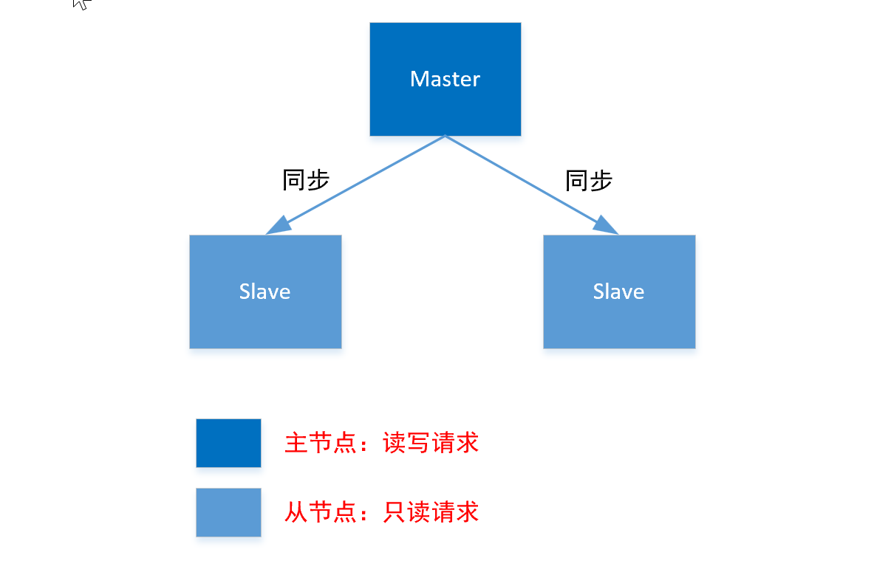
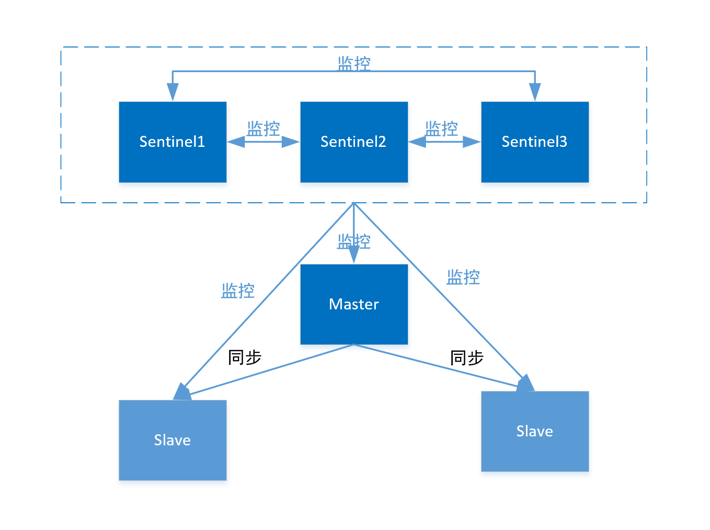

# Redis

## 1. 安装

### 1.1 Windows

> windows 系统的 Redis 有两个配置文件，redis.windows.conf 和 redis.windows-service.conf，设置密码、配置时，只需要在 redis.windows.conf 文件中设置

**安装方式**

1. 使用 xxx.msi 安装，Redis 服务默认是自启动，即直接通过 redis-server.exe 启动；
2. 使用压缩包安装；

<font color="red">不管是哪种方式安装，都可以通过命令行加载配置文件方式或自启动服务启动。
但是第一种方式默认是自启动的，也就是安装后会自动生成启动命令，启动命令并没有加载 Redis 的配置文件（redis.windows.conf），因此会导致 redis 中绑定配置和密码设置不生效。可以设置为手动（计算机-管理-服务-设置为手动），禁用 Redis 的自启动用命令行方式启动</font>

**启动**

```shell
# 1. 命令行方式启动

# 启动服务端
./redis-server.exe redis.windows.conf
# 启动客户端
./redis-cli.exe                                     # 精简模式
./redis-cli.exe -h 127.0.0.1 -p 6379
./redis-cli.exe -h 127.0.0.1 -p 6379 -a 密码        # 客户端登录，-a是指定密码，如果启动时不指定，也可以通过命令行 auth password 指定


# 2. 服务自启动方式， 使用压缩方式安装的Redis，如果需要实现自启动，只需将Redis服务注册成windows服务。在安装目录下，执行命令 redis-server --service-install redis.windows.conf --loglevel verbose --service-name Redis；执行成功后表示已经安装成为windows服务了，但是安装服务后，默认不是马上启动的，但启动类型是自启动，如果想马上启动，需要执行启动命令或重启电脑

# --service-install redis.windows.conf 指定redis配置文件
# --loglevel notice  指定日志级别，Redis总共支持四个级别：debug、verbose、notice、warning，默认为verbose
# --service-name   指定redis服务名称

# 2.1 启动redis服务
redis-server --service-start
# 2.2 停止redis服务
redis-server --service-stop
# 2.3 还可以安装多个服务
redis-server --service-install -service-name redisService1 -port 3306
redis-server --service-install -service-name redisService2 -port 3307
# 2.4 卸载删除redis服务
redis-server --service-uninstall
sc delete 服务名  # 删除服务（管理员身份运行）

```

### 1.2 Linux

使用压缩包方式或 rpm 包安装，启动命令基本相同，如果要添加配置、设置密码，只需要修改 redis.conf 文件

```sh
# 解压，将解压文件存放在 /usr/local/redis 目录
tar -zxvf redis-6.0.6
# 安装gcc，ContOS7默认安装4.8.5版本
yum -y gcc-c++
# 升级gcc，不升级因为版本低，安装时会报错
yum -y install centos-release-scl
yum -y install devtoolset-9-gcc devtoolset-9-gcc-c++ devtoolset-9-binutils
echo "source /opt/rh/devtoolset-9/enable" >>/etc/profile
systemctl enable devtoolset-9 bash
# redis程序编译
make
make install PREFIX=/usr/local/redis    # 将redis安装在指定位置，默认在/usr/local/bin，也可以在编译前通过./configure --prefix=/usr/local/bin设置安装位置
# 在安装位置新增配置文件redis.conf，可以用来配置属性和设置密码
mkdir conf
cp redis.conf /usr/local/redis/bin/conf/
```

### 1.3 配置文件详解

```sh
#Redis默认不是以守护进程的方式运行，可以通过该配置项修改，使用yes启用守护进程
daemonize yes
#当Redis以守护进程方式运行时，Redis默认会把pid写入redis.pid文件，可以通过pidfile指定
pidfile 'E:/xxx/redis/redis_pid/redis.pid'
#端口
port 6379
#绑定主机的ip地址，对于bind，不少人都误解了。以为这个设置是只对客户端IP的连接限制，其实这是错误的！错误的！错误的！bind是你服务器的IP地址！
#如果开启了保护模式protected-mode yes，并且bind未配置，密码也未设置。redis只接受来自本机的连接。
bind 0.0.0.0
#当客户端闲置多长时间后关闭连接，如果指定为0，表示关闭该功能
timeout 300
#指定日志记录级别，Redis总共支持四个级别：debug、verbose、notice、warning
loglevel notice
#日志记录方式，默认为标准输出，如果配置Redis为守护进程方式运行，而这里又配置为日志记录方式为标准输出，则日志将会发送给/dev/null
logfile stdout

#设置数据库的数量，默认数据库为0，可以使用SELECT <dbid>命令在连接上指定数据库id，id可选范围 0 ~ databases -1
databases 16

#配置保存点，如果在N秒后数据发生了M次变化就保存快照文件，也就是指定在多长时间内，有多少次更新操作，就将数据同步到数据文件，可以多个条件配合
#格式：save <seconds> <changes> 可以设置多个
#分别表示900秒（15分钟）内有1个更改，300秒（5分钟）内有10个更改以及60秒内有10000个更改
save 900 1
save 300 10
save 60 10000
# 在测试环境中如果达不到这些触发条件，可以手动在命令行调用生成快照的命令 SAVE 或 BGSAVE
# 注释掉上面保存时间，打开下方注释，即可禁用快照功能
# save ""

#指定存储至本地数据库时是否压缩数据，默认为yes，Redis采用LZF压缩，如果为了节省CPU时间，可以关闭该选项，但会导致数据库文件变的巨大
rdbcompression yes
#指定本地数据库文件名，默认值为dump.rdb
dbfilename dump.rdb
#指定本地数据库存放目录，也就是保存持久化文件的目录
dir 'D:/XXX/redis/redis_database'
#设置当本机为slav服务时，设置master服务的IP地址及端口，在Redis启动时，它会自动从master进行数据同步
#slaveof 127.0.0.1 6379
#当master服务设置了密码保护时，slav服务连接master的密码
#masterauth 123456
#设置Redis连接密码，如果配置了连接密码，客户端在连接Redis时需要通过AUTH <password>命令提供密码，默认关闭
#requirepass foobared
#设置同一时间最大客户端连接数，默认无限制，Redis可以同时打开的客户端连接数为Redis进程可以打开的最大文件描述符数，如果设置 maxclients 0，表示不作限制。当客户端连接数到达限制时，Redis会关闭新的连接并向客户端返回max number of clients reached错误信息
maxclients 10000
#指定Redis最大内存限制，Redis在启动时会把数据加载到内存中，达到最大内存后，Redis会先尝试清除已到期或即将到期的Key，当此方法处理后，仍然到达最大内存设置，将无法再进行写入操作，但仍然可以进行读取操作。Redis新的vm机制，会把Key存放内存，Value会存放在swap区
maxmemory 300m
# 内存达到上限的处理策略
# noeviction(默认策略)：对于写请求不再提供服务，直接返回错误（DEL请求和部分特殊请求除外）
# allkeys-lru：从所有key中使用LRU算法进行淘汰
# volatile-lru：从设置了过期时间的key中使用LRU算法进行淘汰
# allkeys-random：从所有key中随机淘汰数据
# volatile-random：从设置了过期时间的key中随机淘汰
# volatile-ttl：在设置了过期时间的key中，淘汰过期时间剩余最短的
maxmemory-policy noeviction


#启用AOF，指定是否在每次更新操作后进行日志记录，Redis在默认情况下是异步的把数据写入磁盘，如果不开启，可能会在断电时导致一段时间内的数据丢失。因为 redis本身同步数据文件是按上面save条件来同步的，所以有的数据会在一段时间内只存在于内存中。默认为no
appendonly yes
#指定更新日志AOF文件名，默认为appendonly.aof
appendfilename 'appendonly.aof'
#指定更新日志条件，共有3个可选值
#no：表示等操作系统进行数据缓存同步到磁盘（快）
#always：表示每次更新操作后手动调用fsync()将数据写到磁盘（慢，安全）
#everysec：表示每秒同步一次（折衷，默认值）
appendfsync everysec
```

## 2. Spring Cache 和 Redis 区别

1. Spring cache 是由 Spring Framwork 提供的一个缓存抽象层，可以接入各种缓存解决方案来进行使用，通过 Spring Cache 的集成，只需要通过一组注解来操作缓存就可以了。其主要的原理就是向 Spring Context 中注入 Cache 和 CacheManager 这两个 bean，再通过 Spring Boot 的自动装配技术，会根据项目中的配置文件自动注入合适的 Cache 和 CacheManager 实现。

一般是使用一个 ConcurrentHashMap，也就是说实际上是使用 JVM 的内存来缓存对象的，这势必会造成大量的内存消耗。但好处是显然的：使用方便。和 Spring 的事务管理类似，Spring cache 的关键原理就是 Spring AOP，通过 Spring AOP，其实现了在方法调用前、调用后获取方法的入参和返回值，进而实现了缓存的逻辑。 2. Redis 作为一个缓存服务器，是内存级的缓存。它是使用单纯的内存来进行缓存。

集群环境下，每台服务器的 Spring cache 是不同步的，因此 spring cache 只适合单机环境。如果使用 Redis 作为单独的缓存服务器，所有集群服务器统一访问 redis，就不会出现缓存不同步的情况。

**coffeine**

两个都是缓存的方式

不同点：
redis 是将数据存储到内存里
caffeine 是将数据存储在本地应用里

caffeine 和 redis 相比，没有了网络 IO 上的消耗

| 比较项       | ConcurrentHashMap | LRUMap                   | Ehcache                       | Guava Cache                         | Caffeine                |
| ------------ | ----------------- | ------------------------ | ----------------------------- | ----------------------------------- | ----------------------- |
| 读写性能     | 很好，分段锁      | 一般，全局加锁           | 好                            | 好，需要做淘汰操作                  | 很好                    |
| 淘汰算法     | 无                | LRU，一般                | 支持多种淘汰算法,LRU,LFU,FIFO | LRU，一般                           | W-TinyLFU, 很好         |
| 功能丰富程度 | 功能比较简单      | 功能比较单一             | 功能很丰富                    | 功能很丰富，支持刷新和虚引用等      | 功能和 Guava Cache 类似 |
| 工具大小     | jdk 自带类，很小  | 基于 LinkedHashMap，较小 | 很大，最新版本 1.4MB          | 是 Guava 工具类中的一个小部分，较小 | 一般，最新版本 644KB    |
| 是否持久化   | 否                | 否                       | 是                            | 否                                  | 否                      |
| 是否支持集群 | 否                | 否                       | 是                            | 否                                  | 否                      |

## 3. 核心

### 3.1 数据结构

Redis 提供了 5 种数据结构，分别是以下几种：

- **String 字符串**（终究是我扛下来所有）
- **Hash 哈希**（存储对象我也行）
- **List 列表**（栈和队列我都行）
- **Set 集合**（标签系统我在行）
- **Sort Set 有序集合**（排起名来我最棒）

然而，在我们的实际编程开发中，有大多数的开发者仅仅只会使用简单的 Redis 的 String 类型，也就是里面的 Get 和 Set 方法。

#### 3.1.1 String

字符串类型是 Redis 最基础的数据结构，其他几种数据结构都是在字符串类型基础上构建的。值可以是简单的字符串、复杂的字符串（例如 JSON、XML））、数字（整数、浮点数），甚至是二进制（图片、音频、视频）等。

字符串对象的内部编码有 3 种 ：int、raw 和 embstr，Redis 会根据当前值的类型和长度来决定使用哪种编码来实现

- int：如果一个字符串对象保存的是整数值，并且这个整数值可以用`long`类型来表示
- raw：如果字符串对象保存的是一个字符串值，并且这个字符串值的长度大于 32 字节
- embstr：如果字符串对象保存的是一个字符串值，并且这个字符申值的长度小于等于 32 字节

主要使用场景主要有以下几种:

- 作为缓存层，缓存热点数据
- Redis 字符串可以自增自减的特性可以用来做计数器、限速器、自增 ID 生成等
- 分布式系统的 Session 共享
- 二进制数据的存储

#### 3.1.2 Hash

哈希对象用来存储一组数据对，每个数据对又包含键值两部分。

Hash 对象也有两种实现方式：ziplist（压缩列表）和 hashtable（哈希表）

同样，只有当存储的数据量比较小的情况下，Redis 才使用压缩列表来实现哈希对象，具体需要满足两个条件

- 字典中保存的键和值的大小都要小于 64 字节
- 字典中键值对的个数要小于 512 个

当不能同时满足上面的两个条件时，Redis 就使用哈希表来实现 Hash 对象

Hash 对象可以存储的内容是对象，还可以实现购物车和计数器等功能。

#### 3.1.3 List

列表这种对象支持存储一组有序的，且可以重复的数据。因为其有序性，它可以获取指定范围的元素列表，可以在 O(1) 的时间复杂度获取指定索引的下标的元素等。

在 Redis3.2 版本以前列表类型的内部编码有两种 zipList 和 linkedList。而在 Redis3.2 版本开始对列表数据结构进行改造，使用 quickList 代替了 zipList 和 linkedList。

由于列表对象的有序且不可重复的特性，它比较适合用来做文章、商品等列表的存储。

列表类型可以 lpush（左侧 push），同时又可以使用 rpop（右侧弹出）第一个元素，所以列表类型具有先进先出的特性，可以用来实现消息队列，也可以 lpush（左侧 push）和 lpop（左侧弹出），具有后进先出的特性，因此开发中需要使用栈的时候，我们可以使用列表对象来实现。

#### 3.1.4 Set

集合对象是一个无序且唯一的键值集合。它的存储顺序不会按照插入的先后顺序进行存储，与列表不同的是它存储的数据是无序且不重复的。

集合对象的内部编码也有两种，intest（整数集合）与 hashtable（哈希表），当满足下面两个条件的时候，集合对象使用 intset 来实现

- 集合中的元素都是整数
- 集合中元素的个数小于 set-maxintset-entries 配置（默认 512 个）

不满足上面两个条件时，集合对象使用 hashtable 来实现

集合对象的主要两个特性就是：**无序**，**不可重复**，**支持并交差**，因此可以用来做标签系统。

而集合中的 **SPOP** (随机移除并返回集合中一个或多个元素）和 **SRANDMEMBER** (随机返回集合中一个或多个元素) 命令可以帮助我们实现一个抽奖系统。

#### 3.1.5 Sort Set

有序集合类型 (Sorted Set 或 ZSet) 相比于集合类型多了一个排序属性 score（分值），对于有序集合 ZSet 来说，每个存储元素相当于有两个值组成的，一个是有序结合的元素值，一个是排序值。有序集合保留了集合不能有重复成员的特性(分值可以重复)，但不同的是，有序集合中的元素可以排序。

有序集合是由 ziplist (压缩列表)或 skiplist (跳跃表)组成的。

当数据比较少时，有序集合使用的是 ziplist 存储的，有序集合使用 ziplist 格式存储必须满足以下两个条件：

- 有序集合保存的元素个数要小于 128 个；
- 有序集合保存的所有元素成员的长度都必须小于 64 字节。

如果不能满足以上两个条件中的任意一个，有序集合将会使用 skiplist 结构进行存储。

有序集合比较典型的使用场景就是排行榜系统例如学生成绩的排名。某视频(博客等)网站的用户点赞、播放排名、电商系统中商品的销量排名等。

### 3.2 缓存穿透

> 穿透无中生有 key，布隆过滤 null 隔离。缓存击穿过期 key，锁与非期解难题。雪崩大量过期 key，过期时间要随机。面试必考三兄弟，可用限流来保底。

缓存穿透是指客户端发出的请求在内存中和数据库中都不存在，当这种请求大量的发出，就会穿过内存直接打到数据库上，给数据库带来巨大的压力甚至宕机。

通俗说是指用户想要查询一个数据，发现 redis 没有，也就是缓存没有命中，于是向持久层数据库查询。发现也没有，于是本次查询失败。每次请求都要去查数据库。可能导致数据库挂掉，这种情况大概率是遭到了攻击。

解决办法：

常见的解决方案有两种：缓存空数据和使用布隆过滤器。

(1) 缓存空数据

概述：将在内存及数据库中都查不到的数据在内存中缓存空对象，下次请求在发过来，就可直接在内存中返回，不需要请求数据库。

优点：操作简单，维护方便。

缺点：会占用额外内存，可能会造成短期的不一致。

1. 如果空值能够被缓存起来，这就意味着缓存需要更多的空间存储更多的键，因为这当中可能会有很多的空值的键；
2. 即使对空值设置了过期时间，还是会存在缓存层和存储层的数据会有一段时间窗口的不一致，这对于需要保持一致性的业务会有影响；
3. 当然这个时间段会很短，最长不超过五分钟

(2) 布隆过滤器

概述：在内存之前在添加一层布隆过滤器，请求需要先通过布隆过滤器才能到达内存。布隆过滤器是一个通过哈希思想实现的判断一个元素是否在这个集合中的算法。

优点：节约内存空间

缺点：因为用哈希思想实现的，会出现哈希碰撞，造成误判，可以通过设置 K 个散列器来控制误判的概率。

### 3.3 缓存击穿

是指一个 key 非常热点，在不停的扛着大并发，大并发集中对这一个点进行访问，当这个 key 在失效的瞬间，持续的大并发就穿破缓存，直接请求数据库，就像在一个屏障上凿开了一个洞。由于缓存过期，会同时访问数据库来查询最新数据，并且回写缓存，会导致数据库瞬间压力过大。

假设线程 A 在查询缓存之后，本来应该去查询数据库，然后把这个数据重新加载到缓存的，此时只要线程 A 走完这个逻辑，其他线程就都能从缓存中加载这些数据了，但是假设在线程 A 没有走完的时候，后续的线程 B，线程 C，线程 D 同时过来访问当前这个方法， 那么这些线程都不能从缓存中查询到数据，那么他们就会同一时刻来访问查询缓存，都没查到，接着同一时间去访问数据库，同时的去执行数据库代码，对数据库访问压力过大。

解决方案：

1. 设置热点数据永不过期
2. 加互斥锁。分布式锁:使用分布式锁，保证对于每个 key 同时只有一个线程去查询后端服务，其他线程没有获得分布式锁的权限，因此只需要等待即可。这种方式将高并发的**压力转移到了分布式锁**，因此对分布式锁的考验很大。
3. 数据预热。提前将数据加入到 redis 中

### 3.4 缓存雪崩

是指在同一时段大量的缓存 key 同时失效或 者 Redis 服务宕机，导致大量请求到达数据库，带来巨大压力。

解决方案：

1. redis 高可用
2. 限流降级。这个解决方案的思想是，在缓存失效后，通过加锁或者队列来控制读数据库写缓存的线程数量。比如对某个 key 只允许一个线程查询数据和写缓存，其他线程等待。
3. 数据预热。数据加热的含义就是在正式部署之前，我先把可能的数据先预先访问一遍，这样部分可能大量访问的数据就会加载到缓存中。在即将发生大并发访问前手动触发加载缓存不同的 key ，**设置不同的过期时间**，让缓存失效的时间点尽量均匀。

### 3.5 RDB AOF

**RDB**

RDB fork 一个子进程来持久化，会先将数据写到一个临时文件中，等持久化结束后替换原来的文件；整个过程主进程不会进行任何的 IO 操作。这就确保了极高的性能；如果需要进行大规模的恢复，且这些**数据完整性不敏感**，RDB 模式比 AOF 模式更加高效，缺点是**最后一次持久化后**的数据可能会丢失

rdb 保存的文件 dump.rdb

恢复 rdb 数据，将 rdb 数据放到 redis 的启动目录中，redis 启动时就会自动检测并恢复其中数据

- save：save 的时候只管保存，全部阻塞。手动保存，不建议使用
- bgsave：redis 在后台进行异步进行快照操作，快照同时可以响应客户端请求

**AOF**

AOF 将我们的所有命令都保存下来，恢复文件将操作都执行一次。以日志的形式来记录每个写操作，将 Redis 执行的所有指令记录下来，只许追加文件但不可以改写文件，redis 启动之初会读取文件重新构建数据。

AOF 文件保存的是 appendonly.aof

redis-check-aof 可以用来修复 AOF 文件，如果 AOF 文件被恶意修改过是无法链接到 redis 的

优点：

1. 每次修改都同步，文件完整型好
2. 每秒同步一次，可能会丢失一秒的数据
3. 从步同步，效率最高

缺点

1. 相对数据大的文件，aof 远远大于 rdb，修复速度也比它慢
2. aof 的运行效率慢，默认是 rdb

重写规则：如果 aof 文件大于 64m，fork 一个新的进程来对文件进行重写

```
auto-aof-rewrite-percentage 100
auto-aof-rewrite-min-size 64mb
```

AOF 重写：因为 AOF 的运作方式是不断地将命令追加到文件的末尾， 所以随着写入命令的不断增加， AOF 文件的体积也会变得越来越大。举个例子， 如果你对一个计数器调用了 100 次 INCR ， 那么仅仅是为了保存这个计数器的当前值， AOF 文件就需要使用 100 条记录（entry）。然而在实际上， 只使用一条 SET 命令已经足以保存计数器的当前值了， 其余 99 条记录实际上都是多余的。为了处理这种情况， Redis 支持一种有趣的特性： 可以在不打断服务客户端的情况下， **对 AOF 文件进行重建（rebuild**）。执行 BGREWRITEAOF 命令， Redis 将生成一个新的 AOF 文件， 这个文件包含重建当前数据集所需的最少命令。

备份 Redis 数据：Redis 对于数据备份是非常友好的， 因为你可以在服务器运行的时候对 RDB 文件进行复制： RDB 文件一旦被创建， 就不会进行任何修改。 当服务器要创建一个新的 RDB 文件时， 它先将文件的内容保存在一个临时文件里面， 当临时文件写入完毕时， 程序才使用原子地用临时文件替换原来的 RDB 文件。这也就是说， **无论何时， 复制 RDB 文件都是绝对安全的**。

AOF 和 RDB 同时开启，会默认读取 AOF 的数据。

Redis 4.0 开始支持 RDB 和 AOF 的混合持久化（默认关闭，可以通过配置项 `aof-use-rdb-preamble` 开启）。如果把混合持久化打开，AOF 重写的时候就直接把 RDB 的内容写到 AOF 文件开头。这样做的好处是可以结合 RDB 和 AOF 的优点, 快速加载同时避免丢失过多的数据。当然缺点也是有的， AOF 里面的 RDB 部分是压缩格式不再是 AOF 格式，可读性较差。

#### **过期的 key 对 RDB 和 AOF 影响**

- **RDB 对过期 key 的处理**:过期 key 对 RDB 没有任何影响
  - 从内存数据库持久化数据到 RDB 文件;持久化 key 之前，会检查是否过期，过期的 key 不进入 RDB 文件
  - 从 RDB 文件恢复数据到内存数据库:数据载入数据库之前，会对 key 先进行过期检查，如果过期，不导入数据库（主库情况）
- **AOF 对过期 key 的处理**:过期 key 对 AOF 没有任何影响
  - 从内存数据库持久化数据到 AOF 文件：当 key 过期后，还没有被删除，此时进行执行持久化操作（该 key 是不会进入 aof 文件的，因为没有发生修改命令）==也就是这个 key 之前已经被写到 AOF 文件里面了==
  - 当 key 过期后，在发生删除操作时，程序会向 aof 文件追加一条 del 命令（在将来的以 aof 文件恢复数据的时候该过期的键就会被删掉）
  - 重写：重写时，会先判断 key 是否过期，已过期的 key 不会重写到 aof 文件

### 3.6 Reids 发布订阅

是一种消息通信模式：发布者 pub 发送消息，订阅者 sub 接受消息。微信、微博、关注系统

Redis 客户端可以订阅任意数量的频道

原理：通过 subscribe 命令订阅一个频道后，redis-server 里维护一个字典，字典的键是一个个频道，字典的值是链表，链表里保存了这个 channel 的客户端。Subscribe 就是将客户端添加到 channel 的订阅链中

通过 public 命令像订阅者发送信息，redis-server 会使用给定的频道作为键，在他维护的字典里找到客户端链表，遍历链表将信息发送给订阅者

## 4. 常用命令

```sh
redis-cli -h <IP> -p <端口> -a <密码>        # 客户端登录，-a是指定密码，如果启动时不指定，也可以通过命令行 auth password 指定

set <key-name> <key-value>
get <key>
expire <key> <second>
del <key>

# 查看所有信息，有Server、Clients、Memory、Persistence、Stats、Replication、CPU、Cluster、Keyspace
info
# 查看主从复制相关信息
info replication
```

## 5. 高可用模式

主从模式、哨兵模式和集群模式的比较

- 主从模式是最基础的模式，配置简单，主要用于数据备份和读写分离，提高系统的读取性能。但是，主从模式无法处理主节点故障的情况。
- 哨兵模式在主从模式的基础上增加了故障转移的功能，可以自动处理主节点故障的情况，提高了系统的可用性。但是，哨兵模式需要额外的哨兵节点，增加了系统的复杂性。
- 集群模式是一种分布式的解决方案，可以实现数据的水平扩展，提高了系统的性能和存储容量。同时，集群模式也可以实现高可用性，即使某个节点发生故障，系统仍然可以继续提供服务。但是，集群模式的配置和维护相对复杂，需要管理多个节点。

根据不同的应用场景选择合适的模式

- 如果你的应用场景主要是读取数据，数据量不大，对数据的一致性要求不高，那么主从模式可能是一个不错的选择。
- 如果你的应用场景需要高可用性，即使在主节点发生故障的情况下也需要保证服务的正常运行，那么哨兵模式可能更适合你。
- 如果你的应用场景数据量大，需要高性能和高可用性，那么集群模式可能是最好的选择。集群模式可以提供更高的性能，更大的存储容量，以及更好的故障容忍能力。

### 5.1 主从复制

是将一个 Redis 服务器的数据，复制到其他 Redis 服务器。前者称为主节点，后者称为从节点；数据复制是单向的。Master 以写为主，Slave 以读为主。

单个 Redis 最大内存不应该超过 20G



#### 5.1.1 主从复制作用

1. 数据冗余：实现数据的热备份，是持久化之外的一种冗余方式
2. 故障恢复：主节点出现问题，可以由从节点提供服务，实现快速故障恢复
3. 负载均衡：配合读写分配，可以由主节点提供写服务，由从节点提供读服务（写 Redis 数据时，连接到主节点，读 Redis 数据链接从节点）；在写少读多的情况下，可以大大提高 Redis 服务器的并发量
4. 高可用（集群）：是哨兵机制和集群能够实施的基础，主从复制是高可用的基础

#### 5.1.2 复制原理

- slave 启动成功连接到 master 后会发送一个 sync 命令。
- master 接到命令，启动后台的存盘进程，同时收集所有接收到的用于修改数据集命令，在后台进程执行完毕之后，master 将传送整个数据文件到 slave，并完成一次完全同步。
- 全量复制: 而 slave 服务在接收到数据库文件数据后，将其存盘并加载到内存中。
- 增量复制: master 继续将新的所有收集到的修改命令依次传给 slave，完成同步

但是只要是重新连接 master , 一次完全同步(全量复制)将被自动执行

#### 5.1.3 模拟集群需要求改的信息

1、端口
2、pid 名字
3、log 文件名字
4、dump.rdb 名字

配置称为其他的从机 SLAVEOF 127.0.0.1 6379
从机变主机 SLAVEOF NO ONE

#### 5.1.4 存在的局限性

不能自动切换，如果主节点发生故障，从节点不能自动切换为主节点，需要人工干预；
所有的写操作都在主节点上进行，如果写请求量大，主节点可能会成为性能瓶颈。

### 5.2 哨兵

Redis 的哨兵模式是在主从模式的基础上，增加了故障转移的功能。

主从切换是：当主服务器宕机后，需要手动把一台从服务器切换为主服务器，这就需要人工干预，费事费力，还会造成一段时间内服务不可用。这不是一种推荐的方式，更多时候，我们优先考虑哨兵模式。Redis 从 2.8 开始正式提供了 Sentinel (哨兵)架构来解决这个问题。



哨兵模式下，除了主节点和从节点，还有一个或多个哨兵节点（Sentinel）。在这种架构下 Redis 数据节点和 Sentinel 节点都是独立部署的，它们之间没有直接的数据交互，而是通过网络进行通信。注意：上图中的监控是指这些进程之间会建立 tcp 长连接，通过这样的长连接定期发送心跳包。这种分布式架构使得整个系统更具弹性和容错能力，即使某个物理节点出现故障，也不会影响整个系统的正常运行。

Redis Sentinel 引入多个 Sentinel 节点，系统具备了更强的可靠性和容错能力。当有多个 Sentinel 节点同时监控集群时，即使部分 Sentinel 节点出现故障或无法正常工作，仍然可以保证集群的监控和管理功能不受影响。为了确保在进行故障检测和故障转移时能够达成多数派的共识，建议使用奇数个 Sentinel 节点

当哨兵监测到 master 宕机，会自动将 slave 切换成 master，然后通过发布订阅模式通知其他的从服务器，修改配置文件，让它们切换主机。如果主机回来只能变成从机。

#### 5.2.1 哨兵模式的配置

配置哨兵模式需要在哨兵节点的配置文件中设置主节点的信息和故障转移的策略，然后启动哨兵节点即可。在使用上，用户可以直接向主节点发送写请求，而读请求可以发送到主节点或从节点。如果主节点发生故障，用户可以从哨兵节点获取新的主节点信息，然后向新的主节点发送请求。

**哨兵配置**

```bash
# master-name：redis主节点昵称。
# ip：redis主机ip。
# port：redis主机端口。
# quorum：哨兵判断主节点是否发生故障的票数。如果设置为2，表示2个哨兵节点认为主节点发生了故障，一般设置为：哨兵节点数/2+1。
sentinel monitor <master-name> <ip> <port> <quorum>
sentine1 monitor myredis 127.0.0.1 6379 1

# 哨兵会定期的向redis节点发送ping命令来判断redis是否可达，若超过指定的times毫秒内还未得到pong回复，则判读该redis不可达。默认是30s
sentinel down-after-milliseconds <master-name> <times>

# 当redis主节点挂了后，哨兵会选出新的master，此时，剩余的slave会向新的master发起同步数据，这个设置表示允许并行同步的slave个数。
sentinel parallel-syncs <master-name> <nums>

# 进行故障转移时，如果超过设置的times毫秒，表示故障转移失败。默认是3分钟
sentinel failover-timeout <master-name>  <times>

# 如果redis主节点设置了密码，则需要进行这个配置。
sentinel auth-pass <master-name> <password>
```

#### 5.2.2 哨兵模式的优点和局限性

优点:

- 哨兵模式可以实现故障转移，提高系统的可用性
- 哨兵模式可以实现客户端的透明切换，提高系统的可维护性。

局限性：

- 哨兵节点需要额外的资源和维护，增加了系统的复杂性；（哨兵模式的配置其实是很麻烦的）
- 主节点发生故障后，新的主节点可能会有一段时间的数据不一致，影响数据的准确性。

#### 5.2.3 哨兵自动恢复主节点故障

针对主节点故障转移流程大致如下 ∶

- 主节点故障，从节点同步连接中断，主从复制停止。
- 哨兵节点通过定期监控发现主节点出现故障。哨兵节点与其他哨兵节点进行协商，达成多数认同主节点故障的共识。这步主要是防止该情况：出故障的不是主节点，而是发现故障的哨兵节点或者是因为网络问题，该情况经常发生于哨兵节点的网络被孤立的场景下。
- 哨兵节点之间使用 Raft 算法选举出一个领导角色，由该节点负责后续的故障转移工作。
- 哨兵领导者开始执行故障转移：从节点中选择一个作为新主节点，让其他从节点同步新主节点。该工作也就是前面我们说到的人工操作恢复故障的工作。
- 哨兵节点会自动的通知客户端程序告知新的主节点是谁，并且后续客户端再进行写操作，就会针对新的主节点进行操作了。

假设主服务器宕机，哨兵 1 先检测到这个结果，系统并不会马上进行 failover 过程，仅仅是哨兵 1 主观的认为主服务器不可用，这个现象成为主观下线。当后面的哨兵也检测到主服务器不可用，并且数量达到一定值时，那么哨兵之间就会进行一次投票，投票的结果**由一个哨兵发起**，进行 failover [故障转移]操作。切换成功后，就会通过发布订阅模式，让各个哨兵把自己监控的从服务器实现切换主机，这个过程称为客观下线。

#### 5.2.4 哨兵模式的工作原理

**第一部分：怎么判断主节点挂掉**

哨兵重新选取主节点的前提是多个哨兵节点确定主节点挂掉了。注意：是多个哨兵节点判断主节点挂掉了。怎么就多个哨兵节点可以都判断该主节点挂掉了呢？因此在 Redis 哨兵（Sentinel）中，sdown 表示主观宕机（Subjectively Down），odown 表示客观宕机（Objectively Down）。

- sdown 是指单个哨兵节点认为某个 master 节点宕机了。具体来说，如果一个哨兵节点向 master 发送 ping 命令（心跳机制），在超过指定的毫秒数之后没有收到有效回复，那么这个哨兵就会主观认为 master 宕机，将其标记为 sdown。
  0 odown 则是指多个哨兵节点都认为某个 master 节点宕机了。当一个哨兵将 master 标记为 sdown 后，它会在指定时间内，每秒向其他哨兵发送 i 消息来询问它们是否也认为该 master 是 sdown。如果收到该消息的其他哨兵中，有达到法定票数的数量（可配置的最小数量）的哨兵都认为那个 master 是 sdown，那么就可以认为是 odown，即客观认为 master 宕机。
- 多个哨兵需要判定主节点是否挂了，这样才更加安全。但是有的时候可能因为特殊情况，比如主节点仍然工作正常，但是哨兵节点自己网络出问题了，无法访问到主节点了。此时就可能会使该哨兵节点认为主节点下线而出现误判。使用投票的方式来确定主节点是否真的挂了是更稳妥的做法，需要多个哨兵都认为主节点挂了，即票数>=法定票数之后才会真的认为主节点是挂了。

**第二部分：怎么从多个哨兵节点选出一个 leader 节点**

确定 master 客观下线后，要让多个哨兵节点选出一个 leader 节点，由这个 leader 负责选一个从节点作为新的主节点。怎么选出一个 leader 呢？

- Raft 算法是一种被广泛应用于分布式系统中的共识算法，用于确保系统中的多个节点能够达成一致的决策。在 Redis 哨兵集群中，Raft 算法通常用于选举领导者（leader），以协调故障转移过程。

举例说明：

假设我们有三个哨兵节点：S1、S2 和 S3。在故障转移过程中，哨兵节点之间会相互发起选举，以下是大致的选举流程：

- 拉票请求发起：每个哨兵节点都会向其他所有哨兵节点发起拉票请求，表达自己的候选人意愿。例如，哨兵节点 A（S1）会给哨兵节点 B（S2）和哨兵节点 C（S3）发送拉票请求，哨兵节点 B（S2）会给哨兵节点 A（S1）和哨兵节点 C（S3）- 发送拉票请求，以此类推。
- 投票响应：收到拉票请求的哨兵节点会根据自身的情况作出投票决定，并回复投票响应。每个哨兵节点只有一票，并且只能投给一个候选人。如果收到的是第一次拉票请求，那么响应方将投票给拉票方。如果已经给其他候选人投过票，那么就不再投票。
- 选举结果确认：在一轮投票结束后，如果有一个候选人收到了超过半数的选票，那么它将自动成为领导者。例如，如果 S1 和 S2 都投给了 S3，那么 S3 将成为领导者。如果没有候选人获得半数以上的选票，则会重新进行选举。
- 领导者选举完成：新选出的领导者负责挑选一个从节点升级为新的主节点。例如，如果 S3 成为了领导者，它将选择一个从节点升级为新的主节点。其他哨兵节点会观察到新的主节点的出现，从而确认选举过程已经结束

通过上述流程我们能够看出 Raft 算法的核心理念是“先下手为强”，即率先发起拉票请求的候选人更有可能成为领导者。选举的结果可能受到网络延迟的影响，因此选举过程中会有一定的随机性。

在 Redis 哨兵集群中，确保哨兵节点数量为奇数有助于降低出现平票的可能性，从而减少额外的选举开销。偶数个哨兵节点出现的平票概率相对来说大意是点。这一过程确保了集群在主节点故障时能够快速有效地进行故障转移。

**第三部分：leader 怎么选择从节点作为新的主节点**

选出 leader 后，那么由该 leader 选出一个从节点作为新的主节点，那么这里问题又来了：选哪个从节点呢？这里也是右挑选规则的：

- 比较优先级。优先级高(数值小的)的上位，优先级是配置文件中的配置项(slave-priority 或者 replica-priority )；
- 比较 replication offset 谁复制的数据多，高的上位。offset 为从节点从主节点这边同步数据的进度。数值越大说明从节点的数据和主节点就越接近；
- 比较 run id ,谁的 id 小，谁上位。这个 run id 生成的大小是随机的。(此时选谁都可以了，随便挑一个)。

把新的主节点指定好了之后，leader 就会控制这个这个节点执行 slave no one，成为 master。再控制其他节点,执行 slave of ，让这些其他节点,以新的 master 作为主节点了。

#### 5.2.5 哨兵模式的注意事项

- 哨兵节点数量： 哨兵节点尽量不要只有一个，因为如果唯一的哨兵节点挂了，将会影响系统的可用性。建议至少使用三个哨兵节点，以确保高可用性。
- 奇数个哨兵节点： 最好将哨兵节点配置为奇数个。这样做有利于选举领导者，因为得票超过半数的概率更高，从而降低了出现平票的可能性。
- 哨兵节点的角色： 哨兵节点不负责存储数据，它们的主要作用是监控和管理 Redis 主从节点。实际的数据存储仍然由 Redis 主从节点负责。
- 提高可用性： 哨兵节点和主从复制结合解决了提高系统的可用性的问题，但无法解决数据丢失的问题。在极端情况下（主节点没来得及同步就挂了），可能会发生写入数据丢失的情况，因此需要结合其他机制来确保数据的持久性和一致性。
- 存储容量限制： 哨兵节点和主从复制不能提高数据的存储容量。当需要存储的数据接近或超过服务器的物理内存时，单纯依靠这种结构将难以满足需求。为了扩展存储容量，需要引入集群架构，如 Redis Cluster，以实现数据的分片和分布式存储。

### 5.3 集群

Redis 的集群模式是一种分布式的解决方案，它允许多个 Redis 节点（服务器）协同工作，提供更高的性能和可用性。在这种模式下，数据被分片存储在多个节点上，每个节点负责一部分数据的读写。

集群模式主要解决水平拓展问题和整体的高可用（局部节点故障不影响其他节点的数据）。如果要保证所有数据的高可用还需要配合主从模式。

#### 5.3.1 集群模式的工作原理

在集群模式下，Redis 使用一种叫做哈希槽的技术来实现数据的分片。整个哈希空间被分成 16384 个哈希槽，每个节点负责一部分哈希槽。当一个键需要被存储时，Redis 会根据键的值计算出一个哈希值，然后根据哈希值决定将这个键存储在哪个节点上。这样，读写请求就可以在多个节点上并行处理，提高了系统的性能。

集群模式将所有数据分片，分成 16384 个插槽位 SLOT，16384 个插槽分配到所有 Master 节点上。

在 Redis 集群模式下，任意一个 Master 节点都可以接受客户端的请求。当客户端向某个 Master 节点发送请求时，如果这个请求的键所对应的哈希槽不在这个 Master 节点负责的范围内，那么这个 Master 节点会返回一个重定向信息，告诉客户端应该向哪个节点发送请求。这个过程对客户端来说是透明的，客户端只需要按照重定向信息重新发送请求即可。这种方式确保了 Redis 集群可以有效地处理并分发客户端的请求，提高了系统的性能和可用性。

#### 5.3.2 集群模式的配置和使用

配置集群模式需要在每个节点的配置文件中设置集群模式，并指定其他节点的信息，然后启动所有节点即可。在使用上，用户可以直接向任何一个节点发送请求，节点会根据请求的键自动路由到正确的节点上。

#### 5.3.3 集群模式的优点和局限性

优点

- 集群模式可以实现数据的水平扩展，提高了系统的性能和存储容量；
- 集群模式实现高可用性，即使某个节点发生故障，系统仍然可以继续提供服务。

局限性

- 配置和维护相对复杂，需要管理多个节点；
- 某些操作，如多键操作和事务，可能会受到限制。

## 6. 常见问题

### 6.1 启动报错: Creating Server TCP listening socket \*:6379: bind: No error\*\*

```sh
# 解决步骤
1. redis-cli.exe
2. shutdown
3. exit
4. 重新启动
```

### 6.2 Redis 远程连接报错：Error: 在驱动器 %1 上插入软盘。

开启了保护模式 protected-mode yes，并且 bind 未配置，密码也未设置。redis 只接受来自本机的连接。因此远程连接就会报错。

说明：bind 为绑定主机的 ip 地址，对于 bind，不少人都误解了。以为这个设置是只对客户端 IP 的连接限制，其实这是错误的！错误的！错误的！bind 是你服务器的 IP 地址！
