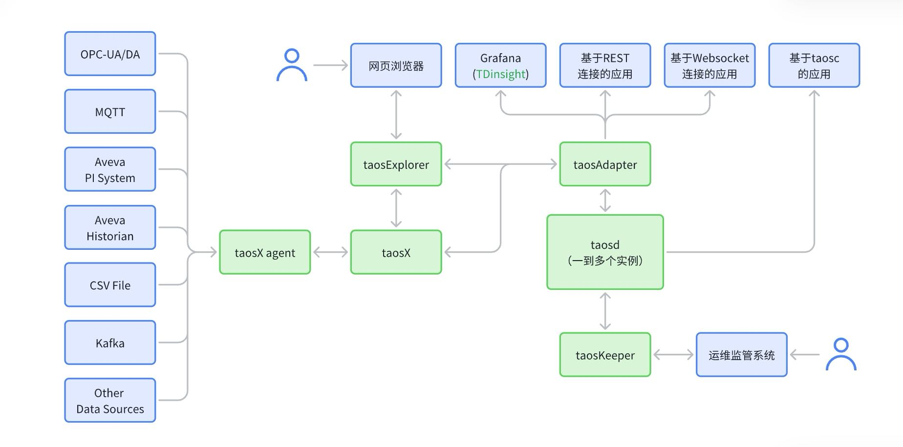
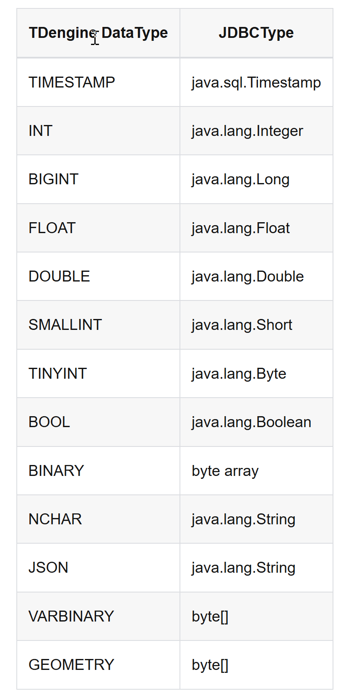

# TDengine

## 1. TDengine 简介

TDengine 是一款高性能、分布式、支持 SQL 的时序数据库（Time-Series Database），其核心代码包括集群功能全部开源，同时 TDengine 还带有内建的缓存、流式计算、数据订阅等系统功能，能大幅减少研发和运维的复杂度，可广泛应用于物联网、车联网、工业互联网、IT 运维、金融等领域。

### 1.1 TDengine 产品

为满足不同用户的需求和场景，涛思数据推出 TDengine 系列产品，包括开源版 TDengine OSS、企业版 TDengine Enterprise 以及云服务 TDengine Cloud。

TDengine OSS 是一个开源的高性能时序数据库，与其他时序数据库相比，它的核心优势在于其集群开源、高性能和云原生架构。而且除了基础的写入、查询和存储功能外，TDengine OSS 还集成了缓存、流式计算和数据订阅等高级功能，这些功能显著简化了系统设计，降低了企业的研发和运营成本。

在 TDengine OSS 的基础上，企业版 TDengine Enterprise 提供了增强的辅助功能，包括数据的备份恢复、异地容灾、多级存储、视图、权限控制、安全加密、IP 白名单、支持 MQTT、OPC-UA、OPC-DA、PI、Wonderware、Kafka 等各种数据源。这些功能为企业提供了更为全面、安全、可靠和高效的时序数据管理解决方案。

此外，TDengine Cloud 作为一种全托管的云服务，存储与计算分离，分开计费，为企业提供了企业级的工具和服务，彻底解决了运维难题，尤其适合中小规模的用户使用。

### 1.2 TDengine 主要功能与特性

TDengine 充分利用了时序数据的特点，提出了“一个数据采集点一张表”与“超级表”的概念，设计了创新的存储引擎，让数据的写入、查询和存储效率都得到极大的提升。

1. 写入数据：TDengine 支持多种数据写入方式。首先，它完全兼容 SQL，允许用户使用标准的 SQL 语法进行数据写入。而且 TDengine 还支持无模式（Schemaless）写入，包括流行的 InfluxDB Line 协议、OpenTSDB 的 Telnet 和 JSON 协议，这些协议的加入使得数据的导入变得更加灵活和高效。更进一步，TDengine 与众多第三方工具实现了无缝集成，例如 Telegraf、Prometheus、EMQX、StatsD、collectd 和 HiveMQ 等。在 TDengine Enterprise 中， 还提供了 MQTT、OPC-UA、OPC-DA、PI、Wonderware、Kafka、InfluxDB、OpenTSDB、MySQL、Oracle 和 SQL Server 等连接器。这些工具通过简单的配置，无需一行代码，就可以将来自各种数据源的数据源源不断的写入数据库，极大地简化了数据收集和存储的过程。

2. 查询数据：TDengine 提供标准的 SQL 查询语法，并针对时序数据和业务的特点优化和新增了许多语法和功能，例如降采样、插值、累计求和、时间加权平均、状态窗口、时间窗口、会话窗口、滑动窗口等。TDengine 还支持用户自定义函数（UDF）。

3. 缓存：TDengine 使用时间驱动缓存管理策略（First-In-First-Out，FIFO），将最近到达的（当前状态）数据保存在缓存中，这样便于获取任何监测对象的实时状态，而无需使用 Redis 等其他缓存工具，简化系统架构和运营成本。

4. 流式计算：TDengine 流式计算引擎提供了实时处理写入的数据流的能力，不仅支持连续查询，还支持事件驱动的流式计算。它提供了替代复杂流处理系统的轻量级解决方案，并能够在高吞吐的数据写入的情况下，提供毫秒级的计算结果延迟。

5. 数据订阅：TDengine 提供了类似 Kafka 的数据订阅功能。但用户可以通过 SQL 来灵活控制订阅的数据内容，并使用 Kafka 相同的 API 来订阅一张表、一组表、全部列或部分列、甚至整个数据库的数据。TDengine 可以替代需要集成消息队列产品的场景， 从而简化系统设计的复杂度，降低运营维护成本。

6. 可视化/BI：TDengine 本身不提供可视化或 BI 的功能。但通过其 RESTful API， 标准的 JDBC、ODBC 接口，TDengine 能够 Grafana、Google Data Studio、Power BI、Tableau 以及国产 BI 工具无缝集成。

7. 集群功能：TDengine 支持集群部署，能够随着业务数据量的增长，通过增加节点线性提升系统处理能力，实现水平扩展。同时，通过多副本技术提供高可用性，并支持 Kubernetes 部署。同时还提供了多种运维工具，方便系统管理员更好地管理和维护集群的健壮运行。

8. 数据迁移：TDengine 提供了多种便捷的数据导入导出功能，包括脚本文件导入导出、数据文件导入导出、taosdump 工具导入导出等。

9. 编程连接器：TDengine 提供不同语言的连接器，包括 C/C++、Java、Go、Node.js、Rust、Python、C#、R、PHP 等。这些连接器大多都支持原生连接和 WebSocket 两种连接方式。TDengine 也提供 RESTful 接口，任何语言的应用程序可以直接通过 HTTP 请求访问数据库。

10. 数据安全：TDengine 提供了丰富的用户管理和权限管理功能以控制不同用户对数据库和表的访问权限，提供了 IP 白名单功能以控制不同帐号只能从特定的服务器接入集群。TDengine 支持系统管理员对不同数据库按需加密，数据加密后对读写完全透明且对性能的影响很小。还提供了审计日志功能以记录系统中的敏感操作。

11. 常用工具：TDengine 还提供了交互式命令行程序（CLI），便于管理集群、检查系统状态、做即时查询。压力测试工具 taosBenchmark，用于测试 TDengine 的性能。TDengine 还提供了图形化管理界面，简化了操作和管理过程。

12. 零代码数据接入：TDengine 企业版提供了丰富的数据接入功能，依托强大的数据接入平台，无需一行代码，只需要做简单的配置即可实现多种数据源的数据接入，目前已经支持的数据源包括：OPC-UA、OPC-DA、PI、MQTT、Kafka、InfluxDB、OpenTSDB、MySQL、SQL Server、Oracle、Wonderware Historian、MongoDB。

### 1.3 技术生态

在整个时序大数据平台中，TDengine 扮演的角色如下：


上图中，左侧是各种数据采集或消息队列，包括 OPC-UA、MQTT、Telegraf、也包括 Kafka，他们的数据将被源源不断的写入到 TDengine。右侧则是可视化、BI 工具、组态软件、应用程序。下侧则是 TDengine 自身提供的命令行程序（CLI）以及可视化管理工具。

### 1.4 适用场景

作为一个高性能、分布式、支持 SQL 的时序数据库（Time-series Database），TDengine 的典型适用场景包括但不限于 IoT、工业互联网、车联网、IT 运维、能源、金融证券等领域。需要指出的是，TDengine 是针对时序数据场景设计的专用数据库和专用大数据处理工具，因其充分利用了时序大数据的特点，它无法用来处理网络爬虫、微博、微信、电商、ERP、CRM 等通用型数据。

## 2. 产品组件

整个 TDengine 产品生态的拓扑架构（组件 taosX、taosX Agent 仅 TDengine Enterprise 提供）。



### 2.1 taosd

taosd 是 TDengine 数据库引擎的核心服务，其配置文件默认是 /etc/taos/taos.cfg 但也可以指定不同路径的配置文件。taosd 进程的日志默认存储在 /var/log/taos/ 目录下，方便用户进行日志查看和管理。

在 TDengine 中，taosd 是一个关键的守护进程，同时也是核心服务进程。它负责处理所有与数据相关的操作，包括数据写入、查询和管理等。在 Linux 操作系统中，用户可以利用 systemd 命令来便捷地启动、停止 taosd 进程。为了查看 taosd 的所有命令行参数，用户可以执行 taosd -h 命令。

taosd 命令行参数如下

-a <json file>：指定一个 JSON 文件，其中包含服务启动时的各项配置参数，其格式形如 {"fqdn":"td1"}，关于配置参数的细节请参考下一节
-c <directory>：指定配置文件所在目录
-s：打印 SDB 信息
-C: 打印配置信息
-e: 指定环境变量，其格式形如 -e 'TAOS_FQDN=td1'
-k: 获取机器码
-dm: 启用内存调度
-V: 打印版本信息

### 2.2 taosc

taosc 是 TDengine 的客户端程序，为开发人员提供了一组函数和接口，以便编写应用程序并连接到 TDengine，执行各种 SQL。由于 taosc 是用 C 语言编写的，因此可以轻松地与 C/C++ 应用程序集成。

当使用其他编程语言与 TDengine 交互时，如果使用原生连接，也需要依赖 taosc。这是因为 taosc 提供了与 TDengine 通信所需的底层协议和数据结构，确保了不同编程语言应用程序能够顺利地与 TDengine 进行交互。

### 2.3 taosAdapter

taosAdapter 是一个 TDengine 的配套工具，是 TDengine 集群和应用程序之间的桥梁和适配器。它支持用户通过 RESTful 接口和 WebSocket 连接访问 TDengine 服务，实现数据的便捷接入和处理。

taosAdapter 能够与各种数据收集代理工具（如 Telegraf、StatsD、collectd 等）无缝对接，从而将数据导入 TDengine。此外，它还提供了与 InfluxDB/OpenTSDB 兼容的数据写入接口，使得原本使用 InfluxDB/OpenTSDB 的应用程序能够轻松移植到 TDengine 上，无须进行大量修改。

通过 taosAdapter，用户可以灵活地将 TDengine 集成到现有的应用系统中，实现数据的实时存储、查询和分析。

taosAdapter 提供以下功能：

- RESTful 接口
- 兼容 InfluxDB v1 写接口
- 兼容 OpenTSDB JSON 和 telnet 格式写入
- 无缝连接到 Telegraf
- 无缝连接到 collectd
- 无缝连接到 StatsD
- 支持 Prometheus remote_read 和 remote_write
- 获取 table 所在的虚拟节点组（VGroup）的 VGroup ID

### 2.4 taosKeeper

taosKeeper 是 TDengine 3.0 版本监控指标的导出工具，旨在方便用户对 TDengine 的运行状态和性能指标进行实时监控。通过简单的配置，TDengine 能够将其运行状态、指标等信息上报给 taosKeeper。当接收到监控数据后，taosKeeper 会利用 taosAdapter 提供的 RESTful 接口，将这些数据存储到 TDengine 中。

taosKeeper 的一个重要价值在于，它能够将多个甚至一批 TDengine 集群的监控数据集中存储在一个统一的平台上。这使得监控软件能够轻松获取这些数据，从而实现对 TDengine 集群的全面监控和实时分析。通过 taosKeeper，用户可以更加便捷地掌握 TDengine 的运行状况，及时发现并解决潜在问题，确保系统的稳定性和高效性。

### 2.5 taosExplorer

为了简化用户对数据库的使用和管理，TDengine Enterprise 引入了一个全新的可视化组件—taosExplorer。这个工具为用户提供了一个直观的界面，方便用户轻松管理数据库系统中的各类元素，如数据库、超级表、子表等，以及它们的生命周期。

通过 taosExplorer，用户可以执行 SQL 查询，实时监控系统状态、管理用户权限、完成数据的备份和恢复操作。此外，它还支持与其他集群之间的数据同步、导出数据，以及管理主题和流计算等功能。

taosExplorer 虽然它没有开源，但随开源版安装包免费提供。值得一提的是，taosExplorer 的社区版与企业版在功能上有所区别。企业版提供了更丰富的功能和更高级别的技术支持，以满足企业用户的需求。

### 2.6 TDinsight

TDinsight 是使用 [Grafana] 对 TDengine 进行监控的解决方案。

TDengine 通过 taosKeeper 将服务器的 CPU、内存、硬盘空间、带宽、请求数、磁盘读写速度、慢查询等信息定时写入指定数据库。通过 Grafana 和 TDengine 数据源插件，TDinsight 将集群状态、节点信息、插入及查询请求、资源使用情况等进行可视化展示，为开发者实时监控 TDengine 集群运行状态提供了便利。本文将指导用户安装 TDengine 数据源插件及部署 TDinsight 可视化面板。

## 3. 工具

### 3.1 taos

TDengine 提供一命令行应用程序（以下简称为 TDengine CLI）taos。要进入 TDengine 命令行，您只要在终端执行 taos (Linux/Mac) 或 taos.exe (Windows) 即可。

### 3.2 taosdump

taosdump 是一个支持从运行中的 TDengine 集群备份数据并将备份的数据恢复到相同或另一个运行中的 TDengine 集群中的工具应用程序。

### 3.3 taosBenchmark

taosBenchmark (曾用名 taosdemo ) 是一个用于测试 TDengine 产品性能的工具。taosBenchmark 可以测试 TDengine 的插入、查询和订阅等功能的性能，它可以模拟由大量设备产生的大量数据，还可以灵活地控制数据库、超级表、标签列的数量和类型、数据列的数量和类型、子表的数量、每张子表的数据量、插入数据的时间间隔、taosBenchmark 的工作线程数量、是否以及如何插入乱序数据等。为了兼容过往用户的使用习惯，安装包提供 了 taosdemo 作为 taosBenchmark 的软链接。

## 4. 安装

在 TDengine 的安装包中，除了 TDengine 数据库引擎 taosd 以外，还提供了一些附加组件，以方便用户的使用。

- taosAdapter 是应用和 TDengine 之间的桥梁；
- taosKeeper 是 TDengine 监控指标的导出工具；
- taosX 是数据管道（data pipeline）工具；
- taosExplorer 是可视化图形管理工具；
- taosc 是 TDengine 客户端驱动。


从 TDengine 3.0.6.0 开始，不再提供单独的 taosTools 安装包，原 taosTools 安装包中包含的工具都在 TDengine-server 安装包中，如果需要请直接下载 TDengine-server 安装包。
从 TDengine 3.1.0.0 开始，只提供 Windows 客户端安装包。如果需要 Windows 服务端安装包，请联系 TDengine 销售团队升级为企业版。

### 4.1 网络端口说明

|                接口或组件名称                |    端口    |  协议   |
| :------------------------------------------: | :--------: | :-----: |
|              原生接口（taosc）               |    6030    |   TCP   |
|                 RESTful 接口                 |    6041    |   TCP   |
|                WebSocket 接口                |    6041    |   TCP   |
|                  taosKeeper                  |    6043    |   TCP   |
|             statsd 格式写入接口              |    6044    | TCP/UDP |
|            collectd 格式写入接口             |    6045    | TCP/UDP |
|         openTSDB Telnet 格式写入接口         |    6046    |   TCP   |
|  collectd 使用 openTSDB Telnet 格式写入接口  |    6047    |   TCP   |
|  icinga2 使用 openTSDB Telnet 格式写入接口   |    6048    |   TCP   |
| tcollector 使用 openTSDB Telnet 格式写入接口 |    6049    |   TCP   |
|                    taosX                     | 6050, 6055 |   TCP   |
|                 taosExplorer                 |    6060    |   TCP   |

### 4.2 Docker 安装

为方便使用，标准的服务端安装包包含了 taosd、taosAdapter、taosc、taos、taosdump、taosBenchmark、TDinsight 安装脚本和示例代码。

```sh
docker pull tdengine/tdengine:3.0.1.4

# 注意：TDengine 3.0 服务端仅使用 6030 TCP 端口。6041 为 taosAdapter 所使用提供 REST 服务端口。6043-6049 为 taosAdapter 提供第三方应用接入所使用端口，可根据需要选择是否打开。
# /var/lib/taos: TDengine 默认数据文件目录。可通过[配置文件]修改位置。
# /var/log/taos: TDengine 默认日志文件目录。可通过[配置文件]修改位置。
docker run -d --name tdengine --restart always \
  -v ~/data/taos/dnode/data:/var/lib/taos \
  -v ~/data/taos/dnode/log:/var/log/taos \
  -p 6030:6030 -p 6041:6041 -p 6043-6060:6043-6060 -p 6043-6060:6043-6060/udp tdengine/tdengine

# 在宿主机上执行，验证该容器中提供的 HTTP 服务是否可用
curl -u root:qny@taos123.com -d "show databases" 192.168.100.96:6041/rest/sql

# 进入容器，执行 taos 进入命令行界面
docker exec -it <container name> bash
taos
taos -u root -h localhost -P 36041 -p
```

## 5. 数据模型

### 5.1 采集量

采集量是指通过各种传感器、设备或其他类型的采集点所获取的物理量，如电流、电压、温度、压力、GPS 等。由于这些物理量随时间不断变化，因此采集的数据类型多 样，包括整型、浮点型、布尔型以及字符串等。随着时间的积累，存储的数据将持续增长。

### 5.2 标签

标签是指附着在传感器、设备或其他类型采集点上的静态属性，这些属性不会随时间发生变化，例如设备型号、颜色、设备所在地等。标签的数据类型可以是任意类型。尽管标签本身是静态的，但在实际应用中，用户可能需要对标签进行修改、删除或添加。与采集量不同，随着时间的推移，存储的标签数据量保持相对稳定，不会呈现明显的增长趋势。在智能电表的示例中，location（位置）和 Group ID（分组 ID）就是典型的标签。

### 5.3 数据采集点

数据采集点是指在一定的预设时间周期内或受到特定事件触发时，负责采集物理量的硬件或软件设备。一个数据采集点可以同时采集一个或多个采集量，但这些采集量都是在同一时刻获取的，并拥有相同的时间戳。对于结构复杂的设备，通常会有多个数据采集点，每个数据采集点的采集周期可能各不相同，它们之间完全独立，互不干扰。以一辆汽车为例，可能有专门的数据采集点用于采集 GPS，有的数据采集点负责监控发动机状态，还有的数据采集点则专注于车内环境的监测。这样，一辆汽车就包含了 3 个不同类型的数据采集点。在智能电表的示例中，d1001、d1002、d1003、d1004 等标识符即代表了不同的数据采集点。

### 5.4 表

鉴于采集的数据通常是结构化数据，为了降低用户的学习难度，TDengine 采用传统的关系型数据库模型来管理数据。同时，为了充分发挥时序数据的特性，TDengine 采取了“一个数据采集点一张表”的设计策略，即要求为每个数据采集点单独建立一张表。例如，若有千万块智能电表，则在 TDengine 中需要创建相应数量的表。在智能电表的示例数据中，设备 ID 为 d1001 的智能电表对应着 TDengine 中的一张表，该电表采集的所有时序数据均存储于此表中。这种设计方式既保留了关系型数据库的易用性，又充分利用了时序数据的独特优势。

“一个数据采集点一张表”，就是在设计数据模型时，要对每个数据采集点单独建一张表，用来存储这个数据采集点所采集的时序数据。“一个数据采集点一张表”的设计有几大优点：

1. 由于不同数据采集点产生数据的过程完全独立，每个数据采集点的数据源是唯一的，一张表也就只有一个写入者，这样就可采用无锁方式来写，写入速度就能大幅提升。
2. 对于一个数据采集点而言，其产生的数据是按照时间排序的，因此写的操作可用追加的方式实现，进一步大幅提高数据写入速度。
3. 一个数据采集点的数据是以块为单位连续存储的。如果读取一个时间段的数据，它能大幅减少随机读取操作，成数量级的提升读取和查询速度。
4. 一个数据块内部，采用列式存储，对于不同数据类型，采用不同压缩算法，而且由于一个数据采集点的采集量的变化是缓慢的，压缩率更高。

如果采用传统的方式，将多个数据采集点的数据写入一张表，由于网络延时不可控，不同数据采集点的数据到达服务器的时序是无法保证的，写入操作是要有锁保护的，而且一个数据采集点的数据是难以保证连续存储在一起的。采用一个数据采集点一张表的方式，能最大程度的保证单个数据采集点的插入和查询的性能是最优的，，而且数据压缩率最高。

在 TDengine 中，通常使用数据采集点的名称（如：d1001）来做表名，每个数据采集点可以有多个采集量（如：current、voltage、phase 等），每个采集量对应一张表的一列。采集量的数据类型可以是整型、浮点型、字符串等。

此外，表的第一列必须是时间戳，即数据类型为 Timestamp。对于每个采集量，TDengine 将使用第一列时间戳建立索引，采用列式存储。

### 5.5 超级表

由于一个数据采集点一张表，导致表的数量巨增，难以管理，而且应用经常需要做采集点之间的聚合操作，聚合的操作也变得复杂起来。为解决这个问题，TDengine 引入了超级表（Super Table，简称为 STable）的概念。

超级表是一种数据结构，它能够将某一特定类型的数据采集点聚集在一起，形成一张逻辑上的统一表。这些数据采集点具有相同的表结构，但各自的静态属性（如标签）可能不同。创建超级表时，除了定义采集量以外，还需定义超级表的标签。一张超级表至少包含一个时间戳列、一个或多个采集量列以及一个或多个标签列。此外，超级表的标签可以灵活地进行增加、修改或删除操作。

在 TDengine 中，表代表具体的数据采集点，而超级表则代表一组具有相同属性的数据采集点集合。以智能电表为例，我们可以为该类型的电表创建一张超级表，其中包含了所有智能电表的共有属性和采集量。这种设计不仅简化了表的管理，还便于进行跨数据采集点的聚合操作，从而提高数据处理的效率。

所以在使用 TDengine 时，我们要先创建库（database），再创建超级表，然后为具体的数据采集点创建子表。从创建到管理数据，都可用自己熟悉的 SQL 语法。

### 5.6 子表

子表是数据采集点在逻辑上的一种抽象表示，它是隶属于某张超级表的具体表。用户可以将超级表的定义作为模板，并通过指定子表的标签值来创建子表。这样，通过超级表生成的表便被称为子表。

### 5.7 库

库是 TDengine 中用于管理一组表的集合。TDengine 允许一个运行实例包含多个库，并且每个库都可以配置不同的存储策略。由于不同类型的数据采集点通常具有不同的数据特征，如数据采集频率、数据保留期限、副本数量、数据块大小等。为了在各种场景下确保 TDengine 能够发挥最大效率，建议将具有不同数据特征的超级表创建在不同的库中。

### 5.8 时间戳

### 5.9 节点管理

组成 TDengine 集群的物理实体是 dnode (data node 的缩写)，它是一个运行在操作系统之上的进程。在 dnode 中可以建立负责时序数据存储的 vnode (virtual node)，在多节点集群环境下当某个数据库的 replica 为 3 时，该数据库中的每个 vgroup 由 3 个 vnode 组成；当数据库的 replica 为 1 时，该数据库中的每个 vgroup 由 1 个 vnode 组成。如果要想配置某个数据库为多副本，则集群中的 dnode 数量至少为 3。在 dnode 还可以创建 mnode (management node)，单个集群中最多可以创建三个 mnode。在 TDengine 3.0.0.0 中为了支持存算分离，引入了一种新的逻辑节点 qnode (query node)，qnode 和 vnode 既可以共存在一个 dnode 中，也可以完全分离在不同的 dnode 上。

创建数据节点

### 5.10 元数据

TDengine 内置了一个名为 INFORMATION_SCHEMA 的数据库，提供对数据库元数据、数据库系统信息和状态的访问。

该数据库存储有关 TDengine 维护的所有其他数据库的信息。它包含多个只读表。实际上，这些表都是视图，而不是基表，因此没有与它们关联的文件。所以对这些表只能查询，不能进行 INSERT 等写入操作。INFORMATION_SCHEMA 数据库旨在以一种更一致的方式来提供对 TDengine 支持的各种 SHOW 语句（如 SHOW TABLES、SHOW DATABASES）所提供的信息的访问。

## 6. 常用命令

> TDengine CLI 参考手册: https://docs.taosdata.com/reference/tools/taos-cli/

TDengine 命令行程序（以下简称 TDengine CLI）是用户操作 TDengine 实例并与之交互的最简洁最常用工具。

```sh
# 登录
taos
taos -u root -h localhost -P 36041 -p
# 登出
quit
q
exit

# 执行脚本
source <filename>

# 调整字符显示宽度。如显示的内容后面以 ... 结尾时，表示该内容已被截断，可通过本命令修改显示字符宽度以显示完整的内容。
SET MAX_BINARY_DISPLAY_WIDTH <nn>;


# 创建用户。sysinfo ：用户是否可以查看系统信息。1 表示可以查看，0 表示不可以查看。createdb：用户是否可以创建数据库。1 表示可以创建，0 表示不可以创建。缺省值为 0。
create user <user_name> pass '<password>' [sysinfo {1|0}] [createdb {1|0}]
# 查看用户
show users;
select * from information_schema.ins_users;
# 修改用户。enable：是否启用用户。1 表示启用此用户，0 表示禁用此用户。
alter user <user_name> alter_user_clause 
alter_user_clause: { 
 pass 'literal' 
 | enable value 
 | sysinfo value
 | createdb value
}
# 禁用用户
alter user <user_name> enable 0
# 删除用户
drop user user_name


# 查看授权
show user privileges

show dnodes;

CREATE DATABASE demo;
USE demo;
CREATE TABLE t (ts TIMESTAMP, speed INT);
INSERT INTO t VALUES ('2019-07-15 00:00:00', 10);
INSERT INTO t VALUES ('2019-07-15 01:00:00', 20);
SELECT * FROM t;


SELECT COUNT(*) FROM test.meters;                                                       # 查询超级表 meters 下的记录总条数
SELECT AVG(current), MAX(voltage), MIN(phase) FROM test.meters;                         # 查询总记录的平均值、最大值、最小值
SELECT COUNT(*) FROM test.meters WHERE location = "California.SanFrancisco";            # 查询 location = "California.SanFrancisco" 的记录总条数
SELECT AVG(current), MAX(voltage), MIN(phase) FROM test.meters WHERE groupId = 10;      # 查询 groupId = 10 的所有记录的平均值、最大值、最小值

# 使用系统提供的伪列_wstart 来给出每个窗口的开始时间
SELECT _wstart, AVG(current), MAX(voltage), MIN(phase) FROM test.d1001 INTERVAL(10s);   # 对表 d1001 按每 10 秒进行平均值、最大值和最小值聚合统计
```

## Java 开发

taos-jdbcdriver 是 TDengine 的官方 Java 语言连接器，Java 开发人员可以通过它开发存取 TDengine 数据库的应用软件。taos-jdbcdriver 实现了 JDBC driver 标准的接口。

### 数据类型映射

TDengine 目前支持时间戳、数字、字符、布尔类型，与 Java 对应类型转换如下：



### JDBC 驱动

taos-jdbcdriver 实现了 JDBC 标准的 Driver 接口，提供了两个实现类：RestfulDriver 和 TSDBDriver。对于建立连接，原生连接与 REST 连接有细微不同。 Websocket 和 REST 连接使用驱动类 com.taosdata.jdbc.rs.RestfulDriver。原生连接使用驱动类 com.taosdata.jdbc.TSDBDriver。

原生连接：jdbc:TAOS://taosdemo.com:6030/power?user=root&password=taosdata

注意：使用 JDBC 原生连接，taos-jdbcdriver 需要依赖客户端驱动（Linux 下是 libtaos.so；Windows 下是 taos.dll；macOS 下是 libtaos.dylib）。

使用 Websocket 和 REST 连接，不需要依赖客户端驱动。与 JDBC 原生连接相比，仅需要：

- driverClass 指定为“com.taosdata.jdbc.rs.RestfulDriver”；
- jdbcUrl 以“jdbc:TAOS-RS://”开头；
- 使用 6041 作为连接端口。
