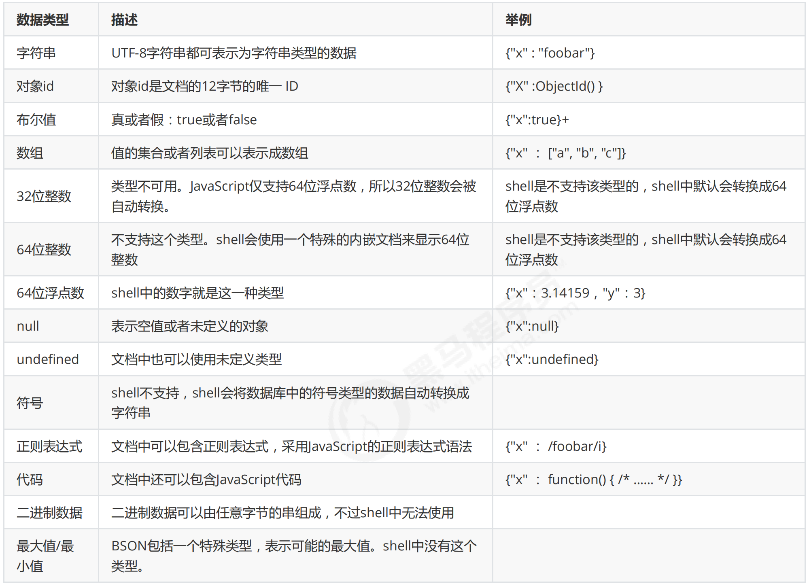

# MongoDB

## 1. 概念

官方给出的解释：MongoDB 是由 C++ 语言编写的，是一个基于分布式文件存储的开源数据库系统。

[MongoDB](http://www.mongodb.org/) 是一个开源、高性能、无模式的文档型数据库，当初的设计就是用于简化开发和方便扩展，是NoSQL数据库产品中的一种。是最像关系型数据库（MySQL）的非关系型数据库。

它支持的数据结构非常松散，是一种类似于 JSON 的 格式叫 BSON，可以存储比较复杂的数据类型。

MongoDB 操作起来比较简单和容易。而且还支持对数据建立索引。并且可以存储大文件数据，比如以前在 mysql 中是将视频，图片等大文件的地址进行存储到数据库中去。而在 MongoDB 中，可以直接将这些数据进行存储。MongoDB 也能很好的支持各种（比如：java、PHP、c、c#等）语言的驱动程序。

**特点**

1. 高性能：
    - MongoDB 提供高性能的数据持久性。特别是对嵌入式数据模型的支持减少了数据库系统上的 I/O 活动。
    - 索引支持更快的查询，并且可以包含来自嵌入式文档和数组的键。（文本索引解决搜索的需求、TTL索引解决历史数据自动过期的需求、地理位置索引可用于构建各种 O2O 应用）
    - mmapv1、wiredtiger、mongorocks（rocksdb）、in-memory 等多引擎支持满足各种场景需求。
    - Gridfs 解决文件存储的需求。
2. 高可用性：
    - MongoDB 的复制工具称为副本集（replica set），它可提供自动故障转移和数据冗余。
3. 高扩展性：
    - MongoDB提供了水平可扩展性作为其核心功能的一部分。分片将数据分布在一组集群的机器上（海量数据存储，服务能力水平扩展）。从3.4开始，MongoDB 支持基于片键创建数据区域。在一个平衡的集群中，MongoDB 将一个区域所覆盖的读写只定向到该区域内的那些片。
4. 丰富的查询支持：
    - MongoDB 支持丰富的查询语言，支持读和写操作(CRUD)，比如数据聚合、文本搜索和地理空间查询等。
5. 其他特点：如无模式（动态模式）、灵活的文档模型

**什么时候选择 MongoDB**

1. 应用不需要事务及复杂 join 支持
2. 新应用，需求会变，数据模型无法确定，想快速迭代开发
3. 应用需要2000-3000以上的读写QPS（更高也可以）
4. 应用需要 TB 甚至 PB 级别数据存储
5. 应用发展迅速，需要能快速水平扩展
6. 应用要求存储的数据不丢失
7. 应用需要99.999%高可用
8. 应用需要大量的地理位置查询、文本查询

如果上述有1个符合，可以考虑 MongoDB，2个及以上的符合，选择 MongoDB 绝不会后悔。

**应用场景**

1. 社交场景，使用 MongoDB 存储存储用户信息，以及用户发表的朋友圈信息，通过地理位置索引实现附近的人、地点等功能。
2. 游戏场景，使用 MongoDB 存储游戏用户信息，用户的装备、积分等直接以内嵌文档的形式存储，方便查询、高效率存储和访问。
3. 物流场景，使用 MongoDB 存储订单信息，订单状态在运送过程中会不断更新，以 MongoDB 内嵌数组的形式来存储，一次查询就能将订单所有的变更读取出来。
4. 物联网场景，使用 MongoDB 存储所有接入的智能设备信息，以及设备汇报的日志信息，并对这些信息进行多维度的分析。
5. 视频直播，使用 MongoDB 存储用户信息、点赞互动信息等。

这些应用场景中，数据操作方面的共同特点是：数据量大、写入操作频繁（读写都很频繁）、价值较低的数据，对事务性要求不高。对于这样的数据，我们更适合使用 MongoDB 来实现数据的存储。

## 2. 体系结构

MongoDB 的逻辑结构是一种层次结构。主要由：文档(document)、集合(collection)、数据库(database)这三部分组成的。

MongoDB 的文档相当于 mysql 数据库的一行记录，所以说mongodb是面向文档进行存储的。MongoDB 的一个集合相当于 mysql 的一张表，一张表中有多行，一个集合中也有许多文档。

| SQL术语/概念 | MongoDB术语/概念 | 解释/说明                            |
| ------------ | ---------------- | ------------------------------------ |
| database     | database         | 数据库                               |
| table        | collection       | 数据库表/集合                        |
| row          | document         | 数据记录行/文档                      |
| column       | field            | 数据字典/域                          |
| index        | index            | 索引                                 |
| table joins  |                  | 表连接，MongoDB不支持                |
|              | 嵌入文档         | MongoDB通过嵌入式文档来替代多表连接  |
| primary key  | primary key      | 主键，MongoDB自动将_id字段设置为主键 |


## 3. 数据模型

MongoDB 的最小存储单位就是文档 document 对象。文档 document 对象对应于关系型数据库的行。数据在 MongoDB 中以 BSON（Binary-JSON）文档的格式存储在磁盘上。

BSON（Binary Serialized Document Format）是一种类似 json 的一种二进制形式的存储格式，简称 Binary JSON。BSON 和 JSON 一样，支持内嵌的文档对象和数组对象，但是 BSON 有 JSON 没有的一些数据类型，如 Date 和 BinData 类型。

BSON 采用了类似于 C 语言结构体的名称、对表示方法，支持内嵌的文档对象和数组对象，具有轻量性、可遍历性、高效性的三个特点，可以有效描述非结构化数据和结构化数据。这种格式的优点是灵活性高，但它的缺点是空间利用率不是很理想。

Bson 中，除了基本的 JSON 类型：string, integer, boolean, double, null, array 和 object，mongo 还使用了特殊的数据类型。这些类型包括 date, object id, binary data, regular expression 和 code。每一个驱动都以特定语言的方式实现了这些类型，查看你的驱动的文档来获取详细信息。

BSON数据类型参考列表：



提示：shell默认使用64位浮点型数值。{“x”：3.14}或{“x”：3}。对于整型值，可以使用NumberInt（4字节符号整数）或NumberLong（8字节符号整数），{“x”:NumberInt(“3”)}{“x”:NumberLong(“3”)}

## 4. 安装

### 4.1 windows 安装

> MongoDB 6.0 以后做出了重大改变，MongoDB 已经不再默认为你安装 shell 工具，因此需要安装一个额外的 shell：Install mongosh — MongoDB Shell，这个工具被称为 mongosh。
>
>下载链接：[https://www.mongodb.com/try/download/shell](https://www.mongodb.com/try/download/shell) 
>
> 因此需要额外安装 mongosh（下载 zip 压缩包，直接解压放在一个目录就可以）。

使用 msi 文件直接安装使用。一般建议创建配置文件 mongo.conf 配置文件，存放在安装目录下，然后编写服务器启动脚本或者设置为服务自启动。

额外说明：

1. 配置环境变量 
2. 默认数据库存储路径为 \data\db，如果需要修改，可以通过 --dbpath 来指定。需要手动创建 db 文件夹，否则报错！
3. 默认端口为 27012，如果想改变默认的启动端口，可以通过 --port 来指定。
4. 在安装目录新建 conf 文件夹，该文件夹中新建配置文件 mongod.conf ，配置如下：
5. 启动服务 mongod -f ../conf/mongod.conf
6. 可以将 mongod 服务注册成 windows 服务 mongod --install --serviceName MongoDB -f E:/Database/MongoDB/Server/conf/mongod.conf

```yaml
# 日志
systemLog: 
  destination: file                                 # 日志输出目标为文件
  path: E:/Database/MongoDB/Server/log/mongod.log   # 日志文件的存储路径
  logAppend: true                                   # 指定是否追加日志信息到现有日志文件（true 表示追加）

# 存储
storage: 
  dbPath: E:/Database/MongoDB/Server/data/db/   # 数据库文件存储路径
  directoryPerDB: true                          # 每个数据库单独创建一个子目录（true 表示开启）
  journal:
    enabled: true                               # 启用日志文件（WiredTiger 引擎的事务日志）

# 端口
net: 
  #bindIp: 0.0.0.0
  port: 27017

setParameter: 
  enableLocalhostAuthBypass: false      # 此参数设置为 false，表示禁止使用 localhost 权限绕过身份验证，确保连接时需要提供有效的身份验证信息

security:
  authorization: enabled
```

### 4.2 Linux 安装

```shell
# 1. 下载压缩包，并上传压缩包到 Linux 中，解压到当前目录
tar -zxvf mongodb-linux-x86_64-6.0.14.tgz

# 2. 移动解压后的文件夹到指定的目录中
mv mongodb-linux-x86_64-6.0.14 /usr/local/mongodb

# 3. 新建几个目录，分别用来存储数据和日志：
mkdir -p /mongodb/data/db
mkdir -p /mongodb/log

# 4. 新建并修改配置文件
vi /mongodb/single/mongod.conf

# 5. 启动 MongoDB 服务，如果启动后不是 successfully ，则是启动失败了。原因基本上就是配置文件有问题。也可以通过进程来查看服务是否启动
/usr/local/mongodb/bin/mongod -f /mongodb/mongod.conf


```
配置文件的内容如下：

```yaml
systemLog:
    # MongoDB发送所有日志输出的目标指定为文件
    destination: file
    # mongod或mongos应向其发送所有诊断日志记录信息的日志文件的路径
    path: "/mongodb/log/mongod.log"
    # 当mongos或mongod实例重新启动时，mongos或mongod会将新条目附加到现有日志文件的末尾。
    logAppend: true
storage:
    # mongod实例存储其数据的目录。storage.dbPath设置仅适用于mongod。
    # The directory where the mongod instance stores its data.Default Value is "/data/db".
    dbPath: "/mongodb/single/data/db"
    journal:
        # 启用或禁用持久性日志以确保数据文件保持有效和可恢复。
        enabled: true
processManagement:
    # 启用在后台运行mongos或mongod进程的守护进程模式。
    fork: true
net:
    # 服务实例绑定的IP，默认是localhost
    bindIp: localhost,192.168.0.2
    # 绑定的端口，默认是27017
    port: 27017
```

### 4.3 docker 安装


## 5 安全配置

默认情况下，MongoDB 实例启动运行时是没有启用用户访问权限控制的，任何客户端都可以直接连接 27017，不需要任何权限验证、不需要验证账户，直接在命令窗口中输入 mongo 回车，就可以进行相关操作。

mongodb官网上说，为了能保障mongodb的安全可以做以下几个步骤：

1. 使用新的端口，默认的27017端口如果一旦知道了 ip 就能连接上，不太安全。
2. 设置 mongodb 的网络环境，最好将 mongodb 部署到公司服务器内网，这样外网是访问不到的。公司内部访问使用 vpn 等。
3. 开启安全认证。认证要同时设置服务器之间的内部认证方式，同时要设置客户端连接到集群的账号密码认证方式。

为了强制开启用户访问控制(用户验证)，则需要在 MongoDB 实例启动时使用选项 --auth 或在指定启动配置文件中添加选项 auth=true 。

### 5.1 用户

MongoDB 是基于角色的访问控制(Role-Based Access Control,RBAC)。所以创建用户需要指定用户的角色。

1. 创建管理员用户，先在 admin 数据库中创建角色为 userAdmin 或 userAdminAnyDatabase 的用户；
2. 启用访问控制，进行登录用户验证，这样创建用户才有意义。

### 5.2 角色

**内置角色**

1. 数据库用户角色：read、readWrite
2. 数据库管理角色：dbAdmin、dbOwner、userAdmin
3. 集群管理角色：clusterAdmin、clusterManager、clusterMonitor、hostManager；
4. 备份恢复角色：backup、restore；
5. 所有数据库角色：readAnyDatabase、readWriteAnyDatabase、userAdminAnyDatabase、dbAdminAnyDatabase
6. 超级用户角色：root
7. 内部角色：__system

```shell
# 创建管理用户
# 干净的数据库是没有用户的，需要自己创建用户，一般先给admin数据库创建一个管理员用户，成功后，可以使用该用户进行数据库管理操作，包括创建其他数据库的用户等。
use admin
db.createUser({user: 'admin', pwd: '123456', roles: [{role: 'userAdminAnyDatabase', db: 'admin'}, "readWriteAnyDatabase"]});

# 创建普通用户
use xxxx
db.createUser({user: 'user', pwd: '123456', roles: [{role: "readWrite", db: "xxxx" }]});

```


## 6. 基本常用命令

MongoDB 中默认的数据库为 test，如果你没有创建新的数据库，集合将存放在 test 数据库中。

```shell
mongosh                     # 登录， --host 主机，--port 端口
show dbs / show databases   # 展示所有数据库
db                          # 查看当前登录的数据库
use admin                   # 使用admin数据库
exit                        # 退出
db.shutdownServer()         # 关闭服务
```


