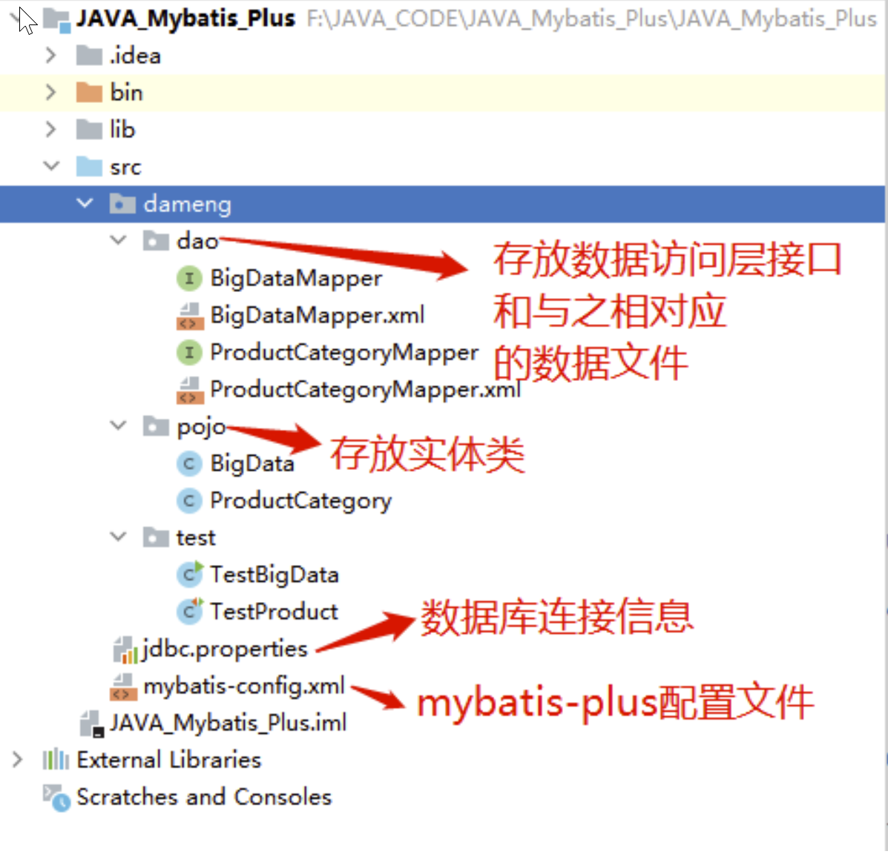
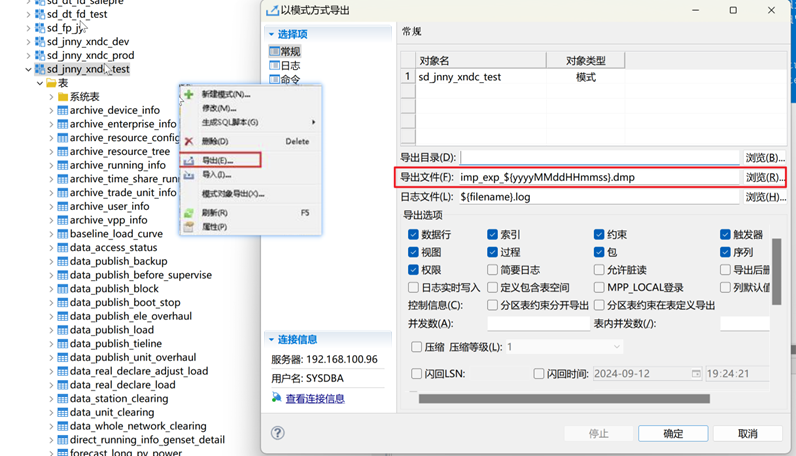

# 达梦数据库

## 1. 介绍

新一代大型通用关系型数据库，全面支持 SQL 标准和主流编程语言接口/开发框架。行列融合存储技术，在兼顾 OLAP 和 OLTP 的同时，满足 HTAP 混合应用场景。

## 2. 安装

> 官网文档特别完整，完全可以参考官网安装。
>
> [官网安装链接](https://eco.dameng.com/document/dm/zh-cn/start/dm-version-acquisition.html)

DM 安装程序提供四种安装方式：“典型安装”、“服务器安装”、“客户端安装”和“自定义安装”，用户可根据实际情况灵活地选择。

1. 典型安装包括：服务器、客户端、驱动、用户手册、数据库服务。
2. 服务器安装包括：服务器、驱动、用户手册、数据库服务。
3. 客户端安装包括：客户端、驱动、用户手册。
4. 自定义安装包括：用户根据需求勾选组件，可以是服务器、客户端、驱动、用户手册、数据库服务中的任意组合。

安装结束后，需要配置实例（创建数据库实例），需要注意的是数据库初始化参数配置，一旦确定无法修改 ，需谨慎设置。

常见参数说明：

- 数据文件使用的簇大小，即每次分配新的段空间时连续的页数。默认值 16，可选值： 16、 32、 64，单位：页。
- 数据文件使用的页大小。默认值 8，可选值： 4、 8、 16、 32，单位： KB。
- 日志文件大小：默认值 256，单位为： MB，范围为： 64 MB~2 GB。
- 标识符大小写敏感。默认值 Y，可选值： Y/N， 1/0。
- 字符集选项。默认值 0，可选值： 0[GB18030]， 1[UTF-8]， 2[EUC-KR]。

**字符集**

字符集在安装初始化库的时候指定，设定后不可更改。

UNICODE_FLAG：此参数表示了数据库中所有数据的字符集，包括数据字典的字符集。需要注意的是，数据库一旦初始化完成，字符集就将无法修改。我们可以使用 select unicode 来查询当前数据库的字符集种类，0 代表 gb18030；1 代表 UTF-8。

### 2.1 Docker 安装

1. 下载 Docker 安装包

2. 导入安装包。

```sh
# 拷贝安装包到 /opt 目录下，执行以下命令导入安装包：
docker load -i dm8_20240422_x86_rh6_64_rq_std_8.1.3.100_pack2.tar
```

3. 查看导入的镜像

4. 启动容器

使用 -e 命令指定数据库初始化参数时，需要注意的是目前只支持预设以下九个 DM 参数。

| 参数名         | 参数描述                                          | 备注           |
| :------------- | :------------------------------------------------ | :------------- |
| PAGE_SIZE      | 页大小，可选值 4/8/16/32，默认值：8               | 设置后不可修改 |
| EXTENT_SIZE    | 簇大小，可选值 16/32/64，默认值：16               | 设置后不可修改 |
| CASE_SENSITIVE | 1:大小写敏感；0：大小写不敏感，默认值：1          | 设置后不可修改 |
| UNICODE_FLAG   | 字符集选项；0:GB18030;1:UTF-8;2:EUC-KR，默认值：0 | 设置后不可修改 |
| INSTANCE_NAME  | 初始化数据库实例名字，默认值：DAMENG              | 可修改         |
| SYSDBA_PWD     | 初始化实例时设置 SYSDBA 的密码，默认值：SYSDBA001 | 可修改         |
| BLANK_PAD_MODE | 空格填充模式，默认值：0                           | 设置后不可修改 |
| LOG_SIZE       | 日志文件大小，单位为：M，默认值：256              | 可修改         |
| BUFFER         | 系统缓存大小，单位为：M，默认值：1000             | 可修改         |

```sh
# --privileged	指定容器是否在特权模式下运行。
docker run -d -p 30236:5236 --restart=always --name=dm8_test --privileged=true -e LD_LIBRARY_PATH=/opt/dmdbms/bin -e PAGE_SIZE=16 -e EXTENT_SIZE=32 -e LOG_SIZE=1024 -e UNICODE_FLAG=1  -e INSTANCE_NAME=dm8_test -v /opt/data:/opt/dmdbms/data dm8:dm8_20240422_rev215128_x86_rh6_64
```

5. 容器启动完成后，使用命令 docker ps 查看镜像的启动情况。

## 3. 数据库工具

DM 安装时，可以选择安装客户端程序提供四种安装方式：“典型安装”、“服务器安装”、“客户端安装”和“自定义安装”，用户可根据实际情况灵活地选择。

### 3.1 SQL 交互式查询工具

disql 是一款命令行客户端工具，用于进行 SQL 交互式查询，disql 工具一般用于没有图形界面时的操作，或者使用的连接工具为命令行形式，如 Xshell、SCRT 等工具。

#### 3.1.1 登录

进入数据库软件安装目录的 bin 目录下。登录方式主要有两种，分别如下：

```sh
# 方式一：如果密码含有特殊字符的情况下，Linux 需要使用双引号将密码包含进来，同时外层再使用单引号进行转义，Windows 需要使用三个双引号将密码包含起来。
./disql                                      ---用户名、密码、端口号均为默认的情况下
./disql username/password@IP:PORT

# 方式二：当密码存在特殊字符时，在 disql 操作界面中只需要使用双引号包含密码即可。
./disql /nolog                              ---进入disql操作终端界面，然后执行下面的操作
conn username/password@IP:PORT               # conn 也可以替换为 connect，或者输入 login 命令，
# 可以输入 login 命令 代替 conn/connect 命令
# 使用 login 命令时，服务名为 IP:PORT 或者 dm_svc.conf 文件中配置的服务名，用户名正常输入，用户输入时无需加转义符，其余回车即可。
login
```

#### 3.1.2 登出

登出命令在 Windows、Linux 均相同，主要分为两类，一类是 logout、disconnect；另一类是 exit、quit。其中，logout/disconnect 只退出或者断开当前登录的会话连接，不退出 disql。exit/quit 表示退出当前登录会话连接并且退出 disql 操作界面。

#### 3.1.3 disql 的使用

```sh
# 执行脚本
SQL> start /home/dmdba/sel.sql         # 通过“start”命令加上脚本位置执行脚本
SQL> ` /home/dmdba/sel.sql             # 通过符号“`”加上脚本位置执行脚本

# 也可以在登录时执行脚本
./disql DBTEST/'"TEST@12#34"'@127.0.0.1:5236 \`/home/dmdba/sel.sql    # Linux 环境下需要对反波浪号“`”进行转义。
disql DBTEST/'"TEST@12#34"'@127.0.0.1:5236 `C:\dm8\sel.sql            # Windows 环境下不需要对反波浪号“`”进行转义

# DISQL 部分常用命令
HELP                  ---帮助命令，可以查看相关命令配置项的用法，help set、help show
SET                   ---设置disql环境变量，可同时设置多个变量，使用空格分开。
SHOW 变量名           ---查看当前disql环境变量，可同时查看多个变量，使用空格分开。
ED或者EDIT 文件名     ---编辑指定的文本文件，缺省调用notepad或者vi
HOST 操作系统命令     ---调用执行操作系统命令
DESC  模式名.对象名   ---获取表或视图、存储过程、函数、包、记录、类的结构描述。
EXPLAIN  SQL语句      ---查看SQL语句预估的执行计划
```

## 4. 核心

### 4.1 表空间

表空间是一种逻辑存储结构，数据库的对象如表、索引等在逻辑上都是存储在指定的表空间中。

注意：

1. 创建、修改表空间的用户必须具有 DBA 权限；
2. 表空间名在服务器中必须唯一；
3. 一个表空间最多可以拥有 256 个数据文件。
4. 文件大小的单位默认为 MB，数据文件大小只写数字即可
5. SYSTEM、MAIN、ROLL 和 TEMP 表空间不允许删除。
6. 系统处于 suspend 或 mount 状态时不允许删除表空间，系统只有处于 open 状态下才允许删除表空间。
7. 如果表空间存放了数据，则不允许删除表空间。如果确实要删除表空间，则必须先删除表空间中的数据对象。

```sh
# 创建表空间。添加的数据文件大小最小为 4096*页大小，如页大小为 8K，则可添加的文件最小值为 4096*8k=32M。默认文件为 128 MB，对应页大小为 32 KB。
create tablespace 'TEST' datafile '/data/dmdata/DAMENG/TEST.DBF' size 128;
CREATE tablespace "USER_DATA" datafile 'E:\Database\DM8\dmdbms\data\DAMENG\USER_DATA.DBF' size 2048 autoextend on maxsize 16777215 CACHE = NORMAL;

# 修改表空间参数。比如：打开自动扩展，每次自动扩展 100M ，扩展上限 10240M
alter tablespace "TEST" datafile '/data/dmdata/DAMENG/TEST.DBF' autoextend on next 100 maxsize 10240;

# 表空间设置加密算法、密码
create tablespace "TEST" datafile '/data/dmdata/DAMENG/TEST.DBF' size 128 autoextend on next 100 maxsize 10240 CACHE = NORMAL encrypt with RC4;

# 查看表空间
select * from dba_data_files;

# 删除
drop tablespace "BOOKSHOP";               # 只可以删除用户创建的表空间并且只能删除未使用过的表空间。
```

### 4.2 模式

模式就是数据库数据的逻辑结构，表，索引，视图，存储过程等数据库对象的逻辑容器。

用户的模式（Schema）指的是用户账号拥有的对象集，在概念上可将其看作是包含表、视图、索引和权限定义的对象。在 DM 中，一个用户可以创建多个模式，一个模式中的对象（表、视图等）可以被多个用户使用。模式不是严格分离的，一个用户可以访问他所连接的数据库中有权限访问的任意模式中的对象。

系统为每一个用户自动建立了一个与用户名同名的模式作为其默认模式，用户还可以用模式定义语句建立其它模式。访问自己模式下的表、视图等，不需要加模式名，访问其他模式下的对象需要拥有访问权限，访问时还需加上模式名。

模式 DM8 数据库包含 CTISYS、SYS、SYSAUDITOR、SYSDBA、SYSSSO 等模式，在创建数据库时如果勾选了创建 DMHR 示例库则会创建 DMHR 模式及其模式下的相关表等信息。

- CTISYS 模式用户保存全文索引的相关信息，其模式下 SYSCONTEXTINDEXES 系统表用于记录全文索引相关信息，CTISYS 模式归属于 SYS 用户。
- SYS 模式是 SYS 用户的默认模式，存放 SYS 开头的系统表和 DBA*, ALL*, USER\_ 开头的系统视图，系统相关的系统函数、存储过程、包等；
- SYSAUDITOR 模式是 SYSAUDITOR 系统审计管理员的默认模式，用于存放数据库审计相关系统表等信息。
- SYSDBA 模式是 SYSDBA 用户的默认模式，存放少部分的系统存储过程对象等；
- SYSSSO 模式是 SYSSSO 系统安全管理员的默认模式。

```sh
# 创建模式
CREATE SCHEMA "DBTEST";
CREATE SCHEMA dmhr2 authorization dmhr;      # 以用户SYSDBA登录，为DMHR用户增加一个模式，模式名为DMHR2

# 创建模式，存储在指定表空间
CREATE TABLE "XOPENS"."IEMS_HEATEXCHANGESTATION_TAB"
(
"NAME" VARCHAR2(22) NOT NULL,
"DESCRIPTION" VARCHAR2(128) NOT NULL,
"NUM" NUMBER(10,0),
CONSTRAINT "IEMS_HEATEXCHEST_TAB_PK" NOT CLUSTER PRIMARY KEY("NAME")) STORAGE(ON "USER_DATA", CLUSTERBTR) ;

# 创建模式时，同时创建多个模式对象（一个序列和两张表）
CREATE SCHEMA TEST
    CREATE SEQUENCE ADDRESS_SEQ INCREMENT BY 1
    CREATE TABLE ADDRESS(
            ADDRESSID INT,
            ADDRESS1 VARCHAR(60) NOT NULL,
            ADDRESS2 VARCHAR(60),
            CITY VARCHAR(30) NOT NULL,
            POSTALCODE VARCHAR(15) NOT NULL)
    CREATE TABLE ADDRESS_TYPE(
        ADDRESS_TYPEID INT PRIMARY KEY,
            NAME VARCHAR(50) NOT NULL);           
COMMENT ON TABLE "ADDRESS"."ADDRESSID" IS '地址';


# 重命名模式对象
ALTER TABLE TEST.ADDRESS RENAME TO ADDRESS1;

# 设置当前用户的默认模式，只能设置成属于自己的模式
SET SCHEMA <模式名>

# 删除模式
DROP SCHEMA [RESTRICT/CASCADE];
# 如果使用RESTRICT选项，只有当模式为空时删除才能成功，否则，当模式中存在数据库对象时则删除失败。默认选项为RESTRICT选项。
# 如果使用CASCADE选项，则整个模式、模式中的对象，以及与该模式相关的依赖关系都被删除。

# 查询模式
SELECT * FROM SYS.SYSOBJECTS where type$='SCH';
# 查询数据库中所有模式分别归属于哪个用户
SELECT t.name schname, t.id, t.pid, b.name username FROM sysobjects t, sysobjects b WHERE t.pid = b.id AND t.type$='SCH';
# 查询某模式下的所有数据库对象
SELECT t.object_id, t.object_name, t.object_type FROM dba_objects t WHERE t.owner='TEST';
# 查询DMHR模式下的所有表信息，同样也可以查询 DBA_VIEWS 试图信息
SELECT t.table_name, t.owner, t.tablespace_name FROM dba_tables t WHERE t.owner='DMHR';

```

### 4.3 用户权限

```sh
# 创建用户 TEST ，密码 “Dameng@123”，使用散列算法 SHA512 ，使用存储加密密钥为 “123456”，指定表空间为 TEST，索引表空间为 TEST。
CREATE USER "TEST" IDENTIFIED BY "Dameng@123" hash with SHA512 salt
encrypt by "123456"
default tablespace "TEST"
default index tablespace "TEST";


CREATE USER "TEST" IDENTIFIED BY "Dameng@123" LIMIT FAILED_LOGIN_ATTEMPS 3, PASSWORD_LOCK_TIME 1, PASSWORD_GRACE_TIME 10 DEFAULT TABLESPACE "TEST";

# 授予权限
grant "PUBLIC","SOI" to "TEST";                    # 授予 “PUBLIC” 和 “SOI” 权限
grant "DBA" to "TEST";
grant SELECT on "DBTEST"."TABLE_TEST" to "TEST";   # 授予 TEST 用户查询表 TABLE_TEST 的权限

# 删除
drop user [IF EXISTS] <用户名> [RESTRICT|CASCADE];
drop user user0 RESTRICT                              # 删除用户user0

# 查看所有用户
select * from dba_users;
```

授权有 DBA，PUBLIC，RESOURCE，SOI，SVI，VIT ；

1. DBA（Database Administrator）

定义：DBA 是数据库管理员的缩写，具备数据库中的最高级别权限。
权限内容：DBA 几乎拥有创建数据库的所有权限，包括创建新的数据库、管理用户权限、备份和恢复数据库、监控和优化数据库性能、管理数据库的安全性和完整性等。DBA 可以创建数据库实例、数据库表、数据库对象等，并管理所有用户和他们的权限。
作用：DBA 是数据库系统的核心管理者，负责确保数据库的正常运行和安全性。

2. PUBLIC

定义：PUBLIC 是一个特殊的角色，它代表数据库中的所有用户。
权限内容：PUBLIC 角色具有一些基本的、默认的权限，主要是对自己模式下操作数据的权限。但需要注意的是，PUBLIC 角色本身并不直接授予用户创建数据库对象或执行高级管理操作的权限。
作用：PUBLIC 角色提供了一种统一的管理方式，使得数据库管理员可以为所有用户设置一些基本的、共通的权限。

3. RESOURCE

定义：RESOURCE 是一个预定义的角色，用于管理数据库对象。
权限内容：RESOURCE 角色具有在自己模式下创建表、视图等对象的权限，也具有操作自己模式下对象数据的权限。但是，它不能创建数据库结构，如数据库实例或数据库本身。
作用：RESOURCE 角色为普通用户提供了在数据库中进行日常操作所需的权限，如数据录入、查询等。

4. SOI（System Object Inspector）

定义：SOI 是一个特殊的角色，用于查询系统表。
权限内容：SOI 角色具有查询系统表（通常是 SYS 开头的表）的权限。这些系统表包含了数据库的元数据信息，如数据库结构、对象定义等。
作用：SOI 角色允许用户查询数据库的元数据信息，有助于了解数据库的结构和对象定义。

5. SVI 和 VIT

注意：在达梦数据库的官方文档和常见资料中，SVI 和 VIT 并不是标准的预定义角色。这可能是因为它们是在特定环境或版本中自定义的角色，或者是用户误将其他角色名称（如 VTI）与 SVI 和 VIT 混淆。
建议：如果 SVI 和 VIT 是在您的数据库环境中自定义的角色，那么它们的权限将取决于创建这些角色时所赋予的权限。建议查阅相关的数据库角色配置文档或联系数据库管理员以获取准确信息。

6. VTI（View Table Inspector）

定义（基于您提到的可能混淆）：虽然 VTI 不是达梦数据库的标准预定义角色，但根据一些资料，它可能代表具有查询动态视图相关权限的角色。
权限内容：如果 VTI 确实存在且代表这样的角色，那么它将具有查询系统动态视图的权限。动态视图通常包含数据库的实时状态信息，如性能统计、执行计划等。
作用：VTI 角色允许用户查询数据库的实时状态信息，有助于进行性能调优和故障排查。

### 4.4 视图

```sh
# 创建视图
CREATE OR REPLACE VIEW v_city AS SELECT '天天向上' AS 汉字，'TTXS' AS 首拼 FROM dual;
CREATE OR REPLACE VIEW dmhr.v_city AS SELECT city_id, city_name, region_id FROM dmhr.city WHERE region_id < 4;

# 查询视图
SELECT * FROM dmhr.v_city;
```

### 4.5 序列

```sh
# 创建序列 SEQ_QUANTITY，起始值为 5，增量值为 2，最大值为 200。
CREATE SEQUENCE dmhr.seq_quantity START WITH 5 INCREMENT BY 2 MAXVALUE 200;

# 查询序列下一个值
SELECT dmhr.seq_quantity.nextval FROM dual;
```

### 4.6 基础命令

```sh
# 创建表
CREATE TABLE dmhr.city
(
 city_id CHAR(3) NOT NULL,
 city_name VARCHAR(40) NULL,
 region_id INT NULL
);
CREATE TABLE dmhr.t2 AS SELECT * FROM dmhr.t1 WHERE 1 = 0;             # 快速复制表结构且不需要数据

# 添加注释
COMMENT ON TABLE TEST.T1 is '这是表注释';
COMMENT ON TABLE "sd_jnny_xndc_test"."archive_trade_unit_info" IS '交易机组表';
COMMENT ON COLUMN "sd_jnny_xndc_test"."archive_trade_unit_info"."aggregate_capacity" IS '聚合容量(MW)';

# 查看表结构
SELECT DBMS_METADATA.GET_DDL('TABLE','EMPLOYEE','DMHR') FROM dual;      # 方式1：第二个参数为表名，第三个参数为模式
SP_TABLEDEF('DMHR','EMPLOYEE');                                         # 方式2：和方式1对比，如果表结构过长，会按照多行展示。

# 查询模式
SELECT * FROM SYS.SYSOBJECTS where type$='SCH';
# 查询某模式下的所有数据库对象
SELECT t.object_id, t.object_name, t.object_type FROM dba_objects t WHERE t.owner='TEST';
# 查询某模式下的所有表信息，同样也可以查询 DBA_VIEWS 试图信息
SELECT t.table_name, t.owner, t.tablespace_name FROM dba_tables t WHERE t.owner='TEST';
# 查询数据库中所有模式分别归属于哪个用户
SELECT t.name schname, t.id, t.pid, b.name username FROM sysobjects t, sysobjects b WHERE t.pid = b.id AND t.type$='SCH';
# 查询列注释
select * from dba_col_comments where OWNER='PERSON' AND table_name='ADDRESS';

# 修改表结构
ALTER TABLE dmhr.t2 DROP stubirth;                                      # 删除字段
ALTER TABLE dmhr.t2 ADD stubirth date;                                  # 增加日期型stubirth字段。
ALTER TABLE dmhr.t2 ADD PRIMARY KEY (id);
ALTER TABLE dmhr.t2 ALTER COLUMN name SET DEFAULT 'dm2020';
ALTER TABLE dmhr.t2 ALTER COLUMN class_id SET NOT NULL;
ALTER TABLE dmhr.t2 ALTER COLUMN tp SET DEFAULT SYSDATE;
ALTER TABLE dmhr.employee DROP CONSTRAINT EMP_DEPT_FK;


# 查询
SELECT * FROM <database>.<tableName>;
SELECT * FROM dmhr.employee where hire_date > '2015-01-01' and commission_pct IS NULL ORDER BY hire_date ASC;
SELECT * FROM (SELECT ROWNUM AS rn, t.* FROM dmhr.employee t WHERE ROWNUM <= 10) WHERE rn = 2;      # 使用伪列 rownum 来过滤，where 子句中引用别名列时，一定要嵌套一层，因为别名是在 select 之后才有效。
SELECT  * FROM dmhr.employee LIMIT 2;


# 插入
INSERT INTO dmhr.t1 (id, class_id) VALUES (1, 103);
INSERT INTO TEST.ADDRESS VALUES(1,'武汉市关山一路特 1 号光谷软件园 C6 栋 5 层','上海市闸北区江场三路 28 号 301 室','上海市','200436');
INSERT INTO dmhr.test VALUES
(1109, '程东生', '410107197103252999', 4400, 102),
(1110, '王金玉', '410107197103258999', 4300, 102),
(1111, '程东生', '410107197103252999', 4400, 102);
COMMIT;                                                                 # 提交事务，DM管理工具默认手动提交。

# 删除表
DROP TABLE [<模式名>.]<表名> [RESTRICT|CASCADE];
# 如果以RESTRICT方式删除该表，要求该表上已不存在任何视图以及参照完整性约束，否则DM返回错误信息，而不删除该表。RESTRICT为默认值。
# 如果以CASCADE方式删除该表，将删除表中唯一列上和主关键字上的参照完整性约束，当设置dm.ini中的参数DROP_CASCADE_VIEW值为1时，还可以删除所有建立在该表上的视图。
```

### 4.7 函数

```sh
SELECT NVL(NULL, 2);                                  # 转换函数，可以进行空值处理，只能转换 null 值为同类型或者可以隐式转换成同类型的值。
SELECT REPLACE('123456',3,NULL)                       # 替换
SELECT TRANSLATE(expr, from_string, to_string)        # 字符替换，to_string 为空，则直接返回空值，to_string 对应的位置没有字符，from_string 中列出的字符将会被删除。
SELECT  * FROM dmhr.employee LIMIT 2;                 # 限制行数，方式1：使用伪列 rownum 来过滤；方式2：使用 LIMIT 子句
SELECT SUBSTR ('18200212584', -4) AS 尾号             # 获取子串
AVG、MIN、MAX、SUM、COUNT(*)                          # 聚集函数
SELECT add_days(hire_date, -5), add_months(hire_date, 5), add_months(hire_date, 5 * 12);        # 使用 add_months 加减月份，使用 add_days 加减天数。
months_between                                        # 计算间隔月份
SELECT SYSDATE;                                       # 获取系统时间，结果为：2024-09-02 09:21:36
SELECT SYSTIMESTAMP;                                  # 获取系统时间，结果为：2024-09-02 09:21:03.976000 +08:00
SELECT TRUNC ('2024-08-20', 'mm');                    # 获得某个日期对应的月初时间。mm月初，day周初，dd一天之始，yy年初
EXTRACT                                               # 提取时间字段中的年、月、日、时、分、秒，返回的值为 NUMBER 类型。
to_char                                               # 用来取日期时间类型字段中的时、分、秒。
```

### 4.8 数据类型

DM 数据库具有 SQL-92 的绝大部分数据类型，常规数据类型主要包括如下几大类：

- 字符数据类型
- 数值数据类型
- 位串数据类型，即 bit 类型
- 日期时间数据类型，包括一般日期时间数据类型、时区数据类型和时间间隔数据类型
- 多媒体数据类型，主要包括两种格式，字符串和二进制

#### 4.8.1 字符数据类型

> GBK，汉字就会占两个字节，英文 1 个；如果是 UTF-8，汉字一般占 3 个字节，英文还是 1 个

根据数据库初始化时的参数不同，字符串中能存储的汉字的个数也不尽相同。主要由如下参数决定：

UNICODE_FLAG：此参数表示了数据库中所有数据的字符集，包括数据字典的字符集。需要注意的是，数据库一旦初始化完成，字符集就将无法修改。我们可以使用 select unicode 来查询当前数据库的字符集种类，0 代表 gb18030；1 代表 UTF-8。

注意：基表中，若没有指定 `USING LONG ROW` 存储选项时，插入 VARCHAR 数据类型的实际最大存储长度由数据库页面大小决定；如果指定了 `USING LONG ROW` 存储选项，则插入 VARCHAR 数据类型的长度不受数据库页面大小限制。VARCHAR 类型在表达式计算中的长度上限不受页面大小限制，为 32767。

varchar：varchar 存放可变长度的字符串，最大长度是 2000，对于空串，varchar 仍按空串处理。

varchar2：也是存放可变长度的字符串，最大长度是 4000。VARCHAR2 把空串等同于 null 处理。

#### 4.8.2 数值数据类型

- 精确数值数据类型包括：NUMERIC、DECIMAL、DEC 类型、NUMBER 类型、INTEGER 类型、INT 类型、BIGINT 类型、TINYINT 类型、BYTE 类型、SMALLINT 类型、BINARY 类型、VARBINARY 类型。
- 近似数值类型包括：FLOAT 类型、DOUBLE 类型、REAL 类型、DOUBLE PRECISION 类型。

NUMERIC 数据类型用于存储零、正负定点数。其中：精度是一个无符号整数，定义了总的数字数，精度范围是 1 至 38。标度定义了小数点右边的数字位数。一个数的标度不应大于其精度，如果实际标度大于指定标度，那么超出标度的位数将会四舍五入省去。

例如：NUMERIC(4,1) 定义了小数点前面 3 位和小数点后面 1 位，共 4 位的数字，范围在 -999.9 到 999.9。所有 NUMERIC 数据类型，如果其值超过精度，会返回一个出错信息，如果超过标度，则多余的位会被截断。

使用语法：NUMERIC[(精度 [, 标度])]，DECIMAL、DEC 类型、NUMBER 类型与 NUMERIC 的语法一致。

#### 4.8.3 位串数据类型

BIT 类型用于存储整数数据 1、0 或 NULL，只有 0 才转换为假，其他非空、非 0 值都会自动转换为真，可以用来支持 ODBC 和 JDBC 的布尔数据类型。

#### 4.8.4 日期时间数据类型

- DATE 类型包括年、月、日信息；
- TIME 类型包括时、分、秒信息；TIME 类型的小数秒精度规定了秒字段中小数点后面的位数，取值范围为 0 ～ 6，如果未定义，缺省精度为 0。
- TIMESTAMP 类型包括年、月、日、时、分、秒信息。TIMESTAMP 类型的小数秒精度规定了秒字段中小数点后面的位数，取值范围为 0 ～ 6，如果未定义，缺省精度为 6。

#### 4.8.5 多媒体数据类型

多媒体数据类型的字值有两种格式：一是字符串，例如：'ABCD'，二是 BINARY，如 0x61626364。

多媒体数据类型包括：

- TEXT/LONG/LONGVARCHAR 类型：变长字符串类型。其字符串的长度最大为 100G-1，用于存储长的文本串。
- IMAGE/LONGVARBINARY 类型：用于指明多媒体信息中的图像类型，长度最大为 100G-1 字节。
- BLOB 类型：用于指明变长的二进制大对象，长度最大为 100G-1 字节。
- CLOB 类型：用于指明变长的字母数字字符串，长度最大为 100G-1 字节。
- BFILE 类型：用于指明存储在操作系统中的二进制文件。

注意：BLOB 和 IMAGE 类型的字段内容必须存储十六进制的数字串内容

## 6. Java 中使用 DM 数据库

> 参考链接：https://eco.dameng.com/document/dm/zh-cn/app-dev/java-MyBatis-Plus-frame.html

### 6.1 Mybatis Plus

1. 准备项目所需 Jar 包。

mybatis-plus3.0 之后的版本才支持 DM 数据库，在选择使用 mybatisplus-jar 包版本时请注意版本号。

2. 新建项目 Java_Mybatis_Plus，并导入项目所需 jar 包。

复制 jar 包到 lib 文件夹后，要选择所有 jar 包，点击鼠标右键，选择 Build path-->Add to Build path。

3. 在 src 源码目录下创建如下包名，完整项目目录结构如下图所示：



4. 书写 Mybatis 的主配置文件：mybatis-config.xml，存放在 src 目录下。mybatis-config.xml 文件如下所示：

```xml
<?xml version="1.0" encoding="UTF-8" ?>
<!DOCTYPE configuration
        PUBLIC "-//mybatis.org//DTD Config 3.0//EN"
        "http://mybatis.org/dtd/mybatis-3-config.dtd">
<configuration>
    <!--<!– 引入 db.properties 文件 –>-->
    <properties resource="jdbc.properties"></properties>
    <!--配置接口-->
    <typeAliases>
        <package name="dameng.dao"/>
    </typeAliases>
    <!-- 配置 mybatis 运行环境-->
    <environments default="development">
        <environment id="development">
            <!-- 配置事务管理，采用 JDBC 的事务管理-->
            <transactionManager type="JDBC" />
            <!-- POOLED:mybatis 自带的数据源，JNDI：基于 Tomcat 的数据源 -->
            <!--使用 DB.properties-->
            <dataSource type="POOLED" >
                <property name="driver" value="${jdbc.driver}"/>
                <property name="url" value="${jdbc.url}"/>
                <property name="username" value="${jdbc.username}"/>
                <property name="password" value="${jdbc.password}"/>
            </dataSource>
        </environment>
    </environments>
    <!-- 将 mapper 文件加入到配置文件中 mapper 文件是写 SQL 语句的文件 -->
    <mappers>
        <!-- 这里如果是配置文件用/ -->
        <mapper resource="dameng/dao/ProductCategoryMapper.xml" />
        <mapper resource="dameng/dao/BigDataMapper.xml" />
    </mappers>
</configuration>
```

5. 添加 jdbc.properties 配置文件，(主要配置 driver、url、username、password 等)。修改数据库连接信息，只修改 jdbc.properties 里的字段即可。jdbc.properties 文件如下所示：

```properties
jdbc.driver=dm.jdbc.driver.DmDriver
jdbc.url=jdbc:dm://localhost:5236
jdbc.username=SYSDBA
jdbc.password=SYSDBA
```

## 7. 导入导出

### 7.1 DTS 迁移工具

适合操作比较大的数据。

导入比较大的 SQL，使用迁移工具还可以设置一次性提交的语句条数和缓存批次，这样可以提高数据导入的效率。

### 7.2 DM 管理工具

#### 7.2.1. 导入导出为 dmp 文件



#### 7.2.2. 导入导出为 SQL 文件

导入时可以分为以下三种方式：

1. 将 SQL 语句粘贴到查询窗口，然后执行。这种方式适合 SQL 不多的情况下使用，如果 SQL 比较多，比如几万条，那么在复制粘贴的时候就会受性能影响了，可能会导致管理工具卡死。
2. 将 SQL 保存到 SQL 类型的文件中，然后用管理工具打开 SQL 文件。这种方式也相对简单，但是如果文件大小不能超过 20 MB，当超过 20 MB 时会报 [文件过于庞大] 错误。
3. 使用管理工具的【执行脚本】功能。这种方式适合导入比较大的脚本，测试导入 3.42 GB 的 SQL 也是可以的，但还是不建议直接这样导入很大的 SQL，如果不能及时提交会使用大量的内存资源。

导出时，可以实现部分场景：

1. 导出单个对象的 DDL 语句。如具体的表或者视图，单击右键选择【生成 SQL 脚本】。
2. 导出一类对象的 DDL 语句。选中表节点或者视图节点，右键，生成 SQL，会生成所有表的 SQL。
3. 导出所有对象的 DDL 语句。选中模式，单击右键选择【模式对象导出】。
4. 导出数据，此方法在数据量不大的情况下可以使用。查询出表数据，在结果中右键选择【导出所有】，选路径然后选要保存的类型为 SQL 并输入文件名。

### 7.3 Disql 命令行

参考《DM_dexp 和 dimp 使用手册》。其中 dexp 的参数 ROWS ：设置是否导出数据，可选参数。取值范围：Y/N。Y：导出数据，缺省值；N：不导出数据。只导出表结构不导出数据，可以将该参数设置为 ROWS=N 。

dexp 和 dimp 是 DM 数据库自带的工具，只要安装了 DM 数据库，就可以在安装目录/dmdbms/bin 中找到。

逻辑导出和逻辑导入数据库对象分为四种级别：数据库级、用户级、模式级和表级。四种级别独立互斥，不能同时存在。四种级别所提供的功能：

1. 数据库级（FULL）：导出或导入整个数据库中的所有对象。
2. 用户级（OWNER）：导出或导入一个或多个用户所拥有的所有对象。
3. 模式级（SCHEMAS）：导出或导入一个或多个模式下的所有对象。
4. 表级（TABLES）：导出或导入一个或多个指定的表或表分区。

#### 7.3.1. dexp 逻辑导出

将用户名和密码均为 SYSDBA，IP 地址为 192.168.0.248，端口号为 8888 的数据库采用 FULL 方式完全导出。/user/data 为数字证书路径。导出文件名为 db_str.dmp，导出的日志文件名为 db_str.log，导出文件的路径为/mnt/dexp/data。

```sql
./dexp USERID=SYSDBA/SYSDBA@192.168.0.248:8888#/user/data FILE=db_str.dmp DIRECTORY=/mnt/dexp/data LOG=db_str.log FULL=Y
```
#### 7.3.2. dimp 逻辑导入

将逻辑备份采用 FULL 方式完全导入到用户名和密码为 SYSDBA，IP 地址为 192.168.0.248，端口号为 8888 的数据库。导入文件名为 db_str.dmp，导入的日志文件名为 db_str.log，路径为/mnt/data/dexp。

```sql
./dimp USERID=SYSDBA/SYSDBA@192.168.0.248:8888 FILE=db_str.dmp DIRECTORY=/mnt/data/dexp LOG=db_str.log FULL=Y
```

## 8. 定时备份

> 数据库备份参考官网链接： https://eco.dameng.com/document/dm/zh-cn/ops/installation-install.html#2.4%20%E6%95%B0%E6%8D%AE%E5%BA%93%E5%A4%87%E4%BB%BD

官方推荐使用全量备份 + 删除的组合策略，此备份策略适用于数据量小于 100G 的场景下。注意开启数据库归档，确定备份路径。

### 8.1 命令行配置备份任务

```sh
call SP_INIT_JOB_SYS(1);
call SP_CREATE_JOB('bakall_delall',1,0,'',0,0,'',0,'每天 23:00 全量备份、删除 30 天前的全量备份');
call SP_JOB_CONFIG_START('bakall_delall');
call SP_ADD_JOB_STEP('bakall_delall', 'bakall', 6, '01020000/opt/dmdbms/data/DAMENG/bak', 3, 1, 0, 0, NULL, 0);
call SP_ADD_JOB_STEP('bakall_delall', 'delall', 0, 'SF_BAKSET_BACKUP_DIR_ADD(''DISK'',''/opt/dmdbms/data/DAMENG/bak'');
CALL SP_DB_BAKSET_REMOVE_BATCH(''DISK'',SYSDATE-30);', 1, 1, 0, 0, NULL, 0);
call SP_ADD_JOB_SCHEDULE('bakall_delall', 'bakall_delall_time01', 1, 1, 1, 0, 0, '23:00:00', NULL, '2019-01-01 01:01:01', NULL, '');
call SP_JOB_CONFIG_COMMIT('bakall_delall');
```

### 8.2 图形化配置备份任务

1. 创建备份任务，定义作业名。在左侧导航栏中，找到代理选项，右键新建代理任务，新建成功后，点击代理的下拉菜单，找到作业选项，右键新建作业，配置好作业名和作业描述。
2. 添加备份规则。在作业步骤点击添加后，在步骤类型中选择备份数据库，备份方式选择完全备份和压缩选项，添加好备份路径。
3. 添加备份保留规则。备份规则配置好后，添加一个 sql 脚本，将备份保留策略添加进去，可选择保留 30 天，具体保留时间可以和用户商议后进行修改。
4. 添加作业调度。在作业步骤选择项配置完成后，选择作业调度选择项，在右侧导航栏中，选择新建按钮。
5. 配置作业调度规则。此配置项中，可以配置调度类型，每天的全量备份的话，调度类型选择反复执行，频率为每天，执行时间为每天的 23 点，配置好后，点击确认即可。具体备份执行时间，可依据用户现场实际要求而定。
6. 配置完成。所有配置完成后，点击页面的确定按钮，即可完成配置。