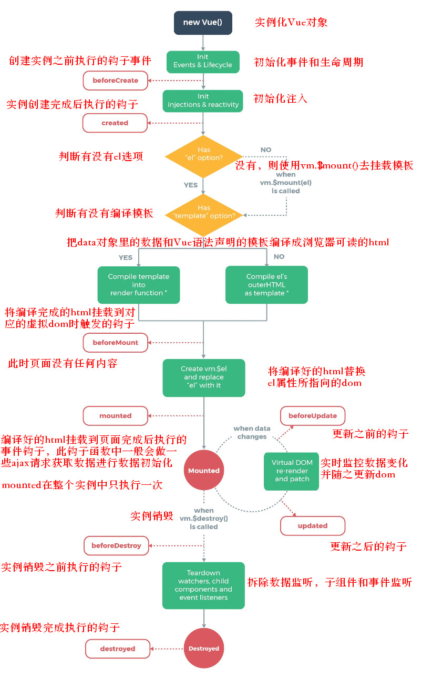

# vue

> vue/vuex/vue-router/element-ui

## 1.MVVM 模式

1. Model：模型层，表示 javascript 对象
2. View：视图层，表示 DOM，HTML 的操作元素
3. ViewModel：连接视图和数据的中间件，双向绑定，Vue.js 就是 MVVM 中的 ViewModel 层的实现者；核心就是实现 DOM 监听与数据绑定

## 2.Vue 特点

1. 轻量级，体积小，
2. 容易上手，学习曲线平稳，文档齐全
3. 结合了 Angular 的模块化和 React 的虚拟 DOM 的优点，并拥有自己独特的功能，如计算属性
4. 开源，社区活跃度高

## 3.Vue 快速入门

1.  导入 Vue.js
    <script src="https://cdn.jsdelivr.net/npm/vue@2.5.16/dist/vue.js"></script>
    <script src="https://cdn.jsdelivr.net/npm/vue@2.5.21/dist/vue.min.js"></script>
2.  构建 vue 对象

```javascript
var vm = new Vue({
  el: '#id',
  data: {
    message: 'hello,dangbo',
  },
})
```

3. View 视图层绑定数据：{{message}}
4. Model 层修改数据：vm.message = "xxx"

## 4.基本语法

### 5.0.1 常用的七个属性

1. el：用来指示 vue 编译器从什么地方开始解析 vue 的语法，可以说是一个占位符
2. data：用来组织从 view 中抽象出来的属性，可以说将视图的数据抽象出来存放在 data 中。
3. template：用来设置模板，会替换页面元素，包括占位符。
4. methods：放置页面中的业务逻辑，js 方法一般都放置在 methods 中

- computed 和 methods 区别：
  - computed 计算属性的方式在用属性时不用加(),而 methods 方式在使用时要像方法一样去用，必须加()
  - 两种方式在缓存上也大有不同，利用 computed 计算属性是将 reverseMessage 与 message 绑定，只有当 message 发生变化时才会触发 reverseMessage，而 methods 方式是每次进入页面都要执行该方法，但是在利用实时信息时，比如显示当前进入页面的时间，必须用 methods 方式

5. render：创建真正的 Virtual Dom
6. computed：计算属性
7. watch：watch:function(new,old){}；监听 data 中数据的变化，两个参数，一个返回新值，一个返回旧值，
8. name：

- 当使用组件递归调用时，被递归调用的组件必须定义 name 属性，因为在组件里面调用自己时，不是使用的在 components 里注册的组件，而是使用根据 name 属性查找组件
- keep-alive 包裹动态组件时，会缓存不活动的组件实例，会出现 include 和 exclude 属性，包含或者排除指定 name 组件
- vue-tools 插件调试时没有 name 属性会报错或警告

9. { required: true, trigger: "blur", message: "用户名不能为空" }，trigger 触发：blur 失去焦点时触发，change 数据改变时触发

### 5.0.2 悬浮绑定 v-bind:title

### 5.0.3 判断循环

1. v-if/v-else

```javascript
<h1 v-if="isSuccess"></h1>
<h1 v-else-if="isSuccess==='A'"></h1>
<h1 v-else="isSuccess"></h1>
```

2. v-for

```javascript
<li v-for="item in data">{{item.message}}</li>
```

### 5.0.4 事件绑定：v-on

```javascript
var vm = new Vue({
  el: '#id',
  data: {},
  methods: {
    sayHi: function () {
      alert('dbs')
    },
  },
})
```

## 6.初始化项目，快速创建一个 Vue 工程

> idea 无法执行 npm run dev，需要将 idea 已管理员身份启动就可以

```js
// vue 2.x 版本
vue init webpack "项目名称"
npm install
npm run dev
// vue 3.x 以上版本
vue create esight-ui
npm run serve
```

## 7.目录结构

## 8.配置环境变量

> process 对象：是一个全局变量，提供有关信息，控制当前 node.js 进程。作为一个对象，它对于 Node.js 应用程序始终是可用的，故无需使用 require()。
> process.env ：返回一个包含用户环境信息的对象，即项目运行所在环境的一些信息

1. 环境文件

- .env 文件：是全局默认配置文件，不论什么环境都会加载合并；
- .env.delelopment 文件：是开发环境，当执行 npm run serve 命令时，会自动加载该文件；
- 先加载.env 文件，之后加载.env.development 文件，两个文件有同一个项，则后加载的文件就会覆盖掉第一个文件

2. 参数

- 属性名必须以 VUE_APP_xxx 开头，开头的变量才会被 webpack 打包，比如 VUE_APP_BASE_API、VUE_APP_TITLE，代码中通过 process.env.VUE_APP_xxx 访问
- process.env.NODE_ENV：不是 process.env 对象上的原有属性，是它添加上去的环境变量，用来确定当前所处开发阶段，

3. 配置

- 默认的文件名称：.env、.env.development、.env.production
- 在 package.json 中的 scripts 配置项中添加--mode xxx 来选择自定义的配置文件

## 9.vue 的生命周期



## 10.语法分析汇总

### 10.0.1 表单

1. label：输入框关联的 label 文字
2. prop：表单域 model 字段，在使用 validate、resetFields 方法的情况下，该属性是必填的
3. placeholder：输入框占用文本
4. type：类型，常用的有 text,textarea,button,date,email,file 等，具体查看链接：[type 类型](https://developer.mozilla.org/en-US/docs/Web/HTML/Element/input#Form_%3Cinput%3E_types)
5. ref：一般写在 el-form 中，以作为验证表单时使用
6. :rules：
7. :model：v-bind:model 的缩写, v-bind 动态绑定指令，默认情况下标签自带属性的值是固定的，这种只是将父组件的数据传递到了子组件，并没有实现子组件和父组件数据的双向绑定。当然引用类型除外，子组件改变引用类型的数据的话，父组件也会改变的
8. v-model:是 vue.js 中内置的双向数据绑定指令，用于表单控件以外的标签是不起作用的(即只对表单控件标签的数据双向绑定有效)
9. prefix-icon 和 suffix-icon 属性：显示图标
10. label-position 属性来改变表单域或标签的位置，可选的值有 top/left/right ，默认的是 right ，lable-position 必须要和 label-width（表单域标签的宽度，作为 Form 直接子元素的 form-item 会继承该值） 共同使用，才会生效
11. created 方法：是一个声明周期钩子函数，vue 实例被生成之后调用这个函数。一般可以在 created 函数中调用 ajax 获取页面初始化所需的数据。

### 10.0.2 页面布局

1. el-scrollbar：左侧导航和右边的内容超出屏幕时，滚动条的样式比较小巧，文档中没有说明，需要看源码。

```js
// 七个props属性：native, wrapStyle, wrapClass, viewClass, viewStyle, noresize, tag
// 注意需要给 el-scrollbar 设置高度，判断是否滚动是看它的height判断的
props: {
 native: Boolean, // 是否使用本地，设为true则不会启用element-ui自定义的滚动条
 wrapStyle: {}, // 包裹层自定义样式
 wrapClass: {}, // 包裹层自定义样式类
 viewClass: {}, // 可滚动部分自定义样式类
 viewStyle: {}, // 可滚动部分自定义样式
 noresize: Boolean, // 如果 container 尺寸不会发生变化，最好设置它可以优化性能
 tag: { // 生成的标签类型，默认使用 `div`标签包裹
  type: String,
  default: 'div'
 }
}

<el-scrollbar :class="settings.sideTheme" wrap-class="scrollbar-wrapper">
    <el-menu
        :default-active="activeMenu"
        :collapse="isCollapse"
        :background-color="settings.sideTheme === 'theme-dark' ? variables.menuBg : variables.menuLightBg"
        :text-color="settings.sideTheme === 'theme-dark' ? variables.menuText : 'rgba(0,0,0,.65)'"
        :unique-opened="true"
        :active-text-color="settings.theme"
        :collapse-transition="false"
        mode="vertical"
    >
        <sidebar-item
            v-for="(route, index) in sidebarRouters"
            :key="route.path  + index"
            :item="route"
            :base-path="route.path"
        />
    </el-menu>
</el-scrollbar>
```

2. unique-opened：设置展开时只保持有一个子菜单展开的设置
3. mode="vertical" 垂直显示
4. sidebar-item 标签：

### 10.0.3 时间监听

@keyup.enter.native=""

## 11.Vue3 Composition API

```yml
Composition API 的入口在 setup() 函数中，beforeCreate之前进行触发, 需要 return
1. reactive 声明式渲染，用来响应数据，响应式对象
2. ref 接收一个参数并返回响应式对象，响应式数据，配合 reactive()
原先在 Vue2 中的 methods，watch，component、data 均写在 setup() 函数，使用之前需要自行导入
回归了 function xxx 定义函数
```

## 14 vue 插件

### 14.0.1 UI 框架 Element-UI

1. 安装：npm install element-ui -S
2. main.js 引用 js 和 css
   import ElementUI from "element-ui";
   import "element-ui/lib/theme-chalk/index.css";
3. 声明使用：Vue.use(ElementUI);
4. 如果需要用到 element-ui 中的其他内容，可以这样子引用：import { Notification, MessageBox, Message } from 'element-ui'

### 14.0.2 前端框架 vue-element-admin

> 框架，是一个后台前端解决方案，它基于 vue 和 element-ui 实现。它使用了最新的前端技术栈，内置了 i18n 国际化解决方案，动态路由，权限验证，提炼了典型的业务模型，提供了丰富的功能组件，它可以帮助你快速搭建企业级中后台产品原型。
> 8.vue-route 官方路由器

### 14.0.3 路由 vue-route

> vue-router，默认 hash 模式，就是使用 URL 的 hash 来模拟一个完整的 URL，于是当 URL 改变时，页面不会重新加载；
> 常用模式为 history 模式(mode: 'history')，这种模式充分利用 history.pushState API 来完成 URL 跳转而无须重新加载页面。

1. 安装：npm install vue-route --save-dev
2. 导入 import "VueRouter" from "vue-router";
3. 显示声明使用：Vue.use(VueRoute);
4. 配置

```js
import Vue from "vue";
import VueRouter from "vue-router";
Vue.use(VueRouter);
const router = new VueRouter({
  mode: 'history',
  routes: [...]
})
export default router;
```

### 14.0.3 通信 vue-axios 和 axios //TODO

1. 安装：npm install axios vue-axios --save
2. 导入
   import "axios" from "axios";
   import "VueAxios" from "vue-axios";
3. 声明使用：Vue.use(VueAxios, axios);

### 14.0.4 状态管理 vuex

> 专为 Vue.js 应用程序开发的状态管理模式。它采用集中式存储管理应用的所有组件的状态，并以相应的规则保证状态以一种可预测的方式发生变化

1. 安装 npm i vuex -S
2. 初始话 index.js 文件
3. 将 store 挂载到当前项目的 Vue 实例当中去

```js
import Vue from 'vue'
import Vuex from 'vuex'

Vue.use(Vuex)
//创建VueX对象
const store = new Vuex.Store({
  state: {
    //存放的键值对就是所要管理的状态
    name: 'helloVueX',
  },
  mutation: {
    // 同步执行
  },
  actions: {
    //
  },
})
export default store
```

Store 的代码结构一般由 State、Getters、Mutation、Actions 这四种组成，也可以理解 Store 是一个容器，Store 里面的状态与单纯的全局变量是不一样的，无法直接改变 store 中的状态。想要改变 store 中的状态，只有一个办法，显示地提交 mutation。

this.$store.dispatcher 异步操作
存储: this.$store.dispatch('setTargetUser',friend);
取值: this.$store.getters.TargetUser
this.$store.commit 同步操作
存储: this.$store.commit('setTargetUser',friend)
取值: this.$store.state.TargetUser

### 14.0.4 自定义 svg 图标 svg-sprite-loader

> &nbsp 它是用于创建 SVG 精灵图的 Webpack 加载程序。通过该插件可以将导入的 SVG 文件自动生成为 symbol 标签并插入进 html 中。

1. 工作原理：实际上是把所有的 svg 打包成一张雪碧图。每一个 symbol 装置对应的 icon，再通过<use xlink:href="#xxx"/>来显示你所需的 icon。
2. 步骤

- 添加依赖：npm install svg-sprite-loader
- 增加全局配置：vue.config.js
- main.js 导入：import './icons';
- 引用 svg 格式图标：src/assets/icons/svg
- 新建 SvgIcon.vue
- 新建 index，引入 icon 组件

process.env.BASE_URL

### 14.0.5 nprogress 页面跳转是出现在浏览器顶部的进度条

npm install nproress -S
NProgress.start();
NProgress.done();
NProgress.configure({ showSpinner: false }) // 进度环隐藏显示
#nprogress .bar {
background: red !important; //自定义颜色
}

## 前后端分离项目无法获取到 session 中的值（验证码）

跨域情况下，默认不允许传送 cookie。因此，需要对前后端进行设置

需要在前端代码每次发送请求时添加 axios.defaults.withCredentials = true，此时在后台两次请求获取的 sessionId 完全相同，也就是同一个 session

## 前端常用加密算法

1. RSA: JSEncrypt，密钥对生成 http://web.chacuo.net/netrsakeypair
2. AES/DES 加密解密：crypto-js.js
