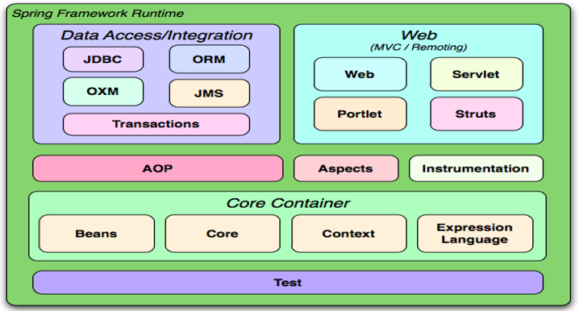
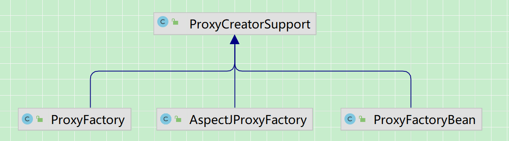

## 1. 概述

Spring 是一个分层的轻量级开源框架，为了解决企业级应用开发的复杂性而创建的。

**特点**

1. `方便解耦，简化开发；`IOC 容器实例化对象、管理依赖关系，降低层与层之间的关联耦合程度，bean 的各种操作。
2. `AOP 面向切面编程；`可以实现对程序进行权限拦截、日志记录、运行监控等功能
3. `支持声明式事务；`只需要通过配置就可以完成对事务的管理，而无需手动编程
4. `集成测试；`Spring 对 Junit4 支持，可以通过注解方便的测试 Spring 程序
5. `方便集成各种优秀框架；`
6. `降低 JavaEE API 的使用难度；`Spring 对 JavaEE 开发中非常难用的一些 API 都提供了封装，使这些 API 应用难度大大降低

## 2. 模块结构

Spring 框架是一个分层架构，它包含了很多模块，每个模块完成不同的功能，常用的模块如下：



### 2.1 Core Container

- Core 模块：主要包含 Spring 框架基本的核心工具类，是其他组件的基本核心，Spring 其他组件都会使用到这个包里的类；
- Beans 模块：是所有应用都要用到的，它包含访问配置文件、创建和管理 bean 以及进行 IoC\DI 操作相关的所有类；
- Context 模块：构建与 Core 和 Bean 模块基础之上的，提供了一种框架式的对象访问方法，Context 模块集成了 Beans 的特性，为 Spring 核心提供大量扩展，添加了对国际化、事件传播、资源加载和对 Context 的透明创建的支持；
- Expression Language 模块：提供了一个强大的表达式语言用于在运行时查询和操纵对象；

### 2.2 AOP

- Aspects 模块：对 AspectJ 的集成支持
- Instrumentation 模块：提供了 class instrumentation 支持和 classloader 实现，使得可以在特定的应用服务器上使用

### 2.3 Test

### 2.4 Data Access/Integration

- JDBC 模块：提供了一个 JDBC 抽象层，它可以消除冗长的 JDBC 编码和解析数据库厂商特有的错误代码，包含了对 JDBC 数据访问进行封装的所有类；
- ORM 模块：对象关系映射 API，提供了一个交互层，利用 ORM 封装包，可以混合使用所有 Spring 提供的特性进行 O/R 映射；
- OXM 模块：一个对 Object/XML 映射实现的抽象层，Object/XML 映射实现包括 JAXB、Castor、XMLBeans、JiBX 和 XSteam；
- Java Messaging Service(JMS) 模块：主要包含了一些制造和消费消息的特性；
- Transaction 模块：支持编程和声明性的事务管理，这些事务类必须实现特定的接口，并且对所有的 POJO 都适用；

### 2.5 Web（MVC/Remoting）

- Web 模块：提供了基础的面向 Web 的集成特性，例如多文件上传、使用 servlet listeners 初始化 IoC 容器等；
- Web-Servlet 模块：包含 MVC 框架的实现；
- Web-Struts 模块：提供对 Struts 的支持；
- Web-Portlet 模块：提供用于 Portlet 环境和 Web-Servlet 模块的 MVC 的实现；

## 3. IOC/DI

`IOC 控制反转（Inversion Of Control）`，站在调用者（对象）的角度，创建被调用的实例不是由调用者完成，而是由 IOC 容器完成并注入。简单说，就是创建对象的控制权被反转到 Spring 框架。

`DI 依赖注入（Dependency Injection）`，站在 Spring 容器的角度，指一个对象依赖的其他对象会通过被动的方式传递进来，是在容器实例化对象的时候不等对象请求就主动将它依赖的类注入给它，而不是自己创建或从容器中查找它依赖的对象。

**从不同角度对同一件事物的描述。就是通过引入 IOC 容器，利用注入依赖关系的方式，实现对象之间的解耦。**

_核心源码_

BeanFactory 是 Spring IOC 容器的基本实现，是一个工厂接口，面向 Spring 本身；采用延迟加载，第一次 getBean 时才会初始化 Bean。

ApplicationContext 是 BeanFactory 的子接口，面向使用 Spring 框架的开发者，几乎所有的应用场合都直接使用 ApplicationContext 而非底层的 BeanFactory；
当配置文件被加载，就会进行对象实例化；它的功能更强大，提供了更多的高级特性，比如国际化处理、事件传递、Bean 自动装配、各种不同应用层的 Context 实现等。

BeanDefinition 是描述 Spring 中 Bean 对象的。

从 IOC 获取 Bean 对象，调用 applicationContext.getBean()方法；ClassPathXmlApplicationContext 用于加载 classpath 下的 xml，FileSystemXmlApplicationContext 用于加载指定盘符下的 xml，AnnotationConfigApplicationContext 用于加载用注解标注的实例。

AbstractAutowireCapableBeanFactory 的 doCreateBean() 方法创建 bean，包括 bean 的整个生命周期，以及 AOP 动态代理的创建过程。

### 3.1 对象实例化

1. 基于注解 [详情请参考章节（5. Spring 注解）](#5-spring-注解)

   - @Repository、@Service、@Component、@Controller
   - @RestController
   - @Configuration 和 @Bean
   - @Import

2. 基于 xml 配置

```xml
<?xml version="1.0" encoding="utf-8" ?>
<beans xmlns="http://www.springframework.org/schema/beans"
       xmlns:xsi="http://www.w3.org/2001/XMLSchema-instance"
       xsi:schemaLocation="http://www.springframework.org/schema/beans
       					   http://www.springframework.org/schema/beans/spring-beans.xsd">
    <!-- 实例化方式 -->
    <!-- 1. 默认无参构造方法 -->
    <bean id="userDao" class="com.ruixi.ioc.ioc.UserDaoImpl" init-method="init" destroy-method="destroy"/>

    <!-- 2. 静态工厂，常用于 Spring 整合其他框架（工具） -->
    <bean id="userDao1" class="com.ruixi.ioc.ioc.StaticFactory" factory-method="createUserDao"/>

    <!-- 3. 实例工厂 -->
    <bean id="instanceFactory" class="com.ruixi.ioc.ioc.InstanceFactory"/>
    <bean id="userDao2" factory-bean="instanceFactory" factory-method="instance"/>

    <!-- 4. FactoryBean接口，具有工厂生成对象能力；每个具体实现类只能生成特定的对象，通常是用来创建比较复杂的Bean。
        比如 ProxyFactoryBean 实现类，用于生成代理对象实例。
        该 Bean 的 id 实际上是从 BeanFactory 中获取的 getObject() 返回的对象，而不是 FactoryBean 本身。如果要获取 FactoryBean 对象，可以在 id 前面加一个&符号来获取。
        说明：
        FactoryBean 是很早的一个类了，和 xml 初始化配套的东西，若是一个 Bean 的创建过程中涉及到很多其他Bean或复杂的逻辑，在 xml 时代配置文件能做的工作有限，只能通过工厂类初始化复杂的 bean。但是现在 java configuration 时代 java 本身就已经逻辑完备了，只使用 @Bean 就可以满足复杂 bean 的初始化需求。
        所以现在看来 FactoryBean 可以算作一个历史遗留的备选方案吧
    -->
    <bean id="myFactoryBean" class="com.ruixi.ioc.ioc.MyFactoryBean"/>
</beans>
```

### 3.2 依赖注入

1. 基于注解

   - @Autowired、@Resource、@Value
   - @PropertySource、@ConfigurationProperties

2. 基于 xml 配置

   - 有参构造方法注入
   - setter 方法注入；
     - <property> 标签注入
     - p 标签方式，是对 setter 方法注入进行简化
     - SpEL 方式，是对 <property> 进行统一编程，所有的内容都使用 value
     - 集合属性注入

```xml
<!-- 组件扫描，扫描含有注解的类 -->
<context:component-scan base-package="com.xxx"></context:component-scan>
<!--
    1. 有参构造方法注入，使用 <constructor-arg> 标签
        name ： 参数名称，
        type ： 参数类型，
        value ： 数据，
        ref ： 引用对象（一般是另一个bean id值），
        index ： 参数索引，从0开始。如果只有索引，匹配到了多个构造方法时，默认使用第一个；如果只有一个有参数的构造方法
        并且参数类型与注入的bean的类型匹配，那就会注入到该构造方法中。
-->
<bean id="userDao" class="com.xxx.UserDao"></bean>      <!-- 无参构造器创建对象 -->
<bean id="userService" class="com.xxx.UserService">
    <constructor-arg name="userDao" index="0" type="" value="" ref="userDao"></constructor-arg>
</bean>

<!-- *************************************** setter 注入 ***************************************-->
<!--
    2.1 <property>标签；name ：属性名称（setter方法去掉set前缀，用来匹配set方法），value/<value> ： 属性值，ref ： 引用对象
-->
<bean id="userService" calss="com.xxx.UserService">
    <property name="userDao" ref="userDao"></property>
</bean>
<bean id="sysUser" class="com.xxx.SysUser">
    <property name="name" value="dangbo"></property>
    <property name="age">
        <value>18</value>
    </property>
    <property name="student" ref="studentId"></property>
</bean>

<!--
    2.2 p 标签注入，使用前必须添加命名空间，对setter方法注入进行简化，替换<property name="属性名">，而是在<bean p:属性名="普通值"  p:属性名-ref="引用值">
-->
<bean id="personId" class="com.xxx.Person"
    p:name="dangbo" p:age="18"
    p:student-ref="studentId">
</bean>

<!--
    2.3 SpEL，对 <property> 进行统一编程，所有的内容都使用value，<property name="" value="#{表达式}">
    #{123}、#{'jack'} ： 数字、字符串
    #{beanId}	：另一个bean引用
    #{beanId.propName}	：操作数据
    #{beanId.toString()}	：执行方法
    #{T(类).字段|方法}	：静态方法或字段
-->
<bean id="userId" class="com.xxx.User" >
    <property name="name" value="#{userId.name?.toUpperCase()}"></property>     <!-- ?. 如果对象不为null，将调用方法 -->
    <property name="age" value="#{18}"></property>
</bean>

<!--
    2.4 集合注入，集合的注入都是给<property>添加子标签
    数组<array>，List<list>，Set<set>，Map<map>，map存放k/v 键值对，使用<entry>描述，Properties<props>，普通数据<value>，引用数据<ref>
-->
<bean id="collDataId" class="com.xxx.CollData" >
    <property name="arrayData"><array><value>1</value></array></property>
    <property name="listData"><list><value>1</value></list></property>
    <property name="setData"><set><value>1</value></set></property>
    <property name="mapData">
        <map><entry key="1" value="1"></entry><entry><key>2</key><value>2</value></entry></map>
    </property>
    <property name="propsData"><props><prop key="1">1</prop></props></property>
</bean>
```

### 3.3 作用域

@Scope 注解 和<Bean> 标签中的 scope 属性可以控制 Spring Bean 的作用域；默认为单例 singleton，多例时，初始化时，不会实例化 bean，只有每次调用的时候才会实例化。四种常见的作用域：

|  作用域   | 解释说明                                                                      |
| :-------: | ----------------------------------------------------------------------------- |
| singleton | 唯一 bean 实例，Spring 中的 bean 默认都是单例的                               |
| prototype | 每次请求都会创建一个新的 bean 实例                                            |
|  request  | 每一次 HTTP 请求都会产生一个新的 bean，该 bean 仅当前 HTTP request 内有效     |
|  session  | 每一次 HTTP Session 会产生一个新的 bean，该 bean 仅在当前 HTTP session 内有效 |

### 3.4 生命周期

对于 prototype 作用域（多例）的 Bean 时， Spring 容器只负责创建 Bean 实例，当创建后， Bean 的实例就交给调用者，Spring 容器并不会跟踪其生命周期；
而对于 singleton 作用域（单实例）的 Bean 时，Spring 容器负责管理整个生命周期，也就是从创建到初始化再到销毁的过程。

1. 实例化 Bean

2. 依赖注入，设置对象属性

3. 检查 Aware 的相关接口并设置相关依赖

   - 实现 BeanNameAware 接口，则调用 setBeanName() 方法
   - 实现 BeanClassLoaderAware 接口，则调用 setBeanClassLoader() 方法，传入加载当前 bean 的 ClassLoader
   - 实现 BeanFactoryAware 接口，则调用 setBeanFactory() 方法，可以使用这个方式来获取其他 Bean

4. BeanPostProcessor 前置处理

   - 实现 BeanPostProcessor 接口，并将实现类交给 spring 容器管理，spring 容器将自动执行，在初始化方法前执行 before()，在初始化方法后执行 after()，一般在初始化之后的方法中，将目标对象转换成代理对象，存放到单例池中。

   - 作用域：默认对容器中所有的 bean 都生效，可以通过第二个参数 beanName 进行控制

5. InitializingBean 接口

6. 初始化方法 init-method

7. BeanPostProcessor 后置处理

8. 注册 Destruction 相关回调接口，在使用前注册了销毁的相关调用接口，为了后边真正销毁 Bean 时再执行相应的方法

9. 使用

10. DisposableBean 接口 和 自定义销毁方法 destory-method

    - 如果实现 DisposableBean 接口，则 Spring 会调用 destory() 方法进行 Bean 的销毁；如果配置自定义销毁方法，则调用该方法对 Bean 销毁。

<span style="color:red">额外说明：@PostConstruct 和 @PreDestroy 注解，都不是 Spring 的，而是 java 自带的</span>

- @PostConstruct：用于指定初始化方法，修饰的方法会在服务器加载 Servlet 的时候运行，并且只会被服务器调用一次，类似于 Servlet 的 init()方法。被该注解修饰的方法会在构造函数之后，init()方法之前运行。
- @PreDestroy：用于指定销毁方法，修饰的方法会在服务器卸载 Servlet 的时候运行，并且只会被服务器调用一次，类似于 Servlet 的 destroy()方法。被该注解修饰的方法会在 destroy()方法之后运行，在 Servlet 被彻底卸载之前。

### 3.5 循环依赖解决方案

### 3.6 Spring 框架中的单例 Bean 是线程安全的嘛？

- 首先，线程安全是指单例的实例对象，如果是多例（prototype），则每次获取 bean 实例都是新创建的，线程之间并不存在共享；
- 对于单例的 Bean，是线程不安全的，Spring 是没有多线程的处理和逻辑，所有线程共享一个实例，存在资源竞争。
- 但是如果单例 Bean 是无状态的，也就是线程中的操作不会对 Bean 的成员执行查询以外的操作，只是调用里边的方法，多线程调用实例方法，
  会在内存中复制变量，在自己的线程的工作内存，因此认为这个单例 Bean 是线程安全的，比如 Controller、Service、Dao 等；
- 如果 Bean 是有状态的，则需要自己保证线程安全。

## 4. AOP、AspectJ

AOP（Aspect Oriented Programming），面向切面编程，通过预编译方式和运行期动态代理实现程序功能的统一维护的一种技术。AOP 是 OOP（面向对象编程）的延续，采取横向抽取机制，取代了传统纵向继承体系重复性代码，允许程序模块化横向切割关注点，或者说横切典型的责任划分，从而使得业务逻辑各部分之间的耦合度降低，提高程序的可重用性，同时提高了开发的效率。常见的使用场景有权限拦截、性能监视、日志、缓存和事务管理等。

**AOP、Spring AOP、AspectJ**

<table>
    <tr>
        <td></td>
        <td>解释说明</td>
    </tr>
       <tr>
        <td><b> AOP 联盟</b></td>
        <td>aopalliance.jar，是 java 中对于面向切面提供了一系列标准化接口，通常 Spring 或其它具备动态织入功能的框架依赖此包。</td>
    </tr>
       <tr>
        <td><b>Spring AOP</b></td>
        <td>运行时增强，使用纯 Java 实现，需要依赖 IOC 容器来管理，并且只能作用于 Spring 容器，在运行期通过动态代理<span style="background-color:yellow">（JDK 动态代理、CGLIB）</span>方式生成 AOP 动态代理类。它不需要专门的编译过程和类加载器。</td>
    </tr>
     </tr>
       <tr>
        <td><b> AspectJ </b> </td>
        <td>编译时增强，基于字节码操作，是一个基于 Java 语言的 AOP 框架，也就是说 AspectJ 扩展了 Java 语言，提供了一个专门的编译器，使用该编译器提供的命令进行编译，从而在编译阶段就可生成 AOP 代理类。</td>
    </tr>
       <tr>
        <td colspan=2, style="background-color:red">Spring AOP 开发时，由于自身的局限性，Spring2.0 开始，Spring AOP 集成了 AspectJ，可以使用 AspectJ 的 Annotation， Aspect 来定义切面，使用 Pointcut 来定义切入点，使用 Advice 来定义增强处理，使用注解@Before、@After 等，因此在开发中，需要引入 org.aspectj:aspectjweaver 包。虽然 Spring AOP 使用了 AspectJ 的 Annotation，但并没有使用它的编译器和织入器。</td>
    </tr>
</table>

**专业术语**

- 目标类（target）：需要被代理的类；
- 代理类（proxy）
- 连接点（JoinPoint）：应用执行过程中能够插入切面的一个点，这个点可以是方法的调用、异常的抛出；
- 切入点（PointCut）：可以插入增强处理的连接点；
- 通知/增强（Advice）：增强处理，通知描述了切面何时执行以及如何执行增强处理；
- 切面（Aspect）：切面是通知 Advice 和切点 PointCut 的结合。
- 引入（Introduction）：引入允许我们向现有的类添加新的方法或者属性。
- 织入（Weaving）：将增强处理应用到目标对象中，并创建一个被增强的代理对象的过程。

### 4.1 底层核心

手动创建代理，ProxyCreatorSupport 类的三个实现类

- ProxyFactory 方式：可以脱离 spring 直接使用，用到的比较多，自动化方式创建代理中都是依靠 ProxyFactory 来实现的；

- ProxyFactoryBean 方式：Spring 环境种给指定的 Bean 创建代理的一种方式。缺点：1. target 属性只能填一个目标对象，不支持多个；2. 只能控制到类级别，类中的所有方法都会增强；3. 显式的调用代理工厂类获取代理对象；

- AspectJProxyFactory 方式：通过 AspectJ 提供的一些功能实现代理。



自动化创建代理，用在 spring 环境中，通过 BeanPostProcessor 后置处理器来对符合条件的 bean 创建代理对象，具体实现该功能的子类是 AbstractAutoProxyCreator

- BeanNameAutoProxyCreator 方式

### 4.2 aopalliance

AOP 联盟（aopalliance.jar），是 java 中对于面向切面提供了一系列标准化接口，通常 Spring 或其它具备动态织入功能的框架依赖此包。

包中包含两个核心顶层接口：

- Advice：增强/通知，代表要织入的逻辑
- JoinPoint：连接点，增强逻辑的织入地点

```shell
Advice  # 增强/通知
   |
   ├── Interceptor  # 拦截器，表示以拦截器的方式去实现增强/通知
   |       |
   |       ├── MethodInterceptor    # 方法拦截器，需要执行时，调用invoke()方法，表示调用该拦截器。Spring中提供了实现类
   |       ├── ConstructorInterceptor   # 构造器拦截器


Joinpoint   # 连接点
   |
   ├── Invocation   # 调用连接点，表示程序调用，是一个可以被拦截器拦截的连接点
   |       |
   |       ├── MethodInvocation     # 方法调用连接点，需要执行时，调用invocation.proceed()方法，表示执行此拦截点，并进入到下一个连接点。Spring中提供了实现类
   |       ├── ConstructorInvocation    # 构造器调用连接点
```

### 4.3 Spring AOP

Spring AOP 是在 AOP 联盟（aopalliance）定义的一系列接口上，提供实现类或者进行封装。

Spring AOP 只支持方法的拦截。

**通知类型**

`执行顺序：Around（前） < Before < 目标方法 < AfterReturning、AfterThrowing < Around（后）`

- 前置通知 org.springframework.aop.MethodBeforeAdvice
- 后置通知 org.springframework.aop.AfterReturningAdvice
- 环绕通知 org.aopalliance.intercept.MethodInterceptor
- 异常通知 org.springframework.aop.ThrowsAdvice

**动态代理**

1. JDK 动态代理和 Cglib 的区别？

   - JDK 动态代理是利用拦截器（必须实现 InvocationHandler）加上反射机制生成一个代理接口的匿名类，在调用目标方法前后增强处理，因此只能对实现了接口的类生成代理，而不能针对类；
   - Cglib 是利用 ASM 框架，通过修改目标类的 class 字节码文件的方式生成子类来增强处理，因此是针对类生成代理，因为父子类采用的是继承，所以目标类和目标方法不要使用 final，对于 final 类或方法，是无法继承的。

2. JDK 动态代理和 Cglib 的选择？

   - 如果目标对象有实现接口，则默认用 JDK 动态代理；但也可以通过配置的方式让其强制使用 Cglib
   - 如果目标对象没有实现接口，必须采用 Cglib

```java
private static final CustomAspect CUSTOM_ASPECT = new CustomAspect();

// JDK 动态代理，使用 JdkDynamicAopProxy 类，调用其 invoke 方法
public static <T> T doCreateJdkProxy(T t) {
    return (T) Proxy.newProxyInstance(t.getClass().getClassLoader(), t.getClass().getInterfaces(),
            new InvocationHandler() {
                @Override
                public Object invoke(Object proxy, Method method, Object[] args) throws Throwable {
                    CUSTOM_ASPECT.before();
                    // 执行方法：method.invoke(对象，实际参数)
                    Object obj = method.invoke(t, args);
                    CUSTOM_ASPECT.before();
                    return obj;
                }
            });
}

// Cglib，使用 CglibAopProxy 类，调用其内部类的 DynamicAdvisedInterceptor 的 intercept 方法。
public static  <T> T doCreateCglibProxy(T t) {
    // 核心类
    Enhancer enhancer = new Enhancer();
    // 设置父类
    enhancer.setSuperclass(t.getClass());
    // 设置回调函数，MethodInterceptor接口 等效 jdk InvocationHandler接口，intercept() 等效 jdk  invoke()
    enhancer.setCallback(new MethodInterceptor() {
        @Override
        public Object intercept(Object proxy, Method method, Object[] args, MethodProxy methodProxy) throws Throwable {
            CUSTOM_ASPECT.before();
            Object obj = methodProxy.invokeSuper(proxy, args);
            CUSTOM_ASPECT.after();
            return obj;
        }
    });
    return (T) enhancer.create();
}
```

### 4.4 AspectJ

> 此处不讨论 AspectJ 的编译时增强。

Spring AOP 集成 AspectJ，主要是通过注解技术，允许直接在 Bean 类中定义切面；新版本 Spring 框架，建议使用 AspectJ 方式来开发 AOP

**通知类型**

1. 环绕通知（@Around）： 方法执行前后都调用的通知（优先级最高的通知），必须手动执行目标方法
2. 前置通知（@Before）： 方法执行之前被调用
3. 后置通知（@AfterReturning）： 仅当方法成功完成后执行的通知
4. 异常通知（@AfterThrowing）： 仅当方法抛出异常退出时执行的通知
5. 最终通知（@After）： 方法执行之后被调用，无论方法中是否出现异常

各种通知的前后顺序问题：

- 前置通知 和 环绕通知的前，没有先后顺序，谁先配置，谁先执行；
- 后置通知、环绕通知的后、最终通知，没有先后顺序，比较乱。

**切入点表达式**

AspectJ 提供了一套自己的表达式语言即切入点表达式，切入点表达式可以标识切面织入到哪些类的哪些方法当中。只要把切面的实现配置好，再把这个切入点表达式写好就可以了，不需要一些额外的 xml 配置。

```java
// 1. 标注在类上的注解，表示该类的任意方法
@within(org.springframework.transaction.annotation.Transactional)
@target(org.springframework.transaction.annotation.Transactional)

// 2. 标注在方法上的注解
@annotation(org.springframework.transaction.annotation.Transactional)

// 3. execution
execution(修饰符 返回值 包.类.方法名(参数) throws 异常)
execution(
    修饰符                      // 访问权限，如 public、protected（可省略）
    返回值                      // 返回值类型
    全限定类名                  // 全限定性类名（可省略）
    方法名(参数)                // 方法名和参数
    throws 异常                // 抛出异常（可省略）
)
/*
  特殊符号说明：
    1. _ 代表 0 到多个任意字符，通常用作某个包下面的某些类以及某些方法。
    2. .. 放在方法参数中，代表任意个参数，放在包名后面表示当前包及其所有子包路径。
    3. + 放在类名后，表示当前类及其子类，放在接口后，表示当前接口及其实现类。
    4. * 任意
*/

// 举些栗子
execution(* com.ruixi.aop.*.service..*.*(..))
```

**注解实现（常用）**

```java
@EnableAspectJAutoProxy
@Aspect
@Component
public class LogAspect {

    /**
     * 切入点，该注解修饰方法 private void xxx(){} 之后通过方法名获得切入点引用
     */
    @Pointcut(value = "@annotation(log)")
    public void pointcut(Log log) {
    }

    @AfterReturning(value = "pointcut(log)", returning = "result")
    public void afterReturning(JoinPoint joinPoint, Log log, Object result) {
        handleLog(joinPoint, log, null, result);
    }

    @AfterThrowing(value = "pointcut(log)", throwing = "e")
    public void afterReturning(JoinPoint joinPoint, Log log, Exception e) {
        handleLog(joinPoint, log, e, null);
    }
}
```

## 5. Spring 注解

| 注解                                                 | 解释说明                                                                                                  | 使用场景                                                             |
| ---------------------------------------------------- | --------------------------------------------------------------------------------------------------------- | -------------------------------------------------------------------- |
| @Bean                                                | 主要用于方法上，将该方法的对象注入到 Spring IOC 容器中，                                                  | 常与 @Qualifier、@Scope、@Primary 搭配使用，适用于导入第三方组件的类 |
| @Scope                                               | 控制 Bean 的作用域；默认为单例 singleton，多例时，初始化时，不会实例化 bean，只有每次调用的时候才会实例化 | 常与 @Bean 搭配使用                                                  |
| @Qualifier                                           | 针对存在多个同类型 bean 的情况，明确指定需要装配的 bean，否则抛异常 NoUniqueBeanDefinitionException       | 常与 @Bean、@Autowire 搭配使用                                       |
| @Primary                                             | 指定默认情况下应该注入特定类型的 Bean，@Qualifier 和 @Primary 同时存在， @Qualifier 优先级高              | 常与 @Bean 搭配使用                                                  |
| @Lazy                                                | @Lazy(value = true)，默认为 true，表示延迟加载，调用某个 bean 的时候才去初始化（针对单例）                | 延迟加载，常与 @Bean 搭配使用                                        |
| @DependsOn                                           |   用来表示一个bean A的实例化依赖另一个bean B的实例化， 但是A并不需要持有一个B的对象，如果需要的话就不用depends-on，直接用依赖注入就可以了或者ref标签      
                       |                                                                    |
| @Configuration                                       | 声明该类为配置类，可以被 @Component 替代，不过使用@Configuration 声明配置类更加语义化                     | 常与 @Bean 一起使用                                                  |
| @Repository<br>@Service<br>@Controller<br>@Component | 标识在类上，表示该类被 Spring IOC 容器管理，                                                              | 持久层、业务层、表现层、组件                                         |
| @ComponentScan                                       | 扫描特定包下的组件                                                                                        | 等同于 xml 中的 <context:component-scan>                             |
| @Conditional                                         | 条件判断                                                                                                  | 大量应用于 Spring Boot 底层，比如@ConfitionalOnClass 等              |
| @AliasFor                                            | 作用于自定义注解的两个属性上，表示这两个互为别名，含义一样                                                | 注解继承时，子注解想拥有父注解的属性值                               |
| ~~@Required~~                                        | ~~作用于 Bean 中的属性的 setter 方法，表明该属性必须设置，否则抛异常 BeanInitializationException~~        | ~~Spring 5.1 版本已弃用~~                                            |
| @Order                                               | 定义 Spring IOC 容器中 Bean 的执行顺序的优先级，而不是定义 Bean 的加载顺序                                | 等同于 Ordered 接口，值越小优先级越高                                |
| @PropertySource                                      | 读取指定 properties 文件                                                                                  | 不常用，常用的是 Spring Boot 的@ConfigurationProperties              |
| @Import                                              | 通过快速导入的方式将实例加入到 Spring IOC 容器中，导入组件的 id 为全路径，                                | 常用于其他框架整合 Spring                                            |
| @Value                                               | 注入普通值                                                                                                |                                                                      |
| @Autowired                                           | 自动注入                                                                                                  |
| @Resource                                            | 自动注入                                                                                                  |

**Autowire 详解**

|          | @Autowired                                                                                                                                                                                                                                                                                                                                                                                                                                                                               | @Resource                                                                                                                                                                                                                                                                                                                                            |
| -------- | ---------------------------------------------------------------------------------------------------------------------------------------------------------------------------------------------------------------------------------------------------------------------------------------------------------------------------------------------------------------------------------------------------------------------------------------------------------------------------------------- | ---------------------------------------------------------------------------------------------------------------------------------------------------------------------------------------------------------------------------------------------------------------------------------------------------------------------------------------------------- |
| 来源     | 是 Spring 的注解                                                                                                                                                                                                                                                                                                                                                                                                                                                                         | 是 javax.annotation 注解                                                                                                                                                                                                                                                                                                                             |
| 原理     | 通过 AutowiredAnnotationBeanPostProcessor 类实现注入                                                                                                                                                                                                                                                                                                                                                                                                                                     |                                                                                                                                                                                                                                                                                                                                                      |
| 作用域   | 标注在构造器、方法、参数、字段、注解                                                                                                                                                                                                                                                                                                                                                                                                                                                     | 标注在类, 字段, 方法                                                                                                                                                                                                                                                                                                                                 |
| 注入方式 | 默认根据类型 byType 注入，如存在多个同类型 bean 时 则通过 byName 注入。<br>存在同类型的多个 Bean 的解决方法：<br> ① 使用@Qualifier；<br> ② 使用@Primary 解决；<br>③ 设置成与注入的 Bean 名称相同                                                                                                                                                                                                                                                                                         | 默认根据 byName 注入，如名称未找到，则根据 byType 注入                                                                                                                                                                                                                                                                                               |
| 属性说明 | 属性 required，默认为 true，表示未找到对应 bean 时抛出异常                                                                                                                                                                                                                                                                                                                                                                                                                               | 属性 name 和 type，指定值后，则按照指定的进行匹配                                                                                                                                                                                                                                                                                                    |
| 举例说明 | @Autowired<br>private IUserService userService;<br><br>例一<br>存在一个实现类：UserServiceImpl.java，则根据类型自动注入 UserServiceImpl 实现类<br><br>例二<br>存在多个实现类：UserServiceImpl.java、UserServiceImpl2.java，则抛异常<br><br>例三<br>存在多个实现类：UserServiceImpl.java、UserService.java，则根据名称注入 UserService.java 实现类<br><br>使用 @Qualifier 指定名称，例二则不会报错<br>@Autowired<br>@Qualifier("userServiceImpl")<br>private IUserService userService<br> | @Resource<br>private IUserService userService;<br><br>例一<br>存在一个实现类：UserServiceImpl.java，则根据类型自动注入 UserServiceImpl 实现类<br><br>例二<br>存在多个实现类：UserServiceImpl.java、UserServiceImpl2.java，则抛异常<br><br>例三<br>存在多个实现类：UserServiceImpl.java、UserService.java，则根据名称注入 UserService.java 实现类<br> |

**@Import 详解**

1. 直接导入 class 数组
2. 实现 ImportSelector 接口的实现类

   是 spring 导入外部配置的核心接口，在 springboot 的自动化配置和@Enablexxx（功能性注解）中起到了决定性的作用。
   ImportSelector 接口中，selectImports()方法作用是：选择并返回需要导入的类的名称；返回一个字符串数组，当在@Configuration 标注的 Class 上使用@Import 引入了一个 ImportSelector 实现类后，
   会把实现类中返回的 Class 名称都定义为 DeferredImportSelector 接口集成 ImportSelector，延迟选择性导入，在装载 bean 时，需要等所有的@Configuration 都执行完毕后才会进行装载。

3. 实现 ImportBeanSelector 接口

```java
// 方式1
@Import({**.class,***.class})  // 导入的bean的全限定名
public class Test{}

// 方式2
// spring 底层使用较多，像Enablexxx等都是通过这种方式实现的。
public class ImportSee implements ImportSelector {
    @Override
    public String[] selectImports(AnnotationMetadata importingClassMetadata) {
        return new String[]{"com.company.module.类名"};
    }
}

// 方式3
// mybatis中的@MapperScan注解，就是基于这种方式实现注入Spring IOC容器的。
```

**ConditionalOnProperty**

用于根据应用程序的配置属性来决定是否应该创建一个 bean 或者是否应该加载一个配置类。这个注解通常用于根据配置灵活地决定某些 bean 的创建和加载行为。

havingValue 属性定义了配置属性的预期值（expected value）。当使用 @ConditionalOnProperty 注解时，它会检查指定的配置属性是否存在，并且是否等于指定的值。

- 属性设置了一个非空字符串（通常是一个期望的值），那么条件仅在该属性的值等于 havingValue 时才成立。
- 属性没有指定，则意味着只要配置属性存在且不等于 false 就满足条件。

matchIfMissing 属性指定了当配置属性没有设置时的匹配行为。默认情况下，它的值为 false。

- matchIfMissing 设置为 true，并且配置中不存在该属性，则条件也会视作成立，即条件匹配成功。
- matchIfMissing 设置为 false，而配置中又不存在该属性，则条件判定不成立，可能会导致相应的 bean 或配置类不会被创建或加载。

matchIfMissing 设置为 false，配置文件中没有该属性，但是properties配置了默认值，该条件也不成立。

## 6. Spring 事务

事务指逻辑上的一组操作，组成这组操作的各个单元，要不全部成功，要不全部不成功。

事务管理是应用系统开发中必不可少的一部分，Spring 为事务管理提供了丰富的功能支持。Spring 事务属性定义在 TransactionDefinition 类里面，包括传播行为、隔离级别、事务超时、是否只读。Spring 事务管理分为编程式和声明式两种方式；

- 编程式事务管理：通过编程的方式管理事务，使用 TransactionTemplate 或直接使用底层的 PlatformTransactionManager，可以带来极大的灵活性，但是难维护；
- 声明式事务管理：使用注解 @Transactional 或 配置文件（XML） 配置来管理事务，是基于 AOP 实现的，将事务管理代码从业务方法中分离出来；在实际业务中经常使用该方式。


Spring的事务管理器，通过PlatformTransactionManager接口表示，其有2个重要的实现类：

DataSourceTransactionManager：用于支持本地事务，事实上，其内部也是通过操作java.sql.Connection来开启、提交和回滚事务。

JtaTransactionManager：用于支持分布式事务，其实现了JTA规范，使用XA协议进行两阶段提交。需要注意的是，这只是一个代理，我们需要为其提供一个JTA provider，一般是Java EE容器提供的事务协调器(Java EE server's transaction coordinator)，也可以不依赖容器，配置一个本地的JTA provider。

### 6.1 事务的隔离级别

| 事务隔离级别     | 说明                                                                                                                                                                                       |
| ---------------- | ------------------------------------------------------------------------------------------------------------------------------------------------------------------------------------------ |
| DEFAULT          | 这是默认值，表示使用底层数据库的默认隔离级别。对大部分数据库而言，通常这值就是 READ_COMMITTED                                                                                              |
| READ_UNCOMMITTED | 该隔离级别表示一个事务可以读取另一个事务修改但还没有提交的数据，该级别不能防止脏读和不可重复读，因此很少使用该隔离级别。                                                                   |
| READ_COMMITTED   | 该隔离级别表示一个事务只能读取另一个事务已经提交的数据，该级别可以防止脏读，这也是大多数情况下的推荐值。                                                                                   |
| REPEATABLE_READ  | 该隔离级别表示一个事务在整个过程中可以多次重复执行某个查询，并且每次返回的记录都相同。即使在多次查询之间有新增的数据满足该查询，这些新增的记录也会被忽略，该级别可以防止脏读和不可重复读。 |
| SERIALIZABLE     | 所有的事务依次逐个执行，这样事务之间就完全不可能产生干扰，也就是说，该级别可以防止脏读、不可重复读以及幻读。但是这将严重影响程序的性能。通常情况下也不会用到该级别。                       |

### 6.2 事务的传播方式

| 事务传播方式              | 说明                                                                                               |
| ------------------------- | -------------------------------------------------------------------------------------------------- |
| PROPAGATION_REQUIRED      | 如果当前没有事务，就新建一个事务，如果已经存在一个事务中，加入到这个事务中。这是默认的传播方式     |
| PROPAGATION_SUPPORTS      | 支持当前事务，如果当前没有事务，就以非事务方式执行                                                 |
| PROPAGATION_MANDATORY     | 使用当前的事务，如果当前没有事务，就抛出异常                                                       |
| PROPAGATION_REQUIRES_NEW  | 新建事务，如果当前存在事务，把当前事务挂起                                                         |
| PROPAGATION_NOT_SUPPORTED | 以非事务方式执行操作，如果当前存在事务，就把当前事务挂起                                           |
| PROPAGATION_NEVER         | 以非事务方式执行，如果当前存在事务，则抛出异常                                                     |
| PROPAGATION_NESTED        | 如果当前存在事务，则在嵌套事务内执行。如果当前没有事务，则执行与 PROPAGATION_REQUIRED 类似的操作。 |

### 6.3 实现原理

底层是基于 Spring AOP，AOP 又是通过动态代理实现，在代码运行时生成一个代理对象，根据@Transactional 的属性配置信息，代理对象决定该注解标注的目标方法是否由拦截器@TransactionInterceptor 来使用拦截，在拦截中，会在目标方法开始执行前创建并加入事务，并执行目标方法的逻辑，最后根据执行情况是否出现异常，利用抽象事务管理器 AbstractPlatformTransactionManager 操作数据源 DataSource 提交或回滚事务。

### 6.3 配置文件（XML）方式

```xml
<!-- 扫描组件 -->
<context:component-scan base-package="com.transaction"></context:component-scan>

<!-- 使用注解方式配置 spring 声明事务（开启事务注解扫描） -->
<tx:annotation-driven transaction-manager="">

<!-- 配置事务管理器 -->
<bean id="transactionManager" class="org.springframework.jdbc.datasource.DataSourcetransactionManager">
    <property name="dataSource" ref="dataSource"></property> <!-- ref引入数据库配置 -->
</bean>

<!-- 配置事务增强(通知)属性，transaction-manager 属性是指定这个事务是使用哪一个事务管理器 -->
<tx:advice id="" transaction-manager="transactionManager">
    <tx:attributes>
        <!--配置支持的方法名称、propagation（传播级别）、isolation（隔离级别）、timeout、read-only、rollback-for 等属性 -->
        <tx:method name="">
    </tx:attributes>
</tx:advice>

<!-- 配置事务切入点表达式,使事务属性与事务关联 -->
<aop:config>
    <!-- 事务切入点 -->
    <aop:pointcut expression="execution(_ com.hxzy.spring.service.._.\*(..))" id="pointCut"/>
    <aop:advisor advice-ref="txAdvice" pointcut-ref="pointCut"/>
</aop:config>
```

### 6.2 @Transactional 注解

1. 开启事务扫描，使用注解@EnableTransactionManagement（SpringBoot 中不需要加 @EnableTransactionManagement 来开启事务，自动装配时已经加了）；
2. 注解标注位置，@Transactional 注解可以作用到接口、类、方法上，但是推荐值被应用到 public 的方法上；
3. 注解属性
   - value（transactionManager）：当配置文件中存在多个 TransactionManager，可以使用该属性指定哪个事务管理器
   - Propagation：事务的传播属性，默认值为 REQUIRED
   - isolation：事务的隔离级别，默认是 Isolation.DEFAULT，它是指数据库的默认隔离级别。
   - timeout：事务的超时时间，默认值为-1，如果超过时间限制但事务还没有完成，则自动回滚事务
   - readOnly：是否为只读事务，默认为 false，为了忽略不需要事务的方法，比如读取数据，可以设置为 true
   - rollbackFor：指定能够触发事务回滚的异常类型，如果有多个异常类型需要指定，各类型之间使用逗号分隔
   - noRollbackFor：抛出指定的异常类型，不回滚

### 6.6 使用事务的注意事项及常见问题

**注意事项**

1. @Transactional 注解推荐作用于方法，而不是类上；
2. @Transactional 注解必须添加在 public 方法上，private、protected 方法上是无效的；如果要用在非 public 方法上，可以开启 AspectJ 代理模式；
3. 类必须被 Spring 管理；
4. 选择支持事务的数据库引擎，比如 Mysql 的 MyISAM 引擎是不支持事务操作；
5. 正确的设置@Transactional 的 propagation 属性，本来期望目标方法进行事务管理，但若是错误的配置这三种 propagation，事务将不会发生回滚；

   - TransactionDefinition.PROPAGATION_SUPPORTS：如果当前存在事务，则加入该事务；如果当前没有事务，则以非事务的方式继续运行。
   - TransactionDefinition.PROPAGATION_NOT_SUPPORTED：以非事务方式运行，如果当前存在事务，则把当前事务挂起。
   - TransactionDefinition.PROPAGATION_NEVER：以非事务方式运行，如果当前存在事务，则抛出异常。

6. 正确的设置@Transactional 的 rollbackFor 属性，默认情况下，如果在事务中抛出了未检查异常（继承自 RuntimeException 的异常）或者 Error，则 Spring 将回滚事务；除此之外，Spring 不会回滚事务；

7. 避免自身调用问题，若同一类中的没有 @Transactional 注解的方法内部调用有@Transactional 注解的方法，有@Transactional 注解的方法的事务被忽略，不会发生回滚；

8. 合理使用异常处理以及事务，避免异常被 try catch 导致不回滚。

9. 事务场景中，DML 操作尽量在一块执行，能够避免 Lock wait timeout exceeded；

**常见问题**

1. org.springframework.transaction.UnexpectedRollbackException: Transaction rolled back because it has been marked as rollback-only

不可预知的回滚异常，因为事务已经被标记为只能回滚状态；

方法 a 中调用方法 b，且 a 和 b 使用同一个事务，方法 b 出现异常，将当前事务标志为回滚，但由于在方法 a 中做了异常处理，程序没有终止而是继续执行，当执行完后，事务 commit 时，检查状态，发现需要事务回滚，所以才会出现不可预知的回滚异常（事务被标记为回滚）。

解决：

- 方法 a 和方法 b 在逻辑上不应该属于同一事务，则将嵌套方法 b 的事务传播属性修改为：PROPAGATION_REQUIRES_NEW，这样执行方法 b 时，会创建一个新事务，不会影响方法 a 中的事务；
- 方法 a 和方法 b 属于同一事务，则将异常处理去掉，或者 catch 里边在抛出异常，也可以 catch 里边手动回滚；
- 方法 a 和方法 b 属于同一事务，但方法 b 失败与否不能影响方法 a 的事务提交，且仍然在方法 a 中异常处理方法 b，则将嵌套方法 b 的事务传播属性修改为：PROPAGATION_NESTED，表示方法 B 是一个子事务，有一个 savepoint，失败时会回滚到保存点，不影响方法 a，方法 a 的提交和回滚可以控制 b，a 与 b 都是一个事务，只是 b 是一个子事务

## 7. 全局异常处理

1. ControllerAdvice，注解定义全局异常处理类
2. ExceptionHandler，注解声明异常处理方法

## 8. 线程池

ThreadPoolTaskExecutor，是对 ThreadPoolExecutor（java.util.concurrent）进行了封装处理

**异步线程traceId如何传递**

本质是通过Mdc来进行异步线程间的traceId同步，可以看下Mdc的源码，最终还是通过InheritableThreadLocal来实现子线程获取父线程信息

```java
public class TaskDecoratorForMdc implements TaskDecorator {
    @Override
    public Runnable decorate(Runnable runnable) {
        try {
            Optional<Map<String, String>> contextMapOptional =ofNullable(MDC.getCopyOfContextMap());
            return () -> {
                try {
                    contextMapOptional.ifPresent(MDC::setContextMap);
                    runnable.run();
                } finally {
                    MDC.clear();
                }
            };
        } catch (Exception e) {
            return runnable;
        }
    }
}


@Bean(name = "callBackExecutorConfig")
public Executor callBackExecutorConfig() {
    ThreadPoolTaskExecutor executor = new ThreadPoolTaskExecutor ();
    // 配置核心线程数
    executor.setCorePoolSize(10);
    // 配置最大线程数
    executor.setMaxPoolSize(20);
    // 配置队列大小
    executor.setQueueCapacity(200);
    // 配置线程池中的线程的名称前缀
    executor.setThreadNamePrefix("async-Thread-");
    // rejection-policy：当pool已经达到max size的时候，如何处理新任务
    // abort：在调用executor执行的方法中抛出异常 RejectedExecutionException
    executor.setRejectedExecutionHandler(new ThreadPoolExecutor.AbortPolicy());
    //线程池增强
    threadPoolTaskExecutor.setTaskDecorator(new TaskDecoratorForMdc());
    // 执行初始化
    executor.initialize();
    return executor;
}
```

日志追踪（链路追踪编号）

实现方式1：自己写代码实现，使用logback日志框架的MDC实现；

- 添加拦截器并配置，TraceLogInterceptor
- springcloud，一般都是用feign，需要拦截feign，RequestInterceptor 
- dubbo，Apache的dubbo（老版的是阿里的，阿里已将dubbo加入apache），写过滤器
- 注解 + AOP切面，针对定时任务@Scheduled
- 异步线程获取主线程traceId
- 远程调用，增加拦截器
- logback.xml配置文件

实现方式2：使用开源工具，安装费点事，功能强大，适合大项目；支持的开发语言和框架较多。

- 推荐 skywalking。

## 6. @Mapper 和@MapperScan

> @Mapper 注解的的作用 -->直接在 Mapper 类上面添加注解@Mapper
>
> 1. 为了把 mapper 这个 DAO 交给 Spring 管理 ；
> 2. 为了不再写 mapper 映射文件 ,通过注解来写 sql；
> 3. 为了给 mapper 接口 自动根据一个添加@Mapper 注解的接口生成一个实现类

> 使用@MapperScan 可以指定要扫描的 Mapper 类的包的路径

## 9. 事件监听- 观察者设计模式

`为了系统业务逻辑之间的解耦，提高可扩展性以及可维护性。`

1.  实现事件机制方式：EventObject、EventListener 和 Source

    - EventObject：java.util.EventObjet 是事件状态对象的基类，他封装了事件源以及和事件相关的信息，所有的 java 事件类都集成该类

    - Eventlistener：是一个标记接口，里边没有方法，所有的监听器监听该接口，事件监听注册在事件源上，当事件源的属性和状态改变的时候，调用相应监听器内的回调方法

    - Source：事件源并不需要实现和继承任何接口和类，他是事件最初发生的地方，因为事件源需要注册事件监听器，所有事件源内需要有相应的盛放事件监听器的容器。

> `实现方式：`
>
> 1. 事件 event extends ApplicationEvent ApplicationContext 或者 ApplicationEventPublisher
>
> 2. 监听器 implements ApplicationListener<T>，重写 onApplicationEvent 方法，该方法参数可以为 Object、也可以为自定义事件 event
>
>    使用注解@EventListener
>
> 3. 注册监听 SpringApplication.addListener(Listener 对象) 或者使用注解@Component SpringApplicationBuilder.listeners(…)
>
> 4. 发布事件 ApplicationContext 接口 继承 接口 ApplicationEventpublisher 事件发布器
>
> `扩展`
>
> 1. ApplicationEventMulticaster 是事件机制中的事件广播器，默认实现 SimpleApplicationEventMulticaster
> 2. ApplicationContext 本身担任监听器注册表的角色，在其子类 AbstractApplicationContext 中就聚合了事件广播器 ApplicationEventMulticaster 和事件监听器 ApplicationListnener，并且提供注册监听器的 addApplicationListnener 方法
> 3. Spring 中，事件源不强迫继承 ApplicationEvent 接口的，也就是可以直接发布任意一个对象类。但内部其实是使用 PayloadApplicationEvent 类进行包装了一层
>
> `spring自带的监听器`
>
> 1. ApplicationStartingEvent：springboot 启动开始的时候执行的事件
>
> 2. ApplicationEnvironmentPreparedEvent spring boot 对应**Enviroment**已经准备完毕，但此时上下文 context 还没有创建。在该监听中获取到 ConfigurableEnvironment 后可以对配置信息做操作，例如：修改默认的配置信息，增加额外的配置信息等等。
>
> 3. ApplicationPreparedEvent：spring boot 上下文 context 创建完成，但此时 spring 中的 bean 是没有完全加载完成的。在获取完上下文后，可以将上下文传递出去做一些额外的操作。值得注意的是：**在该监听器中是无法获取自定义 bean 并进行操作的。**
>
> 4. ApplicationReadyEvent：springboot 加载完成时候执行的事件。
>
> 5. ApplicationFailedEvent：spring boot 启动异常时执行事件。
>
>    > `默认情况下，监听事件都是同步执行的。在需要异步处理时，可以在方法上加上@Async进行异步化操作`

## 11. EasyExcel

### 11.1 导出

```java
// 获取ExcelWriter实例
ExcelWriter excelWriter = EasyExcel.write(pathName).build;
//内容样式策略
WriteCellStyle contentWriteCellStyle = new WriteCellStyle();
//垂直居中,水平居中
contentWriteCellStyle.setVerticalAlignment(VerticalAlignment.CENTER);
contentWriteCellStyle.setHorizontalAlignment(HorizontalAlignment.CENTER);
contentWriteCellStyle.setBorderLeft(BorderStyle.THIN);
contentWriteCellStyle.setBorderTop(BorderStyle.THIN);
contentWriteCellStyle.setBorderRight(BorderStyle.THIN);
contentWriteCellStyle.setBorderBottom(BorderStyle.THIN);
//设置 自动换行
contentWriteCellStyle.setWrapped(true);
// 字体策略
WriteFont contentWriteFont = new WriteFont();
// 字体大小
contentWriteFont.setFontHeightInPoints((short) 12);
// 字体加粗
//        contentWriteFont.setBold(true);
contentWriteCellStyle.setWriteFont(contentWriteFont);
//头策略使用默认
WriteCellStyle headWriteCellStyle = new WriteCellStyle();
// 字体不加粗，默认加粗
//        WriteFont headWriteFont = new WriteFont();
//        headWriteFont.setBold(false);
//        headWriteCellStyle.setWriteFont(headWriteFont);
//修改背景色
//        headWriteCellStyle.setFillForegroundColor(IndexedColors.CORNFLOWER_BLUE.getIndex());
// 获取WriterSheet
WriteSheet writeSheet = EasyExcel.writerSheet(sheetNo, sheetName)
        .registerWriteHandler(new HorizontalCellStyleStrategy(headWriteCellStyle, contentWriteCellStyle))
        .head(BasicElectricity.class)
        .build();
// 执行
excelWriter.write(list, writeSheet);
excelWriter.finish();
```

### 11.2 导入

```java
// 该导入是同步导入、还可以使用自定义监听器实现接口的方式完成
List<BasicElectricity> list = EasyExcel.read(fileName)
    .sheet(0)
    .head(***.class)
    .headRowNumber(1)
    .doReadSync();
// 使用注解@ExcelProperty()标注实体类，遇到类型转换时，实现Converter<BigDecimal>接口。
```

### 11.3 日期处理

```java
public static Date getDate(int days) {
		Calendar c = Calendar.getInstance();
		c.set(1900, 0, 1);
		c.add(Calendar.DATE, days - 2);
		return c.getTime();
	}

	public static Date getTime(Date date, double ditNumber) {
		Calendar c = Calendar.getInstance();
		int mills = (int) (Math.round(ditNumber * 24 * 3600));
		int hour = mills / 3600;
		int minute = (mills - hour * 3600) / 60;
		int second = mills - hour * 3600 - minute * 60;
		c.setTime(date);
		c.set(Calendar.HOUR_OF_DAY, hour);
		c.set(Calendar.MINUTE, minute);
		c.set(Calendar.SECOND, second);
		return c.getTime();
	}

public static void main(String[] args) throws java.lang.Exception {
		// SimpleDateFormat s = new SimpleDateFormat("yyyy-MM-dd hh:mm:ss");
		// System.out.println(s.format(43188.468333)); Excel数字时间

		int days = 43188;
		double ditNumber = 0.468333;
		Date date =new DateConvert().getDate(days);
		Date dateTime = new DateConvert().getTime(date, ditNumber);
		SimpleDateFormat sdf = new SimpleDateFormat("yyyy-MM-dd HH:mm:ss");
		System.out.println(sdf.format(dateTime));
               //输出：2018-03-29 11:14:24

}
```

## 15. @JsonProperty 序列化失效

- POST 接口请求方式为 application/json 方式，@JsonProperty 序列化能够生效；
- GET 请求方式，参数拼接在 URL 后面，此时参数对象中的 @JsonProperty 不会生效。

@JsonUnwrapped 对象扁平化
被 @JsonAnyGetter 注解的方法必须是非静态的、无参数的，且返回值必须为 java.util.Map。序列化时，Map 的条目会被扁平化（与对象其他的属性位于同一级别，与 @JsonUnwrapped 的处理方式相同），而不是作为嵌套属性被序列化。


RequestBodyAdvice是一个Spring框架中的拦截器接口，它可以用于在请求体被处理之前或之后对请求进行修改或处理。它通常被用于以下场景：

请求日志：通过RequestBodyAdvice，您可以在请求体被处理之前记录请求的内容，以便进行日志记录或调试。

请求解密：如果您的请求体是加密的，您可以使用RequestBodyAdvice来解密请求体并在处理请求之前对其进行解密。

请求数据验证：RequestBodyAdvice可以用于在处理请求之前对请求体进行验证和处理，以确保请求体符合应用程序的要求。

请求数据转换：如果请求体包含了特殊格式的数据，例如XML或Protobuf格式，您可以使用RequestBodyAdvice来将请求体转换为应用程序所需的格式。

请求数据加密：如果您的应用程序需要对请求体进行加密，RequestBodyAdvice可以用于对请求体进行加密并在处理请求之前对其进行加密。

总之，RequestBodyAdvice提供了一个灵活的机制，让开发人员能够在请求体被处理之前或之后对请求进行处理和修改，从而实现更高级的功能。


HandlerInterceptor和RequestBodyAdvice都是Spring框架中的拦截器接口，但是它们的作用有所不同：

HandlerInterceptor：HandlerInterceptor用于拦截处理程序执行过程中的请求和响应，并对其进行修改或处理。它可以用于对请求进行权限验证、日志记录、请求时间测量、缓存等处理。

RequestBodyAdvice：RequestBodyAdvice用于在请求体被处理之前或之后对请求进行修改或处理。它通常被用于请求数据的验证、转换、加密等处理。

从使用场景来看，HandlerInterceptor主要用于对请求的拦截和处理，而RequestBodyAdvice则主要用于对请求体的处理和修改。

另外，HandlerInterceptor可以用于拦截所有类型的请求，而RequestBodyAdvice只能用于对请求体进行处理。此外，HandlerInterceptor的三个方法（preHandle、postHandle和afterCompletion）在请求处理过程中的不同阶段都会被调用，而RequestBodyAdvice只有一个方法（beforeBodyRead）用于在请求体被处理之前进行拦截和处理。

因此，在使用时需要根据具体的需求和场景来选择使用HandlerInterceptor还是RequestBodyAdvice。

## 16. cron 表达式

表达式（CronExpression）用于定义时间规则，是一个字符串，一般有两种表达：

1. 秒 分 小时 日 月 星期 年(可选)
2. 秒 分 小时 日 月 星期

其中，年份为可选的，所以一般表达式为6-7个域，每个域以空格分开。其中的星期除了可以使用英文缩写，也可以用数字1-7数字来表示，注意1表示的是星期日，7表示的星期六。

```shell
# 秒 0-59  / 每隔几秒钟   - 在几到几秒钟   * 每秒钟   , 几和几秒钟
# 分 0-59  / 每隔几分钟   - 在几到几分钟   * 每分钟   , 几和几分钟
# 时 0-23  / 每隔几小时   - 在几到几小时   * 每小时   , 几和几小时
# 日 1-31  / 每隔几天     - 在几到几天     * 每天     , 几和几天   ? 不确定日期，由于和周一起使用，就相互排斥   C   L 最后一日   W 只有日期有，表示最近的工作日   LW 这个月的最后一周的工作日
# 月 1-12  / 每隔几月     - 在几到几月     * 每月     , 几和几月
# 周 1-7   / 每隔几周     - 在几到几周     * 每周     , 几和几周   ? 不确定日期，由于和周一起使用，就相互排斥   C   L 星期六，6L表示每个月的最后一个星期五  # 只有星期有，比如6#3表示本月第三周的星期五  
# 年 1970-2099 / 每隔几年   - 在几到几年   * 每年   , 几和几年
```

**示例**

0 0 * * * ?	                每小时0分0秒运行
0 0 1 * * ?	                每天01:00:00运行
0 0 1 * * ? *	            每天01:00:00运行，同上
0 0 1 * * ? 2021	        2021年每天01:00:00运行
0 * 10 * * ?	            每天10点-11点之间每分钟运行一次，开始于10:00:00，结束于10:59:00
0 0/5 10 * * ?	            每天10点-11点之间每5分钟运行一次，开始于10:00:00，结束于10:59:00
0 0/5 10,15 * * ?	        每天10点-11点之间每5分钟运行一次，每天15点-16点之间每5分钟运行一次
0 0-10 10 * * ?	            每天10:00-10:10之间每分钟运行
0 10 1 ? * MON-FRI	        每周一，二，三，四，五的1:10分运行
0 10 1 1 * ?	            每月1日的1:10分运行
0 10 1 L * ?	            每月最后一天1:10分运行
0 10 1 ? * 6L	            每月最后一个星期五1:10分运行
0 10 1 ? * 6#3	            每月第3个星期五1:10分运行
