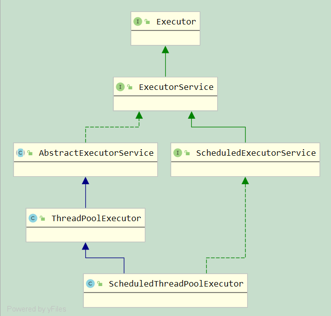

# java.util.concurrent -> 并发编程中常用的实用类。


## Java线程的几种状态

1. NEW

线程刚刚被创建，也就是已经new过了，但是还没有调用start()方法

2. RUNNABLE

RUNNABLE这个名字很具有欺骗性，很容易让人误以为处于这个状态的线程正在运行。事实上，这个状态只是表示，线程是可运行的。一个单核CPU在同一时刻，只能运行一个线程。

3. BLOCKED

线程处于阻塞状态，正在等待一个monitor lock。通常情况下，是因为本线程与其他线程公用了一个锁。其他在线程正在使用这个锁进入某个synchronized同步方法块或者方法，而本线程进入这个同步代码块也需要这个锁，最终导致本线程处于阻塞状态。

4. WAITING

等待状态，调用以下方法可能会导致一个线程处于等待状态：

- Object.wait with no timeout
- Thread.join with no timeout
- LockSupport.park

例如：对于wait()方法，一个线程处于等待状态，通常是在等待其他线程完成某个操作。本线程调用某个对象的wait()方法，其他线程处于完成之后，调用同一个对象的notify或者notifyAll()方法。Object.wait()方法只能够在同步代码块中调用。调用了wait()方法后，会释放锁。

5. TIMED_WAITING

线程等待指定的时间，对于以下方法的调用，可能会导致线程处于这个状态：

- Thread.sleep
- Object.wait with timeout
- Thread.join with timeout
- LockSupport.parkNanos
- LockSupport.parkUntil

6. TERMINATED

线程终止。

这些状态中NEW状态是开始，TERMINATED时销毁，在整个线程对象的运行过程中，这个两个状态只能出现一次。其他任何状态都可以出现多次，彼此之间可以相互转换。

## 线程池

### 最大线程 di



## 四大函数式接口

### 1. Consumer<T>

    void accept(T t);

### 2. Supplier<T>

    T get();

### 3. Fuction<T, R>

    R apply(T t);

### 4. Predicate<T>

    boolean test(T t)

## Future 和 CompletableFuture

### 1.Future

使用 Future 获得异步执行结果时，这两种方法都不是很好，因为主线程也会被迫等待

1. 调用阻塞方法 get()，会阻塞等待
2. 轮询看 isDone()是否为 true，表示任务完成

### 2.CompletableFuture

CompletableFuture 是 java.util.concurrent 库在 java 8 中新增的主要工具，同传统的 Future 相比，其支持流式计算、函数式编程、完成通知、自定义异常处理等很多新的特性。

1. 它可以帮助我们简化异步编程的复杂性，并且提供了函数式编程的能力，可以通过回调的方式处理计算结果，也提供了转换和组合 CompletableFuture 的方法
2. 它可能代表一个明确完成的 Future，也有可能代表一个完成阶段（ CompletionStage ），它支持在计算完成以后触发一些函数或执行某些动作。
3. 它实现了 Future 和 CompletionStage 接口


同传统的Future相比较，CompletableFuture能够主动设置计算的结果值（主动终结计算过程，即completable），从而在某些场景下主动结束阻塞等待。而Future由于不能主动设置计算结果值，一旦调用get()进行阻塞等待，要么当计算结果产生，要么超时，才会返回。


#### 创建 CompletableFuture

**方式一：构造函数创建**

```java
CompletableFuture<String> future = new CompletableFuture();
// 由于新创建的CompletableFuture还没有任何计算结果，这时调用join，当前线程会一直阻塞在这里。
String result = future.join();
System.out.println(result);

// 此时，如果在另外一个线程中，主动设置该 CompletableFuture 的值，则上面线程中的结果就能返回。
future.complete("test");
```

**方式二：supplyAsync 创建**

CompletableFuture.supplyAsync() 也可以用来创建 CompletableFuture 实例。通过该函数创建的 CompletableFuture 实例会异步执行当前传入的计算任务。在调用端，则可以通过 get 或 join 获取最终计算结果。

```java
// 只需传入一个 Supplier 实例（一般使用 lamda 表达式），此时框架会默认使用 ForkJoin 的线程池来执行被提交的任务。
public static <U> CompletableFuture<U> supplyAsync(Supplier<U> supplier)
 
// 指定自定义的线程池，然后将任务提交给该线程池执行。 
public static <U> CompletableFuture<U> supplyAsync(Supplier<U> supplier, Executor executor)


CompletableFuture<String> future = CompletableFuture.supplyAsync(()->{
    System.out.println("compute test");
    return "test";
});

String result = future.join();
System.out.println("get result: " + result);
```

**方式三：runAsync 创建**

CompletableFuture.runAsync() 也可以用来创建 CompletableFuture 实例。与 supplyAsync() 不同的是，runAsync()传入的任务要求是 Runnable 类型的，所以没有返回值。因此，runAsync 适合创建不需要返回值的计算任务。


```java

public static CompletableFuture<Void> runAsync(Runnable runnable)
 
 
public static CompletableFuture<Void> runAsync(Runnable runnable, Executor executor)

// 在示例中，由于任务没有返回值， 所以最后的打印结果是"get result: null"。
CompletableFuture<Void> future = CompletableFuture.runAsync(()->{
    System.out.println("compute test");
});
System.out.println("get result: " + future.join());
```

#### 常见的使用方式

同 Future 相比，CompletableFuture 最大的不同是支持流式（Stream）的计算处理，多个任务之间，可以前后相连，从而形成一个计算流。比如：任务1产生的结果，可以直接作为任务2的入参，参与任务2的计算，以此类推。

常用的流式链接函数包括

```java
// 带 Async 后缀的函数表示需要连接的后置任务会被单独提交到线程池中，从而相对前置任务来说是异步运行的。除此之外，两者没有其他区别。
thenApply
thenApplyAsync
 
thenAccept
thenAcceptAsync
 
thenRun
thenRunAsync
 
thenCombine
thenCombineAsync
 
thenCompose
thenComposeAsync
 
whenComplete
whenCompleteAsync
 
handle
handleAsync
```

**thenApply / thenAccept / thenRun**

这几个连接函数之间的唯一区别是提交的任务类型不一样。

- thenApply 提交的任务类型需遵从 Function<T, R> 签名，也就是有入参和返回值，其中入参为前置任务的结果。
- thenAccept 提交的任务类型需遵从 Consumer<T> 签名，也就是有入参但是没有返回值，其中入参为前置任务的结果。
- thenRun 提交的任务类型需遵从 Runnable 签名，即没有入参也没有返回值。

需要注意的是，通过 thenApply / thenAccept / thenRun 连接的任务，当且仅当前置任务计算完成时，才会开始后置任务的计算。因此，这组函数主要用于连接前后有依赖的任务链。

```java
// 示例中，future1 通过调用 thenApply 将后置任务连接起来，并形成 future2。该示例的最终打印结果为11，可见程序在运行中，future1 的结果计算出来后，会传递给通过 thenApply 连接的任务，从而产生 future2 的最终结果为1+10=11。当然，在实际使用中，我们理论上可以无限连接后续计算任务，从而实现链条更长的流式计算。


CompletableFuture<Integer> future1 = CompletableFuture.supplyAsync(()->{
    System.out.println("compute 1");
    return 1;
});
CompletableFuture<Integer> future2 = future1.thenApply((p)->{
    System.out.println("compute 2");
    return p+10;
});
System.out.println("result: " + future2.join());
 
```

**thenCombine**

同前面一组连接函数相比，thenCombine 最大的不同是连接任务可以是一个独立的 CompletableFuture（或者是任意实现了 CompletionStage 的类型），从而允许前后连接的两个任务可以并行执行（后置任务不需要等待前置任务执行完成），最后当两个任务均完成时，再将其结果同时传递给下游处理任务，从而得到最终结果。

一般，在连接任务之间互相不依赖的情况下，可以使用 thenCombine 来连接任务，从而提升任务之间的并发度。

注意，thenAcceptBoth、thenAcceptBothAsync、runAfterBoth、runAfterBothAsync 的作用与 thenConbime 类似，唯一不同的地方是任务类型不同，分别是BiConumser、Runnable。

```java
// 示例中，future1 和 future2 为独立的 CompletableFuture 任务，他们分别会在各自的线程中并行执行，然后 future1 通过 thenCombine 与 future2 连接，并且以 lamda 表达式传入处理结果的表达式，该表达式代表的任务会将 future1 与 future2 的结果作为入参并计算他们的和。因此，上面示例代码中，最终的打印结果是11。
CompletableFuture<Integer> future1 = CompletableFuture.supplyAsync(()->{
    System.out.println("compute 1");
    return 1;
});
CompletableFuture<Integer> future2 = CompletableFuture.supplyAsync(()->{
    System.out.println("compute 2");
    return 10;
});
CompletableFuture<Integer> future3 = future1.thenCombine(future2, (r1, r2)->r1 + r2);
System.out.println("result: " + future3.join());

```

**thenCompose**

thenCombine 主要用于没有前后依赖关系之间的任务进行连接。那么，如果两个任务之间有前后依赖关系，但是连接任务又是独立的 CompletableFuture，该怎么实现呢？

使用 thenApply 实现

```java
// 示例中，future2 的类型变成了 CompletableFuture 嵌套，而且在获取结果的时候，也需要嵌套调用 join 或者 get。这样，当连接的任务越多时，代码会变得越来越复杂，嵌套获取层级也越来越深。因此，需要一种方式，能将这种嵌套模式展开，使其没有那么多层级。thenCompose 的主要目的就是解决这个问题（这里也可以将 thenCompose 的作用类比于 stream 接口中的 flatMap，因为他们都可以将类型嵌套展开）。
CompletableFuture<Integer> future1 = CompletableFuture.supplyAsync(()->{
    System.out.println("compute 1");
    return 1;
});
CompletableFuture<CompletableFuture<Integer>> future2 =
        future1.thenApply((r)->CompletableFuture.supplyAsync(()->r+10));
System.out.println(future2.join().join());
```

thenCompose 实现上面的代码：

```java
// 很明显，在使用了 thenCompose 后，future2 不再存在 CompletableFuture 类型嵌套了，从而比较简洁的达到了我们的目的。
CompletableFuture<Integer> future1 = CompletableFuture.supplyAsync(()->{
    System.out.println("compute 1");
    return 1;
});
CompletableFuture<Integer> future2 = future1.thenCompose((r)->CompletableFuture.supplyAsync(()->r+10));
System.out.println(future2.join());

```

**whenComplete**

主要用于注入任务完成时的回调通知逻辑。这个解决了传统 future 在任务完成时，无法主动发起通知的问题。前置任务会将计算结果或者抛出的异常作为入参传递给回调通知函数。

```java
// 需要注意的是，future2 获得的结果是前置任务的结果，whenComplete 中的逻辑不会影响计算结果。
CompletableFuture<Integer> future1 = CompletableFuture.supplyAsync(()->{
    System.out.println("compute 1");
    return 1;
});
CompletableFuture future2 = future1.whenComplete((r, e)->{
    if(e != null){
        System.out.println("compute failed!");
    } else {
        System.out.println("received result is " + r);
    }
});
System.out.println("result: " + future2.join());

```

**handle**

handle 与 whenComplete 的作用有些类似，但是 handle 接收的处理函数有返回值，而且返回值会影响最终获取的计算结果。

```java
CompletableFuture<Integer> future1 = CompletableFuture.supplyAsync(()->{
    System.out.println("compute 1");
    return 1;
});
CompletableFuture<Integer> future2 = future1.handle((r, e)->{
    if(e != null){
        System.out.println("compute failed!");
        return r;
    } else {
        System.out.println("received result is " + r);
        return r + 10;
    }
});
System.out.println("result: " + future2.join());
```

#### 方式

anyOf 方法的参数是多个给定的 CompletableFuture，当其中的任何一个完成时，方法返回这个 CompletableFuture。
allOf 方法用来实现多 CompletableFuture 的同时返回。

```java
CompletableFuture<Void> voidCompletableFuture = CompletableFuture.allOf(contractFenshiCentralBidEleAndPriceMapFuture, contractRollingMatchEleAndPriceMapFuture);
```