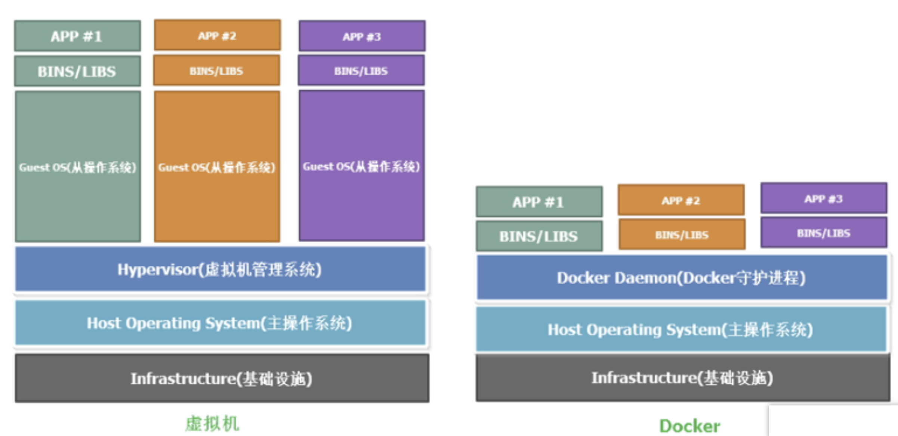
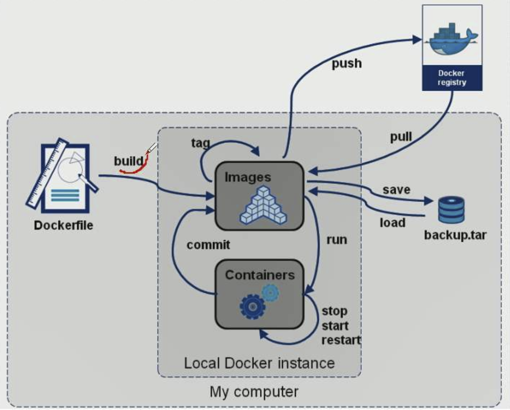
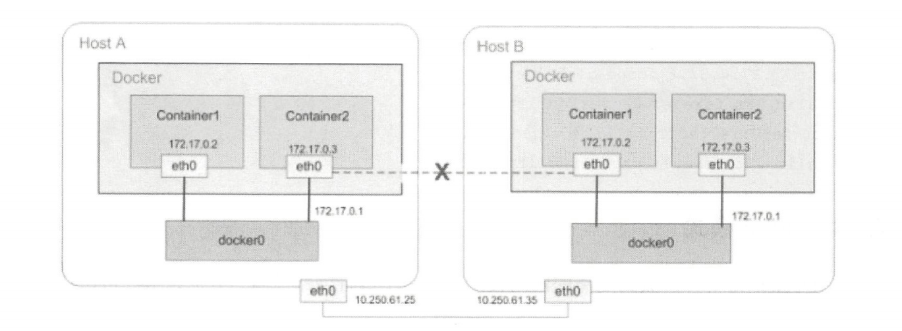
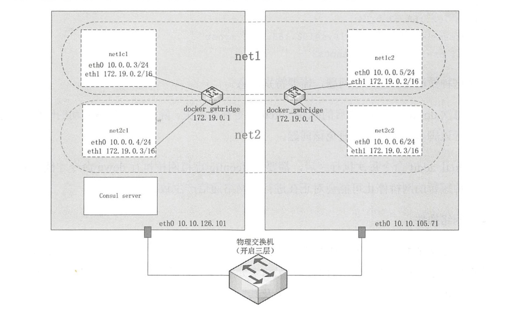
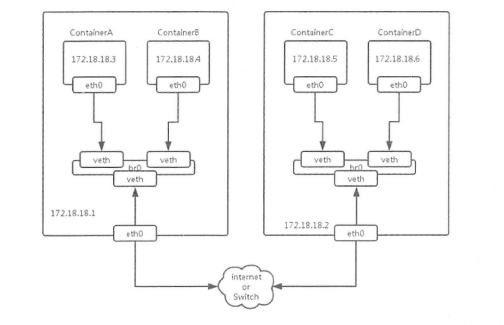
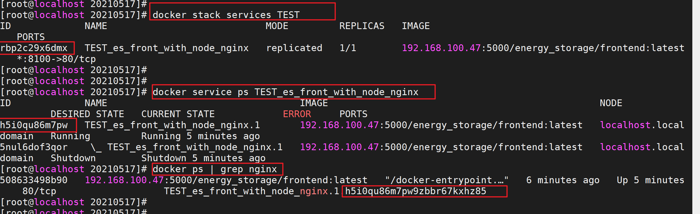
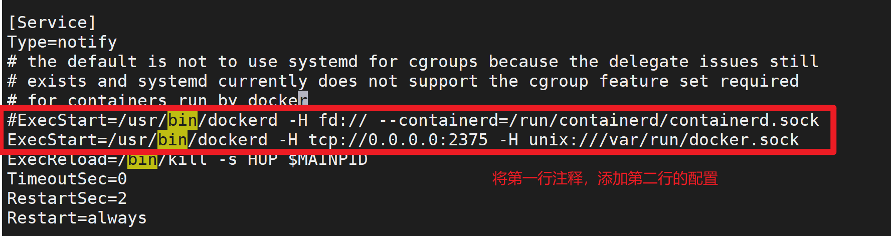

# Docker

## 1. 概念

[Docker]([https://www.docker.com) 是基于Go语言实现的云开源项目。

Docker 是一个开源的应用容器引擎，让开发者可以打包他们的应用以及依赖包到一个可移植的容器中，然后发布到任何流行的 Linux 机器上，也可以实现虚拟化。容器是完全使用沙盒机制，相互之间不会有任何接口(类似 iPhone 的 app)。几乎没有性能开销,可以很容易地在机器和数据中心中运行。最重要的是,他们不依赖于任何语言、框架或包装系统。

**docker 为什么比 jvm 快**

- docker 比 jvm 有更少的抽象层
- docker 利用的是宿主机内核，而 jvm 需要客户操作系统 os，所以说，新建一个容器的时候，docker 不需要像虚拟机一样重新加载一个操作系统的内核，避免引导，虚拟机加载 Guest OS ，是分钟级别的，而 docker 是不需要这个过程的。



## 2. 安装

[参考官方文档安装：https://docs.docker.com/engine/install/centos/](https://docs.docker.com/engine/install/centos/)

### 2.1 卸载旧版本

```sh
# 卸载旧版本，\表示换行
sudo yum remove docker \
                        docker-client \
                        docker-client-latest \
                        docker-common \
                        docker-latest \
                        docker-latest-logrotate \
                        docker-logrotate \
                        docker-engine
# 删除文件和目录                        
sudo yum remove docker-ce docker-ce-cli containerd.io
sudo rm -rf /var/lib/docker
```

### 2.2 安装

```shell
# 1. 安装依赖包
sudo yum install -y yum-utils

# 2. 设置镜像的仓库、更新yum软件包索引
yum-config-manager --add-repo http://mirrors.aliyun.com/docker-ce/linux/centos/docker-ce.repo
yum makecache

# 3. 安装docker相关的源。docker-ce 表示社区版 docker-ee表示企业版，docker的默认工作路径 /var/lib/docker，--installroot=[file]指定安装位置
# 如果存在包冲突，可以使用 yum erase podman buildah 命令，从系统中卸载 Podman 和 Buildah的软件包
yum install docker-ce docker-ce-cli containerd.io
```

### 2.3 启动并验证

```sh
# 启动docker
systemctl start docker
service docker start

# 查看版本，看是否安装成功
docker version

# 设置开机自启
systemctl enable docker

# 配置镜像加速器（阿里云->控制台->产品与服务->容器镜像服务->镜像加速器->操作文档）
vim /etc/docker/daemon.json
{
	"registry-mirrors": ["***"]
}
systemctl daemon-reload
systemctl restart docker

# 启动hello-world服务
docker run hello-world
```

## 3. 核心

### 3.1 镜像（image）

镜像是一种轻量级、可执行的独立软件包，用来打包软件运行环境和基于运行环境开发的软件，他包含运行某个软件所需的所有内容，包括代码、运行时库、环境变量和配置文件。

所有的应用都可以直接打包成 docker 镜像，镜像可以用来创建 Docker 容器，一个镜像可以创建很多容器。

Docker 镜像都是只读的，当容器启动时，一个新的可写层加载到镜像的顶部！

### 3.2 容器（container）

Docker 利用容器（Container）独立运行的一个或一组应用。容器是用镜像创建的运行实例。它可以被启动、开始、停止、删除。每个容器都是相互隔离的、保证安全的平台。可以把容器看做是一个简易版的 Linux 环境（包括root用户权限、进程空间、用户空间和网络空间等）和运行在其中的应用程序。容器的定义和镜像几乎一模一样，也是一堆层的统一视角，唯一区别在于容器的最上面那一层是可读可写的。

### 3.3 仓库（repository）

仓库（Repository）是集中存放镜像文件的场所。
仓库（Repository）和仓库注册服务器（Registry）是有区别的。仓库注册服务器上往往存放着多个仓库，每个仓库中又包含了多个镜像，每个镜像有不同的标签（tag）。

### 3.4 联合文件系统（UnionFS）

联合文件系统（UnionFS）是一种分层、轻量级并且高性能的文件系统，它支持对文件系统的修改作为一次提交来一层层的叠加，同时可以将不同目录挂载到同一个虚拟文件系统下。

UnionFS 是 Docker 镜像的基础，Docker 的镜像实际上由一层一层的文件系统组成。镜像通过分层来进行继承，基于基础镜像（没有父镜像），可以制作各种具体的应用镜像。

**特性**

一次同时加载多个文件系统，但从外面看起来，只能看到一个文件系统，联合加载会把各层文件系统叠加起来，这样最终的文件系统会包含所有底层的文件和目录。

比如：有多个镜像都从相同的 base 镜像构建而来，那么宿主机只需在磁盘上保存一份 base 镜像，同时内存中也只需加载一份 base 镜像，就可以为所有容器服务了。而且镜像的每一层都可以被共享。

### 3.5 镜像加载原理

Bootfs(boot file system) 主要包含 Bootloader 和 Kernel, Bootloader 主要是引导加载Kernel, Linux 刚启动时会加载 Bootfs 文件系统，在 Docker 镜像的最底层是 bootfs。这一层与我们典型的 Linux/Unix 系
统是一样的，包含 Boot 加载器和内核。当 boot 加载完成之后整个内核就都在内存中了，此时内存的使用权已由 bootfs 转交给内核，此时系统也会卸载 bootfs。

Rootfs (root file system) ，在 Bootfs 之上。包含的就是典型 Linux 系统中的 /dev, /proc, /bin, /etc 等标准目录和文件。Rootfs就是各种不同的操作系统发行版，比如Ubuntu，Centos等等。

Docker 镜像都是只读的，当容器启动时，一个新的可写层被加载到镜像的顶部，这一层通常被称为容器层,容器层之下的都叫镜像层。

### 3.6. 容器数据卷

Docker 容器产生的数据，如果不通过 docker commit 生成新的镜像，使得数据做为镜像的一部分保存下来，那么当容器删除后，数据自然也就没有了。这时为了解决容器的数据持久化，需要通过容器数据卷来解决这个问题。

卷就是目录或文件，存在于一个或多个容器中，由 docker 挂载到容器，但不属于联合文件系统，因此能够绕过 Union File System 提供一些用于持续存储或共享数据的特性：

卷的设计目的就是数据的持久化，完全独立于容器的生存周期，因此 Docker 不会在容器删除时删除其挂载的数据卷

特点：

1. 数据卷可在容器之间共享或重用数据
2. 卷中的更改可以直接生效
3. 数据卷中的更改不会包含在镜像的更新中
4. 数据卷的生命周期一直持续到没有容器使用它为止


## 4. 基础命令

```shell
# 1. 帮助
docker verison		# 查看版本
docker info			# 查看详情
docker --help		# 帮助

# 2. 镜像
# 默认情况下会从 docker hub 搜索、拉取、推送镜像；如果从私有仓库获取镜像，则需要指定地址 http://{ip}:{port}/{images}:{tag}
# docker与各个仓库地址默认以https协议进行通信，除非该仓库地址允许以不安全的链接方式访问
docker search <name>                  # 搜索
docker pull <name>                    # docker pull 192.168.100.79:5000/xxx:latest
docker images                         # 列出所有镜像，-a 包括隐藏的中间镜像、-q 只显示镜像ID、--digests 显示镜像的摘要信息、--no-trunc 显示完整的镜像信息
docker rmi -f <imageId...>            # 删除指定镜像，可以多个， -f 强制删除
docker rmi -f $(docker images -aq)    # 删除所有镜像
docker history <imageId>              # 查看镜像分层信息
docker login                          # 登录
docker push                           # 推送
docker tag SOURCE_IMAGE[:TAG] TARGET_IMAGE[:TAG]    # 创建一个引用原镜像的镜像，重命名，打tag

# 3. 容器
docker run -it --name=xxx -p xx:xx --restart=always -v /opt/nginx:/etc/nginx:ro <images>
  # --name='name' 容器名
  # -d 后台方式运行，（常见的坑）后台运行时可以会导致服务停止，因为容器使用后台运行，就必须要有一个前台进程，docker发现没有应用，就会自动停止。
  # -it 使用交互方式运行，进入容器查看分区
  # -p 指定端口，有四种格式：ip:主机端口:容器端口、ip::容器端口、主机端口:容器端口、容器端口
  # -P 随机分配端口
  # -e 环境配置，比如mysql设置密码 -e MYSQL_ROOT_PASSWORD=123456
  # -v 挂载，分为匿名挂载和具名挂载。匿名挂载：容器内路径；具名挂载：宿主机绝对路径:容器内路径。也可以改变容器内读写权限，比如：宿主机绝对路径:容器内路径:ro/rw
  # --volumes-from　多容器之间共享数据卷
  # --env-file 指定环境变量文件
  # --link --link <container_name>:<alias> ，第一个参数为链接到的另一个容器的名称或 ID，第二个参数为链接的别名，可省略。原理就是在/etc/hosts里面添加了一个alias的名称
  # --restart  重启策略，重启是由Docker守护进程完成的；
      # no默认策略，容器退出时不重启容器、
      # on-failure容器非正常退出时才会重启（容器退出状态不为0）、
      # on-failure:3 容器非正常退出时最多重启三次、
      # always容器退出时总是重启、
      # unless-stopped容器退出时总是重启，但不考虑Docker守护进程启动时就已经停止了的容器


docker exec -it <containerId> /bin/bash   # 进入容器后开启一个新的终端，可以在里面操作(常用)，使用exit退出时容器不会停掉
docker attach <containerId>               # 进入容器正在执行的终端，不会启动新的进程，使用exit退出时容器会停掉
exit / Ctrl + P + Q                       # 退出容器，exit 有可能会导致容器停止
docker ps                                 # 列出所有运行的容器，-a 列出停止的容器，-n 显示最近n个创建的容器(包括所有状态)，--no-trunc 不截断输出。
docker rm -f <containerId>                # 删除指定容器
docker rm -f $(docker ps -aq)             # 删除所有容器，等同于 docker ps -aq | xargs docker rm
docker start <containerId>                # 启动容器
docker restart <containerId>              # 重启容器
docker stop <containerId>                 # 停止当前正在运行的容器
docker kill <containerId>                 # 强制停止当前容器

docker logs -f -t --tail 20 <container>   # 查看日志 -f 滚动输出、-t 展示时间、--tail 最后的20行。
docker logs <container> >> log_error.txt  # 日志写到文件中。
docker inspect xxxx                       # 查看容器/镜像元数据，比如日志文件路径等
docker top <containerId>                  # 查看容器中的进程信息

docker cp [r] <containerId>:容器内路径 目的地主机路径      # 容器内拷贝到宿主机上，-r 递归拷贝
docker commit -m="描述信息" -a="作者" 容器id  镜像名:TAG   # 提交容器成为一个新的副本(镜像)

docker save -o xxx.tar 镜像    # 将仓库中的镜像导出成tar格式的文件
docker load -i xxx.tar        # 将tar格式的镜像文件导入到本地镜像仓库
docker image prune            # 删除所有未被 tag 标记和未被容器使用的镜像（既没有标签名也没有容器引用的镜像），-a 删除所有未被容器使用的镜像

# 监控容器资源消耗
docker stats <containerId>  # 每隔1s刷新一次输出内容，--no-stream 只输出当前状态（输出一次），--format 按照自定义格式（table或json）输出
docker stats --format "table {{.Name}}\t{{.ID}}\t{{.CPUPerc}}\t{{.MemUsage}}\t{{.NetIO}}\t{{.BlockIO}}\t{{.MemPerc}}\t{{.PIDs }}"
docker stats --format "{\"container\":\"{{.Container}}\"}"

# 查询挂载
docker volume ls


# eg: nginx
-v /etc/local/nginx/html:/usr/share/nginx/html
-v /etc/local/nginx/conf/nginx.conf:/etc/nginx/nginx.conf
-v /etc/local/nginx/logs:/var/log/nginx/
```

## 5. Dockerfile

是用来构建镜像的文本文件。默认文件名为 Dockerfile，如果不是默认的，可通过 -f 指定。

### 5.1 构建命令

<div style="color:red;font-size:20px">docker build -f Dockerfile -t [imageName]:[tag] .</div>

### 5.2 执行流程

>规则：
>
>- 每条保留字指令都必须大写字母且后面要跟随至少一个参数；
>
>- 指令按照从上到下，顺序执行；
>
>- ‘# 表示注释；
>
>- 每条指令都会创建一个新的镜像层，并对镜像提交。

docker 执行一个 Dockerfile 脚本的流程大致如下：

1. docker 从基础镜像运行一个容器
2. 执行一条指令并对容器作出修改
3. 执行类似 docker commit 的操作提交一个新的镜像层
4. docker 再基于刚提交的镜像运行一个新的容器
5. 执行 dockerfile 中的下一条指令直到所有指令都执行完成

从应用软件的角度来看，Dockerfile、Docker镜像与Docker容器分别代表软件的三个不同阶段，

- Dockerfile是软件的原材料

- Docker镜像是软件的交付品

- Docker容器则可以认为是软件的运行态。

Dockerfile面向开发，Docker镜像成为交付标准，Docker容器则涉及部署与运维，三者缺一不可，合力

充当Docker体系的基石。

| 指令       | 说明                                                         |
| ---------- | ------------------------------------------------------------ |
| FROM       | 基础镜像，当前新镜像是基于哪个镜像的，有继承的意味           |
| MAINTAINER | 镜像维护者的姓名和邮箱地址                                   |
| RUN        | 容器构建时需要运行的命令                                     |
| EXPOSE     | 当前容器对外暴露的端口                                       |
| WORKDIR    | 指定在创建容器后，终端默认登录的进来工作目录，一个落脚点     |
| ENV        | 用来在构建镜像过程中设置环境变量                             |
| ADD        | 将宿主机目录下的文件拷贝进镜像且ADD命令会自动处理URL和解压tar压缩包 |
| COPY       | 类似ADD，拷贝文件和目录到镜像中。<br/>将从构建上下文目录中<源路径>的文件/目录复制到新的一层的镜像内的<目标路径>位置<br/>COPY src dest <br/>COPY ["src","dest"] |
| VOLUME     | 容器数据卷，用于数据保存和持久化工作                         |
| CMD        | 指定一个容器启动时要运行的命令<br/>Dockerfile中可以有多个CMD指令，但只有最后一个生效，CMD会被docker run之后的参数替换 |
| ENTRYPOINT | 指定一个容器启动时要运行的命令，用来追加命令<br />ENTRYPOINT的目的和CMD一样，都是在指定容器启动程序及参数 |
| ONBUILD    | 当构建一个被继承的Dockerfile时运行命令,父镜像在被子继承后父镜像的onbuild被触发 |

**CMD 和 ENTRYPOINT 区别**

CMD 和 ENTRYPOINT 指令都是用于指定容器启动时要运行的默认命令，CMD会被docker run命令后边的命令参数覆盖，而ENTRYPOINT是在 docker run 命令之后的命令参数，会被当做参数传递ENTRYPOINT，之后形成新的组合命令。

**ADD 和 COPY 区别**

COPY 和 ADD 指令用于将文件或目录复制到容器中。但 ADD 指令功能更强大，可以自动解压文件和下载URL资源。建议在不需要特殊处理的情况下，优先使用COPY指令。


```shell
# 举个栗子（从官方pull下来的 centos 镜像是mini版的，不带有 vim ping 这些基础命令）
FROM centos
MAINTAINER dangbo<1456131152@qq.com>
ENV MYPATH /usr/local
WORKDIR $MYPATH
RUN yum -y install vim
RUN yum -y install net-tools

EXPOSE 80

CMD echo $MYPATH
CMD echo "-----end----"
CMD /bin/bash
```



## 6. 网络

[Docker网络官网：https://docs.docker.com/network/](https://docs.docker.com/network/)

Docker是基于Linux Kernel的namespace，CGroups，UnionFileSystem等技术封装成的一种自定义容器格式，从而提供了一套虚拟运行环境。

- namespace：用来做隔离的，比如 pid[进程]、net【网络】、mnt【挂载点】
- CGroups：Controller Groups 用来做资源限制，比如内存和CPU等
- Union File Systems：用来做Image和Container分层


Docker 容器每次重启后容器 ip 是会发生变化的。这也意味着如果容器间使用 ip 地址来进行通信的话，一旦有容器重启，重启的容器将不再能被访问到。而 Docker 网络就能够解决这个问题。

**作用**

1. 容器间的互联和通信以及端口映射
2. 容器 IP 变动的时候，可以通过服务名直接网络通信而不受到影响

因此只要是处于同一个Docker 网络下的容器就可以使用服务名进行直接访问，而无需担心重启。


### 6.1 单机网络模式

| 网络模式  | SCOPE | 描述                                                         |
| --------- | ----- | ------------------------------------------------------------ |
| bridge    | local | 桥接模式，是 Docker 默认采用的网络模式。每个容器都会分配一个独立的 IP 地址，并将容器连接到 docker0 虚拟网桥上，可以通过主机的 IP 地址进行访问。同时，桥接模式允许容器之间相互通信。 |
| host      | local | 主机模式。容器将不会获得独立的网络命名空间，而是直接使用宿主机的网络。这意味着容器可以直接访问宿主机上的网络接口，从而获得更高的网络性能，但也失去了网络隔离的好处。 |
| container | local | container 模式。和已经存在的一个容器共享一个 Network Namespace，而不是和宿主机共享 |
| none      | local | 无网络模式。拥有自己的 Network Namespace，并不为Docker容器进行任何网络配置。也就是说，容器没有网卡、IP、路由等信息。这种模式适用于特殊情况，例如只需要文件系统隔离而不需要网络连接的场景。 |
| overlay   | swarm | Overlay 模式。用于跨多个 Docker 守护进程的容器通信，通常与 Docker Swarm 或者 Kubernetes 等集群管理工具一起使用。 |


scope 参数用于指定网络的作用范围，可以是 local 或 swarm。

- local，适用于单个 Docker 守护程序主机上的容器。在 local 范围内创建的网络仅限于当前宿主机上的容器之间进行通信。这意味着该网络不会跨越宿主机边界，只能在单个宿主机上使用。
- swarm，适用于 Docker Swarm 中的服务和任务。在 swarm 范围内创建的网络可以跨越多个 Docker 守护程序主机，允许 Swarm 集群中的服务之间进行通信。可以实现在整个 Swarm 集群中的不同宿主机上运行的容器之间建立网络连接。

#### 6.1.1 Bridge

桥接模式，是 Docker 默认采用的网络模式。每个容器都会分配一个独立的 IP 地址，并将容器连接到 docker0 虚拟网桥上，可以通过宿主机的 IP 地址进行访问。同时，桥接模式允许容器之间相互通信。


docker0 虚拟网桥

宿主机安装好 Docker 后，Docker 守护进程就会调用 Linux 内核，生成一个虚拟网桥 docker0。它在内核层连通了其他的物理或虚拟网卡，让主机和容器之间可以通过网桥相互通信。

Docker 会默认指定 docker0 的 ip 地址和子网掩码，地址段都是172.17.0.1/16。docker0 特点：默认，域名不能访问，--link 可以打通连接。

172.17.0.1/16 网段的容器之间都是怎么进行路由的呢？

我们在宿主机中查看路由表 route -n，可以看到所有172.17.0.1网段下的报文全部发给了本机的 docker0 虚拟网桥。这就意味着，所有容器其实都把宿主机的 docker0 网桥看成了虚拟交换机，所有报文的路由全部交给了它。启动容器后，Docker 实际是在 iptables 上遵循了 NAT 规则（NAT 是通过 iptables 实现的），实现了端口转发功能。通过 iptables -vnL -t nat 命令可以看到，docker0 网桥上生成了路由转发规则。

不同网络的容器怎么相互访问？

先自定义一个 bridge 网络，并在自定义网络下创建容器，然后使用默认 bridge 网络下的容器，ping 自定义网络的容器，发现是不通的，两个根本不在一个网段下。如果需要相互访问，则需要将默认网络下的容器加入到自定义网络中，使用命令 docker network conect <network_name> <container_name> ，容器之间也可以直接使用别名 ping。 

注意：通过别名 ping，只有自定义网络可以，默认的网络不行。
原因：官方解释，默认桥接网络 bridge 存在缺陷，不建议在生产环境中使用，只能通过 IP 地址进行通信，除非它们使用 legacy-link 标志链接，但是-link也即将过时，不推荐使用。


#### 6.1.2 Host

主机模式，容器将不会获得独立的网络命名空间 Network Namespace，而是直接使用宿主机的网络。这意味着容器可以直接访问宿主机上的网络接口，从而获得更高的网络性能，但也失去了网络隔离的好处。

```sh
docker run --network=host -d tomcat
```

#### 6.1.3 Container

container 模式，和已经存在的一个容器共享一个 Network Namespace，而不是和宿主机共享。新建容器会和已存在的容器共享 IP 地址和端口等网络资源，两个容器的进程可以直接通过 lo 回环接口进行通信。

```sh
docker run --network=container:88c03d9c7d -d tomcat
```


#### 6.1.4 None

无网络模式，拥有自己的 Network Namespace，并不为 Docker 容器进行任何网络配置。也就是说，容器没有网卡、IP、路由等信息。之后，用户可以自己进行网络配置。这种模式适用于特殊情况，例如只需要文件系统隔离而不需要网络连接的场景。


```sh
docker run --network=none -it tomcat 
```

### 6.2 集群网络模式

在实际生产中，我们往往面临的是分布式环境下复杂的网络通信系统，因此要保证网络易管理、高容错、并且具有较好的通信质量。

Docker 容器跨主机互访一直是一个问题，Docker 官方为了避免网络上带来的诸多麻烦，故将跨主机网络开了比较大的口子，而由用户自己去实现。目前 Docker 跨主机的网络实现方案也有很多种，主要包括端口映射、ovs、 fannel等。


docker swarm 集群中，会有默认创建两个网络：

ingress network

ingress 是 docker swarm 集群默认的网络，也是一个特殊的 overlay 网络，用于服务节点间的负载均衡，处理与群集服务相关的控制和数据流量。当任何 Swarm 节点在发布的端口上接收到请求时，它将该请求交给一个名为 IPVS 的模块。IPVS 跟踪参与该服务的所有 IP 地址，选择其中的一个，并通过 ingress 网络将请求路由到它。

docker_gwbridge

是一种桥接网络，将 overlay 网络（包括 ingress 网络）连接到一个单独的 Docker 守护进程的物理网络。默认情况下，服务正在运行的每个容器都连接到本地 Docker 守护进程主机的 docker_gwbridge 网络。docker_gwbridge 网络在初始化或加入 Swarm 时自动创建。大多数情况下，用户不需要自定义配置，但是 Docker 允许自定义。


#### 6.2.1 Bridge 端口转发

和单机网络的 Bridge 模式一样，在集群环境下，Docker 容器依然可以通过 Bridge 默认进行通信。

两台不同的宿主机 A 和 B 内部的容器通过 docker0 虚拟网桥进行通信。跨宿主机通信的时候，则通过两台宿主机的物理网卡和物理网络进行通信。



比如宿主机 A 上的某个容器1想要和宿主机 B 上的某个容器2通信，那么容器1会首先将报文发送给宿主机 A 的 docker0 虚拟网桥，然后该网桥发现目标 IP 地址正是宿主机 B 的 IP 地址，于是就会将报文再转发给宿主机 A 的物理网卡 eth0，接着该物理网卡就会寻址将报文发给宿主机 B，宿主机 B 的物理网卡接收到报文之后会自动被 docker0 虚拟网桥捕获，最后路由给容器2。

该模式简单有效，但是因为 NAT 转发会在本机上维护一张路由表，因此导致网络性能较差。同时在该模式下，跨容器网络的端口冲突和端口占用问题也会非常明显。虽然 Bridge 端口转发模式有种种不足，但是由于过程简单，因此在很多中小型企业的生产环境中往往是最常被选择的模式。

#### 6.1.2 overlay

Overlay 模式。用于跨多个 Docker 守护进程的容器通信，通常与 Docker Swarm 或者 Kubernetes 等集群管理工具一起使用。

Overlay 网络模式主要是由隧道和路由两种方式实现，一种是对基础网络协议进行封包，另一种是配置更复杂的路由配置实现容器间跨主机的网络通信。其实，以上两种或多或少的都会给我们网络的实现带来了复杂性以及性能上的损耗，因为当我们拥有庞大的业务集群以后，这些复杂度和性能损耗都是不能忽视的。

#### 6.2.3 扁平网络

很多复杂的业务场景对网络提出了更高的要求，比如让业务网络和管理网络隔离，让服务器拥有多张网卡，其中某几张网卡绑在一起支撑业务网络通信，某几张支持管理网络。另外，在一些混合部署模式下，一部分业务系统和数据系统部署在裸金属主机上，另一部分新产品线部署在 Docker容器下，我们可能会希望让这两部分无缝对接。

一般面对这种情况，我们的做法是将 Docker 容器网络和物理网络直接通过交换机来打通将这两张网络统一为一张扁平化网络，如图所示。

我们将物理网卡 eth0 直接插拔在每个 Docker 容器上，为 eth0 分配一个和物理网络同源的 IP 地址端，这样每个容器获得的 IP 地址就是和物理网络同网段的 IP 地址，同时容器之间的报文可以直接通过物理网卡转发给物理网络的交换机进行后续的转发。



通过网卡和交换机直接进行二层报文传输，其性能优于 NAT，且可以直接将 Docker 容器暴露在物理网络里。美中不足的是，各个宿主机的网段需要提前规划，网络规则需要进行手动配置。

在这种模式下，每台物理机上的容器 IP 地址的分配和收回是一个很大的问题，管理不好，IP 地址冲突就不可避免。为了尽可能避免出现问题，只能在管理上不断加强，一般常见的管理方式有如下几种。

1. 新建虚拟网桥

最简单的做法是新建一个虚拟网桥，然后将物理网卡插入该网桥中，将容器也插入该虚拟网桥中作为出口。

通过 Docker 命令去创建一个自定义的网络起名为 “mynet”，同时会产生一个网桥 br0，之后通过更改网络配置文件（在/etc/sysconfig/network-scripts/下ifcfg-br0、ifcfg-默认网络接口名）将默认网络接口桥接到 br0 上，重启网络后，桥接网络就会生效。Docker 默认在每次启动容器时都会将容器内的默认网卡桥接到 br0 上，而且宿主机的物理网卡也同样桥接到了 br0 上了。其实桥接的原理就好像是一台交换机，Docker 容器和宿主机物理网络接口都是服务器，通过 veth pair 这个网络设备像一根网线插到交换机上。至此，所有的容器网络已经在同一个网络上可以通信了，每一个 Docker 容器就好比是一台独立的虚拟机，拥有和宿主机同一网段的IP，可以实现跨主机访问了。

以下为该方法的典型示例代码。

```sh
# 首先创建一个名为 mynet 的虚拟网卡，其中的 gateway 是虚拟网桥的地址，subnet 是子网掩码，ip-range 是当前宿主机的容器地址段，aux-address 指向交换机。
docker network create --gateway=192.168.57.99 --subnet=192.168.0.0/16 --ip-range=192.168.57.0/24 --aux-address=DefaultGatewayIPv4=192.168.56.1 mynet
# 然后执行 brctl addif 命令，将物理网卡 enp0s3 插入刚刚建立的 mynet 虚拟网桥中。
brctl addif br-14e0b9e5069f enp0s3
```

但是这种做法会产生两个问题，需要特别注意。

- 每次 docker service 重启的时候，brctl 命令都会丢失，除非每次机器启动的时候定时执行该脚本，否则无法避免该问题。

- brctl addif 命令每次执行之后，都要对 ifconfig 虚拟网桥执行 down 命令才能生效，这种短暂的网桥停止可能会对正在进行的网络通信产生致命影响。

2. 编写网络插件

第二种做法是编写一个 IPAM 网络插件管理容器的 IP 地址，该插件后端可以对接 etcd 实现分布式存储，用来管理和存储所有的已分配和未分配的 IP 资源池，如图所示。大家可以参考网络上的内容来了解目前开源的优秀框架及其原理。



该框架将新建一块 br0 网桥，然后将物理网卡插入 br0 网桥，达到直连交换机通信的效果。该框架在使用时需要在本机执行如下命令生成 br0。

```sh
docker network create
--opt=com.docker.network.bridge.enable_icc=true
--opt=com.docker.network.bridge.enable_ip_masquerade=false
--opt=com.docker.network.bridge.host_binding_ipv4=0.0.0.0
--opt=com.docker.network.bridge.name=br0
--opt=com.docker.network.driver.mtu=1500
--ipam-driver=talkingdata
```

我们首先需要创建一个 br0 自定义网桥，这个网桥并不是通过系统命令手动建立的原始 Linux 网桥，而是通过 Docker 的 network create 命令建立的自定义网桥，通过这种方式我们可以设置 DefaultGatewayIPv4 参数来设置容器的默认路由，解决原始 Linux 自建网桥不能解决的问题。

用 Docker 创建网络时，我们可以通过设置 subnet 参数来设置子网 IP 地址的范围，默认情况下我们可以把整个网段给子网，后面可以用 ipam driver（地址管理插件）来进行控制。还有一个参数 gateway 是用来设置 br0 自定义网桥地址的，其实也就是宿主机的地址。

这里顺便提一下 ipam-driver 这个插件。ipam-driver 是 Docker 新推出的一种网络驱动插件，Docker 每次启停与删除容器都会调用这个插件提供的 IP 地址管理接口，然后 IP 地址管理接口会对存储 IP 地址的 etcd 执行增删改査操作。此插件运行时会启动一个 UNIX Socket，然后会在 Docker/run/plugins 目录下生成一个 sock 文件，执行 Docker Daemon 之后会和这个 sock 文件进行交互，调用我们之前实现好的几个接口进行 IP 地址管理，防止 IP 冲突。


使用 L2-FLAT

我们还可以使用开源网络框架中的 L2-FLAT 模型插件。现在很多开源的 Docker 集群网络模式（如 Fannel 的 host-gw 模式）中都默认带有 L2-FLAT 模型插件，能够帮我们解决上述网络 IP 地址分配和管理中的问题。

#### 6.2.4 Flannel 模式

Docker 集群网络中还有各种成熟的开源解决方案。常用的技术方案是建立隧道和 VXLAN，打通不同的宿主机，再通过软件功能和分布式存储做软件交换机，跨宿主机做报文传输，这些本质上都是 SDN（软件定义网络）的一种技术实现。

简单说起来，Flannel 模式的设计思路就是通过分布式存储 etcd 在集群环境下维护一张全局路由表，然后每台宿主机上会运行一个 flanneld 守护进程，负责和 etcd 交互，拿到全局路由表，同时监听本宿主机上的所有容器报文，执行类似交换机的路由转发操作。Flannel 的性能介于 NAT 和物理模式之间，采用SDN 思想，优点是功能丰富、跨主机通信能力强，缺点是维护成本高、有一定的性能损耗。

### 6.3 常用命令

```shell
docker network --help     # 帮助

# 创建网络，--driver指定网络模式，默认bridge，网络模式为overlay时，scope只能为swarm；--subnet 192.168.0.0/16 子网，--gateway 192.168.0.1 网关，--attachable 启用手动连接容器

docker network create --driver bridge --subnet 192.168.0.0/16 --gateway 192.168.0.1 <network_name> 
docker network create --driver overlay --attachable --scope swarm  <network_name> 
docker network create --driver overlay --subnet 172.28.0.0/24 <network_name>

docker network inspect <network_name>                     # 显示网络的详细信息
docker network ls                                         # 列出所有网络
docker network rm <network_name>                          # 删除网络
docker network prune                                      # 删除所有没有使用的网络
docker network connect <network_name> <container>         # 连接容器到网络
docker network disconnect <network_name> <container>      # 断开网络中的容器

# 举例
docker run -d -P --name tomcat01 --network bridge tomcat  # 启动容器时指定网络
docker network connect my-network my-container            # 将容器加入到网络
```

### 6.4 示例

docker network create --driver overlay --subnet 172.28.0.0/24 application_net

创建 docker 网络，--subnet 可以指定 docker 容器的网段，默认是10.0.1.0段，如果与客户网络不冲突，可以不写，只能使用如图下边的三类私有地址


```yml
# 手动创建网络或者已存在的网络。然后在配置文件加入外部网络
networks:
  dev:
    external: true

# 配置文件中直接定义网络，在启动时，会自动创建，常用于将所有的服务放在一个compose文件的场景。
networks:
  dev-net:
    driver: overlay
networks:
  dev-net:
    driver: bridge  

version: '3'
services:
  nacos:
    restart: always    

version: '3'
services:
  mysql:
    restart: always
    image: mysql:5.7.31
    ports:
      - 13306:3306
    networks:
      - dev-net  
```

## 7. docker-compose

Docker Compose 负责实现对 Docker 容器集群的快速编排。将所管理的容器分为三层，分别是工程（project）、服务（service）、容器（container），运行目录下的所有文件（docker-compose.yml）组成一个工程，一个工程包含多个服务，每个服务中定义了容器运行的镜像、参数、依赖，一个服务可包括多个容器实例。

使用 docker-compse 编排的一组容器时会默认创建一个网络，并且这组容器全部都会加入到网络当中。容器之间可以直接使用服务名去直接通信。

**主要特点**

- **本地部署：** 主要用于在单个Docker主机上部署和管理容器化应用程序。
- **独立性：** Docker Compose文件独立于任何特定的编排平台，只依赖于Docker Compose工具来运行。
- **简单性：** 相对简单易用，使用直观的语法来定义服务、网络和卷。

### 7.1 安装

```shell
# 下载docker-compose文件，如果报错，直接到官网下载，之后将名称改为docker-compose即可
curl -L https://github.com/docker/compose/releases/download/1.18.0/docker-compose-`uname -s`-`uname -m` -o /usr/local/bin/docker-compose
# 赋予权限
chmod +x /usr/local/bin/docker-compose
# 查看版本，用来检查安装是否成功
docker-compose version
```

### 7.2 常用命令

```shell
docker-compose [-f <arg>...] [options] [COMMAND] [ARGS...]   
  # -f --file   指定compose文件，默认为docker-compose.yml
  # -p --project-name   指定项目/工程名称，默认使用当前所在目录为项目名
  # --verbose  输出更多调试信息
  # -v，-version  打印版本并退出
  # -log-level  指定日志等级(DEBUG, INFO, WARNING, ERROR, CRITICAL)

# 执行命令，是针对项目工程而言的，必须在对应的目录下执行
docker-compose config [SERVICE]                   # 验证Compose文件格式是否正确
docker-compose build [options] [SERVICE...]				# 基于docker-compose.yml文件构建或重新构建镜像，而不是运行，--no-cache当构建镜像时，不使用缓存
docker-compost up -d [options] [SERVICE...]	      # 创建并运行容器，也就是部署一个Compose应用，如果之前已经构建了镜像，则它只会运行它。默认读取 docker-compose.yaml/yml 文件，-f 指定其他文件名，-d 应用在后台启动
docker-compose up -d --build .                    # 上两条命令的集合体，构建并运行

docker-compose ps	[SERVICE...]				            # 列出项目中目前的所有容器

docker-compose stop [options] [SERVICE...]        # 停止Compose应用相关的服务容器，如果不加参数和服务名，则停止所有的服务容器
docker-compose start [options] [SERVICE...]  			# 启动已经存在的服务
docker-compose restart [options] [SERVICE...]			# 重启项目中的服务
docker-compose run [options] [SERVICE...]			    # 在一个新的容器中运行一个服务
docker-compose down [options] [SERVICE...]        # 停止和删除容器、网络，–rmi all/local删除所有或镜像名为空的镜像 -v 删除卷
docker-compose rm -s -f [options] [SERVICE...] 		# 删除所有（停止状态的）服务容器，-s 停止，-f 强制删除，推荐先执行stop停止容量，再删除
docker-compose logs	[options] [SERVICE...]				# 查看服务容器日志的输出
docker-compose kill                       	      # 通过发送SIGKILL信号来强制停止服务容器，-s指定发送的信号

docker-compose port SERVICE PRIVATE_PORT          # 显示某个容器端口所映射的公共端口
```

### 7.3 示例

```yaml
version: '3'
services:
  mysql:
    # 如果同时指定image和build两个标签，那么Compose会构建镜像并且把镜像命名为image值指定的名字。
    image: mysql:8.0.20
    build: ./dir            # 除了基于镜像，还可以基于Dockerfile，在使用up启动时执行构建任务，构建标签是build，可以指定Dockerfile所在文件夹的路径，也可以是相对路径。
    build:                  # 设定上下文根目录，以该目录为准指定Dockerfile        
      context: ../          # 可以是Dockerfile的文件路径，也可以是到链接到git仓库的url，当提供的值是相对路径时，被解析为相对于撰写文件的路径，此目录也是发送到Docker守护进程的context
      dockerfile: path/of/Dockerfile          # 使用dockerfile文件来构建，必须指定构建路径
    restart: always         # stack 没有该参数，使用 --update-delay、--update-parallelism、--update-failure-action 等参数来定义服务更新时的行为，以及容器失败时的处理方式。
    container_name: mysql   # stack 没有该参数
    command:                                    # 覆盖容器启动后默认执行的命令。
      --default-authentication-plugin=mysql_native_password
    depends_on:             # 一般项目容器启动的顺序是有要求的，如果直接从上到下启动容器，必然会因为容器依赖问题而启动失败。depends_on标签用于解决容器的依赖、启动先后的问题
      - redis  
    pid: host               # 将PID模式设置为主机PID模式，跟主机系统共享进程命名空间。容器使用pid标签将能够访问和操纵其他容器和宿主机的名称空间。
    ports:                  # 用于映射端口，如果只是指定容器的端口，宿主机会随机映射端口。
      - 3306:3306
    extra_hosts:            # 添加主机名的标签，会在容器的/etc/hosts文件中添加配置。
      - somehost:162.242.195.82
    environment:
      - TZ=Asia/Shanghai
      - MYSQL_ROOT_PASSWORD=db123456
    volumes:
      - "./data:/var/lib/mysql"                 # 挂载数据
      - "./conf/my.cnf:/etc/my.cnf"             # 挂载配置文件
      - "./init:/docker-entrypoint-initdb.d/"   # 挂载初始化sql
      - "~/configs:/etc/configs/:ro"            # 使用用户的相对路径（~/ 表示的目录是 /home/<用户目录>/ 或者 /root/）。
    dns: 8.8.8.8                                # 自定义DNS服务器。可以是一个值，也可以是一个列表。
    dns:
      - 8.8.8.8
    expose:                                     # 暴露端口，但不映射到宿主机，只允许能被连接的服务访问。仅可以指定内部端口为参数
      - 3000
      - 8000
    links:                                      # 链接到其它服务中的容器。使用服务名称（同时作为别名），或者“服务名称:服务别名”（如 SERVICE:ALIAS），
      - redis
      - db:database
    network_mode: host  
    networks:                                   # 设置网络
      - dev-net

# 同一个网络下，可以直接使用容器名称来代替ip地址进行访问。
networks:
  dev-net:
    external: true
```


### 7.4 docker-compose 和 docker stack 区别

Docker Compose 和 Docker Stack 是用于定义和管理多容器应用程序的工具，它们使用YAML文件来描述应用程序的服务、网络和卷等组件。

Docker Compose 是用于在单个主机上定义和运行多个容器应用程序的工具，通常情况下，它并不直接支持不同宿主机上容器之间的通信。Docker Compose 主要用于本地开发、测试和部署单个主机上的应用程序。

如果你需要在不同宿主机上运行的容器之间进行通信，可以考虑使用 Docker Swarm 或 Kubernetes 等容器编排工具来实现跨主机通信。这些工具提供了跨主机的网络功能，使不同主机上的容器能够相互通信。

在 Docker Swarm 中，你可以创建 overlay 网络来连接不同节点上的容器，从而实现跨主机通信。通过在 Swarm 集群中部署服务，并将容器加入到同一个 overlay 网络中，即可实现不同宿主机上容器之间的通信。

|          | docker stack                                                                                                                | docker-compose                                                                                                                    |
| -------- | --------------------------------------------------------------------------------------------------------------------------- | --------------------------------------------------------------------------------------------------------------------------------- |
| 开发语言 | go 语言                                                                                                                     | python 语言                                                                                                                       |
| 支持版本 | 只支持 version3 以上版本                                                                                                    | 都可以                                                                                                                            |
| 安装     | Swarm 模式已经在 1.12 中集成到 Docker Engine 中，docker stack 是 swarm mode 的一部分, 即使是单机使用, 也需要一个 swarm 节点 | 需要额外的安装                                                                                                                    |
| 命令     | docker stack deploy -c docker-compose.yml serviceName                                                                       | docker-compose up -d -f docker-compose.yml                                                                                        |
| 作用     | 适合于迭代开发、测试和 快速验证原型                                                                                         | 适用于开发、测试环境的容器编排工具                                                                                                |
| 区别     | 通过 deploy，构建服务，不支持 build，无法使用 stack 命令构建 build 新镜像，它是需要镜像是预先已经构建好的。                 | 通过 build，构建服务;更适合于开发场景，不支持 deploy，所以在 yml 中使用 deploy 就会报错，可以是镜像，也可以和 Dockerfile 配合使用 |

## 8. docker stack

docker stack 被定义为适用于生产环境的编排工具，强化了（复制集、 容器重启策略、回滚策略、服务更新策略）等生产特性；docker stack 几乎能做 docker-compose 所有的事情 （生产部署 docker stack 表现还更好），docker stack 是进阶 docker swarm 的必经之路，docker stack 可认为是单机上的负载均衡部署； 可认为是多节点集群部署（docker swarm）的特例。

其中，stack为项目名/栈名，组织和管理一组相互关联的服务，service为服务名，每个服务由一个或多个任务（task）组成，每个任务对应着运行中的容器。

**主要特点**

- **集群部署：** 用于在Docker Swarm集群中部署和管理容器化应用程序。
- **服务发现和负载均衡：** 支持通过服务名称进行服务发现，并提供内置的负载均衡功能。
- **扩展性：** 可以轻松地扩展服务的实例数量以满足流量需求，并自动处理负载均衡和故障转移。

### 8.1 常用命令

```bash
docker stack deploy -c stackFile路径 service名 --with-registry-auth  # 部署 stack，-c 路径，--with-registry-auth 向swarm代理发送Registry认证详细信息
docker stack ls                       # 列出所有 stack
docker stack services <stack_name>    # 查询 stack 的服务列表
docker stack rm <stack_name>          # 删除 stack
docker stack ps <stack_name>          # 查询 stack 的任务运行状态，和 docker service ps <service_name> 类似，它会将 stack 下的 所有 service 的任务状态列出来

docker service create --name <service_name> --network <network_name> <image>      # 基于某个镜像创建一个服务，比如将服务添加到该网络中，实现使用服务名访问。
docker service ls                     # 列出所有服务
docker service ps <service_name>      # 查询服务中的任务运行状态。说明：任务和容器不是一回事，每个服务由一个或多个任务（task）组成，每个任务对应着运行中的容器。
docker service logs --tail 1000 -f <service_name>   # 查询日志
docker service update --force <service_name>        # 重启某个服务
docker service rm <service_name>                    # 删除某个服务
docker service inspect <service_name>               # 展示某个服务的详细信息
```



### 8.2 举例

```yaml
version: '3.2'
services:
  database:
    image: mysql:5.7.31
    ports:
      - 3306:3306
    environment:
      - TZ=Asia/Shanghai
      - MYSQL_ROOT_PASSWORD=db123456
    volumes:
      - "./data:/var/lib/mysql"                 # 挂载数据
      - "./conf/my.cnf:/etc/my.cnf"             # 挂载配置文件
      - "./init:/docker-entrypoint-initdb.d/"   # 挂载初始化sql
    command:
      --default-authentication-plugin=mysql_native_password
    deploy:
      replicas: 1                   # 制定容器数量
      restart_policy:
        condition: on-failure
      resources:
        limits:
          cpus: "8"                 # 20%的内存可用处理时间
          memory: 21024M            # 内存不超过1024M
      update_config:
        parallelism: 1              # 每次启动一个容器一份服务
        delay: 5s                   # 更新一组容器之间的等待时间
        monitor: 10s                # 单次更新多长时间后没有结束则判定更新失败
        max_failure_ratio: 0.1      # 更新时能容忍的最大失败率
    networks:
      dev-net:
        aliases:
          - mysql   # 在该网络下，给服务起别名，同一个网络下的服务，可以直接通过别名来访问，如果不起别名，默认为服务名。
  redis:
    image: redis:5.0.7
    ports:
      - "6379:6379"
    volumes:
      - "/usr/local/redis/redis.conf:/etc/redis/redis.conf"
      - "/usr/local/redis/data:/data"
    command:
      redis-server /etc/redis/redis.conf
    deploy:
      restart_policy:
        condition: on-failure
      resources:
        limits:
          memory: 500M
        reservations:
          memory: 200M
    networks:
      dev-net:
        aliases:
          - redis.host

networks:
  dev-net:
    driver: overlay
```

## 9. docker swarm

Docker Swarm 是 Docker 的集群管理工具。它将 Docker 主机池转变为单个虚拟 Docker 主机，使得容器可以组成跨主机的子网网络。Docker Swarm 提供了标准的 Docker API，所有任何已经与 Docker 守护程序通信的工具都可以使用 Swarm 轻松地扩展到多个主机。

Swarm 可拓展性的极限是在 1000 个节点上运行 50000 个部署容器，每个容器的启动时间为亚秒级，同时性能无减损。

Docker Swarm 由 Swarm Manager 提供高可用性，通过创建多个 Swarm master 节点和制定主 master 节点宕机时的备选策略。如果一个 master 节点宕机，那么一个 slave 节点就会被升格为 master 节点，直到原来的 master 节点恢复正常。

swarm 集群由管理节点（manager）和工作节点（work node）构成。

- swarm mananger：负责整个集群的管理工作包括集群配置、服务管理等所有跟集群有关的工作。一个 Swarm 集群可以有多个管理节点，但只有一个管理节点可以成为 leader，leader 通过 raft 协议实现。

为了利用 swarm 模式的容错功能，Docker 建议根据组织的高可用性要求实现奇数个节点。当您拥有多个管理器时，您可以从管理器节点的故障中恢复而无需停机。

N个管理节点的集群容忍最多损失 (N-1)/2 个管理节点。
Docker建议一个集群最多7个管理器节点。

- work node：主要负责运行相应的服务来执行任务（task）。工作节点是任务执行节点，管理节点将服务 (service) 下发至工作节点执行。管理节点默认也作为工作节点。也可以通过配置让服务只运行在管理节点。


任务 （Task）是 Swarm 中的最小的调度单位，目前来说就是一个单一的容器。

### 9.1 常用命令

```sh
################## 管理集群 docker swarm ##################
docker swarm init                                     # 初始化，--advertise-addr 发布的地址，--force-new-cluster 强制从当前状态创建一个新的集群

docker swarm join-token [OPTIONS] (worker|manager)    # 查看加入节点到集群的命令及令牌(token)，-q 只显示令牌，--rotate 使旧令牌无效并生成新令牌
docker swarm join-token worker                        # 查看加入工作节点到集群的命令及令牌
docker swarm join-token manager                       # 查看加入管理节点到集群的命令及令牌

docker swarm join [OPTIONS] HOST:PORT                 # 将节点加入swarm集群，作为一个manager或worker

docker swarm leave [OPTIONS]                          # 主动退出集群，让节点处于down状态（在需要退出Swarm集群的节点主机上执行命令）

# 若想解散整个集群，则需先移除所有work-node节点主机，然后所有管理节点也退出集群
# 移除一个work-node节点主机的完整步骤：
docker node update --availability drain [id]          # 1. 在管理节点上操作，清空work-node节点的容器。
docker swarm leave                                    # 2. 在work-node节点主机上操作，退出集群
docker node rm [id]                                   # 3. 在管理节点上操作，删除work-node节点

docker swarm update [OPTIONS]                         # 更新 swarm 集群的配置

################## 管理swarm集群节点 docker node ##################
docker node ls                          # 查看集群中的节点
docker node ps [OPTIONS] [NODE...]      # 查看运行的一个或多个及节点任务数，默认当前节点
docker node promote NODE [NODE...]      # worker角色升级为manager
docker node demote NODE [NODE...]       # manager角色降级为worker
docker node inspect 主机名              # 查看节点的详细信息，默认json格式
docker node inspect --pretty 主机名     # 查看节点信息平铺格式
docker node rm 主机名                   # 从swarm中删除一个节点，-f 强制删除，如果需要删除manage节点，需要先变成worker节点
docker node update [options] 主机名     # 更新一个节点

```
### 9.2 Swarm 集群搭建

> TCP协议端口 2377 ：集群管理端口
>
> TCP协议端口 7946 ：节点之间通讯端口（不开放则会负载均衡失效）
>
> UDP协议端口 4789 ：overlay网络通讯端口

```sh
# 在 manage 主机上初始化 swarm，执行命令的节点自动成为管理节点。
# 如果主机有多个网卡，拥有多个IP，必须使用 --advertise-addr 指定 IP。
docker swarm init     
docker swarm init --advertise-addr 192.168.99.100   

# 执行命令后会给出加入这个 swarm 的命令，在子节点 node 主机上执行命令加入集群
docker swarm join --token SWMTKN-1-4lzr2216s61ecbyayyqynjwybmxy5y5th5ru8aal2a0d1t2vn3-ekdgf4swlz8fiq4nnzgnbhr5u 192.168.99.100:2377

# 查看集群节点信息。集群的大部分命令需要在管理节点中才能运行
docker node ls

# 在 manage 主机上初始化集群网络
docker network create -d overlay --subnet=192.168.0.0/24 --gateway=192.168.0.254 --attachable cluster_net
```

## 10. docker config

docker config 允许您管理容器中的配置文件。您可以将配置文件存储为 Docker 配置对象，并将其附加到一个或多个服务中。这些配置对象可以是普通文件或目录，例如应用程序配置文件、证书、密钥等。

通常都是通过将配置文件放入镜像中、设置环境变量、挂载volume、挂载目录的方式，但是在集群环境中，通过配置对象来管理集群中的配置文件，这样的方式也更加通用。

```sh
docker config --help                    # 帮助
docker config ls [OPTIONS]              # 查看
docker config inspect 配置文件名        # 查看详情
docker config rm CONFIG [CONFIG...]     # 删除
docker config create 配置文件名 本地配置文件      # 创建


docker service create --name <service_name> --config source=conf,target=/etc/nginx/conf.d/default.conf -p 90:88 nginx:latest  # 创建服务
docker service update --config-rm <config_name> <service_name>                                                                # 删除配置文件
docker service update --config-add src=<config_name>,target=/etc/nginx/nginx.conf <service_name>                              # 添加配置文件到服务
docker service update --config-add source=<config_name>,target=/etc/nginx/nginx.conf <service_name>                           # 添加配置文件到服务
```
## 11. docker secret 

管理敏感数据存储

```sh
docker secret ls                                      # 查看列表
docker secret inspect [OPTIONS] SECRET [SECRET...]    # 显示一个或多个敏感数据卷的详细信息，--pretty 易读的格式打印信息

docker secret create [OPTIONS] SECRET [file|-]        # 从文件或标准输入创建一个敏感数据卷作为内容， -d 指定驱动，-l 指定标签，--template-driver 指定模板驱动程序
docker secret rm SECRET [SECRET...]                   # 移除一个或多个敏感数据卷
```

## 12. 私有仓库（registry）

Docker 官方提供了公共的镜像仓库 [Docker Hub]( https://hub.docker.com)，但是从安全和效率等方面考虑，在大多数公司都会部署私有环境内的 Registry。其实 Docker 官方也提供了一个私有镜像仓库 docker Registry，安装部署容易，安装一个 Registry 容器就可以使用。但是 Registry 缺点比较明显：

1. 没有图形界面
2. 没有项目管理
3. 没有用户权限控制
4. 看不到镜像操作记录

目前比较常见的有几种：Harbor、hyper/docker-registry-web UI 展示、portainer 可视化管理，最常用的是 Harbor，他是由 VMware 公司开源的企业级的 Docker Registry 管理项目，它以 Docker 公司开源的 Registry 为基础，帮助用户迅速搭建一个企业级的 docker Registry 服务；Harbor 提供了如下功能：

1. 基于角色的访问控制(Role Based Access Control)
2. 基于策略的镜像复制(Policy based image replication)
3. 镜像的漏洞扫描(Vulnerability Scanning)
4. AD/LDAP 集成(LDAP/AD support)
5. 镜像的删除和空间清理(Image deletion & garbage collection)
6. 友好的管理 UI(Graphical user portal)
7. 审计日志(Audit logging)
8. RESTful API
9. 部署简单(Easy deployment)

### 12.1 registry

```shell
# 拉取、启动、测试
docker pull registry
docker run -it --name registry --restart=always -p 5000:5000 -v /usr/local/registry/:/var/lib/registry registry:latest
http://{ip}:5000/v2             # 正常情况时，会返回 {}
http://{ip}:5000/v2/_catalog    # 所有的镜像
docker tag <sourceImage:tag> <targerImage:tag> # 将原镜像重命名，因为如果要将镜像push到私有仓库，就必须按照格式命名：ip:port/imageName:tag
docker push <targerImage:tag>
# 使用hyper/docker-registry-web
docker pull hyper/docker-registry-web
docker run -d -p 5001:8080 --name regisry-web --restart=always --link registry -e registry_url=http://registry:5000/v2 -e registry_name=localhost:5000 hyper/docker-registry-web:latest
```

### 12.2 harbor

harbor 是使用 docker-compose 部署的，因此必须安装 docker-compose。[安装 docker-compose](#7-docker-compose)

```shell
# 1. 官网下载并解压
# 2. 如果需要修改配置文件中的内容，比如用户密码，端口等，可以在 Harbor.yml 中修改
# 3. ./install.sh，Harbor 服务就会根据当期目录下的 docker-compose.yml 开始下载依赖的镜像，检测并按照顺序依次启动各个服务
# 4. 开机自启动

① vim /usr/lib/systemd/system/harbor.service
② 增加内容
[Unit]
Description=Harbor
After=docker.service systemd-networkd.service systemd-resolved.service
Requires=docker.service
Documentation=http://github.com/vmware/harbor

[Service]
Type=simple
Restart=on-failure
RestartSec=5
# docker-compose 和 harbor 的安装位置
ExecStart=/usr/local/bin/docker-compose -f  /usr/local/harbor/docker-compose.yml up
ExecStop=/usr/local/bin/docker-compose -f /usr/local/harbor/docker-compose.yml down

[Install]
WantedBy=multi-user.target
③ systemctl enable harbor
```

## 13. IDEA 集成 Docker 的远程访问

1. 修改 docker 配置文件并重启：
   - 配置文件：`/lib/systemd/system/docker.service`
   - 重启命令：`systemctl restart docker`
   - 命令：`ExecStart=/usr/bin/dockerd -H tcp://0.0.0.0:2375 -H unix:///var/run/docker.sock`



2. 防火墙开启 2375 端口

3. 远程测试自验：http://docker 宿主机 ip:2375/version
4. idea 配置 docker


