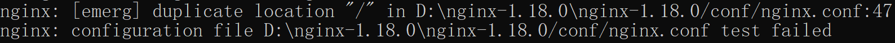

# Nginx

## 概念

[Nginx](http://nginx.org/) 是一个高性能的 HTTP 和反向代理服务器。其特点是占有内存少，并发能力强，能够同时处理大量的并发连接。

常见的应用场景有：

1. web 服务器

Nginx 可以作为 web 服务器，可以处理静态资源文件，如HTML、CSS、JavaScript、图片等。同时还支持 CGI 协议的动态语言，比如 perl、php、Python等。虽然 Nginx 不直接支持 Java，但可以作为反向代理服务器与 Tomcat 等 Java 应用服务器配合使用。

2. 反向代理服务器

Nginx 可以作为反向代理服务器，接收客户端请求并将其转发给后端的多台应用服务器，实现负载均衡、故障转移、动态增删应用服务器、数据传输的加密和身份认证等功能。

3. 负载均衡

Nginx 支持负载均衡，可以根据不同的负载均衡策略（包括轮询、IP哈希、权重轮询等多种策略），将来自客户端的请求分发到多台应用服务器上，实现请求的合理分配。

4. 动静分离

动静分离的目的是提高访问效率和扩展性，将静态资源和动态资源分开部署，通过Nginx的配置实现请求的分发，从而减轻后端应用服务器的压力。

5. 提供基本的安全防护

Nginx 可以通过限制客户端访问速率、拒绝恶意请求、设置访问控制、SSL加密等手段，增强 Web 应用程序的安全性，减少潜在攻击风险。

6. 缓存服务器

Nginx 可以将请求结果缓存在内存中或硬盘上，提高 Web 应用程序的性能。


## 反向代理和正向代理

1. 正向代理

正向代理是客户端与服务端之间的代理服务器。为了从目标服务器取得内容，客户端向代理服务器发送一个请求，并且指定目标服务器，之后代理向目标服务器转发请求，将获得的内容返回给客户端。正向代理的情况下，客户端必须要进行一些特殊的设置才能使用。正向代理隐藏了客户端的身份和位置信息，可以帮助客户端绕过防火墙等限制，访问被封锁的网站和资源。

正向代理需要客户端设置正向代理服务器的 ip:port或域名进行访问，由设置的服务器ip或者域名去访问内容并返回。

2. 反向代理

反向代理是指以代理服务器来接收客户端的请求，然后将请求转发给内部网络上的服务器，将从服务器上得到的结果返回给客户端，此时代理服务器对外表现为一个反向代理服务器。对于客户端来说，反向代理就相当于目标服务器，只需要将反向代理当作目标服务器一样发送请求就可以了，并且客户端不需要进行任何设置。反向代理可以实现负载均衡、缓存加速、安全过滤等功能，提高服务的稳定性和性能。

3. 异同

相同点：正向代理和反向代理所处的位置都是客户端和真实服务器之间，所做的事情也都是把客户端的请求转发给服务器，再把服务器的响应转发给客户端。

不同点：

- 正向代理是客户端的代理，服务器不知道真正的客户端是谁；反向代理是服务器的代理，客户端不知道真正的服务器是谁
- 正向代理一般是客户端架设的；反向代理一般是服务器架设的
- 正向代理主要是用来解决访问限制问题；反向代理则是提供负载均衡、安全防护等作用。二者都能提高访问速度

4. 举例

正向代理：【借钱】，同学从马云借钱，但是他俩之间毫无关系，结果当然是没有借到。经过一番打听，同学的老师王先生是马云的好朋友，于是同学请求王老师，让王老师帮忙向马云借钱，最终马云同意借钱给王老师，王老师把这笔钱转交给了同学。
反向代理：【拨打10086客服电话】，如果遇到困难需要拨打10086客服电话，可能一个地区的10086客服有几十个，但是我们不需要关心电话那头的人是谁。只需要拨通10086的总机号码，电话那头总有客服会回应。这里的10086总机号码就相当于反向代理，客户端不知道真正提供服务的人是谁。

## 安装

### Linux 安装

默认安装路径为：/usr/local/nginx
默认配置文件为：/usr/local/nginx/conf/nginx.conf

```sh
# 1. 依赖安装  pcre-8.45.tar.gz  openssl-1.1.1b.tag.gz  zlib-1.2.11.tag.gz
# 安装 PCRE 包：PCRE 作用是让 Nginx 支持 Rewrite 功能
# 安装 openssl、zlib：安装编译工具和库文件
yum install -y make zlib zlib-devel gcc-c++ libtool openssl openssl-devel pcre pcre-devel 

# 2. 准备源代码安装包  
nginx-1.18.0.tag.gz
# 3. 解压 
tar -zxvf nginx-1.18.0.tar.gz
4. 配置
./configure
5. 编译和安装
make && make install
```

## 命令

> Docker 容器启动的 Nginx，如果需要修改配置，可以进入到容器，直接修改配置，然后重启 Nginx，而不需要重新启动一个 Docker 容器。

```shell
cd /usr/local/nginx/sbin                    # 默认安装路径

nginx -v                                    # 查看版本
./nginx                 start nginx         # 启动
./nginx -s stop         nginx -s stop       # 关闭
./nginx -s reload       nginx -s reload     # 重载
./nginx -t              nginx -t            # 查看配置文件是否正确
```

## 配置说明

### proxy_pass

1. proxy_pass 代理 ip + port 后边有斜杆\ 或路径，新的路径是：proxy_pass + 访问路径除去lacation相同部分路径。
2. proxy_pass 代理 ip + port 后边啥都没有，新的路径：proxy_pass + location + 访问路径除去location相同路径。

1. proxy_pass 代理 ip + port 后边有斜杆\ 或路径，转发后地址：代理地址+访问URL目录部分去除location匹配目录。
2. proxy_pass 代理 ip + port 后边啥都没有，转发后地址：代理地址+访问URL目录部。

### location

location 指令用于匹配请求的 URL 路径，并指定相应的处理方式。


**语法规则：**

- = 表示精确匹配。用于不含正则表达式的 uri 前，要求请求字符串与 uri 严格匹配，如果匹配成功，就停止继续向下搜索并立即处理该请求。
- ~ 表示正则匹配（区分大小写）。
- ~* 表示正则匹配（不区分大小写）。
- ^~ 表示普通字符串匹配上以后不再进行正则匹配。用于不含正则表达式的 uri 前，要求 Nginx 服务器找到标识 uri 和请求字符串匹配度最高的 location 后，立即使用此location处理请求，而不再使用location块中的正则uri和请求字符串做匹配。
- / 通用匹配，任何请求都会匹配到。
- 普通前缀匹配，不加任何规则时，默认是大小写敏感，相当于加了 ~ 和 ^~。
- @ nginx内部跳转

需要注意的是，如果 uri 包含正则表达式，则必须要有 ~ 或者 ~* 标识。

**优先级：**

1. = 的优先级最高。一旦匹配成功，则不再查找其他 location 的匹配项。
2. ^~ 和普通前缀匹配。使用前缀匹配，不支持正则表达式，如果有多个 location 匹配成功的话，不会终止匹配过程，会匹配表达式最长的那个

    - 得到的最长的 location 为 ^~ 类型，则表示阻断正则表达式，不再匹配正则表达式
    - 得到的最长的 location 不是 ^~ 类型，继续匹配正则表达式，只要有一个正则成功，则使用这个正则的location，立即返回结果，并结束解析过程

    先找到匹配表达式最长的那个，如果存在相同的，则按照优先级 ^~  >  ~*  >  ~  > 普通前缀匹配 选择对应的 location。

3. / 任何没有匹配成功的，都会匹配这里处理。

```conf
# 访问 localhost:80/a/b/  返回777。
location ^~ /a/ {
    eturen 666 
}
location /a/b/ {
    returen 777 
}
location ~ /a/ {
    returen 888 
}
```

末尾带斜杠和不带斜杠的区别如下：

- 末尾带斜杠：当location指令的路径以斜杠结尾时，表示匹配以该路径开头的所有请求。这种方式通常用于匹配某个目录下的所有资源。例如，location /images/ 将匹配所有以 /images/ 开头的请求，包括子路径如/images/logo.png、/images/banner.jpg
- 末尾不带斜杠：当 location 指令的路径不以斜杠结尾时，表示精确匹配该路径的请求。这种方式通常用于精确匹配特定的路径。例如，location /images 将只匹配路径为 /images 的请求，不会匹配 /images/logo.png 等子路径。

需要注意的是，末尾带斜杠和不带斜杠的区别还与nginx的配置顺序有关。如果存在多个 location 指令匹配同一个请求，nginx 会按照配置文件中的顺序选择第一个匹配的 location 进行处理。

### root 和 alias

在 Nginx 配置中，alias 和 root 都用于指定静态文件目录的两个指令。区别在于如何处理 URI

1. root 指令定义文件在文件系统中的根路径，并将与请求 URI 的匹配部分组合起来构成实际的文件路径。root读取的是根目录，可以在 server 或 location 指令中使用。
2. alias 指令用于将请求映射到指定的路径，可以用于隐藏实际的文件路径。alias 只能在 location 指令中使用。

```conf
# root，例如：请求的 URI 是 /images/logo.png，并且 root 指令设置为 /var/www/html，则 Nginx 会在文件系统上寻找 /var/www/html/images/logo.png。如果请求的 URI 包含斜杠结尾，则 Nginx 会将其视为目录，而不是文件，例如，/images/ 将在 /var/www/html/images/ 目录下查找。

server {
    listen 80;
    server_name localhost;
    root /var/www/html;
}

# alias，例如：请求的 URI 是 /static/images/logo.png，并且 alias 指令设置为 /var/www/data/，则 Nginx 会在文件系统上寻找 /var/www/data/images/logo.png。
server {
    listen 80;
    server_name localhost;

    location /static/ {
        # 我们要注意：对于alias指定的文件夹，我们最好加上“/”。(强制要求)
        alias /var/www/data/;
    }
}
```

### 配置文件 nginx.conf


配置文件分为三部分：

1. 第一部分：全局块

从配置文件开始到 events 块之间的内容，主要会设置一些影响 nginx 服务器整体运行的配置指令，主要包括：

- 配置运行 Nginx 服务器的用户（组）
- 允许生成的 worker process 数
- 日志存放路径和类型
- 进程 pid 存放路径
- 一个 Nginx 进程打开的最多文件描述符数目

2. 第二部分：events 块

events 块，主要影响 Nginx 服务器与用户的网络连接，常用的设置包括：

- 每个 worker 进程允许的最大连接数
- 事件驱动模型的选择，可以是 epoll, kqueue, eventport, 或者 select
- 是否允许一个 worker 进程同时接受多个新连接
- 启用或禁用互斥锁定来接受新连接
- 设置互斥锁定的延迟时间

3. 第三部分：http 块

http 块，用于配置代理、缓存、日志定义等绝大多数功能和第三方模块的配置。


```conf
############ 该配置文件基于 nigx-1.24.0 的原配置文件进行注释修改的 ############

#user  nobody;          # 配置worker进程运行用户（和用户组），nobody也是一个Linux用户，一般用于启动程序，没有密码
worker_processes  1;    # 服务器并发处理服务的关键配置，不考虑硬件软件设备的制约，值越大，并发处理量越多；根据硬件调整，通常等于CPU数量或者2倍的CPU数量
# worker_cpu_affinity 01 10;            # 配置充分利用多核 cpu。该配置表示2核 cpu，开启2个进程，其中01表示启用第一个CPU内核，10表示启用第二个CPU内核


#error_log  logs/error.log;             # 配置全局错误日志及类型，[debug | info | notice | warn | error | crit]，默认是error
#error_log  logs/error.log  notice;
#error_log  logs/error.log  info;

#pid        logs/nginx.pid;             # 配置进程 pid 文件
#worker_rlimit_nofile 1024;             # 一个进程打开的最多文件描述符数目，理论值应该是最多打开文件数（系统的值ulimit -n）与Nginx进程数相除，但是Nginx分配请求并不均匀，所以建议与ulimit -n的值保持一致。

events {
    worker_connections  1024;           # 每个 worker 进程允许的最大连接数。
    #use epoll;                         # 设置事件驱动模型，use [ kqueue | rtsig | epoll | /dev/poll | select | poll ]; epoll模型是Linux 2.6以上版本内核中的高性能网络I/O模型，如果跑在FreeBSD上面，就用kqueue模型。
    #multi_accept on;                   # 允许一个 worker 进程同时接受多个新连接，可以提高连接的响应速度。
    #accept_mutex on;                   # 启用或禁用互斥锁定来接受新连接。在高并发情况下，启用互斥锁定可以避免惊群现象。
    #accept_mutex_delay 500ms;          # 设置互斥锁定的延迟时间。
}

# http 块包括 http 全局块、server 块
http {
    include       mime.types;                   # 文件扩展名与文件类型映射表
    default_type  application/octet-stream;     # 默认文件类型
    charset utf-8;                              # 默认编码

    #log_format  main  '$remote_addr - $remote_user [$time_local] "$request" '
    #                  '$status $body_bytes_sent "$http_referer" '
    #                  '"$http_user_agent" "$http_x_forwarded_for"';

    #access_log  logs/access.log  main;

    sendfile        on;                     # 开启高效文件传输模式，Nginx 将使用操作系统提供的 sendfile 系统调用来直接在内核空间中传输文件，而不需要将文件内容从内核空间拷贝到用户空间再写入网络 socket。对于普通应用设为on，如果用来进行下载等应用磁盘IO重负载应用，可设置为off，以平衡磁盘与网络I/O处理速度，降低系统的负载。注意：如果图片显示不正常把这个改成off。
    
    # TCP 的配置指令，用于控制 Nginx 与客户端之间的 TCP 连接行为。
    #tcp_nopush     on;                     # 启用时，Nginx 会尽可能地发送 TCP 数据包，即使数据包的大小未达到 TCP 的最大传输单元 (MTU)。这样可以减少延迟，并提高传输效率。通常在处理小文件或实时通信时使用。
    #tcp_nodelay    on;                     # 启用时，Nginx 禁用 Nagle 算法，即无论数据包的大小如何，都会立即发送。这可以减少数据包的延迟，但也可能增加网络拥塞。通常在对延迟要求较高的应用中使用，例如实时音视频传输。

    autoindex       on;                     # 开启目录列表访问，合适下载服务器，默认关闭。
    
    #server_names_hash_bucket_size 128;     # 服务器名的 hash 哈希桶的大小


    #keepalive_timeout  0;
    keepalive_timeout  65;                  # 长连接超时时间，单位是秒

    # gzip 模块设置
    gzip  on;                               # 开启 gzip 压缩输出
    gzip_http_version 1.0;                  # 压缩版本，默认1.1，前端如果是 squid2.5 请使用1.0
    gzip_disable 'MSIE[1-6].';              # IE版本1-6不支持gzip压缩，关闭
    gzip_types text/css text/javascript application/javascript image/jpeg image/png image/gif;      # 需要压缩的文件格式， text/html 默认会压缩，不用添加
    gzip_buffers 4 8k;                      # 设置压缩缓冲区大小，此处设置为4个8K内存作为压缩结果流缓存
    gzip_min_length 1k;                     # 压缩文件最小大小
    gzip_comp_level 4;                      # 压缩等级1-9
    gzip_vary on;                           # 增加响应头'Vary: Accept-Encoding'，告知客户端能否缓存
    gzip_proxied off;                       # 是否在向后端代理服务器请求的过程中启用 Gzip 压缩

    #FastCGI 的配置指令，用于控制与 FastCGI 进程通信的超时时间以及缓冲区大小。为了改善网站的性能：减少资源占用，提高访问速度。
    fastcgi_connect_timeout 800;            # 设置与 FastCGI 进程建立连接的超时时间，单位为秒。如果连接建立时间超过该值，则认为连接超时。默认为300s，
    fastcgi_send_timeout 800;               # 设置向 FastCGI 进程发送请求的超时时间，单位为秒。如果在该时间内无法完成请求的发送，则认为发送超时。默认为300s，
    fastcgi_read_timeout 800;               # 设置从 FastCGI 进程读取响应的超时时间，单位为秒。如果在该时间内无法读取到响应数据，则认为读取超时。默认为300s，
    fastcgi_buffer_size 64k;                # 设置用于存储从 FastCGI 进程接收到的响应数据的缓冲区大小。这个缓冲区会在接收到响应后进行缓存，然后再传输给客户端。
    fastcgi_buffers 4 64k;                  # 设置用于存储从 FastCGI 进程接收到的响应数据的缓冲区数量和大小。例如，"fastcgi_buffers 4 64k;" 表示使用 4 个 64KB 大小的缓冲区来存储响应数据。
    fastcgi_busy_buffers_size 128k;         # 设置用于存储正在被处理的 FastCGI 响应数据的缓冲区大小。当响应数据超过该大小时，将使用磁盘临时文件进行存储。
    fastcgi_temp_file_write_size 128k;      # 设置临时文件的写入大小，即超过该大小的响应数据将被写入磁盘临时文件中。


    #limit_zone crawler $binary_remote_addr 10m;     # 开启限制 IP 连接数，即特定 IP 地址的请求频率，防止爬虫等恶意行为。"$binary_remote_addr" 是一个变量，表示客户端的 IP 地址，"10m" 则表示该共享内存区域的大小为 10MB。

    client_max_body_size 20M;              # 上传文件大小限制。当超过该限制时，Nginx 将返回 413（Request Entity Too Large）错误状态码给客户端。将 size 设置为 0 将禁止检查客户端请求正文的大小。
    client_header_buffer_size 1k;          # 设置读取客户端请求头的缓冲区大小。先处理请求的request_line，之后才是request_header。如果请求行或请求头字段无法容纳进缓冲区，就会分配由 large_client_header_buffers 指令配置的更大缓冲区。
    large_client_header_buffers 4 8k;      # 设置用于读取大型客户端请求头的缓冲区最大数量和大小。请求行不能超过一个缓冲区的大小，否则会向客户端返回 414（Request-URI 太大）错误。请求标头字段也不能超过一个缓冲区的大小，否则会向客户端返回 400（错误请求）错误。
   

    # server块，配置虚拟主机的相关参数
    # 每个 http 块可以包括多个 server 块，而每个 server 块就相当于一个虚拟主机。
    # 每个 server 块也分为全局 server 块，以及可以同时包含多个 locaton 块。
    # location 块的主要作用是基于 Nginx 服务器接收到的请求字符串（例如 server_name/uri-string），对虚拟主机名称（也可以是 IP 别名）之外的字符串（例如 前面的 /uri-string）进行匹配，对特定的请求进行处理。地址定向、数据缓存和应答控制等功能，还有许多第三方模块的配置也在这里进行。
    server {
        listen       80;                    # 配置监听端口，默认为80
        server_name  localhost;             # 配置域名或ip
        charset utf-8;                      # 配置字符集

        #access_log  logs/host.access.log  main;    # 配置本虚拟主机的访问日志

        location / {
            root   html;                        # root是配置服务器的默认网站根目录位置，默认为Nginx安装主目录下的html目录
            index  index.html index.htm;        # 配置首页文件的名称
            try_files $uri $uri/ /index.html;   # 检测文件存在性重定向到首页目录，防止404。按照指定的顺序查找文件，并使用第一个找到的文件进行请求处理，last表示匹配不到就内部直接匹配最后一个。
        }
        location @router {
            rewrite ^.*$ /index.html break;
        }

        location /api/ {
            proxy_pass http://127.0.0.1:88;             # 反向代理的地址
            proxy_redirect off;                         # 是否开启重定向
            # proxy_set_header field value; 重新定义或者添加发往后端服务器的请求头。
            proxy_set_header X-Real-IP $remote_addr;    
            proxy_set_header X-Forwarded-For $proxy_add_x_forwarded_for;
            proxy_set_header Host $host;
            proxy_set_header HTTP_X_FORWARDED_FOR $remote_addr;
            proxy_set_header X-Forwarded-Proto $scheme;

            proxy_connect_timeout 60000;           # 与后端服务器连接超时时间（代理连接超时）
            proxy_send_timeout 60000;              # 后端服务器数据回传时间（代理发送超时）
            proxy_read_timeout 60000;              # 连接成功后，后端服务器响应时间（代理接收超时）
            
            client_max_body_size 10m;           # 允许客户端请求的最大单文件字节数
            client_body_buffer_size 128k;       # 缓冲区代理缓冲用户端请求的最大字节数，
            proxy_buffer_size 4k;               # 设置代理服务器（Nginx）保存用户头信息的缓冲区大小
            proxy_buffers 4 32k;                # proxy_buffers缓冲区，网页平均在32k以下的设置
            proxy_busy_buffers_size 64k;        # 高负荷下缓冲大小（proxy_buffers*2）
            proxy_temp_file_write_size 64k;     # 设定缓存文件夹大小
        }

        #error_page  404              /404.html;                        # 配置404错误页面

        # redirect server error pages to the static page /50x.html     
        error_page   500 502 503 504  /50x.html;                        # 配置50x错误页面
        location = /50x.html {
            root   html;
        }
    }

    # HTTPS server
    #
    #server {
    #    listen       443 ssl;
    #    server_name  localhost;

    #    ssl_certificate      cert.pem;
    #    ssl_certificate_key  cert.key;

    #    ssl_session_cache    shared:SSL:1m;
    #    ssl_session_timeout  5m;

    #    ssl_ciphers  HIGH:!aNULL:!MD5;
    #    ssl_prefer_server_ciphers  on;

    #    location / {
    #        root   html;
    #        index  index.html index.htm;
    #    }
    #}

}
```

### stream 模块概要

> Nignx 可以作为四层（传输层）和七层（应用层）代理来进行流量转发和负载均衡。这两种代理方式有不同的工作原理和适用场景：
>
> 四层代理：
>
> - 四层代理是在 OSI 模型的传输层（第四层）进行操作的代理，主要基于 IP 地址、端口号等信息来进行转发。
> - Nginx 作为四层代理可以实现 TCP 和 UDP 数据包的转发和负载均衡，但无法解析 HTTP 协议的内容。
> - 四层代理适用于直接将数据包转发到后端服务器，适合处理对传输层信息有要求的场景，如负载均衡、TCP 代理等。
>
> 七层代理：
>
> - 七层代理是在 OSI 模型的应用层（第七层）进行操作的代理，可以解析 HTTP/HTTPS 协议的内容，实现更精细的请求转发控制。
> - Nginx 作为七层代理可以实现 HTTP 请求的转发、反向代理、缓存控制、SSL 终端等功能。
> - 七层代理适用于需要对 HTTP 请求进行深度处理和分发的场景，如反向代理、内容缓存、请求转发等。

stream 模块是用于处理 TCP 和 UDP 协议的四层数据，它允许 NGINX 作为**反向代理**或**负载均衡器**，将 TCP/UDP 请求转发到后端服务器。相对于 HTTP，TCP/UDP 流量的负载均衡和处理更接近底层。

ngx_stream_core_module 模块由1.9.0版提供。 默认情况下，没有构建此模块。 必须使用-with stream配置参数启用。 也就是说，必须在使用./configure --with-stream 编译时添加流模块。

需要注意的是，在 stream 模块中，不能使用 location 指令，它只能使用 server 指令。每个 server 块都代表一个独立的服务端口，可以在其中定义代理规则，将请求转发到不同的后端服务器。

原理：

NGINX stream 模块通过拦截 TCP 和 UDP 数据包，进行数据包分析和处理，实现四层的代理和负载均衡功能。在配置文件中，我们可以定义一组 upstream 服务器，然后通过 stream 模块将来自客户端的连接请求转发给这些 upstream 服务器，从而实现负载均衡和高可用性。


```conf
# stream 模块和 http 模块是并列级别
stream {

    log_format basic '$remote_addr [$time_local] '
                 '$protocol $status $bytes_sent $bytes_received '
                 '$session_time';
    access_log /var/log/nginx/stream-access.log basic buffer=32k;

    # 负载均衡配置（TCP长连接配置），端口号在前面的端口号前要进行偏置1000
    upstream nacos {
        server 192.168.2.188:9848;      
    }

    server {
        listen 13345;
        proxy_pass nacos;       # 定义后端服务器群组名
    }

    # 为了让这个配置文件简单一些，将配置stream放入到/etc/nginx/conf.d，并以.stream做后缀名。
    # 需要为每个端口创建一个.stream做后缀名的配置文件
    include /etc/nginx/conf.d/*.stream;
}
```


### 负载均衡

nginx 分配服务器的负载均衡策略包括：

1. 轮询（默认）， 每个请求按时间顺序逐一分配到不同的后端服务器，如果后端服务器 down 掉，能自动剔除，如果在恢复，也会添加进来。
2. weight 权重，默认为 1，被分配的客户端越多，权重不能设置为0。
3. ip_hash，每个请求按访问 ip 的 hash 结果分配，这样每个访客固定访问一个后端服务器。
4. fair（第三方），按后端服务器的响应时间来分配请求，响应时间短的优先分配。

使用 upstream 配置实现负载均衡，需要注意：

- 只能用于 http 上下文
- 各 server 只能直接使用 IP 或主机名，不要加协议

```conf
# 1. 默认
upstream myserver {
    server 127.0.0.1:8080;
    server 127.0.0.1:8081;
}
# 2. weight 权重
upstream weight {
    server localhost:8080 weight=10;
    server localhost:8099 weight=1;
}
# 3. ip_hash
upstream iphash {
    ip_hash;
    server localhost:8080;
    server localhost:8099;
}
# 4. fair
upstream fair {
    server localhost:8080;
    server localhost:8099;
    fair;
}
```

### 动静分离

> Nginx 动静分离简单来说就是把动态跟静态请求分开，不能理解成只是单纯的把动态页面和静态页面物理分离。严格意义上说应该是动态请求跟静态请求分开，可以理解成使用 Nginx 处理静态页面，Tomcat 处理动态页面。
>
> 动静分离从目前实现角度来讲大致分为两种，
> - 一种是纯粹把静态文件独立成单独的域名，放在独立的服务器上，也是目前主流推崇的方案；
> - 另外一种方法就是动态跟静态文件混合在一起发布，通过 nginx 来分开。

在Nginx中，动静分离是指将动态资源和静态资源分开处理，以提高网站性能和并发访问能力。

通常情况下，静态资源（如HTML、CSS、JavaScript、图片等）可以直接由Nginx服务器处理和响应，而动态资源（如PHP、Java等后端语言生成的页面）则可以交由后端服务器（如PHP-FPM、Tomcat等）处理。通过这种动静分离的方式，可以降低后端服务器的负载，提高网站的并发访问能力。

可以使用 autoindex on 显示目录下的所有文件。

```shell
# 实现动静分离，访问静态资源，root为绝对路径。
location /code/ {
    root D:/;
    autoindex on;                   # 开启目录列表访问，合适下载服务器，默认关闭。
    autoindex_exact_size off;       # 关闭详细文件大小统计，让文件大小显示MB，GB单位，默认为b；
}
```

### 配置 SSL

> ssl(Secure Sockets Layer)

```conf
# 1. 先检查是否安装Nginx SSL模块，如果安装了，跳过2、3步；出现 configure arguments: –with-http_ssl_module, 则已安装
nginx -V
# 2. 安装基础支持包
yum -y install openssl openssl-devel
# 3. 安装ssl模块
cd /home/nginx-1.10.2
../configure --prefix=/usr/local/nginx --with-http_ssl_module
make  # 编译
make install
# 4. 配置服务器
新建cert文件夹，将pem与key文件拷贝进来

server {
   listen 443;                              # 监听443端口（https默认端口）,
   server_name www.xxx.com;                 # 绑定证书的域名
   ssl on;
   ssl_certificate xxx.pem;                 # pem文件的路径
   ssl_certificate_key xxx.key;             # key文件的路径
   ssl_session_timeout 5m;                  # 缓存有效期
   ssl_protocols TLSv1 TLSv1.1 TLSv1.2;     # 协议配置
   ssl_ciphers ECDHE-RSA-AES128-GCM-SHA256:HIGH:!aNULL:!MD5:!RC4:!DHE;                          # 安全链接可选的加密协议
   ssl_ciphers ECDHE-RSA-AES128-GCM-SHA256:ECDHE:ECDH:AES:HIGH:!NULL:!aNULL:!MD5:!ADH:!RC4;     # 阿里云
   ssl_prefer_server_ciphers on;
   location / {

   }
}
```
### 日志格式

默认变量格式：log_format combined '$remote_addr - $remote_user [$time_local] "$request" $status $body_bytes_sent "$http_referer" "$http_user_agent"';

- $remote_addr变量：记录了客户端的 IP 地址（普通情况下）。
- $remote_user变量：当 nginx 开启了用户认证功能后，此变量记录了客户端使用了哪个用户进行了认证。
- $time_local变量：记录了当前日志条目的时间。
- $request变量：记录了当前 http 请求的方法、url 和 http 协议版本。
- $status变量：记录了当前 http 请求的响应状态，即响应的状态码，比如200、404等响应码，都记录在此变量中。
- $body_bytes_sent变量：记录了 nginx 响应客户端请求时，发送到客户端的字节数，不包含响应头的大小。
- $http_referer变量：记录了当前请求是从哪个页面过来的，比如你点了 A 页面中的超链接才产生了这个请求，那么此变量中就记录了 A 页面的 url。
- $http_user_agent变量：记录了客户端的软件信息，比如，浏览器的名称和版本号。

其他变量：

- $http_host 请求地址，即浏览器中你输入的地址（IP或域名）
- $request_time：处理请求的总时间,包含了用户数据接收时间
- $upstream_response_time：建立连接和从上游服务器接收响应主体的最后一个字节之间的时间
- $upstream_connect_time：花费在与上游服务器建立连接上的时间
- $upstream_header_time：建立连接和从上游服务器接收响应头的第一个字节之间的时间

修改后的自定义格式：

```log
log_format  main  '$remote_addr - $remote_user [$time_local] "$request" '

    '$status $body_bytes_sent "$http_referer" '

    '"$http_user_agent" "$http_x_forwarded_for" '

    '"$http_host" "$request_time" "$upstream_response_time" "$upstream_connect_time" "$upstream_header_time"';
```


### 配置实例

实例一：使用 nginx 反向代理，访问 www.123.com 直接跳转到 127.0.0.1:8080

```conf
# 1. 启动  127.0.0.1:8080 服务，比如启动一个 tomcat
# 2. 修改 host 文件，将 www.123.com 映射到 127.0.0.1
# 3. 增加 Nginx 配置

server {
    listen          80;
    server_name     www.123.com;

    location / {
        proxy_pass  http://127.0.0.1:8080;
        index  index.html index.htm index.jsp;
    }
}
```
实例二：使用 nginx 反向代理，根据访问的路径跳转到不同端口的服务中

- 访问 http://127.0.0.1:9001/edu/ 直接跳转到 127.0.0.1:8081
- 访问 http://127.0.0.1:9001/vod/ 直接跳转到 127.0.0.1:8082

```conf
# 1. 准备两个 tomcat，一个 8001 端口，一个 8002 端口，并准备好测试的页面
# 2. 增加 nginx 配置

server {
    listen          9001;
    server_name     127.0.0.1;

    location /edu/ {
        proxy_pass  http://127.0.0.1:8081;
    }
    location /vod/ {
        proxy_pass  http://127.0.0.1:8082;
    }
}
```
## 工作原理

1. master-workers 的机制的好处 

首先，对于每个 worker 进程来说，独立的进程，不需要加锁，所以省掉了锁带来的开销，同时在编程以及问题查找时，也会方便很多。其次，采用独立的进程，可以让互相之间不会影响，一个进程退出后，其它进程还在工作，服务不会中断，master 进程则很快启动新的 worker 进程。当然，worker 进程的异常退出，肯定是程序有 bug 了，异常退出，会导致当前 worker 上的所有请求失败，不过不会影响到所有请求，所以降低了风险。

2. 需要设置多少个 worker

Nginx 同 redis 类似都采用了 io 多路复用机制，每个 worker 都是一个独立的进程，但每个进程里只有一个主线程，通过异步非阻塞的方式来处理请求， 即使是千上万个请求也不在话下。每个 worker 的线程可以把一个 cpu 的性能发挥到极致。所以 worker 数和服务器的 cpu 数相等是最为适宜的。设少了会浪费 cpu，设多了会造成 cpu 频繁切换上下文带来的损耗。

4个worker进程分别绑定到了4个不同的CPU核心上
worker_processes 4
worker_cpu_affinity 0001 0010 0100 1000

4个worker进程绑定到了8个不同的CPU核心中的其中4个
worker_processes 4
worker_cpu_affinity 0000001 00000010 00000100 00001000

3. 连接数 worker_connection

这个值是表示每个 worker 进程所能建立连接的最大值，所以，一个 nginx 能建立的最大连接数，应该是 worker_connections * worker_processes。当然，这里说的是最大连接数，对于 HTTP 请求本地资源来说，能够支持的最大并发数量是 worker_connections * worker_processes，如果是支持 http1.1 的浏览器每次访问要占两个连接，所以普通的静态访问最大并发数是： worker_connections * worker_processes /2，而如果是 HTTP 作为反向代理来说，最大并发数量应该是 worker_connections * worker_processes/4。因为作为反向代理服务器，每个并发会建立与客户端的连接和与后端服务的连接，会占用两个连接。


## 搭建高可用集群

> Keepalived+Nginx 高可用集群，有两种模式：主从模式、双主模式。
>
> 需要使用 keepalived 实现高可用、用来配置虚拟 ip，设置心跳检测解决静态路由的单点故障问题


## 问题汇总

### 1. 配置多个 location，报错：重复配置 location，路径指定相同，

解决办法：只保留一个 location 或者修改其中一个 location 指定的路径



### 2. 无效的 PID：nginx 未启动

> 

### 3. location 中每个 url 之后需要添加英文分号；不管位置在哪，和 json 不太一样，json 最后一个不需要分号
### 4. 使用正则表达式之后，proxy_pass 中 url 不能追加
### 5. nginx: [emerg] CreateDirectory() "D:\nginx-1.18.0\nginx-1.18.0/temp/client_body_temp" failed (3: The system cannot find the path specified)

nginx 问题，需要重新安装或解压

### 6. nginx: [emerg] "proxy_pass" cannot have URI part in location given by regular expression, or inside named location, or inside "if" statement, or inside "limit_except" block in D:\nginx-1.18.0\nginx-1.18.0/conf/nginx.conf:95

nginx: [emerg] "proxy_pass"不能有 URI 部分在正则表达式给出的位置中，或在 named location 中，或在"if"语句中，或在"limit_except"块中

### 7. js 文件 net::ERR_ABORTED 503

location / {
    proxy_set_header Host $host;
    proxy_set_header X-Real-IP $remote_addr;
    proxy_pass http://1.1.1.1:81/;
    limit_req  zone=one burst=10 nodelay;   
}

limit_req 参数在 Nginx 中是请求次数限制，上面配置的是一个周期最多10次请求，但是这个页面上请求的 js 文件远远超过10个，所以出现了服务不可用错误

### 8. 504超时，默认1分钟，需要将proxy_read_timeout 改大点

proxy_connect_timeout 60000;
proxy_read_timeout 60000;
proxy_send_timeout 60000;

9. 413 Request Entity Too Large

nginx 配置文件中的client_max_body_size是控制请求body的大小限制的参数，默认为1MB，如果超过这个数值，则会直接返回413状态码

http {
    client_max_body_size 20M;
}  

## Nginx 集成 swagger

```shell
location ~* ^(/v2|/webjars|/swagger-resources|/swagger-ui.html){
       proxy_set_header Host $host;
       proxy_set_header  X-Real-IP  $remote_addr;
       proxy_set_header X-Forwarded-For $remote_addr;
       #proxy_set_header Host $host:$server_port;
       proxy_set_header X-Forwarded-Proto $scheme;
       proxy_set_header X-Forwarded-Port $server_port;
       proxy_pass http://10.18.66.66:8600; # 后端服务地址
}
```