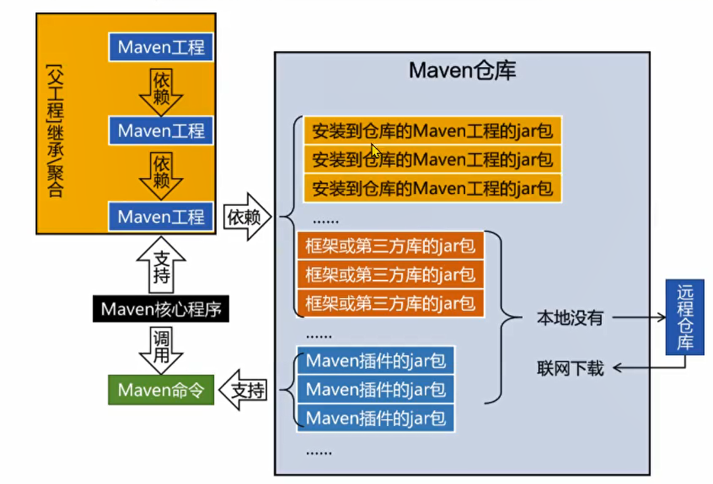
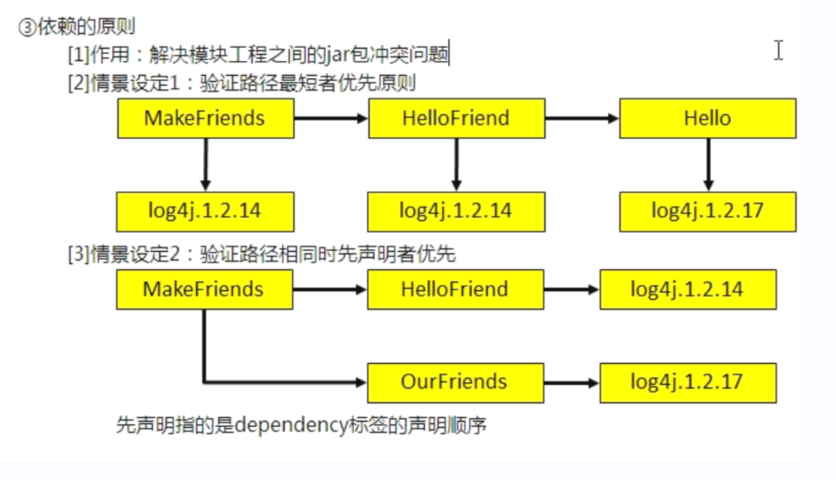

# Maven

[Maven 官网： https://maven.apache.org/](https://maven.apache.org/)


## 1. 概念

> bom全称是bill of materials，即物料清单。
> pom里面是具体的依赖项，bom是对依赖项的管理。bom里面声明的gav不会引入到项目依赖jar包里面，pom中声明的gav会被引入到项目依赖jar包里面，有了bom，在bom声明时候可以省去版本号的声明。

项目构建和依赖管理工具。

**坐标**

- groupId：公司或组织Id
- artifactId：一个项目或者是项目中的一个模块Id
- version：版本号，比如 SNAPSHOT 表示快照版本，RELEASE 表示正式版本

**工作机制**



## 1. 常用命令

```bash
# 忽略测试进行打包，测试代码不会影响项目发布，但是会影响项目打包
mvn clear package -Dmaven.test.skip=true
# 命令行下载jar包
mvn dependency:get --settings /usr/local/fengpin-soft/maven/apache-maven-3.6.3/conf/settings.xml -DgroupId=com.fengpin -DartifactId=fp-security-starter -Dversion=1.0.0
mvn dependency:get -DremoteRepositories=http://xxx/repository/public/ -DgroupId=com.xx -DartifactId=xx-xx -Dversion=1.0.0-SNAPSHOT
# 指定setting
mvn clean package --settings /xxx/conf/settings.xml
# 安装时，指定本地仓库位置
mvn clean install -Dmaven.repo.local=/home/xxx/
# 查看依赖树
mvn -X dependency:tree>tree.txt

# 生成当前项目的有效 POM 文件
mvn help:effective-pom
# 查看插件详细配置信息
mvn help:describe -Dplugin=org.apache.maven.plugins:maven-resources-plugin -Ddetail
```

## 2. 生命周期

生命周期（Lifecycle）是 Maven 构建过程的整体组织结构。Maven 定义了三个默认的生命周期：clean（清理）、default（默认）和site（站点）。每个生命周期由一系列阶段（phase）组成。

- clean：用于清理项目。
- default/build：用于构建项目。
- site：用于生成项目站点文档。

阶段（Phase）是生命周期中的一个有序步骤，代表了 Maven 执行构建过程的不同阶段。

**clean**

|   阶段   |                         描述                         |
| :------: | :--------------------------------------------------: |
| pre-clean |        在清理之前执行的任务        |
| clean  |                清理生成的输出文件                |
| post-clean  |                在清理之后前执行的任务                |

**default**

|   阶段   |   处理   |                         描述                         |
| :------: | :------: | :--------------------------------------------------: |
| validate | 验证项目 |        验证项目是否正确且所有必须信息是可用的        |
| compile  | 执行编译 |                源代码编译在此阶段完成                |
|   test   |   测试   |     使用适当的单元测试框架（例如 JUnit）运行测试     |
| package  |   打包   |      创建 jar/war 包如在 pom.xml 中定义提及的包      |
|  verify  |   检查   |       对集成测试的结果进行检查，以保证质量达标       |
| install  |   安装   |      安装打包的项目到本地仓库，以供其他项目使用      |
|  deploy  |   部署   | 将安装包上传至远程仓库中，以共享给其他开发人员和工程 |

除了这些阶段之外，default 生命周期还包含一些其他阶段，以下是完整的 default 生命周期阶段列表：

- validate：验证项目是否正确且所有必需的信息都可用。
- initialize：初始化构建环境，比如设置属性或创建目录结构。
- generate-sources：生成源代码。
- process-sources：处理源代码，如编译等。
- generate-resources：生成资源文件。
- process-resources：处理资源文件，如复制到输出目录等。
- compile：编译源代码。
- process-classes：处理编译后的类文件，如生成额外的文件。
- generate-test-sources：生成测试源代码。
- process-test-sources：处理测试源代码，如编译等。
- generate-test-resources：生成测试资源文件。
- process-test-resources：处理测试资源文件，如复制到输出目录等。
- test-compile：编译测试源代码。
- process-test-classes：处理测试编译后的类文件，如生成额外的文件。
- test：运行测试。
- prepare-package：在打包之前执行的任务钩子。
- package：打包编译后的代码成可发布的格式，如 JAR。
- pre-integration-test：在集成测试之前执行的任务钩子。
- integration-test：运行集成测试。
- post-integration-test：在集成测试之后执行的任务钩子。
- verify：验证包是否有效且符合质量标准。
- install：将包安装到本地仓库，以供其他项目使用。
- deploy：将包部署到远程仓库，以供其他开发人员和项目使用。

**site**

|   阶段   |                         描述                         |
| :------: | :--------------------------------------------------: |
| pre-site |        在生成站点之前执行的任务        |
| site  |                生成项目站点文档                |
| post-site   |     在生成站点之后执行的任务     |
| site-deploy  |      将生成的站点文档部署到远程服务器      |


目标（Goal）是 Maven 构建过程中执行的具体任务。每个阶段都会绑定到一个或多个目标上。Maven 提供了许多内置的目标用于执行各种操作，比如编译源代码、运行单元测试、打包项目等。


Maven通过lifecycle（生命周期）、phase（阶段）和goal（最小任务单元）来提供标准的构建流程。lifecycle、phase和goal的关系：

- lifecycle相当于Java的package，它包含一个或多个phase；
- phase相当于Java的class，它包含一个或多个goal；
- goal相当于class的method，它其实才是真正干活的。

**通常使用 mvn 这个命令时，后边的参数是阶段 phase，Maven自动根据生命周期运行到指定的phase。命令: mvn [phase] [phase]**

**IntelliJ IDEA 中显示的 Lifecycle 和 Maven 定义的生命周期、阶段概念不一致**

在 IntelliJ IDEA 中，Maven 的生命周期中包括了 clean 和其他阶段（phase）是因为 IntelliJ IDEA 将 Maven 的生命周期视为一个整体，以方便用户进行构建和管理项目，方便用户执行生命周期中的各个阶段，而不需要手动输入命令。

IntelliJ IDEA 使用 Maven 插件来解析和执行 Maven 构建，它会根据 Maven 项目的配置文件（例如 pom.xml）中声明的生命周期阶段和插件来显示和执行阶段。因此，在 IntelliJ IDEA 的 Maven Lifecycle 窗口中，您将看到包括 clean、validate、compile、test、package、verify、install 和 deploy 在内的所有阶段。

虽然在 Maven 的概念中，clean、validate、compile、test、package、verify、install 和 deploy 都属于不同的阶段，但在 IntelliJ IDEA 中，它们被统一显示在 Maven Lifecycle 窗口中，以便于用户进行操作和管理。

**IntelliJ IDEA 中执行 mvn pre-clean 报错**

在 Maven 命令行中，mvn clean中的clean是指 Maven 生命周期中的一个阶段。具体来说，这个阶段对应的是 clean 生命周期中的 clean 阶段。

在 IntelliJ IDEA 中无法执行 mvn pre-clean 命令，这是因为 pre-clean 不是一个独立的阶段，而是 clean 生命周期中的一个阶段。在 Maven 的生命周期中，只有一些特定的阶段可以直接通过命令行执行。

pre-clean 是一个生命周期（Lifecycle）中的钩子（Hook），它表示在执行 clean 阶段之前需要执行的任务。这些钩子任务通常是由 Maven 插件定义的，并且会在相应的生命周期阶段之前执行。但是，您不能直接通过命令行来执行这些钩子任务。

在 IntelliJ IDEA 中，您可以通过配置 pom.xml 文件中的插件来定义和执行自定义的钩子任务。例如，您可以使用 Maven 插件来在 clean 阶段之前执行一些额外的清理操作。请注意，具体的配置和使用方法会根据插件的不同而有所差异。

## 3. pom.xml 配置说明

POM（Project Object Model）项目对象模型。

默认目录结构：

```tree
project
└─src
   ├─main
   │  ├─java
   │  │  └─com
   │  │      └─fengpin
   │  └─resources
   └─test
      ├─java
      │  └─com
      │      └─fengpin
      └─resources
```

### 3.1 依赖范围、依赖传递

**作用**

1. 使用 scope 来指定当前包的依赖范围和依赖的传递性。常见的可选值有：compile、provided、runtime、test、system、import 等。
2. optional 是 maven 依赖 jar 时的一个选项，表示该依赖是可选的，不会被依赖传递。

**说明**

- compile 为默认的依赖有效范围。
- provided 在开发过程中需要用到的 jar 包，比如 servlet-api.jar 。而这个范围的 jar 包之所以不参与部署，就是避免和服务器上已有的同类 jar 包冲突。 
- test，表示依赖项目仅仅参与测试相关的工作，包括测试代码的编译，执行。
- runtime，专门用于编译时不需要，但是运行时需要的 jar 包。
- system，被依赖项不会从 maven 仓库下载，而是从本地文件系统拿。需要添加 systemPath 的属性来定义路径。
- import，打包类型必须是 pom，且必须放在 <dependencyManagement> 中。 

|  作用域  | 对主程序是否有效 | 对测试程序是否有效 | 是否参与打包部署 | 是否传递 |      举例       |
| :------: | :--------------: | :----------------: | :--------------: | :------: | :-------------: |
| compile  |        √         |         √          |        √         |    √     |   spring-core   |
| provided |        √         |         √          |        ×         |    ×     | servlet-api.jar |
|   test   |        ×         |         √          |        ×         |    ×     |      JUnit      |
| runtime  |        ×         |         √          |        √         |    √     |      jdbc       |
|  system  |        √         |         √          |        ×         |    √     |                 |

### 3.2 依赖原则（传递依赖的规则）



1. 路径最短者优先
2. 路径相同时先声明者优先

举例：在 A 依赖 B，B 依赖 C 的前提下，C 是否能够传递到 A，取决于 B 依赖 C 时使用的依赖范围。

- B 依赖 C 时，使用 compile 范围，则可以传递
- B 依赖 C 时，使用 test 或 privided 范围，则不能传递

### 3.3 依赖排除

使用 exclusions 标签配置依赖的排除。

### 3.4 继承

作用：在父工程中统一管理项目的依赖信息，具体来说就是管理依赖信息的版本。

```xml
<parent>
    <groupId>com.fengpin</groupId>
    <artifactId>fp-dependencies</artifactId>
    <version>${revision}</version>
    <!--
        <relativePath> 元素来指定父模块和子模块之间的相对路径。

        当您在一个多模块项目中使用 Maven 时，通常会有一个父模块和多个子模块。父模块的 pom.xml 文件通常用于定义整个项目的共享配置和依赖项，而子模块的 pom.xml 文件则包含特定于各自模块的配置和依赖项。

        当子模块的 pom.xml 中包含 <parent> 元素来引用父模块时，Maven 将默认从父模块所在的目录中查找父模块的 pom.xml 文件。但是，如果父模块的 pom.xml 文件不在默认位置（即与子模块位于同一目录），则需要使用 <relativePath> 元素来指定父模块的相对路径。
    -->
    <relativePath>../fp-dependencies</relativePath>
</parent>
```

### 3.5 超级 POM、有效 POM

Super POM 是 Maven 的默认 POM。除非明确设置，否则所有 POM 都扩展 Super POM。就好比一个 Java 类默认继承了 Object 类。

effective POM，在 POM 的继承关系中，子 POM 可以覆盖父 POM中的配置，如果子 POM 没有覆盖，那么父 POM 中的配置将会被继承。按照这个规则，继承关系中的所有 POM 叠加到一起，就得到了一个最终生效的 POM。显然 Maven 实际运行过程中，执行构建操作就是按照这个最终生效的 POM 来运行的。这个最终的 POM 就是有效 POM。

查看有效 POM 命令： mvn help:effective-pom

### 3.6 POM 配置文件解读

**变量（属性）引用的几种访问方式**

1. 使用 <properties> 自定义的属性；
2. 使用系统属性，也就是 Java 程序中 System.getProperties() 的所有输出结果；
3. 使用系统环境变量，需要加个前缀 env，比如 ${env.java_home}、${env.path}
4. 使用 project 属性，需要加个前缀 project，比如 ${project.artifactId}、${project.parent.artifactId}、${project.modules[0]}
5. 使用 settings 全局配置，需要加个前缀 settings，比如 ${settings.localRepository}

用途：

- 在 POM 文件中引入属性
- 资源过滤功能：在非 Maven 属性文件中引用属性，由 Maven 在处理资源时，将引入属性的表达式替换成属性值


```xml
<?xml version="1.0" encoding="UTF-8"?>
<!-- project 标签：根标签，表示对当前工程进行配置、管理。  -->
<project xmlns="http://maven.apache.org/POM/4.0.0" xmlns:xsi="http://www.w3.org/2001/XMLSchema-instance"
         xsi:schemaLocation="http://maven.apache.org/POM/4.0.0 https://maven.apache.org/xsd/maven-4.0.0.xsd">
    <!-- modelVersion 标签：从 Maven 2 开始就固定是 4.0.0。代表当前 pom.xml 所采用的标签结构。 -->
    <modelVersion>4.0.0</modelVersion>

    <!-- 坐标信息 -->
    <groupId>com.fengpin</groupId>
    <artifactId>fp-dependencies</artifactId>
    <version>${revision}</version>
    <!-- packaging 标签：打包方式，常用取值包括：jar、war、pom、maven-plugin -->
    <packaging>pom</packaging>

    <!-- 定义属性 -->
    <properties>
        <!-- 统一依赖管理 -->
        <revision>1.0.0-SNAPSHOT</revision>
        <spring.boot.version>2.7.12</spring.boot.version>

        <!-- Java 版本和编码格式 -->
        <java.version>1.8</java.version>
        <java_source_version>1.8</java_source_version>
        <java_target_version>1.8</java_target_version>
        <maven.compiler.source>1.8</maven.compiler.source>
        <maven.compiler.target>1.8</maven.compiler.target>
        <project.reporting.outputEncoding>UTF-8</project.reporting.outputEncoding>
        <!-- 在构建过程中读取源码时使用的字符集 -->
        <project.build.sourceEncoding>UTF-8</project.build.sourceEncoding>
    </properties>

    <!-- dependencies 标签：配置具体依赖信息 -->
    <dependencies>
    
    </dependencies>

    <build>
        <!-- 当前工程在构建过程中使用的最终名称 -->
        <finalName>demo</finalName>
        <!-- 变量的定义可以不放在pom里, 也可以指定其他文件, 通过build.filters.filter配置即可 -->
        <filters>
            <filter>src\main\resources\env.properties</filter>
        </filters>
        <!-- 配置资源目录，resources 标签其实就是 maven-resources-plugin 的配置。 -->
        <resources>
            <!-- 表示对该目录下的资源文件进行过滤处理（是指对资源文件进行替换操作），也就是将配置文件中的${...}占位符进行解析替换 -->
            <resource>
                <filtering>true</filtering>     <!-- 过滤，只会将include中的配置文件打包，且替换${...}的值 -->
                <directory>src/main/resources</directory>
                <includes>
                    <include>**/*.*</include>
                </includes>
            </resource>
            <!-- 不过滤处理，只是将所有配置文件打包到classpath下 -->
            <resource>
                <filtering>false</filtering>    
                <directory>src/main/java</directory>
                <includes>
                    <include>**/*.xml</include>
                </includes>
            </resource>
        </resources>
        <!-- 插件配置 -->
        <plugins>
            <!-- spring-boot-maven-plugin 是用于 spring boot 项目的打包（package）阶段。 -->
            <plugin>
                <groupId>org.springframework.boot</groupId>
                <artifactId>spring-boot-maven-plugin</artifactId>
                <version>2.7.12</version>
                <configuration>
                    <fork>true</fork> <!-- 如果没有该配置，devtools不会生效 -->
                </configuration>
                <!-- execution 标签：可以配置多个 execution，其中id-唯一标识、phase-关联的生命周期阶段、goals/goal-关联指定生命周期的目标 -->
                <executions>
                    <execution>
                        <goals>
                            <goal>repackage</goal>
                        </goals>
                    </execution>
                </executions>
            </plugin>
        </plugins>
    </build>

    <!-- 用于指定项目构建后发布到远程仓库的配置信息 -->
    <distributionManagement>
        <!-- 
            1. 用于指定重定位规则，
            2. 目的是将构件从其原始位置移动到新的位置，一般是由于特定的组织或项目对构件进行了修改或重新打包，需要将其发布到不同的仓库或命名空间下。通过在 relocation 元素中指定需要重定位的构件，可以将构件发布到指定的位置。
            3. relocation 元素在 POM 文件中并不常见，通常用于特定情况下的构建和部署需求。如果你的项目中没有具体的重定位需求，可以忽略该配置。
        -->
        <relocation>
            <!-- relocation 元素指定了一个被重定位的构件（artifact）。artifactId 元素的值为 "mapstruct"，表示需要重定位的构件是名为 "mapstruct" 的模块或项目。 -->
            <artifactId>mapstruct</artifactId>
        </relocation>
    </distributionManagement>
</project>
```

## 4. Setting 配置说明

maven 默认的中央仓库是在 maven 安装目录下的 /lib/maven-model-builder-${version}.jar 中，打开该文件，能找到超级POM：\org\apache\maven\model\pom-4.0.0.xml ，它是所有 Maven POM 的父 POM，所有 Maven 项目继承该配置，在这个 POM 中找到 repositories 标签的 url：https://repo.maven.apache.org/maven2

**优先级** 

本地仓库 > active profile > pom 中的 repository > mirror

用户级别的 settings.xml 文件是存储在用户主目录下 .m2 目录中的文件，其路径为 <user-home>/.m2/settings.xml，用于配置当前用户的 Maven 设置。
全局级别的 settings.xml 文件是存储在 Maven 安装目录下的 conf 目录中的文件，其路径为 <maven-home>/conf/settings.xml，用于配置所有用户的 Maven 设置。

1. 本地仓库
2. global settings active profile
3. global settings default profile
4. user settings active profile
5. user settings default profile
6. pom profile
7. pom repo
8. user mirror
9. global mirror

```xml
<!-- setting 设置 -->
<settings xmlns="http://maven.apache.org/SETTINGS/1.2.0"
          xmlns:xsi="http://www.w3.org/2001/XMLSchema-instance"
          xsi:schemaLocation="http://maven.apache.org/SETTINGS/1.2.0 http://maven.apache.org/xsd/settings-1.2.0.xsd">

    <!-- 本地仓库路径配置，命令行参数：-Dmaven.repo.local=xxx -->
    <localRepository>D:\apache-maven-3.8.1\repository</localRepository>

     <!--
     | 远程库的服务器信息，用于上传或下载时需要认证的远程仓库。
     | 
     | 同一个仓库，releases 和 snapshots 的用户密码相同，则可以只配置一个 server。
     | 
     | <id> 标签说明：是指仓库的唯一标识。
     | 1. 下载时，必须和配置的仓库 id 或者镜像 id 相同，pom 中是指 <repositories> 和 <pluginRepositories> 标签，setting是指 <mirror> 和 <profiles> 标签。
     | 2. 上传时，必须和 pom 中配置的 <distrubutionManagement> 标签 id 相同。
     |
     | -->
    <servers>
        <server>
            <id>releases</id>              
            <username>admin</username>
            <password>admin@nexus</password>
        </server>
        <server>
            <id>snapshots</id>
            <username>admin</username>
            <password>admin@nexus</password>
        </server>
    </servers>

    <!--
     | 仓库镜像：
     | mirror 相当于一个拦截器，它会拦截maven对remote repository的相关请求，把请求里的remote repository地址，重定向到mirror里配置的地址。
     | 
     | 如果没有配置，则默认会到 http://repo1.maven.org/maven2 仓库去请求插件和依赖包。
     |
     | mirrors 可以配置多个子节点，但它只会使用其中的一个节点。Maven 在选择 Mirror 时遵循以下规则：
     |  
     | 1. Maven 会按照在 settings.xml 文件中定义的镜像顺序依次尝试。它将根据 <mirrorOf> 元素的配置和远程仓库URL进行匹配。
     | 2. Maven 会选择与远程仓库 URL 最匹配的镜像。匹配方式是通过 <mirrorOf> 元素的配置来判断的。
     | 3. 如果没有找到匹配的镜像，Maven将会直接请求远程仓库。
     |
     | 如果多个 mirror 的 <mirrorOf> 配置相同，意味着它们都适用于相同的仓库。在这种情况下，Maven 通常会选择 settings.xml 文件中出现的第一个镜像进行下载。如果第一个镜像不可用或无法访问，那么 Maven 会尝试使用下一个镜像。
     |
     | mirror 中配置的库，默认只支持 release 库的拉取，snapshot 是不支持的。
     |
     | -->
    <mirrors>
        <mirror>
            <id>alimaven</id>                                        <!-- id是唯一标识一个mirror -->
            <name>aliyun maven</name>                                <!-- name是节点名 -->
            <url>https://maven.aliyun.com/repository/public/</url>   <!-- url是官方的库地址 -->
            <!--
             | mirrorOf里边配置的是要替代的仓库id。
             |
             | central是 http://repo1.maven.org/maven2 默认仓库的标识。
             |
             | 常用配置：* 匹配所有远程仓库，repo1,repo2 只匹配这两个仓库，*,!repo1 匹配除repo1外的所有仓库。
             |
             | 如果配置为 * ，则表示该仓库地址为所有仓库的镜像，那么这个时候，maven会忽略掉其他设置的各种类型仓库，只在mirror里面找，
             | 所以建议不要这样设置，它将导致pom文件中 profiles 里面的仓库设置都失效。
             |
             | -->
            <mirrorOf>central</mirrorOf>
        </mirror>
    </mirrors>

    <!--
     | <profiles>里可以配置多个<profile>，并且需要使用<activeProfiles>来激活，只有激活了哪个<profile>，哪个<profile>才生效。
     |
     | 配置Maven项目中需要使用的远程仓库可以配置多个，可以配置在 pom 或 setting 文件中。为了共用，配置在 setting 中，项目配置自己的仓库，则配置在 pom 中。
     | pom 中的仓库配置覆盖setting 文件中的配置，也就是当项目中配置了 pom 文件中的仓库时，Maven 将会优先使用 pom 文件中的仓库，而 setting 文件配置的仓库则不会生效。
     |
     | 场景：公司内部仓库使用 setting 配置，现在需要和外部对接，外部公司直接提供了自己的仓库，需要怎么配置才会两个一起生效？？？
     | 答案：setting 配置不变，将外部公司仓库配置到 pom 中，作为第一仓库，然后再将公司内部仓库配置到 pom中，作为第二仓库。
     |
     | 优先级顺序：如果都激活了，根据profile定义的先后顺序来进行覆盖取值，后面定义的会覆盖前面，并不是根据activeProfile定义的顺序。
     |
     | -->
    <profiles>
        <!-- 全局设置 -->
        <!--
         | 
         | setting.xml 中配置：仅在本地生效，如果脱离当前 setting.xml 能够覆盖的范围，则无法生效。
         | 在当前 Maven 工程 pom.xml 中配置：无论在哪个环境执行编译等构建操作都有效。     
         | -->
        <profile>
            <id>jdk1.8</id>
            <activation>
                <activeByDefault>true</activeByDefault>
                <jdk>1.8</jdk>
            </activation>
            <properties>
                <project.build.sourceEncoding>UTF-8</project.build.sourceEncoding>
                <maven.compiler.source>1.8</maven.compiler.source>
                <maven.compiler.target>1.8</maven.compiler.target>
                <maven.compiler.compilerVersion>1.8</maven.compiler.compilerVersion>
            </properties>
        </profile>

		<!-- 私服仓库配置 -->
        <profile>
            <id>nexus-profile</id>
            <repositories>
                <repository>
                    <id>nexus</id>    <!--仓库id，repositories可以配置多个仓库，保证id不重复-->
                    <name>xxx-nexus-name</name>
                    <url>http://192.168.100.99:8082/repository/maven-public/</url>
                    <releases>
                        <enabled>true</enabled>
                    </releases>
                    <snapshots>
                        <enabled>true</enabled>
                    </snapshots>
                </repository>
            </repositories>
            <pluginRepositories>
                <pluginRepository>
                    <id>nexus</id>
                    <name>nexus</name>
                    <url>http://192.168.100.99:8082/repository/maven-public/</url>
					<releases>
						<enabled>true</enabled>
					</releases>
					<snapshots>
						<enabled>true</enabled>
					</snapshots>
				</pluginRepository>
            </pluginRepositories>
        </profile>
    </profiles>

    <!-- 激活配置 -->
    <!-- 根据profile定义的先后顺序来进行覆盖取值的，后面定义的会覆盖前面定义的 -->
    <!-- 也可以使用-P参数显示的激活一个profile -->
    <activeProfiles>
        <activeProfile>jdk1.8</activeProfile>
        <activeProfile>nexus-profile</activeProfile>
    </activeProfiles>
</settings>
```

## 5. Nexus 私服仓库

私服搭建：nexus-repository-manager

### 5.1 上传

上传部署时，是需要在 pom 和 setting 中都配置的。pom 中配置 distributionManagement 标签，setting 中配置服务器认证信息，和distributionManagement配合使用。

```xml
<!-- setting中设置 -->
<server>
    <id>db-maven-release</id>
    <username>admin</username>
    <password>admin123</password>
</server>
<server>
    <id>db-maven-snapshot</id>
    <username>admin</username>
    <password>admin123</password>
</server>

<!-- pom中增加url -->
<distributionManagement>
    <repository>
        <id>db-maven-release</id>   <!-- id的名字可以任意取，但是在setting文件中的属性<server>的ID与这里一致 -->
        <name>libs-release</name>
        <url>http://192.168.100.99:8081/repository/db-maven-hosted/</url>
    </repository>
    <snapshotRepository>
        <id>db-maven-snapshot</id>
        <name>libs-snapshot</name>
        <url>http://192.168.100.99:8081/repository/db-maven-snapshot/</url>
    </snapshotRepository>
</distributionManagement>

<!-- 执行命令 -->
maven clean deploy
```

### 5.2 下载部署

```xml
<profile>
    <!--profile的id-->
    <id>nexus-profile</id>
    <!-- 远程仓库列表 -->
    <repositories>
        <repository>    <!--仓库id，repositories可以配置多个仓库，保证id不重复-->
            <id>nexus-db</id>
            <!--仓库地址，即nexus仓库组的地址-->
            <url>http://192.168.100.99:8081/repository/db-maven-group/</url>
            <releases>
                <enabled>true</enabled>
            </releases>
            <snapshots>
                <enabled>true</enabled>
            </snapshots>
        <repository>
    </repositories>
    <!-- 插件仓库列表 -->
    <pluginRepositories>
        <!-- 插件仓库，maven的运行依赖插件，也需要从私服下载插件 -->
        <pluginRepository>
            <!-- 插件仓库的id不允许重复，如果重复后边配置会覆盖前边 -->
            <id>nexus-db</id>
            <name>Public Repositories</name>
            <url>http://192.168.100.99:8081/repository/db-maven-group/</url>
            <layout>default</layout>
            <snapshots>
                <enabled>true</enabled>
            </snapshots>
            <releases>
                <enabled>true</enabled>
            </releases>
        </pluginRepository>
    </pluginRepositories>
</profile>

<!-- 必须激活，否则profiles中相关配置不起效果 -->
<activeProfiles>
    <activeProfile>nexusProfile</activeProfile>
    <activeProfile>jdk-1.8</activeProfile>
</activeProfiles>
```

## 6. 插件

Maven 生命周期（Lifecycle）中的每个阶段（phase）都可以被绑定到 n（n>=1）个插件（Plugin）的目标（goal）。

多个 goal 绑定同一个 phase 的话，Maven 会从上到下一次执行。

一个 Plugin 中可以包含多个 goal。每个 Plugin 都有其自己的一组 Goal。

插件通常提供了一个目标的集合，并且可以使用下面的语法执行：mvn [plugin-name]:[goal-name] 或 mvn [groupId]:[artifactId]:[version]:[goal-name]

### 6.0 Maven 内置插件

Maven 项目在默认情况下会使用一些内置插件来完成常见的构建任务。这些内置插件通常被包含在 Maven 核心中，因此无需在项目的 pom.xml 文件中显式声明就可以使用。

1. maven-clean-plugin：用于清理项目。
2. maven-compiler-plugin：用于编译项目源代码。
3. maven-surefire-plugin：用于运行项目的单元测试。
4. maven-jar-plugin：用于创建可执行的 JAR 文件。
5. maven-install-plugin：用于将项目安装到本地仓库。
6. maven-site-plugin：用于生成项目的文档网站。
7. maven-deploy-plugin：用于将项目部署到远程仓库。
8. maven-resources-plugin：用于处理项目的资源文件。 用在 process-resources 和 process-test-resources 阶段。

validate 和 verify 阶段通常不需要使用任何插件，因为它们的主要目的是在构建过程中检查项目的正确性。这些阶段通常用于执行一些静态分析工具或其他检查工具，例如检查代码格式，检查依赖项冲突等。但是如果需要在 validate 或 verify 阶段执行一些特定的任务，可以使用一些插件。以下是一些常用的插件及其在 validate 或 verify 阶段中使用的目标：

- [maven-dependency-plugin](#62-maven-dependency-plugin-项目依赖管理)：在 validate 阶段中运行 dependency:analyze 目标来检查依赖项冲突和版本问题。
- [maven-checkstyle-plugin](#66-3-maven-checkstyle-plugin-代码检查)：在 validate 阶段中运行 Checkstyle 工具来检查代码风格。
- [maven-pmd-plugin](#66-1-maven-pmd-plugin-代码检查)：在 validate 阶段中运行 PMD 工具来检查代码质量。

#### 6.0.1 maven-resources-plugin

项目直接或间接引入 spring-boot-starter-parent 作为 parent，且没有手动配置 maven-resources-plugin 插件。则只能使用 @*@ 这一种占位符，这是因为 spring-boot-starter-parent 指定了 <resource.delimiter>@</resource.delimiter>，并设置 <useDefaultDelimiters>false</useDefaultDelimiters>。
spring 害怕和其他语法有冲突，所以使用了这个配置。


项目没有引入 spring-boot-starter-parent 作为 parent，手动引入 maven-resources-plugin 插件，但没有指定任何 delimiter，也没有显式配置 useDefaultDelimiters 为 false，那么可以使用默认占位符 @*@ 或 ${*}，因为不配置 useDefaultDelimiters 的话，默认为 true。

```xml
<build>
    <!-- 配置资源目录，resources 标签其实就是 maven-resources-plugin 的配置。 -->
    <resources>
        <resource>
            <!-- 
                filtering 作用是是否允许指定任意文件可以以${...} or @...@的语法来提取pom.xml当中的配置。默认为 false。
                设置为 true 表示对该目录下的资源文件进行过滤处理（是指对资源文件进行替换操作），也就是将配置文件中的${...}/@...@占位符进行解析替换。
             -->
            <filtering>true</filtering>
            <!-- includes指定文件，对没有必要使用变量取值的，千万不能将 filtering 设置为 true，针对于这一点官网也明确指出二进制文件一定不要过滤，防止乱码！ -->
            <directory>src/main/resources</directory>
            <!-- 指定资源文件目录中，仅包含哪些文件被打包 -->
            <includes>
                <include>**/*.*</include>
            </includes>
            <!-- 指定资源文件目录中，仅哪些文件不被打包 -->
            <excludes>
                <exclude>**/*.md</exclude>
            </excludes>
        </resource>
        <resource>
            <filtering>false</filtering>
            <directory>src/main/java</directory>
            <includes>
                <include>**/*.xml</include>
            </includes>
        </resource>
    </resources>
    <plugins>
        <plugin>
            <artifactId>maven-resources-plugin</artifactId>
            <version>3.2.0</version>
            <configuration>
                <propertiesEncoding>UTF-8</propertiesEncoding>
                <!-- 配置项 delimiter -->
                <delimiters>
                    <delimiter>@</delimiter>
                </delimiters>
                <!-- 是否使用默认的分隔符替换。如果设置为 true，则项目配置和默认配置叠加。 -->
                <useDefaultDelimiters>false</useDefaultDelimiters>
                <nonFilteredFileExtensions>
                    <!--不应用过滤的其他文件扩展名(已定义的有:jpg, jpeg, gif, bmp, png)-->
                    <nonFilteredFileExtension>xls</nonFilteredFileExtension>
                    <nonFilteredFileExtension>xlsx</nonFilteredFileExtension>
                </nonFilteredFileExtensions>
            </configuration>
        </plugin>
    </plugins>
</build>
```

#### 6.0.2 maven-surefire-plugin

```xml
<plugin>
    <groupId>org.apache.maven.plugins</groupId>
    <artifactId>maven-surefire-plugin</artifactId>
    <version>3.2.0</version>
    <configuration>
        <!-- 配置测试类文件所在的目录 -->
        <testSourceDirectory>src/test/java</testSourceDirectory>
        <!-- 配置测试类的匹配规则 -->
        <includes>
            <include>**/*Test.java</include>
        </includes>
    </configuration>
</plugin>

```
#### 6.0.3 maven-site-plugin

用于生成项目的网站文档。它根据项目的源代码、资源文件和其他配置信息，生成一个静态网站，其中包含有关项目的各种文档、报告和页面。主要功能包括：

1. 生成项目网站：通过执行 site 目标，maven-site-plugin 将生成一个项目网站，包含项目的一般信息、文档、报告、日志等。
2. 添加站点描述：您可以使用 <description> 元素为生成的网站添加描述性文本，以便在网站首页上显示。
3. 添加和自定义导航菜单：您可以在 src/site/site.xml 文件中配置网站导航菜单，以创建自定义的页面导航结构。
4. 自动生成站点报告：插件可以使用其他 Maven 插件生成各种报告，例如代码覆盖率、测试报告、静态代码分析报告等，并将它们添加到生成的网站中。
5. 支持多 module 网站：如果您的 Maven 项目包含多个子模块，您可以为每个模块生成独立的网站，并为父项目生成一个主站点，以包含所有子模块的概要和导航。

```xml
<plugin>
    <artifactId>maven-site-plugin</artifactId>
    <version>3.2.0</version>
</plugin>
```


#### 6.0.4 maven-jar-plugin 

只包括当前模块的jar，不包含依赖jar，无法直接启动（相当于打成一个可以依赖的jar包）

```xml
<plugin>
	<groupId>org.apache.maven.plugins</groupId>
	<artifactId>maven-jar-plugin</artifactId>
	<version>3.2.0</version>
	<configuration>
		<archive>
			<!-- 生成的jar中，包含pom.xml和pom.properties这两个文件 -->
			<addMavenDescriptor>true</addMavenDescriptor>
			<!-- 生成MANIFEST.MF的设置 -->
			<manifest>
				<!-- 这个属性特别关键，如果没有这个属性，有时候我们引用的包maven库下面可能会有多个包，并且只有一个是正确的，其余的可能是带时间戳的，
				此时会在classpath下面把那个带时间戳的给添加上去，然后我们在依赖打包的时候，打的是正确的，所以两头会对不上，报错。 -->
				<useUniqueVersions>false</useUniqueVersions>
				<!-- 为依赖包添加路径, 这些路径会写在MANIFEST文件的Class-Path下 -->	
				<addClasspath>true</addClasspath>
				<!-- 这个jar所依赖的jar包添加classPath的时候的前缀，如果这个jar本身和依赖包在同一级目录，则不需要添加 -->
				<classpathPrefix>lib/</classpathPrefix>
                <!-- jar启动入口类：指定运行的主程序,会在META-INF/MANIFEST.MF 指定main -->
                <mainClass>${start-class}</mainClass>
                <addDefaultImplementationEntries>true</addDefaultImplementationEntries>
			</manifest>
			<manifestEntries>
				<!-- 在Class-Path下添加配置文件的路径 -->
				<Class-Path>../config/</Class-Path>
				<!-- 假如这个项目可能要引入一些外部资源，但是你打包的时候并不想把这些资源文件打进包里面，这个时候你必须在这边额外指定一些这些资源文件的路径，这个位置指定的话，
                要根据你预期的这些位置去设置，我这边所有jar都在lib下，资源文件都在config下，lib和config是同级的 -->
				<!-- 同时还需要注意另外一个问题，假如你的pom文件里面配置了 <scope>system</scope>,就是你依赖是你本地的资源，这个时候使用
				这个插件，classPath里面是不会添加，所以你得手动把这个依赖添加进这个地方，用空格隔开就行-->
			</manifestEntries>
		</archive>
		<!-- jar包的位置-->
		<outputDirectory>${project.build.directory}/lib</outputDirectory>
		<includes>
			<!-- 打jar包时，只打包class文件 -->
			<!-- 有时候可能需要一些其他文件，这边可以配置，包括剔除的文件等等-->
			<include>**/*.class</include>
		</includes>
	</configuration>
</plugin>
```

### 6.1 maven-help-plugin 帮助

提供了一些帮助和信息查询功能，可以帮助开发人员更好地了解和使用 Maven 构建工具。主要功能包括：

```bash
# 显示 maven-help-plugin 的帮助信息
mvn help:help

# 显示插件的帮助信息
mvn help:describe -DgroupId=<groupId> -DartifactId=<artifactId> -Dversion=<version>
mvn help:describe -Dplugin=org.apache.maven.plugins:maven-resources-plugin -Ddetail=true

# 显示项目的生命周期阶段
mvn help:describe -Dcmd=[phase]
mvn help:describe -Dcmd=install

# 显示构建环境信息（操作系统、Java 版本、Maven 版本）
mvn help:system

# 显示项目的有效 POM 文件
mvn help:effective-pom

# 显示当前已激活的 profile
mvn help:active-profiles
# 显示当前工程所有可用 profile
mvn help:all-proflie

# 计算用户在交互模式下给出的 Maven 表达式
# 比如定义一个 properties 属性 <swagger.version>2.2.8</swagger.version>，执行命令后，在交互模式可以根据 ${swagger.version} 的值
mvn help:evaluate
```

### 6.2 maven-dependency-plugin 项目依赖管理

可以实现的功能（不局限于这些噢）：

1. 复制依赖：你可以使用 `copy-dependencies` 目标将所有依赖项复制到指定的目录中，这在需要离线构建或部署时非常有用。
2. 解压依赖：类似地，你也可以使用 `unpack-dependencies` 目标将所有依赖项解压到指定的目录中，而不是仅仅复制它们。
3. 分析依赖：使用 `analyze` 目标可以生成关于项目依赖的报告，包括依赖冲突和重复的依赖项等信息。这对于排除依赖问题非常有用。
4. 查找依赖：使用 `list` 目标可以列出项目依赖的所有信息，包括 groupId、artifactId、版本号、依赖范围等等，这对于了解项目依赖结构非常有用。
5. 生成依赖树：使用 `tree` 目标可以生成项目依赖树，显示每个依赖项及其传递依赖项，这对于了解项目依赖结构以及解决依赖冲突非常有用。
6. 打包依赖：使用 `bundle` 目标可以将项目及其依赖项打包成一个单独的 jar，这对于简化部署和发布非常有用。

| 目标             | dependency:copy                                              | dependency:copy-dependencies                                 |
| ---------------- | ------------------------------------------------------------ | ------------------------------------------------------------ |
| **作用对象**     | 只能复制指定的单个依赖项。                                   | 可以复制所有依赖项。                                         |
| **依赖处理方式** | 只复制指定的依赖项，它不会处理这些依赖项的传递依赖关系。     | 可以复制所有依赖项，并且会自动处理传递依赖关系。             |
| **使用方式**     | 通常用于复制单个依赖项到指定目录中，例如将某个依赖项复制到应用程序的 lib 目录中。 | 通常用于将所有依赖项复制到指定目录中，例如将所有依赖项复制到发布包的 lib 目录中。 |

```xml

<plugin>
    <groupId>org.apache.maven.plugins</groupId>
    <artifactId>maven-dependency-plugin</artifactId>
    <version>3.2.0</version>
    <executions>
        <!-- 将一系列在此插件内列出的artifacts ，将他们copy到一个特殊的地方，重命名或者去除其版本信息。这个可以解决远程仓库存在但是本地仓库不存在的依赖问题 -->
        <execution>
            <phase>package</phase>
            <goals>
                <goal>copy</goal>
            </goals>
            <configuration>
                <artifactItems>
                    <artifactItem>
                        <groupId>junit</groupId>
                        <artifactId>junit</artifactId>
                        <version>4.11</version>
                        <outputDirectory>${project.build.directory}/libs</outputDirectory>
                    </artifactItem>
                </artifactItems>
            </configuration>
        </execution>
        <!-- 将项目所有的依赖copy到指定的地方 -->
        <execution>
			<id>copy-dependencies</id>
			<phase>package</phase>
			<goals>
				<goal>copy-dependencies</goal>
			</goals>
			<configuration>
				<!-- 拷贝项目依赖包到lib/目录下 -->
				<outputDirectory>${project.build.directory}/lib</outputDirectory>
				<!-- 默认情况下，dependency:copy-dependencies 目标会复制所有传递依赖项间接依赖也拷贝。设置为 false 可以包括所有传递项。 -->
				<excludeTransitive>false</excludeTransitive>
				<!-- 默认情况下，dependency:copy-dependencies 目标在复制依赖项时会去掉版本号。设置为 false 可以保留版本号 -->
				<stripVersion>false</stripVersion>
                <!-- 指定依赖项的输出目录。 -->
                <outputDirectory>target/lib</outputDirectory>
                <!-- 默认情况下，如果一个依赖项在输出目录中已经存在，dependency:copy-dependencies 目标不会覆盖它。设置为 true 可以强制复制并覆盖已存在的依赖项（仅适用于发布版本）。 -->
                <overWriteReleases>false</overWriteReleases>
                <!-- 默认情况下，如果一个依赖项在输出目录中已经存在，dependency:copy-dependencies 目标不会覆盖它。设置为 true 可以强制复制并覆盖已存在的依赖项（仅适用于快照版本）。 -->
                <overWriteSnapshots>false</overWriteSnapshots>
                <!-- 默认情况下，如果一个依赖项在输出目录中已经存在，并且已存在的依赖项的时间戳比要复制的依赖项新，则不会复制该依赖项。设置为 true 可以复制并覆盖已存在的依赖项，即使已存在的依赖项的时间戳较新。 -->
                <overWriteIfNewer>true</overWriteIfNewer>
			</configuration>
		</execution>
    </executions>
</plugin>
```

### 6.3 maven-source-plugin 源码生成 **

用于帮助生成项目的源代码和源码附件（source attachments）。源码附件是一个包含项目源代码的 JAR 文件，可以与二进制 JAR 文件一起发布，以便其他开发人员可以查看和调试源代码。

**作用**

1. 为项目生成源代码 JAR 文件和源码附件
2. 加入源文件路径和包含/排除规则
3. 设置生成的源码 JAR 文件的元数据
4. 将源码 JAR 文件和源码附件的部署和安装与 Maven 生命周期绑定在一起

```xml
<plugin>
    <groupId>org.apache.maven.plugins</groupId>
    <artifactId>maven-source-plugin</artifactId>
    <version>3.2.0</version>
    <!-- 
        是否配置 attach 只是为了控制源码 jar 是否附加到构建输出中。因为此插件配置后，就代表源码jar会生成。 
        值为 true，说明打成的源码 jar 文件才做作为附件附加到构建输出中。
     -->
    <configuration>
        <attach>true</attach>
    </configuration>
    <executions>
        <execution>
            <!-- 执行生命周期阶段 package 时，就会调用该插件的目标 jar -->
            <phase>package</phase>
            <goals>
                <goal>jar</goal>
            </goals>
        </execution>
    </executions>
</plugin>
```
### 6.4 maven-project-info-reports-plugin  项目信息报告生成

用于生成项目信息报告，提供有关项目配置和元数据的详细信息。它可以生成各种报告，包括项目概述、构建环境、源码统计和依赖关系等。

具体来说，maven-project-info-reports-plugin 可以生成以下报告：

1. project-info 报告：提供项目的概要信息，包括项目名称、描述、组织信息、版本号等。
2. ci-management 报告：提供项目的持续集成管理信息，如配置的 CI 工具和设置。
3. dependencies 报告：显示项目的依赖关系，包括直接依赖和传递依赖的详细信息。
4. dependency-convergence 报告：检查项目依赖之间的不一致性，并列出其中存在的任何问题。
5. dependency-management 报告：显示项目的依赖管理信息，包括依赖版本和范围等。
6. distribution-management 报告：提供项目的分发管理信息，包括发布仓库和发布设置。
7. modules 报告：显示项目的模块信息，如果项目是一个多模块项目。
8. issue-management 报告：显示项目的问题管理信息，如配置的问题跟踪工具和设置。
9. scm 报告：提供源代码管理系统（例如 Git、Subversion）的详细信息。
10. summary 报告：提供项目的摘要信息，包括构建环境和依赖关系等。

```xml
<plugin>
    <artifactId>maven-project-info-reports-plugin</artifactId>
    <version>3.2.0</version>
</plugin>
```

### 6.5 maven-javadoc-plugin 文档生成

用于生成项目的 Javadoc 文档。Javadoc 是一种用于生成 Java 代码文档的工具，它可以从源代码中提取注释并生成具有良好结构和格式的文档。

```xml
<plugin>
    <groupId>org.apache.maven.plugins</groupId>
    <artifactId>maven-javadoc-plugin</artifactId>
    <version>3.3.1</version>
    <configuration>
        <!-- 插件配置 -->
    </configuration>
    <executions>
        <execution>
            <!-- 执行配置 -->
        </execution>
    </executions>
</plugin>
```

### 6.6-1 maven-pmd-plugin 代码检查 **

都是用于进行代码质量分析和静态代码检查的工具。

|        |                          Checkstyle                          |                           FindBugs                           |                             PMD                              |
| ------ | :----------------------------------------------------------: | :----------------------------------------------------------: | :----------------------------------------------------------: |
| 插件   |                   maven-checkstyle-plugin                    |                    findbugs-maven-plugin                     |                       maven-pmd-plugin                       |
| 关注点 |                  代码风格和格式（编码规范）                  |                        代码缺陷和安全                        |                      代码规范和最佳实践                      |
| 目的   |               检查Java源文件是否与代码规范相符               |  基于Bug Patterns概念，查找字节码文件（.class）中的潜在bug   |                  检查Java源文件中的潜在问题                  |
| 检查项 | 可以检查代码是否符合所选择的编码规范，如缩进、命名约定、代码长度、空格使用等。 | 可以检查代码中的潜在漏洞，如空指针引用、资源泄漏、敏感数据泄露等。 | 可以检查代码中的潜在问题，如未使用的变量、不必要的对象创建、重复的代码、冗长的方法等。 |


```xml
<plugin>
    <groupId>org.apache.maven.plugins</groupId>
    <artifactId>maven-pmd-plugin</artifactId>
    <version>3.21.0</version>
    <executions>
        <execution>
            <goals>
                <goal>check</goal>
                <goal>pmd</goal>
            </goals>
        </execution>
    </executions>
    <dependencies>
        <dependency>
            <groupId>com.alibaba.p3c</groupId>
            <artifactId>p3c-pmd</artifactId>
            <version>2.1.1</version>
        </dependency>
    </dependencies>
    <configuration>
        <!-- 指定要使用的 PMD 规则集的路径。可以使用内置规则集，也可以使用自定义的规则集。 -->
        <rulesets>
            <ruleset>p3c/mandatory.xml</ruleset>
        </rulesets>
        <!-- 指定是否将所有项目的代码合并到一个分析结果中。默认值为 true。 -->
        <aggregate>true</aggregate>
        <!-- 指定是否显示 PMD 插件执行过程中的失败错误信息。默认值为 true。 -->
        <printFailingErrors>true</printFailingErrors>
        <!-- 指定是否启用分析缓存，以提高性能。默认值为 true。 -->
        <analysisCache>true</analysisCache>
        <!-- 指定是否在生成的代码质量报告中为问题行添加源代码链接。默认值为 false。 -->
        <linkXRef>false</linkXRef>
        <!-- 指定是否跳过 PMD 检查过程。默认值为 true。 -->
        <skip>false</skip>
        <!-- 指定代码被编译的目标 JDK 版本。默认值为 1.8。 -->
        <targetJdk>1.8</targetJdk>
        <format>xml</format>
        <outputDirectory>${project.build.directory}/builds/target</outputDirectory>
    </configuration>
</plugin>
```

### 6.6-2 findbugs-maven-plugin 代码检查


### 6.6-3 maven-checkstyle-plugin 代码检查

```xml
<plugin>
    <groupId>org.apache.maven.plugins</groupId>
    <artifactId>maven-checkstyle-plugin</artifactId>
    <version>3.1.0</version>
    <dependencies>
        <dependency>
            <groupId>com.puppycrawl.tools</groupId>
            <artifactId>checkstyle</artifactId>
            <version>8.29</version>
        </dependency>
        <dependency>
            <groupId>io.spring.javaformat</groupId>
            <artifactId>spring-javaformat-checkstyle</artifactId>
            <version>${spring-javaformat.version}</version>
        </dependency>
        <dependency>
            <groupId>io.spring.nohttp</groupId>
            <artifactId>nohttp-checkstyle</artifactId>
            <version>${nohttp-checkstyle.version}</version>
        </dependency>
    </dependencies>
    <executions>
        <execution>
            <id>checkstyle-validation</id>
            <phase>validate</phase>
            <configuration>
                <skip>${disable.checks}</skip>
                <configLocation>src/checkstyle/checkstyle.xml</configLocation>
                <suppressionsLocation>src/checkstyle/checkstyle-suppressions.xml</suppressionsLocation>
                <includeTestSourceDirectory>true</includeTestSourceDirectory>
                <propertyExpansion>main.basedir=${main.basedir}</propertyExpansion>
                <encoding>UTF-8</encoding>
            </configuration>
            <goals>
                <goal>check</goal>
            </goals>
        </execution>
        <execution>
            <id>nohttp-checkstyle-validation</id>
            <phase>validate</phase>
            <configuration>
                <skip>${disable.checks}</skip>
                <configLocation>src/checkstyle/nohttp-checkstyle.xml</configLocation>
                <suppressionsLocation>src/checkstyle/nohttp-checkstyle-suppressions.xml</suppressionsLocation>
                <propertyExpansion>main.basedir=${main.basedir}</propertyExpansion>
                <encoding>UTF-8</encoding>
                <sourceDirectories>${basedir}</sourceDirectories>
                <includes>**/*</includes>
                <excludes>**/.git/**/*,**/target/**/,**/.flattened-pom.xml,**/*.class,**/spring-boot-gradle-plugin/build/**,**/spring-boot-gradle-plugin/bin/**</excludes>
            </configuration>
            <goals>
                <goal>check</goal>
            </goals>
            <inherited>false</inherited>
        </execution>
    </executions>
</plugin>
```

### 6.7 arch-unit-maven-plugin 代码检查

ArchUnit是一个用于Java代码架构自动化检测的开源框架，可以帮助开发者在编译期间自动化地检查代码的结构和规范。

```xml
<plugin>
    <groupId>com.societegenerale.commons</groupId>
    <artifactId>arch-unit-maven-plugin</artifactId>
    <version>2.7.2</version>
    <configuration>
        <!-- 需压排出的包路径 -->
        <excludedPaths>
            <excludedPath>my/package/to/exclude</excludedPath>
        </excludedPaths>

        <rules>
            <configurableRules>
                <configurableRule>
                    <!--<rule>com.tngtech.archunit.library.GeneralCodingRules</rule>-->
                    <rule>com.poe4j.archunit.rules.ArchunitBootRule</rule>
                    <applyOn>
                        <packageName>com.wisesoft</packageName>
                        <scope>main</scope>
                    </applyOn>
                </configurableRule>
            </configurableRules>
            <dependencies>
                <dependency>
                    <groupId>com.example</groupId>
                    <artifactId>my-archunit-tests</artifactId>
                    <version>1.0.0-SNAPSHOT</version>
                    <scope>test</scope>
                </dependency>
            </dependencies>
        </rules>
    </configuration>
</plugin>
```

### 6.8 maven-failsafe-plugin 运行集成测试

| maven-surefire-plugin                                        | maven-failsafe-plugin                                        |
| ------------------------------------------------------------ | ------------------------------------------------------------ |
| 用于运行单元测试（unit tests）。                             | 用于运行集成测试（integration tests）。                      |
| 默认绑定到 Maven 生命周期的 `test` 阶段，即在执行 `mvn test` 时会运行其中的测试。 | 默认绑定到 Maven 生命周期的 `verify` 阶段，即在执行 `mvn verify` 时会运行其中的测试。 |
| 测试类文件需要符合默认的命名规范（包括 Test 或TestCase 后缀）。 | 测试类文件需要符合默认的命名规范（包括 IT 或IntegrationTest 后缀）。 |
| 通常在内存中执行，非常适合轻量级的测试。                     | 更适合运行耗时较长、需要依赖外部资源（如数据库、服务等）的集成测试。 |

Failsafe 插件是一个测试插件，用于运行集成测试。与 Surefire 插件不同，Failsafe 插件用于运行需要依赖外部环境、例如数据库或网络等的测试。

```xml
<plugin>
    <groupId>org.apache.maven.plugins</groupId>
    <artifactId>maven-failsafe-plugin</artifactId>
    <version>2.22.2</version>
    <executions>
        <execution>
            <id>integration-test</id>
            <goals>
                <goal>integration-test</goal>
                <goal>verify</goal>
            </goals>
        </execution>
    </executions>
    <configuration>
        <classesDirectory>/builds/microservice/fengpin/fengpin-common/target/classes</classesDirectory>
        <!-- 配置测试类文件所在的目录 -->
        <testSourceDirectory>src/test/java</testSourceDirectory>
        <!-- 配置测试类的匹配规则 -->
        <includes>
            <include>**/*Test.java</include>
        </includes>
    </configuration>
</plugin>
```

### 6.9 maven-war-plugin

配置和 maven-jar-plugin 基本类似。

```xml
<plugin>
    <artifactId>maven-war-plugin</artifactId>
    <version>3.3.2</version>
    <configuration>
        <archive>
            <manifest>
                <mainClass>${start-class}</mainClass>
                <addDefaultImplementationEntries>true</addDefaultImplementationEntries>
            </manifest>
        </archive>
    </configuration>
</plugin>
```

### 6.10 flatten-maven-plugin 扁平化 **

> 架构师必备
>
> Description: Plugin to generate flattened POM (reduced and resolved information required for consumers of maven repositories) and to use (install, sign, deploy) it instead of original pom.xml.

**问题**

比如有一些common模块（common-core、common-log、common-redis、common-security、common-swagger），对于这些对于这些公共的依赖，当我们进行修改的时候，只需要改对应的模块代码即可。
但会出现这样一个问题，每个common公共依赖的版本号，可能会不一样：可能common-core是1.0，common-log是1.1等等，这样就导致项目的依赖管理变得比较混乱。

**分析**

对于这个问题，能想到的就是使用父子工程的构建项目，用公共的 parent 的 pom 配置一个版本号 ${revision}，然后每个子模块，都使用公共的版本号配置。

使用该方式，部署的包虽然有版本号，但是里边的 pom 中的版本还是 ${revision}。因此就需要使用 flatten-maven-plugin 插件，帮我们替换 ${revision} 公共的版本号。

**原理分析**

当我们打包完成后，我们看一下项目的目录，可以看到多了一个 .flattened-pom.xml 文件。与 pom.xml 文件对比发现，${revision} 已经被替换成真实的版本号了。

flatten-maven-plugin 插件，通过将 pom.xml 文件里面的 ${revision} 替换成真实的版本号，然后生成 .flattened-pom.xml 文件，然后 mvn install 或 mvn package 就以 .flattened-pom.xml 文件进行打包。

**问题处理**

问题1：出现 .flattened-pom.xml 文件，但 ${revision} 无法被替换成真实的版本号，是因为 flatten-maven-plugin 插件，不起作用导致的。
解决： flatten-maven-plugin 插件需要的 maven 版本 3.5 以上。

```xml
<plugin>
    <groupId>org.codehaus.mojo</groupId>
    <artifactId>flatten-maven-plugin</artifactId>
    <version>1.2.7</version>
    <configuration>
        <!--
            updatePomFile 属性表示是否将生成的 .flattened-pom.xml 作为当前项目的 pom 文件。默认只有打包的时候（package、install、deploy）会将 .flattened-pom.xml
            做为当前项目的 pom 文件，但是打包类型 <packaging>pom</packaging> 的 pom.xml 中的占位符是不会被替换的。
            如果想要都被替换，那就将 updatePomFile 的属性设置为 true 吧。如果 flattenMode 被设置为 bom，updatePomFile 默认属性值为 true。
        -->
        <updatePomFile>true</updatePomFile>
        <flattenMode>resolveCiFriendliesOnly</flattenMode>
    </configuration>
    <executions>
        <execution>
            <id>flatten</id>
            <phase>process-resources</phase>
            <goals>
                <goal>flatten</goal>
            </goals>
        </execution>
        <execution>
            <id>flatten.clean</id>
            <phase>clean</phase>
            <goals>
                <goal>clean</goal>
            </goals>
        </execution>
    </executions>
</plugin>

<plugin>
    <groupId>org.codehaus.mojo</groupId>
    <artifactId>flatten-maven-plugin</artifactId>
    <version>1.2.7</version>
    <configuration>
        <!--
            updatePomFile 属性表示是否将生成的 .flattened-pom.xml 作为当前项目的 pom 文件。默认只有打包的时候（package、install、deploy）会将 .flattened-pom.xml 做为当前项目的 pom 文件，但是打包类型 <packaging>pom</packaging> 的 pom.xml 中的占位符是不会被替换的。如果想要都被替换，那就将 updatePomFile 的属性设置为 true 吧。如果 flattenMode 被设置为 bom，updatePomFile 默认属性值为 true。
        -->
        <updatePomFile>true</updatePomFile>
        <flattenMode>resolveCiFriendliesOnly</flattenMode>
    </configuration>
    <executions>
        <execution>
            <id>flatten</id>
            <phase>process-resources</phase>
            <goals>
                <goal>flatten</goal>
            </goals>
        </execution>
        <execution>
            <id>flatten.clean</id>
            <phase>clean</phase>
            <goals>
                <goal>clean</goal>
            </goals>
        </execution>
    </executions>
    <inherited>true</inherited>
    <configuration>
        <updatePomFile>true</updatePomFile>
        <flattenMode>bom</flattenMode>
        <pomElements>
            <pluginManagement>expand</pluginManagement>
            <properties>expand</properties>
            <repositories>expand</repositories>
        </pomElements>
    </configuration>
</plugin>
```

### 6.11  maven-shade-plugin

用于构建可执行的、可独立运行的 JAR 文件。它的主要功能是将项目的依赖项和其他资源合并到一个单独的 JAR 文件中，以消除对外部依赖的需求，并简化项目的部署和分发。

```xml
<plugin>
    <artifactId>maven-shade-plugin</artifactId>
    <version>3.2.4</version>
    <executions>
        <execution>
            <phase>package</phase>
            <goals>
                <goal>shade</goal>
            </goals>
            <configuration>
                <transformers>
                    <transformer implementation="org.apache.maven.plugins.shade.resource.AppendingTransformer">
                        <resource>META-INF/spring.handlers</resource>
                    </transformer>
                    <transformer implementation="org.springframework.boot.maven.PropertiesMergingResourceTransformer">
                        <resource>META-INF/spring.factories</resource>
                    </transformer>
                    <!-- 防止同名配置文件，在打包时被覆盖，用来处理多个jar包中存在重名的配置文件的合并 -->
                    <transformer implementation="org.apache.maven.plugins.shade.resource.AppendingTransformer">
                        <resource>META-INF/spring.schemas</resource>
                    </transformer>
                    <transformer implementation="org.apache.maven.plugins.shade.resource.ServicesResourceTransformer"/>
                    <transformer implementation="org.apache.maven.plugins.shade.resource.ManifestResourceTransformer">
                        <mainClass>${start-class}</mainClass>
                    </transformer>
                </transformers>
            </configuration>
        </execution>
    </executions>
    <dependencies>
        <dependency>
            <groupId>org.springframework.boot</groupId>
            <artifactId>spring-boot-maven-plugin</artifactId>
            <version>2.6.6</version>
        </dependency>
    </dependencies>
    <configuration>
        <keepDependenciesWithProvidedScope>true</keepDependenciesWithProvidedScope>
        <createDependencyReducedPom>true</createDependencyReducedPom>
        <filters>
            <filter>
                <artifact>*:*</artifact>
                <excludes>
                    <exclude>META-INF/*.SF</exclude>
                    <exclude>META-INF/*.DSA</exclude>
                    <exclude>META-INF/*.RSA</exclude>
                </excludes>
            </filter>
        </filters>
    </configuration>
</plugin>
```

### 6.12 maven-assembly-plugin

> 作用：

maven提供的打包插件有如下三种：

| 插件                  | 功能                                                         |
| --------------------- | ------------------------------------------------------------ |
| maven-jar-plugin      | maven 默认打包插件【springboot默认使用该方式打包】，用来创建 project jar |
| maven-shade-plugin    | 用来打可执行包，executable(fat) jar                          |
| maven-assembly-plugin | 支持定制化打包方式，例如 apache 项目的打包方式               |

是 maven 中针对打包任务而提供的标准插件。允许用户将项目输出与它的依赖项、模块、站点文档、和其他文件一起组装成一个可分发的归档文件。例如创建可运行的 JAR 文件、ZIP 文件等。

主要功能是根据预定义的描述文件（称为 Assembly 描述符）组装和打包项目。比如：

1. 创建自定义的分发包结构：定义自己的分发包结构，例如将项目的编译结果、资源文件、配置文件等按照指定的目录结构进行组织，并生成一个可执行的 JAR 文件或一个压缩文件。这样可以更方便地进行项目的部署和分发。
2. 打包所需的依赖项：除了项目的构建结果，还可以打包项目所需的依赖项。你可以选择将依赖项打包到一个独立的目录中，或者将它们打包到生成的可执行 JAR 文件中，以便在目标环境中运行。
3. 支持多种打包格式：打包成指定格式分发包，包括 ZIP、TAR、TAR.GZ、TAR.BZ2、JAR、WAR 等。
4. 支持文件过滤和重命名：能够自定义包含/排除指定的目录或文件。可以通过配置规则来排除某些文件或目录，也可以对文件进行重命名，以满足特定的需求。

```xml
<plugin>  
    <artifactId>maven-assembly-plugin</artifactId>  
    <executions>
        <execution>  
            <id>make-zip</id>
            <phase>package</phase>  
            <goals>    
                <goal>single</goal> 
            </goals>    
            <configuration>  
                <descriptors> 
                <!--描述文件路径-->  
                <descriptor>build/assembly/assembly.xml</descriptor>  
                </descriptors>  
            </configuration>  
        </execution>  
    </executions>  
 </plugin> 
```

### 6.13 maven-antrun-plugin

用于在构建过程中执行 Ant 任务。它允许你使用 Ant 的强大功能来完成各种构建和部署任务。例如，可以使用 Ant 任务清理目录、生成额外的资源文件、复制文件、运行脚本等。

Ant 是一个基于 XML 的构建工具，它提供了一种灵活和可扩展的方式来定义和执行各种构建任务。

```xml
<plugin>
    <groupId>org.apache.maven.plugins</groupId>
    <artifactId>maven-antrun-plugin</artifactId>
    <version>3.2.0</version>
    <executions>
        <execution>
            <phase>prepare-package</phase>
            <goals>
                <goal>run</goal>
            </goals>
            <configuration>
                <target>
                    <!-- 在此处定义您的 Ant 任务 -->
                    <echo message="Running custom Ant task" />
                    <copy file="src/main/resources/config.properties" todir="target/config" />
                    <!-- 其他 Ant 任务 -->
                </target>
            </configuration>
        </execution>
    </executions>
    <dependencies>
        <!-- 如果需要，添加 Ant 相关的依赖 -->
    </dependencies>
</plugin>
```

### 6.14 maven-invoker-plugin

用于在 Maven 构建过程中执行独立的 Maven 项目，比如实现多个项目关联自动化构建。它提供了一种在构建期间运行独立项目的机制，以验证 Maven 构建的正确性和稳定性。用于

```xml
<plugin>
    <artifactId>maven-invoker-plugin</artifactId>
    <version>2.0.0</version>
    <configuration>
        <debug>true</debug>
        <!-- 需要一起构建的项目目录 -->
        <projectsDirectory>D:\Code\fengpin-ui\projects</projectsDirectory>
        <cloneProjectsTo>${project.build.directory}</cloneProjectsTo>
        <!-- 此种方式一直没有测试成功，也没有找出是什么问题
        <pomIncludes>
            <pomInclude>D:\Code\fengpin-ui\projects\app-web-ui\pom.xml</pomInclude>
            <pomInclude>D:\Code\fengpin-ui\projects\app-desktop-ui\pom.xml</pomInclude>
        </pomIncludes>
            -->
    </configuration>
    <executions>
        <execution>
            <id>id-integration-test</id>
            <goals>
                <goal>run</goal>
            </goals>
        </execution>
    </executions>
</plugin>
```

### 6.15 maven-release-plugin

用于实现项目的发布和版本管理。它提供了一种标准化的方式来自动化执行项目版本控制、打包发布等操作，简化了发布过程，并确保版本管理的一致性。主要功能包括：

1. 版本自动升级：插件可以自动升级项目的版本号，包括主版本、次版本、修订版本。它可以根据一定的规则自动生成新的版本号，并更新项目的 POM 文件中的版本信息。
2. 代码提交：在版本发布过程中，插件可以自动提交项目源代码的修改到版本控制系统（如 Git、SVN 等），确保代码的变更与版本一致。
3. 构建和发布：插件支持自动执行项目的构建和打包操作，生成可发布的构件，如 JAR、WAR 或其他格式。同时，它也可以将构件发布到远程仓库（如 Maven 仓库）中，以供他人使用。
4. 标签管理：为了方便版本的追踪和管理，插件可以自动生成并应用标签到版本控制系统，以标识发布的版本。这样可以确保每个发布版本都有一个唯一的标识符。

```xml
<plugin>
    <groupId>org.apache.maven.plugins</groupId>
    <artifactId>maven-release-plugin</artifactId>
    <version>2.5.3</version>
    <configuration>
        <autoVersionSubmodules>true</autoVersionSubmodules>
    </configuration>
</plugin>
```

### 6.16 maven-enforcer-plugin

用于强制执行构建规则和约束条件，以确保项目的构建结果符合预期和要求。它可以帮助开发团队遵循一致的构建规范，提高项目的质量和稳定性。主要功能包括：

1. 版本约束：插件可以定义特定的依赖规则，用来检查项目中使用的 Maven 和 Java 版本是否满足指定的要求。例如，你可以配置插件要求项目使用特定版本的 Maven 或 Java，以确保构建环境的一致性。
2. 构建环境约束： 插件可以定义必需的构建环境条件，例如特定的 JDK 版本、操作系统、环境变量等，并确保构建过程在符合这些条件的环境中执行。
3. 插件约束：插件还可以限制项目中使用的 Maven 插件的版本和配置。这可以确保项目使用最新的插件版本或特定的插件配置。
4. 自定义规则：除了上述内置的约束条件外，你还可以编写自定义的规则和检查逻辑，以满足项目特定的约束需求。这个功能非常灵活，可以根据具体情况定制构建规则。

```xml
<plugin>
    <groupId>org.apache.maven.plugins</groupId>
    <artifactId>maven-enforcer-plugin</artifactId>
    <version>3.0.0</version>
    <executions>
        <execution>
            <id>enforce-versions</id>
            <goals>
                <goal>enforce</goal>
            </goals>
            <configuration>
                <rules>
                    <requireMavenVersion>
                        <version>3.6.2</version>
                        <message>You are using an unsupported version of Maven. Please use version 3.6.2 or later.</message>
                    </requireMavenVersion>
                    <banDuplicateClasses>
                        <excludes>
                            <exclude>**/*.class</exclude>
                        </excludes>
                    </banDuplicateClasses>
                    <!-- 其他规则 -->
                </rules>
            </configuration>
        </execution>
    </executions>
</plugin>
```

### 6.16-1 maven-archetype-plugin

### 6.17 spring-boot-maven-plugin

将应用程序及其依赖jar一起打包到一个独立的jar中，打出来的是fat jar，可以直接启动。

```xml
<plugin>
    <groupId>org.springframework.boot</groupId>
    <artifactId>spring-boot-maven-plugin</artifactId>
    <executions>
        <execution>
            <id>repackage</id>
            <goals>
                <goal>repackage</goal>
            </goals>
        </execution>
    </executions>
    <configuration>
        <mainClass>${start-class}</mainClass>
    </configuration>
</plugin>
```

### 6.18 xml-maven-plugin  XML 文件操作

用于在构建过程中执行 XML 文件的操作。它允许您在 Maven 构建期间执行各种操作，例如创建、修改、过滤和验证 XML 文件。

```xml
<plugin>
    <groupId>org.codehaus.mojo</groupId>
    <artifactId>xml-maven-plugin</artifactId>
    <version>1.0</version>
    <executions>
        <execution>
            <!-- 执行配置 -->
        </execution>
    </executions>
    <configuration>
        <!-- 插件配置 -->
    </configuration>
</plugin>
```


### 6.19 johnzon-maven-plugin JSON 处理工具

它与 Johnzon 库一起使用，提供用于 JSON 处理的工具。Johnzon 是一个用 Java 实现的 JSON 处理库，可以用于解析和生成 JSON 数据。

johnzon-maven-plugin 用于执行与 JSON 相关的任务。这个插件提供了以下功能：

1. JSON 格式验证（validate）：可以验证 JSON 文件的格式是否有效。
2. JSON 转换（generate）：可以将 POJO（Plain Old Java Object）转换为 JSON 格式，并将其写入指定的文件。
3. JSON 解析（parse）：可以解析 JSON 文件，并将其转换为 POJO。

```xml
<plugin>
    <groupId>org.apache.johnzon</groupId>
    <artifactId>johnzon-maven-plugin</artifactId>
    <version>1.2.16</version>
    <executions>
        <execution>
            <id>validate-json</id>
            <goals>
                <goal>validate</goal>
            </goals>
            <configuration>
                <!-- JSON 文件路径 -->
                <files>
                    <file>path/to/json/file.json</file>
                </files>
            </configuration>
        </execution>
        <!-- 其他执行配置 -->
    </executions>
</plugin>
```

### 6.20 git-commit-id-plugin

用于在构建过程中获取 Git 代码库的提交信息，并将这些信息注入到你的 Java 类中。这个插件可以帮助你在构建过程中嵌入有关 Git 提交的信息，例如提交 ID、提交时间、提交者等，这些信息可以在运行时被访问到。

- 生成 git.properties 文件；
- 配置打包名称，默认打包文件名格式为：<artifactId>-<version>.jar，需要在 version 后边拼接属性：git.commit.id.abbrev（插件将该属性注入到maven项目中，可以在pom文件中引用），比如 <version>1.0.0-${git.commit.id.abbrev}</version>
- 校验Git属性是否符合预期值

```xml
<plugin>
    <groupId>pl.project13.maven</groupId>
    <artifactId>git-commit-id-plugin</artifactId>
    <version>4.9.10</version>
    <executions>
        <execution>
            <!-- 默认绑定阶段 initialize -->
            <phase>initialize</phase>
            <goals>
                <goal>revision</goal>
            </goals>
        </execution>
    </executions>
    <configuration>
        <!-- true：扫描路径时打印更多信息，默认值false -->
        <verbose>true</verbose>
         <!-- 定义插件中所有时间格式，默认值：yyyy-MM-dd'T'HH:mm:ssZ -->
        <dateFormat>yyyy-MM-dd HH:mm:ss</dateFormat>
        <!-- 生成git属性文件，默认false：不生成 -->
        <generateGitPropertiesFile>true</generateGitPropertiesFile>
        <!-- 生成git属性文件路径及文件名，默认${project.build.outputDirectory}/git.properties -->
        <generateGitPropertiesFilename>/builds/microservice/fengpin/fp-common/target/classes/git.properties</generateGitPropertiesFilename>
        <!-- 生成git属性文件格式，默认值properties -->
        <format>json</format>
    </configuration>
</plugin>
```

### 6.21 ossindex-maven-plugin 漏洞扫描

是一个用于 Maven 项目的插件，用于集成 OWASP OSS Index 工具。OWASP OSS Index 是一个开源项目漏洞扫描工具，用于检查项目的依赖项是否包含已知的漏洞。

**作用**

1. 自动漏洞扫描：ossindex-maven-plugin 插件会在 Maven 构建过程中自动扫描项目的依赖项，以检查它们是否包含已知的漏洞。它会根据依赖项和相关漏洞数据库的匹配来确定潜在的风险。
2. 报告生成：插件会生成与依赖项漏洞相关的报告，以便您了解项目中可能存在的安全风险。报告可以包含有关漏洞的详细信息，如漏洞名称、描述、影响版本范围和建议的修复措施等。
3. 集成 CI/CD 流程：插件的集成非常适合将其纳入到持续集成和持续交付（CI/CD）流程中。通过在构建过程中自动进行漏洞扫描，并生成相应的报告，您可以及早发现和解决项目中的安全问题。

```xml
<plugin>
    <groupId>org.sonatype.ossindex.maven</groupId>
    <artifactId>ossindex-maven-plugin</artifactId>
    <version>3.1.0</version>
    <!-- 定义插件在构建过程中的执行阶段。 -->
    <executions>
        <execution>
            <id>audit-dependencies</id>
            <phase>validate</phase>
            <goals>
                <goal>audit</goal>
            </goals>
        </execution>
    </executions>
    <configuration>
        <!-- 排除依赖项，这些依赖项将被排除在漏洞扫描的范围之外。 -->
        <excludeCoordinates>
            <exclude>
                <groupId>com.google.guava</groupId>
                <artifactId>guava</artifactId>
                <version>31.1-jre</version>
            </exclude>
            <exclude>
                <groupId>io.netty</groupId>
                <artifactId>netty-handler</artifactId>
                <version>4.1.77.Final</version>
            </exclude>
            <exclude>
                <groupId>io.springfox</groupId>
                <artifactId>springfox-swagger2</artifactId>
                <version>3.0.0</version>
            </exclude>
            <exclude>
                <groupId>io.github.classgraph</groupId>
                <artifactId>classgraph</artifactId>
                <version>4.8.83</version>
            </exclude>
            <exclude>
                <groupId>org.springframework</groupId>
                <artifactId>spring-web</artifactId>
                <version>5.3.20</version>
            </exclude>
            <exclude>
                <groupId>com.github.pagehelper</groupId>
                <artifactId>pagehelper</artifactId>
                <version>5.3.0</version>
            </exclude>
            <exclude>
                <groupId>com.baomidou</groupId>
                <artifactId>mybatis-plus</artifactId>
                <version>3.5.1</version>
            </exclude>
            <exclude>
                <groupId>org.bouncycastle</groupId>
                <artifactId>bcprov-jdk15on</artifactId>
                <version>1.68</version>
            </exclude>
            <exclude>
                <groupId>com.thoughtworks.xstream</groupId>
                <artifactId>xstream</artifactId>
                <version>1.4.18</version>
            </exclude>
            <exclude>
                <groupId>org.springframework.security</groupId>
                <artifactId>spring-security-crypto</artifactId>
                <version>5.7.1</version>
            </exclude>
            <exclude>
                <groupId>log4j</groupId>
                <artifactId>log4j</artifactId>
                <version>1.2.17</version>
            </exclude>
            <exclude>
                <groupId>org.apache.commons</groupId>
                <artifactId>commons-compress</artifactId>
                <version>1.19</version>
            </exclude>
            <exclude>
                <groupId>com.fasterxml.jackson.core</groupId>
                <artifactId>jackson-core</artifactId>
                <version>2.13.4</version>
            </exclude>
            <exclude>
                <groupId>com.fasterxml.jackson.core</groupId>
                <artifactId>jackson-core</artifactId>
                <version>2.13.3</version>
            </exclude>
            <exclude>
                <groupId>org.springframework</groupId>
                <artifactId>spring-web</artifactId>
                <version>5.3.24</version>
            </exclude>
            <exclude>
                <groupId>org.bouncycastle</groupId>
                <artifactId>bcprov-jdk15on</artifactId>
                <version>1.69</version>
            </exclude>
            <exclude>
                <groupId>org.yaml</groupId>
                <artifactId>snakeyaml</artifactId>
                <version>1.30</version>
            </exclude>
            <exclude>
                <groupId>org.springframework.security</groupId>
                <artifactId>spring-security-crypto</artifactId>
                <version>5.7.5</version>
            </exclude>
            <exclude>
                <groupId>io.netty</groupId>
                <artifactId>netty-handler</artifactId>
                <version>4.1.85.Final</version>
            </exclude>
            <exclude>
                <groupId>io.netty</groupId>
                <artifactId>netty-codec</artifactId>
                <version>4.1.85.Final</version>
            </exclude>
            <exclude>
                <groupId>io.netty</groupId>
                <artifactId>netty-codec-haproxy</artifactId>
                <version>4.1.85.Final</version>
            </exclude>
        </excludeCoordinates>
    </configuration>
</plugin>
```

### 6.22 flyway-maven-plugin 管理数据库的版本控制和变更管理

> flyway-maven-plugin 和 liquibase-maven-plugin 比较
> 
> 都是用于与 Maven 构建工具集成的数据库迁移工具插件，两者都支持对数据库进行版本控制。
> 
> 1. 语法和配置：Flyway 使用 SQL 迁移脚本，需要提供原生 SQL 脚本。而 Liquibase 支持多种格式（包括 SQL、XML、JSON、YAML 等）来定义变更集。Liquibase 还提供了更复杂的变更定义和逻辑，例如条件变更、回滚脚本等。
> 2. 数据库支持：Flyway 对各种主流数据库的支持更为广泛，包括 PostgreSQL、MySQL、Oracle 等，而 Liquibase 也支持多种数据库，但可能需要针对特定的数据库做一些适配工作。
> 

是 Flyway 数据库迁移工具的 Maven 插件。它允许你通过 Maven 构建过程来管理和执行数据库迁移。主要功能有：

1. 执行数据库迁移：通过 migrate 目标，你可以在构建过程中执行 Flyway 数据库迁移。该目标会自动检查版本并升级到最新版本，如果有未应用的迁移，则会自动应用这些迁移。
2. 生成数据库脚本：通过 clean 和 generateScrips 目标，你可以生成 SQL 脚本来创建和删除数据库对象。这些脚本可以用于数据库备份、版本控制和测试。
3. 修复数据库问题：通过 repair 目标，你可以修复 Flyway 元数据表中的错误，例如修复已应用但缺少的迁移记录。
4. 验证数据库状态：通过 validate 目标，你可以验证已应用的迁移是否与 Flyway 元数据表中记录的一致，以确保数据库的正确性和一致性。

```xml
<plugin>
    <groupId>org.flywaydb</groupId>
    <artifactId>flyway-maven-plugin</artifactId>
    <version>8.0.5</version>
</plugin>
```

### 6.23 liquibase-maven-plugin 管理数据库的版本控制和变更管理

用于管理数据库的版本控制和变更管理。它基于 Liquibase 库，可以帮助你在 Maven 构建过程中自动化管理数据库的变更，并保证不同环境下数据库的一致性。

Liquibase 是一个开源的数据库变更管理工具，它可以通过一个版本化的变更日志文件来跟踪和应用数据库结构的更改。

```xml
<plugin>
    <groupId>org.liquibase</groupId>
    <artifactId>liquibase-maven-plugin</artifactId>
    <version>4.5.0</version>
    <configuration>
        <!-- 数据库连接配置 -->
        <url>jdbc:mysql://localhost:3306/vpp_shanxi_dev</url>
        <username>root</username>
        <password>fengpin@123</password>
        <!-- 变更日志文件和路径 -->
        <changeLogFile>src/main/resources/db/changelog.xml</changeLogFile>
    </configuration>
    <executions>
        <execution>
            <goals>
                <goal>update</goal>
            </goals>
        </execution>
    </executions>
    <dependencies>
        <!-- 指定数据库驱动依赖 -->
        <dependency>
            <groupId>mysql</groupId>
            <artifactId>mysql-connector-java</artifactId>
            <version>8.0.27</version>
        </dependency>
    </dependencies>
</plugin>
```

### 6.24 jacoco-maven-plugin 代码覆盖率报告

用于在 Maven 项目中生成代码覆盖率报告。它基于 JaCoCo（Java Code Coverage）工具，可以帮助您度量代码的测试覆盖率，即确定代码中被测试覆盖到的部分。

```xml
<plugin>
    <groupId>org.jacoco</groupId>
    <artifactId>jacoco-maven-plugin</artifactId>
    <version>0.8.7</version>
    <executions>
        <execution>
            <id>prepare-agent</id>
            <goals>
                <!-- 在测试执行前准备 JaCoCo agent -->
                <goal>prepare-agent</goal>
            </goals>
        </execution>
        <execution>
            <id>report</id>
            <phase>test</phase>
            <goals>
                <!-- 生成代码覆盖率报告 -->
                <goal>report</goal>
            </goals>
        </execution>
        <execution>
            <id>post-unit-test</id>
            <phase>test</phase>
            <goals>
                <!-- 在测试执行后恢复 JaCoCo agent -->
                <goal>restore-instrumented-classes</goal>
            </goals>
        </execution>
    </executions>
</plugin>
```

### 6.25 versions-maven-plugin 版本管理

用于管理项目的依赖版本。它提供了一些目标和功能，可以帮助你检查和更新项目中的依赖版本。常用功能包括：

1. 显示依赖版本：插件可以帮助你查看项目中所有依赖的当前版本号，以及最新可用的版本号。这有助于你了解项目中依赖的状态，并决定是否需要更新到最新版本。
2. 更新依赖版本：插件可以自动更新项目中的依赖版本。你可以指定要更新的特定依赖，或者使用插件提供的目标来更新所有依赖到最新版本。这样可以确保你的项目使用最新的稳定依赖。
3. 列出可用版本：插件可以列出某个依赖可用的所有版本。这对于选择合适的依赖版本或者解决依赖冲突问题非常有帮助。

```bash
# 显示当前项目中所有依赖项的版本信息和可用的更新版本。
mvn versions:display-dependency-updates 
# 显示插件的更新版本信息。
mvn versions:display-plugin-updates
# 自动更新依赖项的版本
mvn versions:update-properties
```

```xml
<plugin>
    <groupId>org.codehaus.mojo</groupId>
    <artifactId>versions-maven-plugin</artifactId>
    <version>2.10</version>
    <configuration>
        <!-- 指定要包含在版本检查和更新中的依赖项模式 -->
        <includes></includes>
        <!-- 指定要排除在版本检查和更新之外的依赖项模式。 -->
        <excludes></excludes>
        <!-- 指定是否允许使用快照版本。 -->
        <allowSnapshots></allowSnapshots>
        <!-- 指定是否允许进行主要版本更新。 -->
        <allowMajorUpdates></allowMajorUpdates>
        <!-- 指定是否生成备份的 POM 文件。 -->
        <generateBackupPoms></generateBackupPoms>
    </configuration>
</plugin>
```

### 6.26 jooq-codegen-maven 基于数据库生成 Java 持久层代码

用于与 JOOQ（Java Object Oriented Querying）集成，在 Maven 构建过程中生成基于数据库的 Java 持久层代码。（Java 实体类、DAO类和查询接口）

JOOQ 是一个 Java 编程库，它提供了一种方便的方式来与关系型数据库进行交互。使用时需要编写 jooq-codegen-config.xml。

```xml
<plugin>
    <groupId>org.jooq</groupId>
    <artifactId>jooq-codegen-maven</artifactId>
    <version>3.15.5</version>
    <executions>
        <execution>
            <id>jooq-codegen</id>
            <phase>generate-sources</phase>
            <goals>
                <goal>generate</goal>
            </goals>
            <configuration>
                <!-- JOOQ 代码生成相关配置 -->
                <configurationFile>path/to/jooq-codegen-config.xml</configurationFile>
            </configuration>
        </execution>
    </executions>
</plugin>
```

### 6.27 kotlin-maven-plugin 编译代码

用于编译 Kotlin 代码。它基于 Kotlin 编程语言和 Kotlin 标准库，可以帮助你在 Maven 构建过程中编译 Kotlin 代码，并将其打包成可执行的 JAR 文件或 WAR 文件。

```xml
<plugin>
    <groupId>org.jetbrains.kotlin</groupId>
    <artifactId>kotlin-maven-plugin</artifactId>
    <version>1.6.10</version>
    <executions>
        <execution>
            <id>compile</id>
            <phase>compile</phase>
            <goals>
                <goal>compile</goal>
            </goals>
        </execution>
        <execution>
            <id>test-compile</id>
            <phase>test-compile</phase>
            <goals>
                <goal>test-compile</goal>
            </goals>
        </execution>
    </executions>
    <configuration>
        <jvmTarget>1.8</jvmTarget>
        <javaParameters>true</javaParameters>
    </configuration>
</plugin>
```

### 6.28 build-helper-maven-plugin 辅助项目构建

用于在构建过程中辅助项目的构建。主要功能有：

1. 添加附加源代码目录：通过 add-source 目标，你可以将其他目录中的源代码目录添加到项目的编译路径中。这对于将生成的代码、自动生成的代码或外部模块的源代码引入到项目中非常有用。
2. 添加附加的资源目录：通过 add-resource 目标，你可以将其他目录中的资源目录添加到项目的资源路径中。这样，项目在构建过程中会将这些额外的资源文件包含在内。
3. 添加附加的测试源代码和资源目录：类似于上述的 add-source 和 add-resource 目标，build-helper-maven-plugin 还提供了 add-test-source 和 add-test-resource 目标，用于添加附加的测试源代码和资源目录到项目中。
4. 添加附加的插件依赖：通过 add-plugin-dependency 目标，你可以将额外的插件依赖添加到项目中。这对于使用其他插件来扩展项目的构建能力非常有用。

```xml
<plugin>
    <groupId>org.codehaus.mojo</groupId>
    <artifactId>build-helper-maven-plugin</artifactId>
    <version>3.2.0</version>
    <!-- 
        inherited 属性用来指定配置是否应该被子模块继承。当设置为 false 时，子模块将不会继承父模块的相同配置。而当设置为 true 或者默认情况下，子模块会继承父模块的配置。
        
        如果您需要将该插件应用到多个子项目中，可以在父项目中配置该插件，并将其inherited属性设置为true。
     -->
    <inherited>false</inherited>
    <executions>
        <execution>
            <!-- Attach effective POM -->
            <id>attach-artifacts</id>
            <phase>package</phase>
            <goals>
                <goal>attach-artifact</goal>
            </goals>
            <configuration>
                <artifacts>
                    <artifact>
                        <file>${project.build.directory}/effective-pom/spring-boot-dependencies.xml</file>
                        <type>effective-pom</type>
                    </artifact>
                </artifacts>
            </configuration>
        </execution>
    </executions>
</plugin>
```

### 6.29 spring-javaformat-maven-plugin


## 7. Nexus 使用

[官网：https://help.sonatype.com/repomanager3](https://help.sonatype.com/repomanager3) 

### 7.1 部署

> 镜像地址：https://hub.docker.com/r/sonatype/nexus3/tags/?page=1&ordering=last_updated

启动镜像

docker run -d -p 8081:8081  --name nexus3 --restart=always -v D:\docker\nexus\nexus-data:/var/nexus-data -v D:\docker\nexus\sonatype-work:/opt/sonatype/sonatype-work/nexus3 sonatype/nexus3

### 7.2 仓库类型

nexus 中仓库的类型有三种，分别为：Proxy、Hosted、Group。（v2版本，还有一个virtual类型）

1. Proxy：代理仓库，用来关联代理中央Maven仓库，和咱本地maven远程中央仓库一个意思。
2. Hosted：宿主仓库，这个类型用于定义我们自己的私服，比如公司内部的一些公共依赖包，就可以传到上面。hosted 还有三种策略，用于分别存储不通场景产出的依赖。

    - Release：一般用于存储已经正式发布的依赖。
    - Snapshot：用于存储未发布的依赖。
    - Mixed：混合，已发布和未发布的都有。

3. group：仓库组，Nexus 通过仓库组的概念统一管理多个仓库，这样我们在项目中直接请求仓库组即可请求到仓库组管理的多个仓库。
4. virtual：虚拟仓库，用于适配 Maven 1。


### 7.3 创建自定义私服

#### 7.3.1 创建中央仓库

找到 Repository点击菜单Repositories点击create repository,打开界入会让选择recipe，每一种recipe在配置上会存在一些区别，我们就选maven2，中央仓库穿件选择的类型是Proxy，所以我们要选择就是maven2(proxy)，选择后打开接口，配置是目标的中央仓库地址即可。配置后接口参看上面类型。

#### 7.3.2 创建自定义仓库

还是一样点击create repository选择maven(Hosted)，进入界面后根据自己使用的场景选择version policy,特别注意有一个deployment policy的选项，这个选项是用来设置，是否可以往当前仓库发布依赖版本的，如果选了disable那将不能不发依赖版本到当前仓库。

#### 7.3.1 创建组

还是一样点击create repository选择maven(group)，取个名，然后下面有一个穿梭框，吧需要合并的仓库选到membwers中即可。


### 7.4 权限配置

【权限问题】角色中带admin和带view的区别

- nx-repository-admin 开头的是针对仓库本身的相关权限
- nx-repository-view 开头的是针对仓库里的jar的相关权限
- nx-component-upload 菜单的上传功能


## 8 自定义插件

自定义 Maven 插件，有两种方式：注释和注解，常用注解方式。使用注解自定义插件的步骤：

- 创建工程；
- 设定打包方式：修改 pom 中的 packaging 为 maven-plugin；
- 引入依赖： maven-plugin-api、 maven-plugin-annotations；
- 编写 Mojo 类，并继承 AbstractMojo，实现 execute() 方法；（或者实现 Mojo 接口）
- Mojo 类上使用注解或注释定义目标；
- 指定 maven-plugin-plugin 的版本。