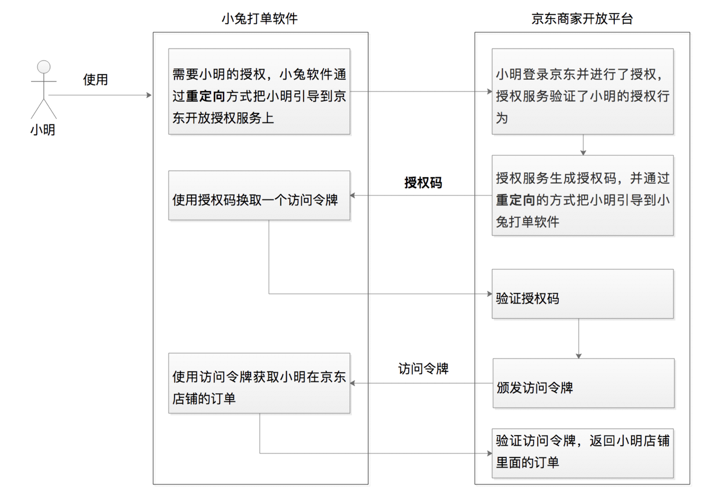
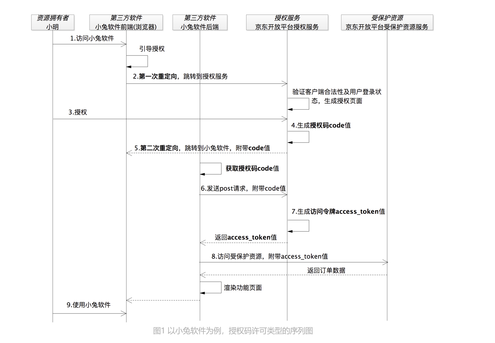

# OAuth 2.0

OAuth (Open Authorization)

OAuth 2.0 是一种授权协议。就是保证第三方（软件）只有在获得授权之后才可以进一步访问授权者的数据。

OAuth 2.0 的核心是授权许可，更进一步说就是令牌机制（颁发访问令牌和使用访问令牌）。只有拿到了访问令牌才可以代表用户访问数据。

互联网中所有的受保护资源，几乎都是以 Web API 的形式来提供访问的。

## 1. 四种角色

OAuth 2.0 的体系里边有四种角色：

    - 资源拥有者
    - 客户端，就是第三方软件
    - 授权服务，就是负责颁发访问令牌的服务
    - 受保护资源

## 2. 授权许可类型

OAuth 2.0 有四种授权许可类型，如何选择使用那种授权许可类型？

1. 在对接 OAuth 2.0 的时候先考虑授权码许可类型，其次再结合现实生产环境来选择；
2. 如果是官方出品，则可以直接使用资源拥有者凭据许可；
3. 如果是值嵌入到浏览器的应用且没有服务端，就只能选择隐士许可；
4. 如果获取的信息不属于任何一个第三方用户，则直接使用客户端凭据许可类型。

### 2.1 授权码许可（Authorization Code）类型

是 OAuth 2.0 中最经典、最完备、最安全、应用最广泛的许可类型。

**授权码许可类型中，为什么需要授权码？**

授权码许可流程有两种通信方式。一种是前端通信，因为它通过浏览器促成了授权码的交互流程，比如京东商家开放平台的授权服务生成授权码发送到浏览器，第三方软件小兔从浏览器获取授权码。正因为获取授权码的时候小兔软件和授权服务并没有发生直接的联系，也叫做间接通信。另外一种是后端通信，在小兔软件获取到授权码之后，在后端服务直接发起换取访问令牌的请求，也叫做直接通信。

在 OAuth 2.0 中，访问令牌被要求有极高的安全保密性，因此我们不能让它暴露在浏览器上面，只能通过第三方软件（比如小兔）的后端服务来获取和使用，以最大限度地保障访问令牌的安全性。正因为访问令牌的这种安全要求特性，当需要前端通信，比如浏览器上面的流转的时候，OAuth 2.0 才又提供了一个临时的凭证：授权码。通过授权码的方式，可以让用户小明在授权服务上给小兔授权之后，还能重新回到小兔的操作页面上。这样，在保障安全性的情况下，提升了小明在小兔上的体验。

### 2.2 隐式许可（Implicit）

客户端没有后端服务，相当于将客户端嵌入到了浏览器中，访问浏览器的过程相当于接触了客户端的全部。

这个流程和授权码流程类似，只是需要特别注意一点，response_type 的值变成了 token，是要告诉授权服务直接返回 access_token 的值。

### 2.3 客户端凭据许可（Cilent Credentials）

没有明确的资源拥有者，也就是要获取与用户无关的资源，不需要资源拥有者授权，客户端直接使用注册时的 app_id 和 app_secret 来换回访问令牌 token 的值。比如客户端获取平台提供的logo或省份信息等。

因为是由后端服务发起 access_token 的请求，所有这种授权许可不需要刷新令牌。 grant_type = client_credentials

### 2.4 资源拥有者凭据许可（Resource Owner Password Credentials）

资源拥有者的凭据，就是用户的凭据，就是用户名和密码。

用于客户端是官方出品的，又要使用 OAuth 2.0 来保护 Web API 资源。grant_type = password

OAuth2 的核心概念包括以下几点：

- 授权码(Authorization Code)：用户在第三方应用程序中授权访问他们的资源时，会收到一个授权码。
- 访问令牌(Access Token)：授权码可以兑换为访问令牌，访问令牌用于访问用户的资源。
- 刷新令牌(Refresh Token)：访问令牌有限期有效，可以使用刷新令牌重新获取新的访问令牌。
- 客户端(Client)：第三方应用程序，通过 OAuth2 协议与用户资源进行交互。
- 资源服务器(Resource Server)：保存用户资源的服务器，通过 OAuth2 协议提供访问令牌。
- 授权服务器(Authorization Server)：负责处理用户授权请求，颁发访问令牌和刷新令牌。

