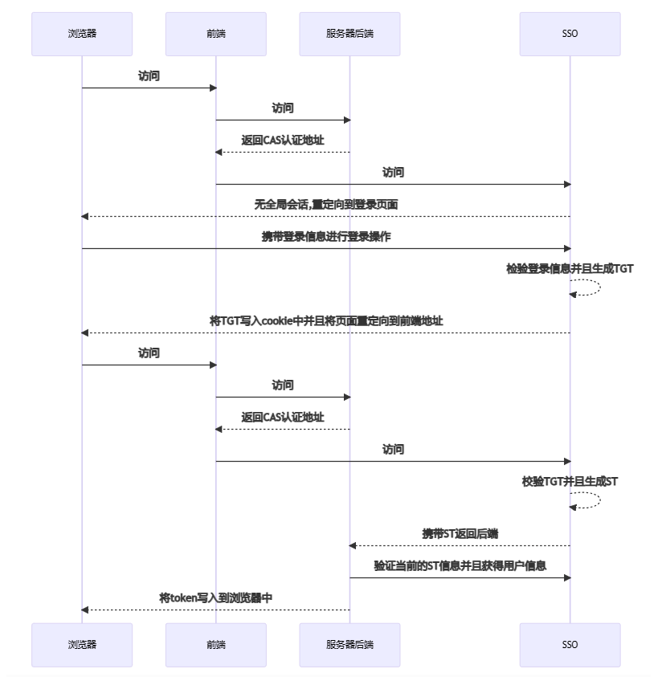
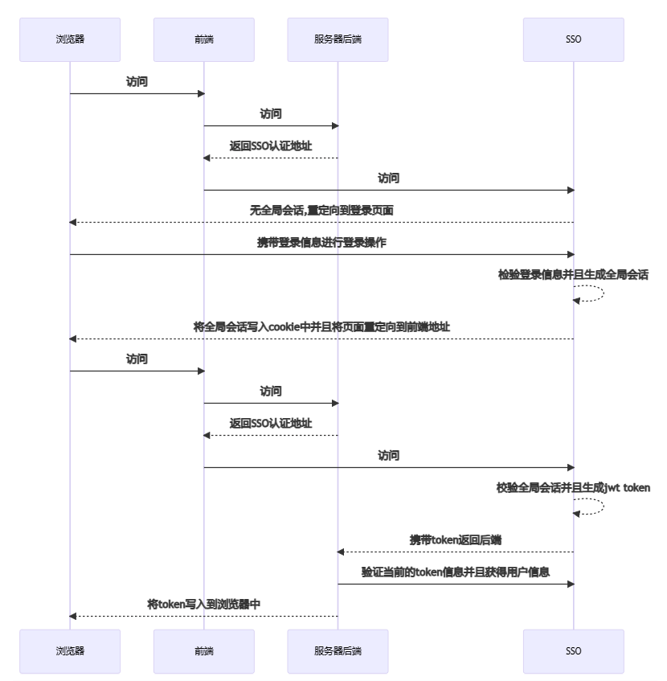

# 权限体系

在计算机领域中，权限体系通常用于控制用户对资源（如文件、数据库、网络等）的访问权限。在整个体系的建立过程中可以分为两个部分(**认证和鉴权**)实现，并且这两个部分没有强依赖性，可以根据业务的不同选择不同的类型进行组合。

认证：认证是指根据声明者所特有的识别信息，确认声明者的身份。
授权：在信息安全领域，授权是指资源所有者委派执行者，赋予执行者指定范围的资源操作权限，以便执行者代理执行对资源的相关操作。
鉴权：鉴权是指对于一个声明者所声明的身份权利，对其所声明的真实性进行鉴别确认的过程。
权限：是一个抽象的概念，一般预先定义和配置好，以便控制的具体实现。权限的定义，若简单点，可以直接对应于一个可执行的操作集合。而一般情况下，会有基于角色的方式来定义权限，由角色来封装可执行的操作集合。

[微服务架构权限体系的设计和落地方案](https://blog.csdn.net/zhaokk_git/article/details/123873507)
[网关认证的技术方案](https://blog.csdn.net/weixin_42888110/article/details/132492106)

## 1. 认证（Authentication）

认证是指确认用户身份的过程。在认证过程中，系统会验证用户提供的凭据（如用户名和密码、指纹、智能卡等）是否与系统中存储的凭据匹配，从而确定用户是否是其声称的那个人。认证的目的是确保系统只允许合法用户访问受保护的资源。

### 1.1 认证方式

认证方式是指用户在进行身份验证时所采用的方法或手段。随着越来越多的业务场景和一些复杂的环境的要求，诞生出来不同的认证方式，在不同的业务场景下可以进行自主的选择和叠加。常见的一些认证方式有：

1. 账号密码认证
2. 邮箱验证
3. 手机短信验证
4. 安全问题验证：用户在注册时设置安全问题及答案，用于找回密码或进行身份验证。
5. 生物识别认证：通过扫描用户的生物特征（如指纹、面部、虹膜等）来验证身份。
6. 智能卡认证：用户需要插入带有智能芯片的卡片，并输入PIN码来进行身份验证。
7. 硬件令牌认证：用户需要使用专门的硬件设备（如USB安全密钥）来生成动态验证码进行验证。
8. 单点登录（Single Sign-On，SSO）：是一种身份验证技术，允许用户使用一组凭据（如用户名和密码）登录到多个相关系统或应用，而无需重复输入凭据。
9. OAuth认证：是一种授权框架，允许用户授权第三方应用访问其受保护的资源，而无需提供用户名和密码。例如微信传入 openId，应用后端就需要进行账号和 openId 的关联。
10. 双重认证（Two-Factor Authentication，2FA）：除了密码外，用户需要提供第二种验证因素，如手机短信验证码、应用程序生成的动态验证码等，以增加安全性。
11. 多因素认证（Multi-Factor Authentication，MFA）：也要叠加认证，类似于双重认证，但可以包括多种因素的组合，如密码、指纹识别、硬件令牌等。


**账号密码认证**

目前最常使用，但是安全性也是最低的一种认证方式，因此一般会采用一些措施保证登录安全和帐号安全。

   - 增加验证码，如滑动图片、文字点选、字符输入等
   - 检测长时间使用同一密码进行强制修改密码操作
   - 对登录过程中的数据进行加密传输
   - 对数据的存储进行加随机盐等安全的密码方式进行脱敏存储(防止撞库)

**手机验证码验证**

手机验证码有着快速登录认证的特点，因此会有一部分系统选择使用手机验证码进行登录，但是也会存在一定的风险。

   - 短信验证码防盗刷
   - 短信验证码超时机制

**双重认证**

由于单一的认证场景下并不能保证认证过程的安全性，因此可以根据不同的业务场景进行认证方式的组合和叠加。

   - 账号密码 + 短信验证码
   - 账号密码 + 邮箱验证

### 1.2 认证协议

认证协议是认证结果的表达形式，用于验证用户身份和生成令牌。

1. CAS（Central Authentication Service）

   - CAS 是一种企业级的开放源代码单点登录解决方案，用于集中化的用户身份认证和会话管理。
   - CAS 通过在服务器端维护用户的登录状态，并为用户颁发票据（ticket）来实现单点登录和安全认证。
   - CAS 允许用户在一次登录后访问多个应用程序而无需重新认证，提供了统一的身份验证机制。

   

2. JWT（JSON Web Token）

   - JWT 是一种基于 JSON 的开放标准（RFC 7519），用于在各方之间安全地传输信息。
   - JWT 可用作身份验证凭证，通过生成和签发令牌来传递身份信息，通常用于在不同系统之间进行身份验证。

   

在实际应用中，CAS 和 JWT 经常结合使用，以实现更强大的身份验证和授权机制。通常情况下，CAS 用于实现单点登录和会话管理，而 JWT 用于在不同的系统之间安全地传递身份信息和授权信息。这样的组合可以为企业应用提供灵活而安全的身份验证解决方案。

在授权框架方面，OAuth 2.0 是一种授权框架，主要关注授权而非认证，用于控制对资源的访问权限，允许用户授权第三方应用程序代表其执行操作。


## 2. 鉴权（Authorization）

鉴权是在认证成功后确定用户对系统资源的访问权限的过程。一旦用户成功通过认证，系统会根据用户的身份和角色等信息，决定用户是否有权执行特定的操作或访问特定的资源。鉴权的目的是确保用户在访问系统资源时只能执行其被授权的操作，避免未经授权的访问。

在实际项目中，都会有权限管理控制，具体来说就是：不仅要控制一个用户能够访问哪些资源，还要控制用户只能访问资源的哪些数据。

- <font color="red">控制访问资源的权限管理，比较经典的方案是 RBAC</font>
- <font color="red">控制数据的权限，可以使用 Spring AOP 切面技术</font>

**数据规则权限**

可以通过自定义注解 + Spring AOP，实现 Sql 拼接；如果使用 MybatisPlus 框架，不写 sql，可以定义公共方法，将 sql 条件部分放在 QueryWrapper<>对象中。

步骤：

1. 自定义一个数据权限的注解，比如叫 PermissionData
2. 在对应的资源请求方法上添加注解，比如在列表上添加注解 @PermissionData
3. 利用 AOP 抓取到用户对应角色的所有数据规则并进行 SQL 拼接，最终在 SQL 层面实现数据过滤

## 3. 权限

权限是用户可以访问的资源，包括页面权限、操作权限和数据权限。通常，权限基于角色来定义，角色封装了可执行的操作集合。

1. 页面权限：即用户登录系统可以看到的页面，由菜单来控制，菜单包括一级菜单和二级菜单，只要用户有一级和二级菜单的权限，那么用户就可以访问页面
2. 操作权限：即页面的功能按钮，包括查看、新增、修改、删除、审核等，用户点击删除按钮时，后台会校验用户角色下的所有权限是否包含该删除权限。如果是，就可以进行下一步操作，反之提示无权限
         
   - "可见即可操作"，意思是如果页面上能够看到操作按钮，那么用户就可以操作，要实现此需求，这里就需要前端来配合，前端开发把用户的权限信息缓存，在页面判断用户是否包含此权限，如果有，就显示该按钮，如果没有，就隐藏该按钮。 

3. 数据权限：数据权限就是用户在同一页面看到的数据是不同的，比如财务部只能看到其部门下的用户数据，采购部只看采购部的数据。


## 4. Base64 编码

Base64 是网络上最常见的用于传输 8 Bit 字节码的编码方式之一。是从二进制到字符的过程，常用于在文本协议中传输或存储二进制数据，比如在 HTTP 环境下传递较长的标识信息、电子邮件中传输二进制附件、在网页中嵌入图片或音视频文件等。

Base64 是一种字符串编码格式，采用了A-Z，a-z，0-9，“+”和“/”这64个字符来编码原始字符（还有垫字符“=”）。一个字符本身是一个字节，也就是8位，而base64编码后的一个字符只能表示6位的信息。也就是原始字符串中的3字节的信息编码会变成4字节的信息。Base64的主要作用是满足MIME的传输需求。


使用Base64编码将字节数组转换为字符串时，其长度会有所增加。具体增加的长度取决于原始字节数组的长度。在Base64编码中，每3个字节的数据会被编码为4个字符。如果原始字节数组的长度不是3的倍数，编码结果会进行填充，通常使用等号（=）进行填充，以确保编码结果长度为4的倍数。具体计算方法如下：

- 如果原始字节数组的长度是3的倍数，编码后的字符串长度为 (原始字节数组长度 / 3) * 4。
- 如果原始字节数组的长度不是3的倍数，编码后的字符串长度为 [(原始字节数组长度 / 3) + 1] * 4。
- 需要注意的是，编码后的字符串长度是以字符为单位计算的，不同编码方式（如UTF-8、UTF-16等）所占用的字节数可能不同。


Base64 是基于64个可打印字符来进行编码的，但现实中存在很多使用场景，有的场景中标准64字符不一定全部适用。

1. 标准场景：64个字符由：A~Z、a~z、0~9以及 + 、 / 组成。
2. URL 场景：标准的 Base64 并不适合直接放在 URL 里传输，因为 URL 编码器会把标准 Base64中的“/”和“+”字符变为形如“%XX”的形式，而这些“%”号在存入数据库时还需要再进行转换，因为 ANSI SQL 中已将“%”号用作通配符。JDK1.8 中要处理 URL 场景生成的 base 编码字符串，要使用 Base64.getUrlDecoder() 来 decode
3. MIME 场景：在 MIME 场景中，Base64 编码后的数据每行不超过76个字符，还会在行末添加“\r”和“\n”（CR/LF）。JDK1.8 中要处理 mime 场景生成的 base 编码字符串，要使用 Base64.getMimeDecoder() 来 decode

### 4.1 实现方式

**方式一：commons-codec.jar**

```xml
<dependency>
    <groupId>commons-codec</groupId>
    <artifactId>commons-codec</artifactId>
    <version>1.11</version>
</dependency>
```

```java
String base64String="test123";
byte[] result = Base64.encodeBase64(base64String.getBytes());
```


**方式二：sun.misc.BASE64Encoder**

```java
import sun.misc.BASE64Encoder;

是 Sun Microsystems 提供的基于 JVM 的 Base64 编码器，用于将二进制数据编码为 Base64 字符串。

sun 开头的包并不属于 java 规范，是 sun 公司的实现，所以 jdk7 中的这种 base64 编码方式并不是 java 的规范。

/**
 * 编码，jdk7 进行编码
 *
 * @param content
 * @return
 */
public static String encode(byte[] content) {
   return new BASE64Encoder().encode(content);
}

/**
 * 解码，jdk7 进行解码
 *
 * @param source
 * @return
 */
public static byte[] decode(String source) {
   try {
      BASE64Decoder decoder = new BASE64Decoder();
      return decoder.decodeBuffer(source);
   } catch (IOException e) {
      e.printStackTrace();
   }
   return null;
}
```

**方式三：Java8 Base64**

在 Java 8 及更高版本中，可以使用 java.util.Base64 类。java.util.Base64 提供了更好的性能和更丰富的功能，并且是 Java 标准 API 的一部分，因此更适合在各种项目中使用。

**方式四：Apache Common**

Apache Common 中的 org.apache.commons.codec.binary.Base64 类是基于 rfc2045 实现的，根据类注释可以了解到此实现解码时忽略了所有不在 the base64 alphabet 范围内的字符，所以该实现可以处理包含换行符的 base64 编码结果。

同时该类的编码方法提供了参数，用于指定编码结果长度在超过 76 个字符的时候是否添加换行，默认不换行。

### 4.2 jdk7 和 jdk8 进行编码解码的问题

针对比较长的原文进行 base64 编码：

1. jdk7 的 Base64 编码结果包含换行；
2. jdk8 的 Base64 编码结果不包含换行；jdk8 的 Base64.getDecoder() 无法解码包含换行的编码结果，需要使用 Base64.getMimeDecoder();。jdk8 的编码结果使用 jdk7 进行解码，没有任何问题。

查看类注释，发现原因：

1. jdk7 的编码和解码，实现是按照 RFC1521 来的，rfc1521 明确规定，编码结果的每一行不能超过 76 个字符。解码的字符必须在：Table 1（也就是 the base64 alphabet）、换行符和空白符这个范围内；
2. jdk8 的编码和解码，实现是按照 rfc4648 和 rfc2045 两个协议来实现的。编码和解码操作是照着两个协议中的'Table 1'中指定的'The Base64 Alphabet'来的。编码器不会添加任何换行符，解码器只会处理'The Base64 Alphabet'范围内的数据，如果不在这个范围内，解码器会拒绝处理。

解决问题：

1. 使用 apache common 包中的 org.apache.commons.codec.binary.Base64 类进行编码和解码；
2. 编码之后或解码之前去除换行符或使用当前JDK的Base64工具类重新生成一下；
3. 编码和解码使用相同的jdk版本；

## 5. URL 编码（URLEncode）

1. 特点：将特殊字符以及非ASCII字符转换为URL安全的格式，以便在URL中传输或作为查询参数。
2. 字符集：URL编码使用ASCII字符集，并将特殊字符转换为%xx的形式，其中xx表示字符的十六进制值。
3. 填充字符：URL编码没有填充字符的概念，每个字符都会被转换成特定的编码形式。
4. 使用场景：常用于URL参数传递、表单提交等场景，以确保URL中的特殊字符被正确解析和处理。


### 4.3 示例：解析图片方式

#### 以 base64 文件编码形式传输并显示前端

```java
BufferedImage bufferedImage = new BufferedImage(130, 48, BufferedImage.TYPE_INT_RGB);
// 省略...
FastByteArrayOutputStream os = new FastByteArrayOutputStream();

try {
   ImageIO.write(bufferedImage, "jpg", os);
} catch (IOException e) {
   return ResultVo.error(e.getMessage());
}
Map<String, Object> data = new HashMap<>(2);
data.put("uuid", "uuid");
// base64 编码
data.put("img", Base64.getEncoder().encodeToString(os.toByteArray()));
return ResultVo.success(data);
```

```js
methods: {
    getCode() {
      getCodeImg().then(res => {
        this.codeUrl = "data:image/gif;base64," + res.img;
        // data表示取得数据的协定名称，image/png 是数据类型名称，base64 是数据的编码方法，逗号后面就是这个image/png文件base64编码后的数据。
        this.loginForm.uuid = res.uuid;
      });
    },
}

```

#### 将流对象放入到 response 中

```java
//将图片输出
ImageIO.write(image,"jpg",response.getOutputStream());

window.URL.createObjectURL(response);

<div class="login-code">
   
</div>

// 获取验证码
export function getCaptcha(){
    return request({
        url: '/captchaImage',
        method: 'get',
        responseType: 'blob'
        // Blob对象表示不可变的类似文件对象的原始数据
    })
}
```

## 6. 单点登录

> 为什么需要单点登录：
>
> web 系统早已从久远的单系统发展成为如今由多系统组成的应用群，复杂性应该由系统内部承担，而不是用户。无论web系统内部多么复杂，对用户而言，都是一个统一的整体，也就是说，用户访问web系统的整个应用群与访问单> 个系统一样，登录/注销只要一次就够了

单点登录（Single Sign-On，SSO）是一种身份验证技术，允许用户使用一组凭据（如用户名和密码）登录到多个相关系统或应用，而无需重复输入凭据。通俗点讲就是用户只需要登录一次，即可在多个应用系统中访问受授权的资源。


### 6.1 Cookie + Session

单系统登录解决方案的核心是 Cookie，Cookie 携带 session id 在浏览器与服务器之间维护会话状态。但 Cookie 是有限制的，这个限制就是 Cookie 的域（通常对应网站的域名），浏览器发送 http 请求时会自动携带与该域匹配的 Cookie，而不是所有Cookie。

采用Cookie + Session 实现 SSO，分为两种不同场景的实现：同域单点登录和跨域单点登录。

**同域单点登录**

必须保证所有系统都需要使用同一个一级域名，通过不同的二级域名来区分。这也是早期多系统登录采用同域名共享 Cookie 的方式。

共享 Cookie 的方式存在以下问题：

1. Cookie不安全
2. 不能跨域实现免登

**跨域单点登录**

多个系统域名不一样，例如第三方系统，这样不能共享 Cookie 了，因此就需要通过一个单独的授权服务来做统一登录，并基于共享授权服务器的 Cookie 来实现单点登录。

其原理是在用户登录之后，认证服务器将用户信息存储在 Session 中，并生成一个 Session ID，然后将该 Session ID 存储在 Cookie 中，并返回给用户。用户在访问其他应用系统时，判断未登录，则跳转到认证服务器，也就是该系统会向认证服务器发送请求，由于是跳转到认证服务器下（重定向），所以能通过浏览器中认证服务器的 Cookie 读取到 Session 中之前的登录信息。认证服务器通过 Session ID 来判断该用户是否已经登录过，如果已经登录过，则返回一个新的 Session ID 给应用系统，否则需要用户重新登录。

### 6.2 Token

和上边提到的跨越单点登录原理一样。在用户登录之后，认证服务器生成一个 Token，并将该 Token 存储在共享的存储中（例如 Redis、数据库等），然后将该 Token 返回给用户。用户在访问其他应用系统时，该系统会向认证服务器发送请求，并带上 Token。认证服务器通过 Token 来判断该用户是否已经登录过，如果已经登录过，则返回一个新的 Token 给应用系统，否则需要用户重新登录。

### 6.3 基于 Oauth2

OAuth 2.0可以用于身份验证和授权，允许用户通过授权服务器获取访问令牌，然后在不同系统间共享该令牌实现 SSO。

### 6.4 OpenIO Connect

OpenID Connect 是建立在 OAuth 2.0协议之上的身份验证协议，为Web应用提供了认证和授权。

### 6.5 CAS 

CAS（Central Authentication Service）是一个开源的单点登录协议，它通过中心化的认证服务器来实现用户登录的认证和授权，并在多个应用之间共享用户会话状态。

CAS 协议的具体实现包括 CAS Server 和 CAS Client。CAS Server 负责管理用户的登录状态和身份信息，CAS Client 则集成到各个应用中，用于向 CAS Server 发送认证请求并接收认证响应。CAS 通过票据交换的方式实现单点登录，用户在登录一个应用后，访问其他已集成 CAS 的应用时无需重新登录，从而实现了用户的单点登录体验。CAS 协议的开源实现包括 Apereo CAS 和 Jasig CAS 等。


