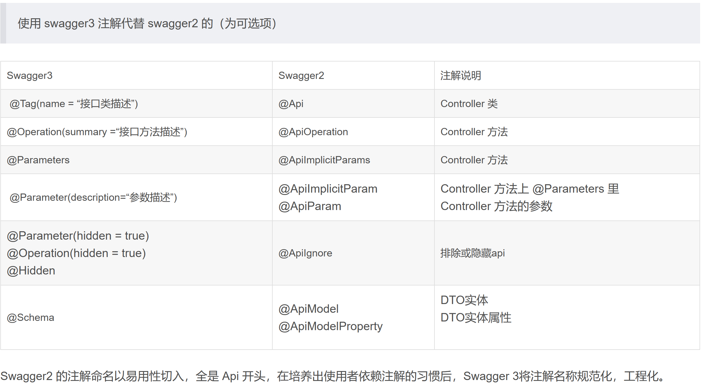

# Swagger

[个人源代码](https://gitee.com/nanbo-one/openapi-swagger.git)


> 发展史
>
> Swagger 是由 Tony Tam 在2010年创建的，由 SmartBear Software 所拥有并管理。最初是一个用于描述和文档化 RESTful API 的工具，它使用 YAML 或 JSON 格式的规范来定义 API 的结构、参数、请求和响应等信息，并提供了交互式的 API 文档。
>
> 在2015年，Swagger 2.0规范捐赠给了 Linux 基金会（后来成为 OpenAPI Initiative）。随后，Swagger 规范被重命名为 OpenAPI 规范，以便更好地反映其开放和共享的性质。
>
> 在2017年7月，Open API Initiative 发布了 OpenAPI Specification 3.0.0，OpenAPI 规范扩展了原始的 Swagger 规范，使其能够更好地支持各种类型的 API 描述（如 gRPC、GraphQL 等），并增加了对各种安全方案、认证方式和其他功能的支持。
>

## 1. 概念


Swagger 是一个简单但功能强大的 API 表达工具。主要团队后来成为了 Open API 标准的主要定义者。由于 Swagger 是由参与创建原始 Swagger 规范的团队开发的，因此通常仍将这些工具视为该规范的代名词。


- Swagger Editor  可以在浏览器中用YAML编辑OpenAPI的定义。
- Swagger Codegen  一款代码生成器。
- Swagger UI  自动生成OpenAPI的定义，可以在浏览器上进行查看，这个模块也是很多开发用的比较多的模块

除了以上三个模块，Swagger还有很多很多其它子项目，如SwaggerHub插件，Swagger-JS, Swagger-Parser, Swagger-Node等等。由此可见，Swagger项目并不局限于Java语言，它的目标是更好的设计、管理API，包括OpenAPI规范, AsyncAPI规范, JSON相关的Schema等等。


## 2. 常用注解

java 中 swagger1.x 对应 Swagger2、swagger2.x 对应 OpenAPI3

```xml
<!-- swagger2 注解包 -->
<dependency>
    <groupId>io.swagger</groupId>
    <artifactId>swagger-annotations</artifactId>
    <version>1.6.9</version>
</dependency>

<!-- swagger3 注解包 -->
<dependency>
    <groupId>io.swagger.core.v3</groupId>
    <artifactId>swagger-annotations</artifactId>
    <version>2.2.3</version>
</dependency>

```

| Swagger2                         | OpenAPI3                                                     | 说明                                                         |
| -------------------------------- | ------------------------------------------------------------ | ------------------------------------------------------------ |
| @APiModel、@ApiModelProperty     | @Schema                                                      | 实体类<br />实体属性                                         |
| @Api                             | @Tag                                                         | Controller 类                                                |
| @ApiOperation                    | @Operation                                                   | Controller 方法，描述接口方法                                |
| @ApiImplicitParams               | @Parameters                                                  | Controller 方法上，里层嵌套@ApiImplicitParam/@Parameter      |
| @ApiImplicitParam<br />@ApiParam | @Parameter                                                   | Controller 方法<br />Controller 方法的参数                   |
| @ApiIgnore                       | @Parameter(hidden = true) <br />@Operation(hidden = true)<br />@Hidden | 排除或隐藏api                                                |
| @ApiResponses @ApiResponse       | @ApiResponses、@ApiResponse                                  | 用在controller方法的返回值上。一般不会手动给每个API 写上一堆@ApiResponse。通常会有一个统一的返回Result<T>，有一个统一的异常处理类，使用@RestControllerAdvice标记，然后每个方法会捕捉对应的异常，只要我们使用`@ResponseStatus`来标记这些方法，springdoc就会自动生成相应的文档 |
|                                  |                                                              |                                                              |
|                                  | @SecurityScheme                                              | 定义一个安全模式，我们可以定义全局的，也可以针对某个controller定义类级别的 |
|                                  | @SecurityRequirements()                                      |                                                              |
| dataType 属性                    |                                                              | 参数类型，可传基本类型、类、泛型类等                         |
| ParamType 属性：                 |                                                              | 表示参数放在哪个位置<br />  header-->请求参数的获取：@RequestHeader(代码中接收注解) query-->请求参数的获取：@RequestParam(代码中接收注解) path（用于 restful 接口）-->请求参数的获取：@PathVariable(代码中接收注解) body-->请求参数的获取：@RequestBody(代码中接收注解) form（不常用） |




Swagger2 的注解以易用性切入、全是Api开头，在培养出使用者依赖注解的习惯后，Swagger3 将注解名称规范化，工程化。

由于Swagger2.0规范已过时。此处只列Open API 3.0规范的注解

### 3.1 @Tag

用于对接口进行分类和归类。

具体属性：

- name：名称，必填属性，如果将多个Controller上的name写一样的，就会把它们归类在一起。
- description：表示标签的描述信息，非必填属性。
- externalDocs：用于指定URL地址文档信息来追加描述接口的信息。非必填属性。
```java
// 示例：
@Tag(
    name = "用户管理",
    description = "用户管理的控制器接口",
    externalDocs = @ExternalDocumentation(
                description = "这是一个接口文档介绍",
                url = "https://www.baidu.com/"))
```

### 3.2 @Operation     

用于对API操作（即方法）进行描述和标记。

具体属性：

- summary：简要描述
- description：详细描述信息
- hidden：是否隐藏
- tags：标签，用于分组API
- deprecated：表示该API操作已经过时或不推荐使用
- parameters：用于指定API操作的参数列表，包括路径参数、请求参数、请求头部等。可以使用@Parameter注解进一步定义参数
- operationId：操作的唯一标识符，建议使用唯一且具有描述性的名称，可以用于生成客户端代码或文档等
- requestBody：用于定义API操作的请求体，可以使用@RequestBody注解进一步定义请求体
- responses：用于定义 API 操作的响应列表，包括成功响应和错误响应。可以使用@ApiResponse注解进一步定义响应
- security：用于对API操作进行安全控制，可以使用@SecurityRequirement注解进一步定义安全需求


### 3.3 @Parameter

用于描述HTTP请求的参数信息，它是一个Parameter[]类型的数组，每个元素表示一个请求参数；

具体属性：

- name：参数名称
- in：参数来源，可选 query、header、path 或 cookie，默认为空，表示忽略
- description：参数描述
- required：参数是否必须，默认为 false
- deprecated：参数是否已过时，默认为 false
- allowEmptyValue：是否允许空值，默认为false
- style：参数的序列化风格，可以是 "matrix"、"label"、"form"、"simple"、"spaceDelimited"、"pipeDelimited"、"deepObject"
- explode：当参数值是对象或数组时，是否将其展开成多个参数，默认为 false
- schema：参数类型和格式的定义，通常使用@Schema注解
- example：参数值的示例

### 3.4 @Parameters

包含多个 @Parameter 注解，指定多个参数。

### 3.5 @Schema

用于描述实体类属性的描述、示例、验证规则等，比如 POJO 类及属性。

具体属性：
       
- description：描述
- name：指定属性名称。该属性只对属性有效，对类无效
- title：标题
- example：示例值
- required：是否为必须，2.2.5版本弃用。替换为 RequiredMode 
- requiredMode：是否必填项。枚举Schema.RequiredMode 可选值：默认AUTO：可有可无；REQUIRED：必须存在此字段(会加红色*)；NOT_REQUIRED：不需要存在此字段
- accessMode：访问方式。包括AccessMode.READ_ONLY（只读）、AccessMode.WRITE_ONLY（只写）、AccessMode.READ_WRITE（读写）
- format：属性的数据格式。例如：日期格式、时间格式、数字格式，@Schema(format = "email")
- maxLength、minLength：指定字符串属性的最大长度和最小长度
- maximum、minimum：指定数值属性的最大值和最小值
- pattern：正则表达式
- deprecated：已过时属性，默认为false
- defaultValue：默认值
- implementation：引入具体的实体
- type：数据类型
    - 基本类型：取值为相应的 Java 类型名，例如 int、long、float、double、boolean 等。
    - 包装类型：与基本类型相同，取值为相应的Java包装类型名，例如Integer、Long、Float、Double、Boolean等。
    - 字符串类型：取值为string。
    - 数组类型：取值为 array。对于数组类型，还可以使用 schema 属性指定其元素类型的 Schema 信息。
    - 对象类型：不用指定type，可以通过implementation属性引入。
    - 枚举类型：取值为enum。对于枚举类型，还需要使用enumAsRef属性指定是否将其定义为一个独立的引用类型。
    - 其它类型：不用指定type，可以通过implementation属性引入。

@Schema注解：提供了四个属性来描述复杂类型，分别是allOf、anyOf、oneOf和not。
    这四个属性可以用于组合不同的JSON Schema以描述一个复杂类型，具体如下：
    ①：allOf: 表示当前schema是多个其它schema的并集。
        例如，如果一个Java类型同时实现了两个接口，那么可以使用allOf来表示这个Java类型继承了这两个接口的所有属性和方法。
    ②：anyOf: 表示当前schema可以匹配其中任意一个schema，其本身也是一个组合体，可以嵌套使用。
        例如，一个返回类型可能是多个Java类型中的任意一个，可以使用anyOf来描述这种情况。
    ③：oneOf: 表示当前schema只能匹配其中一个schema，其本身也是一个组合体，可以嵌套使用。
        例如，一个Java类型只能是多个子类型中的任意一个，可以使用oneOf来描述这种情况。
    ④：not: 表示当前Schema不能匹配某个schema。
        例如，一个Java类型不能是某个子类型，可以使用not来描述这种情况。
    但是总感觉这个Swagger无法满足我特定要求的实体，具体解决如下：
        比如我现在有个AjaxResult类（code，msg，data），其中data为Object或其它类型，这时我返回的数据里data为其它类型的
        实体，所以我这里不理解如何返回的实体中，通过点击data而显示另外实体，我只能通过anyOf方式来实现（加上注解）
        @ApiResponse(
                responseCode = "200",
                description = "响应成功",
                content = @Content(
                        mediaType = "application/json",
                        schema = @Schema(
                                description = "返回实体，AjaxResult内data为StudentVO模型",
                                anyOf = {AjaxResult.class, StudentVO.class})
                )
        )


        注解权限设置：@SecurityScheme （具体参考io.swagger.v3.oas.annotations.security）
    说明：用于定义API的安全方案。通过使用@SecurityScheme注解，我们可以为API定义多种安全方案，并指定每种方案的相关属性，
    例如认证类型、授权URL、令牌URL、作用域等。
    常用属性：
        ①：name：
            安全方案的名称；
        ②：type：
            认证类型，具体包含如下：SecuritySchemeType.API_KEY（API密钥）、SecuritySchemeType.HTTP（HTTP认证）、
                SecuritySchemeType.OAUTH2（OAuth2.0 认证）等；
        ③：description：
            安全方案的描述信息；
        ④：in：
            仅在使用API密钥认证时适用，表示API密钥的位置，包括如下：
                ApiKeyLocation.HEADER（HTTP 头部）、ApiKeyLocation.COOKIE（Cookie）等
        ⑤：scheme：
            仅在使用HTTP认证时适用，表示认证方案，例如HTTP Authentication Scheme.Basic（Basic 认证）；
            防止客户端需要在请求头部中添加一个包含用户名和密码的 Base64 编码字符串，并以 "Basic " 开头，如：
            Authorization: Basic YWRtaW46MTIzNDU2
        ⑥：bearerFormat：
            仅在使用 Bearer Token 认证时适用，表示 Bearer Token 的格式；
        ⑦：flows：
            仅在使用OAuth2.0认证时适用，表示OAuth2.0的认证流程，包括@OAuthFlows.authorizationCode、
            @OAuthFlows.clientCredentials、@OAuthFlows.password 和 @OAuthFlows.implicit等。
    示例：(可以在我们自定义的SwaggerOpenApiConfig内设置权限认证)
        @SecurityScheme(
            name = "JWT-test",                   // 认证方案名称
            type = SecuritySchemeType.HTTP,      // 认证类型，当前为http认证
            description = "这是一个认证的描述详细",  // 描述信息
            in = SecuritySchemeIn.HEADER,        // 代表在http请求头部
            scheme = "bearer",                   // 认证方案，如：Authorization: bearer token信息
            bearerFormat = "JWT")                // 表示使用 JWT 格式作为 Bearer Token 的格式


当前在自定义的SwaggerOpenApiConfig类上面设置了两种权限校验方式，如下：
@SecurityScheme(
        name = "JWT-test",                   // 认证方案名称
        type = SecuritySchemeType.HTTP,      // 认证类型，当前为http认证
        description = "这是一个认证的描述详细",  // 描述信息
        in = SecuritySchemeIn.HEADER,        // 代表在http请求头部
        scheme = "bearer",                   // 认证方案，如：Authorization: bearer token信息
        bearerFormat = "JWT")                // 表示使用 JWT 格式作为 Bearer Token 的格式
@SecurityScheme(
        name = "X-API-KEY",
        type = SecuritySchemeType.APIKEY,
        description = "这是一个认证的描述详细",
        in = SecuritySchemeIn.HEADER,
        scheme = "bearer")

设置全部接口描述都有指定的一种校验方式：
    在@OpenAPIDefinition注解里的security属性设置校验方式
    @OpenAPIDefinition(   
        ....
        security = @SecurityRequirement(name = "JWT-test")
    )
设置指定接口描述有指定的一种校验方式：
    在@Operation注解里的security属性设置校验方式
    @Operation(   
        ....
        security = @SecurityRequirement(name = "JWT-test")
    )

### 3.6 @Hidden

某个元素（API 操作、实体类属性等）是否在 API 文档中隐藏。

### 3.7 @RequestBody（不常用）

API 请求的注解

- description：请求信息的描述
- content：请求的内容
- required：是否必须

### 3.8 @Content（不常用）

内容注解。

- mediaType：内容的类型。比如：application/json
- schema：内容的模型定义，使用 @Schema 注解指定模型的相关信息

### 3.9 @ApiResponse（不常用）

API 的响应信息。

- responseCode：响应的 HTTP 状态码
- description：响应信息的描述
- content：响应的内容


## 3. API 文档生成

通过 Swagger 生成 API 文档有两种方式：

1. 通过 Swagger 注解集成到项目中生成。好处：随时保持接口和文档的同步。坏处：代码入侵

    - SpringFox 是 spring 社区维护的一个项目（非官方），帮助使用者将 swagger2 集成到 Spring 中。
    - SpringDoc 是 spring 社区维护的一个项目（非官方），帮助使用者将 swagger3 集成到 Spring 中。

2. 使用 Swagger Editor 编写 API 文档的 Yaml/Json 定义。

    - 用 Yaml 生成代码，然后也可以实现 Swagger UI 来展示 API 文档。
    - 用 Yaml 生成代码，用 swagger2markup 将其转换为 AsciiDoc 或 MarkDown 格式；然后再通过 asciidoctor-maven-plugin 插件将其转换为漂亮的 HTML 格式文档方便查看。


### 3.1 SpringFox

是一个通过扫描代码提取代码中的信息，生成API文档的工具。springfox 不止支持 Swagger的OpenAPI Specification API文档的格式，同样支持 RAML，jsonapi 格式。

目前已停更！！！

|                            | springfox-swagger2                                           | springfox-boot-starter                                       |
| -------------------------- | ------------------------------------------------------------ | ------------------------------------------------------------ |
| 说明                       | 需要和 springfox-swagger-ui 一起使用                         | starter包，整合了springfox-swagger2和springfox-swagger-ui，实现自动装配。 |
| 支持的规范                 | 3.0.0版本以上都支持，低版本只支持 Swagger2                   | 兼容 OpenAPI3 和 Swagger2                                    |
| 版本                       |                                                              | 只有一个版本3.0.0                                            |
| 开启注解                   | @EnableSwagger2（2.9.2 及以下版本  ）<br />@EnableSwagger2WebMvc/@EnableSwagger2WebFlux（2.10.x）<br />@EnableSwagger3（3.0.0） | @EnableOpenApi                                               |
| 配置拦截器是否需要手动放行 | 是                                                           | 否                                                           |
| 访问路径                   | swagger-ui.html                                              | swagger-ui/index.html                                        |
| 文档类型                   | return new Docket(DocumentationType.SWAGGER_2)<br />return new Docket(DocumentationType.OAS_30) | return new Docket(DocumentationType.OAS_30)                  |


**SpringFox 3.0.0 发布**
 
- SpringBoot支持springfox Boot starter依赖性（零配置、自动配置支持），但需要SpringBoot 2.2+。
- 更好的规范兼容性与2.0。
- 支持OpenApi 3.0.3。
- 零依赖。几乎只需要spring-plugin，swagger-core ，现有的swagger2注释将继续工作并丰富openapi3.0规范。

但是springfox-boot-starter 3.0.0版本对于高版本的Spring Boot也并不能很好的支持，比如Spring Boot 2.7.0就不能和springfox-boot-starter兼容。

```xml
<!-- 用于帮助我们自动生成描述API的json文件 -->
<dependency>
    <groupId>io.springfox</groupId>
    <artifactId>springfox-swagger2</artifactId>
</dependency>

<!-- 将描述API的json文件解析出来，用一种更友好的方式呈现出来。swagger-ui 是原生swagger-Ui界面，访问后缀（默认的）：swagger-ui.html-->
<dependency>
    <groupId>io.springfox</groupId>
    <artifactId>springfox-swagger-ui</artifactId>
</dependency>

<!-- springfox-swagger-ui和swagger-bootstrap-ui都是纯swagger-ui的ui皮肤项目，渲染页面的，作用是一样的， -->
<!-- bootstrap-ui,只是在改变页面效果，访问后缀：doc.html -->
<dependency>
    <groupId>com.github.xiaoymin</groupId>
    <artifactId>swagger-bootstrap-ui</artifactId>
    <version>1.9.6</version>
</dependency>
```

Swagger2 配置类示例

```java
@Configuration
// 开启 Swagger 注解
@EnableSwagger2 
public class SwaggerConfig {
    // 创建 swagger 的 Docket 的 bean 实例，使用注解@Bean；如需配置多个分组，则创建多个docket实例
    @Bean
    public Docket docket(Environment environment) {
        // 设置显示的swagger环境信息
        Profiles profiles = Profiles.of("dev", "test");
        // 判断是否处在自己设定的环境当中
        boolean flag  = environment.acceptsProfiles(profiles);

        return new Docket(DocumentationType.SWAGGER_2)
                .apiInfo(apiInfo())
                 // 配置api文档的分组
                .groupName("党博") 
                 // 配置是否开启swagger
                .enable(flag) 
                .select()
                //配置扫描路径
                .apis(RequestHandlerSelectors.basePackage("com.dangbo.controller")) 
                // 配置过滤哪些
                .paths(PathSelectors.none()) 
                .build();
    }

    // api基本信息
    private ApiInfo apiInfo() {
        return new ApiInfo("my first swagger",
                "党博的第一个swagger",
                "v1.0",
                "http://mail.qq.com",
                new Contact("dangbo", "http://mail.qq.com", "1456131152@qq.com"),  //作者信息
                "Apache 2.0",
                "http://www.apache.org/licenses/LICENSE-2.0",
                new ArrayList());
    }


}
```


### 3.2 SpringDoc

SpringDoc 也是一个为 Spring Boot 应用程序生成 OpenAPI 文档的库，它基于 OpenAPI 3.0 规范构建的。与 Springfox 不同，Springdoc 默认使用 Spring MVC 注释（如@GetMapping和@PostMapping）而不是 Swagger 注释来生成 OpenAPI 文档。

Springdoc 支持 Swagger 页面 Oauth2 登录。

Springdoc 还支持 Java Bean Validation API 的注解。


```xml
<!-- 它提供了一组注解和工具来集成Swagger UI和OpenAPI规范 -->
<dependency>
   <groupId>org.springdoc</groupId>
   <artifactId>springdoc-openapi-ui</artifactId>
   <version>1.7.0</version>
</dependency>

```

```java
@Configuration
public class SpringDocConfig {
    @Bean
    public OpenAPI myOpenAPI() {
        return new OpenAPI()
                .info(new Info()
                        .title("程序员API")
                        .description("程序员的大本营")
                        .version("v1.0.0")
                        .license(new License()
                                .name("许可协议")
                                .url("https://shusheng007.top"))
                        .contact(new Contact()
                                .name("书生007")
                                .email("wangben850115@gmail.com")))
                .externalDocs(new ExternalDocumentation()
                        .description("ShuSheng007博客")
                        .url("https://shusheng007.top"));
    }

    // 分组配置，配置多个 GroupedOpenApi

    @Bean
    public GroupedOpenApi publicApi() {
        return GroupedOpenApi.builder()
                .setGroup("spring-app-public")
                .pathsToMatch("/api/v1/public/**")
                .build();
    }
 }
```

```yml
# springdoc配置
springdoc:
  # 分组配置
  group-configs:
    - group: 用户管理
      packages-to-scan: com.luo.demo.api.controller
      paths-to-match: /users/**
    - group: 角色管理
      packages-to-scan: com.luo.demo.api.controller
      paths-to-match: /roles/**
```
## 4. Swagger Codegen

**swagger-codegen-maven-plugin**

```xml
<!-- swagger-codegen-maven-plugin -->
<plugin>
    <groupId>io.swagger</groupId>
    <artifactId>swagger-codegen-maven-plugin</artifactId>
    <version>2.4.13</version>
    <configuration>
        <language>spring</language>
        <generateApis>true</generateApis>
        <generateModels>true</generateModels>
        <generateSupportingFiles>false</generateSupportingFiles>
        <!-- swagger 接口定义文件位置 -->
        <inputSpec>${project.basedir}/src/main/resources/api/sys-common.yaml</inputSpec>
        <!-- 生成的代码输出位置 -->
        <output>${project.basedir}</output>
        <!-- api包路径 -->
        <apiPackage>com.dxd.db.api</apiPackage>
        <!-- model包路径 -->
        <modelPackage>com.dxd.db.dto</modelPackage>

        <importMappings>
            <importMapping>LocalDate=java.time.LocalDate</importMapping>
            <importMapping>LocalDateTime=java.time.LocalDateTime</importMapping>
        </importMappings>
        <configOptions>
            <interfaceOnly>true</interfaceOnly>
            <dateLibrary>java8</dateLibrary>
            <java8>true</java8>
            <defaultInterfaces>false</defaultInterfaces>
        </configOptions>
    </configuration>
</plugin>
```

**swagger-codegen-cli**

[github 地址](https://github.com/swagger-api/swagger-codegen)可以根据提示操作，里面也有示例；或者使用 swagger-codegen-cli 脚手架工具

```json
java -jar swagger-codegen-cli-2.2.1.jar generate -i D:/xxx.Yaml -l java -o D:/swagger-codegen/java

-i 指定Json或Yaml文件的输入路径
-l 指定生成客户端代码的语言，该参数为必须
-o 指定生成文件的位置，默认当前目录

除了可以指定上面三个参数，还有一些常用的：
-c json格式的配置文件路径；支持的配置项因语言的不同而不同，可以将配置项写入到json文件中；就不需要命令行指定了。如果没有的话，这些参数就需要在命令行指定

-a 当获取远程 swagger 定义时,添加授权头信息;URL-encoded 格式化的 name,逗号隔开的多个值
--api-package 指定生成的 api 类的包名
--invoker-package
--artifact-id 指定 pom.xml 的 artifactId 的值
--artifact-version 指定 pom.xml 的 artifact 的版本
--group-id 指定 pom.xml 的 groupId 的值
--model-package 指定生成的 model 类的包名
-s 指定该参数表示不覆盖已经存在的文件
-t 指定模版文件所在目录
--library 指定实际的实现框架

{
    "interfaceOnly" : "true",
    "library" : "feign",　　　　　　　　　　　　　　
    "invokerPackage" : "com.dxd.db.client",　　　　　　# 相当于源文件的真正代码的位置
    "modelPackage" : "com.dxd.db..model",　　　     　# model存放的位置definitions下定义的东西
    "apiPackage" : "com.dxd.db.api"　　　　　　       # API最终在DefaultApi中，这个文件的位置
}
```
