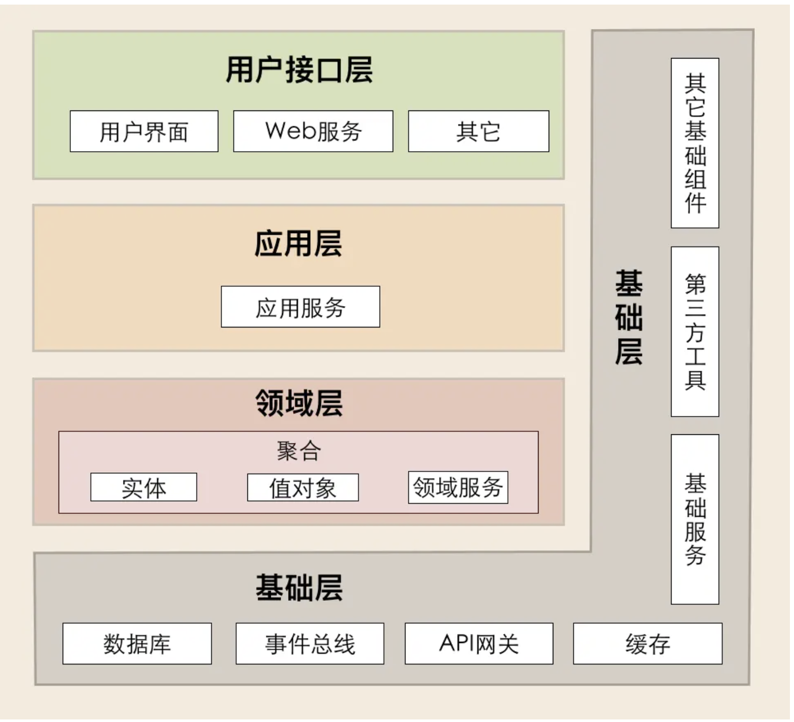

# 驱动领域设计

领域驱动设计（Domain-Driven Design，简称DDD）是一种软件开发方法论，并不是一种具体的架构，重点关注解决复杂业务需求的领域问题。它强调将领域专家的知识融入到软件开发过程中，通过建立一个基于领域模型的统一语言来提高软件系统的设计和实现质量。

## 1. MVC架构模式

在传统应用程序中，我们通常采用经典的MVC（Model-View-Controller）架构进行开发，它将整体的系统分成了 Model（模型），View（视图）和 Controller（控制器）三个层次，也就是将用户视图和业务处理隔离开，并且通过控制器连接起来，很好地实现了表现和逻辑的解耦，是一种标准的软件分层架构。

在遵循此分层架构的开发过程中，我们通常会建立三个Maven Module：Controller、Service 和 Dao，它们分别对应表现层、逻辑层和数据访问层。（Model层是包含数据库表对应的属性。有的应用会将其单独抽取出来作为一个Maven Module，但实际上它可以合并到 DAO 层。）


**MVC架构模型的不足**

1. 代码角度
   - service 层职责过重，在MVC架构中，Service层常常被赋予处理复杂业务逻辑的任务。随着业务逻辑的增长，Service层可能变得臃肿和复杂。业务逻辑有可能分散在各个Service类中，使得业务逻辑的组织和维护成为一项挑战。
   - 过于关注数据库而忽视领域建模，虽然MVC的设计初衷是对数据、用户界面和控制逻辑进行分离，但它在面对复杂业务场景时并未给予领域建模足够的重视。这可能导致代码难以理解和扩展，因为代码更像是围绕数据库而不是业务需求进行设计。（面向数据库表编程，而非模型编程）
   - 瘦实体模型：只起到数据类的作用，业务逻辑散落到 service，可维护性越来越差。
   - 实体类之间的关系是复杂的网状结构，成为大泥球，牵一发而动全身，导致不敢轻易改代码。
   - 对外接口直接暴露实体模型，导致不必要开放内部逻辑对外暴露，就算有 DTO 类一般也是实体类的直接 copy。
   - 外部依赖层直接从 service 层调用，字段转换、异常处理大量充斥在 service 方法中。
2. 项目管理角度
   - 边界划分不明确，在MVC架构中，顶层设计上的边界划分并没有明确的规则，往往依赖于技术负责人的经验。在大规模的团队协作中，这可能导致职责不清晰、分工不明确等问题。
   - 单元测试困难，在MVC架构中，Service层通常以事务脚本的方式进行开发，并且往往耦合了各种中间件操作，如数据库、缓存、消息队列等。这种耦合使得单元测试变得困难，因为要在没有这些中间件的情况下运行测试可能需要大量的模拟或存根代码。
   - 交付效率：越来越低。
   - 理解成本高：新成员介入成本高，长期会导致模块只有一个人最熟悉，离职成本很大。

## 2. DDD 基本概念

1. 统一语言：是提炼领域知识的输出结果，也是进行后续需求迭代及重构的基础。
2. 边界上下文 （Bounded Context）：包含两部分：上下文（Context）是业务目标，限界（Bounded）则是保护和隔离上下文的边界。

    - 领域、子域、支撑域
    - 聚合、实体、值对象
    - 分层：用户接口层、应用层、领域层、基础层

3. 聚合根 AggregateRoot
4. 聚合本身也是一个实体，聚合可以包含其他实体，其他实体不能脱离聚合而单独提供服务.
5. 值对象：没有主键，依附于实体而存在，比如用户实体下住址对象，一般在数据库中已 json 字符串的形式存在；最常见的值对象是枚举；
6. 贫血/充血模型：将：“状态”(数据，成员对象)、“行为 “(逻辑、过程)，分离到不同的对象中，只有状态的对象 (VO -> Value Object)  被称为贫血模型，只有行为的对象，就是框架分层中常见的 Logic/Service/Manager 层
7. 领域对象，通常指的是实体(Entity)。在领域驱动设计中，实体是领域模型的核心部分，它代表领域中具有独立标识和生命周期的概念。实体具有自己的属性和行为，并且能够封装相关的业务规则和逻辑。


## 3. DDD 架构模型

在DDD中，通常将应用程序分为四个层次，分别为用户接口层（Interface Layer），应用层（Application Layer）， 领域层（Domain Layer），基础设施层（Infrastructure Layer），每个层次承担着各自的职责和作用。




### 3.1 接口层（Interface Layer）

负责处理与外部系统的交互，包括UI、Web API、RPC接口等。它会接收用户或外部系统的请求，然后调用应用层的服务来处理这些请求，最后将处理结果返回给用户或外部系统。

```xml
interface
├── controller           定义Controller类      
├── api                  定义接口层的服务类和服务接口
├── dto                  定义数据传输对象，前后端对接DTO（Request、Reponse）
├    ├── request         定义前端输入参数对象，通用用 xxxCommand、xxxQuery  
├    ├── reponse         定义后端返回结果对象，通用用 xxxResDTO、xxxResVO 
├── handler              全局异常处理类或者全局拦截器
├── websocket            
└── rpc
```

### 3.2 应用层（Application Layer）


主要负责应用程序具体的业务逻辑，处理输入输出，协调不同领域对象之间的交互。通常来说，它们是面向用户/客户端的服务，其主要作用是根据用户需求进行请求的分发和协调。例如，一个UserApplicationService 可以实现注册、登录等用户相关的功能。

它承担协调领域层和基础设施层的职责，实现具体的业务逻辑。它调用领域层的领域服务和基础设施层的基础服务，完成业务逻辑的实现。

应用层要尽量简单。它不包含任务业务规则或知识，只是为了下一层的领域对象协助任务、分配工作。它没有反映业务情况的状态，但它可以具有反映用户或程序的某个任务的进展状态。

应用层主要负责组织整个应用的流程，是面向用例设计的。

对于复杂的业务来说，应用层也有几种模式：

- 编排服务：最典型比如 Drools；
- Command、Query 命令模式；
- 业务按 Rhase、Step 逐层拆分模式；

```java
// 应用层application可以合并到领域层biz目录。
application
├── assembler            负责数据传输对象DTO与领域对象Domain相互转换。
├── external             存放ExternalService类，负责与其他系统的应用层进行交互，通常是我们主动访问第三方服务。
├── dto                  存放前后端对接DTO（Request、Reponse）
├    ├── request 
├    ├── reponse
├── factory              工厂方法
├── model                存放DTO（ExtRequest、ExtReponse）类。
└── service/facade       调用Domain执行命令操作，负责Domain的任务编排和分配工作
```

问题1：前后端交互的dto或command，以及assemler转换器，是属于应用层还是接口层？

通常情况下，可以将DTO和Command放在接口层，而将Assembler转换器放在应用层。

1. DTO和Command：接口层负责定义系统对外暴露的服务接口，DTO和Command是用于在接口层和外部系统/客户端之间传输数据的对象。DTO（数据传输对象）是用于承载数据并跨越层边界进行数据传递的纯数据结构。Command是一种特殊类型的DTO，用于表示业务操作的命令。这些数据对象的定义属于接口层的职责。
2. Assembler：Assembler转换器用于在不同的层之间进行数据转换和映射。它的主要作用是将DTO或Command转换为领域对象，或将领域对象转换为DTO或Command。由于Assembler涉及到数据的转换和映射逻辑，它通常被视为应用层的责任。应用层使用Assembler来协调接口层的DTO/Command和领域层的对象之间的数据转换。

这种划分方式有助于将关注点分离，并提高代码的可读性和可维护性。但请注意，具体的应用架构和团队实践可能会有所不同，你可以根据具体情况进行适当的调整。

### 3.3 领域层（Domain Layer）

该层包含了业务领域的所有元素，如实体、值对象、领域服务、聚合、工厂和领域事件等。这一层的主要职责是实现业务领域的核心逻辑。

模型层Biz

```
domain
├── bc1                       某个业务的限界上下文 Bounded Context
├    ├── event                不同的 BC 之间使用基于「领域事件」的交互方式（也可以自定义 DSL，防腐层等不同的解决方案）
├    ├    ├── handler         具体处理事件的对象
├    ├    ├── producer        事件的发送方
├    ├── exception            定义了领域层相关的异常，即一般称之为的 BusinessException，代表违反某些业务逻辑的异常
├    ├── model                领域对象，一般建议使用「充血模型」进行建模
├    ├── service            
├    ├── specification        用于表示领域概念的查询条件或规约的对象
├    ├── repository           聚合仓储服务，提供接口IRepository
```

注意，领域对象是具有属性和行为的对象，是有状态的，数据和行为都是可以重用的。

应用“贫血模型”会把属于对象的数据和行为分离，领域对象不再是一个整体，破坏了领域模型。


领域层主要负责表达业务概念，业务状态信息和业务规则。

Domain层是整个系统的核心层，几乎全部的业务逻辑会在该层实现。

领域模型层主要包含以下的内容：

实体(Entities):具有唯一标识的对象

值对象(Value Objects): 无需唯一标识。

领域服务(Domain): 与业务逻辑相关的，具有属性和行为的对象。

聚合/聚合根(Aggregates & Aggregate Roots): 聚合是指一组具有内聚关系的相关对象的集合。

工厂(Factories): 创建复杂对象，隐藏创建细节。

仓储(Repository): 提供查找和持久化对象的方法。

领域层biz目录：

（1）domain

存放Domain类，Domain负责业务逻辑，调用Repository对象来执行数据库操作。Domain没有数据库操作，具体的数据库操作是通过调用Repository对象完成的。

（2）repository

存放Repository类，调用Dao或者Mapper对象类执行数据库操作。

在领域驱动设计（DDD）中，Repository 模式是一种用于封装领域对象的持久化操作的模式。Repository 是一个用于存储和检索领域对象的接口，它提供了一组标准的方法来定义对领域对象的持久化操作。

Repository 的主要目的是将领域对象与底层的数据访问逻辑解耦，使得领域对象可以专注于业务逻辑而不用关心具体的数据存储细节。通过使用 Repository，可以将数据访问操作抽象成一组统一的方法，从而提供了更加高层次和友好的接口供领域层使用。

Repository 模式通常提供以下常见方法：

- `getById(id)`：根据唯一标识符获取领域对象。
- `save(entity)`：保存或更新领域对象到数据存储中。
- `delete(entity)`：从数据存储中删除领域对象。
- `findByCriteria(criteria)`：根据某些特定的查询条件查询领域对象列表。

在实现 Repository 接口时，具体的数据访问逻辑可以通过不同的技术（如关系型数据库、NoSQL 数据库、文件系统等）来实现。Repository 可以选择使用 ORM 框架或直接使用 SQL 语句进行数据操作，这取决于具体的项目需求和技术栈。

通过使用 Repository 模式，可以实现领域层与数据访问层的解耦，提高代码的可维护性和可测试性。同时，Repository 还有助于保持领域模型的纯净性，使得领域对象更加独立、可复用和可扩展。

Repository 是面向领域的，Repository 定义的目的不是 DB 驱动的，Repository 管理的数据的最小粒度是聚合根

（3）factory

存放Factory类，负责Domain和实体Entity的转换。


### 3.4 基础设施层（Infrastructure Layer）

主要提供通用的技术能力，负责与外部资源进行交互。如数据持久化、缓存、消息队列、文件系统等基础设施服务。它可被其他三层调用，提供各种必要的技术服务。

基础设施包括独立于我们的应用程序存在的一切：外部库，数据库引擎，应用程序服务器，消息后端等。

```java
Infrastructure
├── commons                   存放通用工具类Utils、常量类Constant、枚举类Enum、BizErrCode错误码类等等
├    ├── constant  
├    ├── enums  
├    ├── utils    
├── persistence   
├    ├── converter  
├    ├── entity  
├    ├── external             外部服务层，存放ExternalService类，负责与其他系统的应用层进行交互，通常是我们主动访问第三方服务。  
├    ├── mapper           
├    ├── repository           负责与数据库进行交互，是领域层中 Repository 接口的具体实现
```

问题2：外部服务层（External Services） 不是在应用层嘛？

外部服务层放置在应用层的优点是，它可以直接与应用层逻辑进行交互，并提供对外部服务的访问接口。这样可以更好地将应用层从外部服务的细节中解耦，使应用层保持专注于业务逻辑的实现。

然而，有些团队也会选择将外部服务层单独提取出来，作为一个独立的层次。这样做的优点是可以更好地隔离外部服务与应用层的关注点，以及其他基础设施相关的操作。这种方式可以提高整个系统的可测试性和可伸缩性，并促使遵循单一职责原则。

问题3：经典的 Hibernate 笛卡尔积问题

答案是在聚合根中，一般不会加在大量的关联实体对象。如果确实需要查询关联对象而关联对象又比较多怎么办呢？在 DDD 中有一个 CQRS (Command-Query Responsibility Segregation) 模式，是一种读写分离模式，在此场景中需要将查询操作放到查询命令中分页查询。

当然 CQRS 也是一个很复杂模式，不应照搬他人方案，而是根据自己的业务场景选择适合自己的方案。