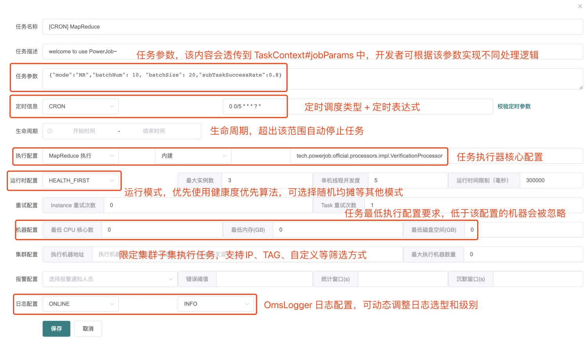

# PowerJob

> [官网：http://www.powerjob.tech/index.html](http://www.powerjob.tech/index.html)

## 1. 背景

公司前期所有的系统的定时任务，都是使用 Spring 框架自带的 @Scheduled 注解实现，用于在指定的时间间隔或固定的时间点执行方法。这种方式简单，能够快速实现基本的定时任务需求。但只适用于简单的定时任务需求。

后来部分项目引入了 Quartz 框架，Quartz 是一个开源的、功能强大且灵活的任务调度框架，基于 CRON 调度作业。它支持复杂的任务调度需求，如多个作业、依赖关系、作业状态管理等。支持分布式集群部署，但是没有可视化界面，人工干预调度任务非常困难。

现阶段，随着系统规模的扩大和定时任务数量的增加，原有实现方式暴露出以下问题：

1. 缺乏任务调度中心，监控和管控功能较弱，定时任务的触发时点改变，需要重新发布才能修改这些条件。
2. 在多实例情况下，同一定时任务会在多台服务器上都执行，导致资源浪费，且多任务间没有协调和管理。

## 2. 概念

PowerJob（原OhMyScheduler）是全新一代分布式任务调度与计算框架，PowerJob 的设计目标为企业级的分布式任务调度平台，即成为公司内部的任务调度中间件。整个公司统一部署调度中心 powerjob-server，旗下所有业务线应用只需要依赖 powerjob-worker 即可接入调度中心获取任务调度与分布式计算能力。其主要功能特性如下：

- 使用简单：提供前端 Web 界面，允许开发者可视化地完成调度任务的管理（增、删、改、查）、任务运行状态监控和运行日志查看等功能。
- 定时策略完善：支持 CRON 表达式、固定频率、固定延迟和API四种定时调度策略。
- 执行模式丰富：支持单机、广播、Map、MapReduce 四种执行模式，其中 Map/MapReduce 处理器能使开发者寥寥数行代码便获得集群分布式计算的能力。
- 工作流支持：支持在线配置任务依赖关系（DAG），以可视化的方式对任务进行编排，同时还支持上下游任务间的数据传递，以及多种节点类型（判断节点 & 嵌套工作流节点）。
- 执行器支持广泛：支持 Spring Bean、内置/外置 Java 类，另外可以通过引入官方提供的依赖包，一键集成 Shell、Python、HTTP、SQL 等处理器，应用范围广。
- 运维便捷：支持在线日志功能，执行器产生的日志可以在前端控制台页面实时显示，降低 debug 成本，极大地提高开发效率。
- 依赖精简：最小仅依赖关系型数据库（MySQL/PostgreSQL/Oracle/MS SQLServer...）
- 高可用 & 高性能：调度服务器经过精心设计，一改其他调度框架基于数据库锁的策略，实现了无锁化调度。部署多个调度服务器可以同时实现高可用和性能的提升（支持无限的水平扩展）。
- 故障转移与恢复：任务执行失败后，可根据配置的重试策略完成重试，只要执行器集群有足够的计算节点，任务就能顺利完成。


### 2.1 分组概念

appName：应用名称，建议与用户实际接入 PowerJob 的应用名称保持一致，用于业务分组与隔离。一个 appName 等于一个业务集群，也就是实际的一个 Java 项目。

### 2.2 核心概念

- 任务（Job）：秒速了需要被 PowerJob 调度的任务信息，包括任务名称、调度时间、处理器信息等。
- 任务实例（JobInstance，简称 Instance）：任务（Job）被调度执行后会生成任务实例（Instance），任务实例记录了任务的运行时信息（任务与任务实例的关系类似于类与对象的关系）。
- 作业（Task）：任务实例的执行单元，一个 JobInstance 存在至少一个 Task，具体规则如下：

    - 单机任务（STANDALONE）：一个 JobInstance 对应一个 Task
    - 广播任务（BROADCAST）：一个 JobInstance 对应 N 个 Task，N 为集群机器数量，即每一台机器都会生成一个 Task
    - Map/MapDeduce 任务：一个 JobInstance 对应若干个 Task，由开发者手动 map 产生

- 工作流（Workflow）：由 DAG（有向无环图）描述的一组任务（Job），用于任务编排。
- 工作流实例（WorkflowInstance）：工作流被调度执行后会生成工作流实例，记录了工作流的运行时信息。

### 2.3 扩展概念

- JVM 容器：以 Maven 工程项目的维度组织一堆 Java 文件（开发者开发的众多 Java 处理器），可以通过前端网页动态发布并被执行器加载，具有极强的扩展能力和灵活性。
- OpenAPI：允许开发者通过接口来完成手工的操作，让系统整体变得更加灵活。开发者可以基于 API 便捷地扩展 PowerJob 原有的功能。
- 轻量级任务：单机执行且不需要以固定频率或者固定延迟执行的任务 （>= v4.2.1）
- 重量级任务：非单机执行或者以固定频率/延迟执行的任务 （>= v4.2.1）

### 2.4 定时任务类型

- API：该任务只会由 powerjob-client 中提供的 OpenAPI 接口触发，server 不会主动调度。
- CRON：该任务的调度时间由 CRON 表达式指定。
- 固定频率：秒级任务，每隔多少毫秒运行一次，功能与 java.util.concurrent.ScheduledExecutorService#scheduleAtFixedRate 相同。
- 固定延迟：秒级任务，延迟多少毫秒运行一次，功能与 java.util.concurrent.ScheduledExecutorService#scheduleWithFixedDelay 相同。
- 工作流：该任务只会由其所属的工作流调度执行，server 不会主动调度该任务。如果该任务不属于任何一个工作流，该任务就不会被调度。

备注：固定延迟和固定频率任务统称秒级任务，这两种任务无法被停止，只有任务被关闭或删除时才能真正停止任务。

## 3. 项目说明

本项目由主体项目（PowerJob）和前端项目（PowerJob-Console）构成，其中，PowerJob各模块说明如下：

```java
├── LICENSE
├── powerjob-client // powerjob-client，普通Jar包，提供 OpenAPI
├── powerjob-common // 各组件的公共依赖，开发者无需感知
├── powerjob-remote // 内部通讯层框架，开发者无需感知
├── powerjob-server // powerjob-server，基于SpringBoot实现的调度服务器，负责提供 Web 服务和完成任务的调度
├── powerjob-worker // powerjob-worker，普通Jar包，接入powerjob-server的应用需要依赖该Jar包，负责执行用户所编写的任务代码，同时提供分布式计算能力。
├── powerjob-worker-agent // powerjob-agent，是一个仅集成了官方处理器的执行器。其实就是为 worker 加了一个 main 方法，如果常见需求为脚本的调度执行，可以考虑直接部署 agent，简单快捷方便
├── powerjob-worker-samples // 教程项目，包含了各种Java处理器的编写样例
├── powerjob-worker-spring-boot-starter // powerjob-worker 的 spring-boot-starter ，spring boot 应用可以通用引入该依赖一键接入 powerjob-server
├── powerjob-official-processors // 官方处理器，包含一系列常用的 Processor，依赖该 jar 包即可使用
├── others
└── pom.xml

```

## 4. 本地启动入门

### 4.1 调度器  powerjob-server

1. 创建数据库（仅需要创建数据库）：找到你的 DB，运行 SQL CREATE DATABASE IF NOT EXISTS `powerjob-daily` DEFAULT CHARSET utf8mb4
2. 修改 powerjob-server-starter 中的 application 配置文件的数据源配置。其中 jdbc URL 中指定的数据库，如果是新的数据库，即与业务库分离，需要手动创建数据库，相关表自动创建，无需手动。
3. 修改 powerjob-server-starter 中的 application 配置文件的存储扩展配置。支持 MongoDB、OSS、数据库等方式，主要用于实现在线日志、容器部署等扩展功能。
4. 修改 powerjob-server-starter 中的 application 配置文件的的告警配置。
5. 启动，可以直接通过启动类 tech.powerjob.server.PowerJobServerApplication 启动调度服务器。启动成功后，访问 http://127.0.0.1:7700/ ，如果能顺利出现 Web 界面，则说明调度服务器启动成功！
6. 注册应用和登录。v4.x及前序版本和v5.x版本页面操作方式不同！

### 4.2 执行器的示例代码 powerjob-worker-samples

1. 修改 powerjob-worker-samples 中的 application 配置文件的 app-name。改为控制台注册的名称。
2. 编写自己的处理器代码

```java
@Slf4j
@Component
public class StandaloneProcessorDemo implements BasicProcessor {

    @Override
    public ProcessResult process(TaskContext context) throws Exception {

        // PowerJob 在线日志功能，使用该 Logger 打印的日志可以直接在 PowerJob 控制台查看
        OmsLogger omsLogger = context.getOmsLogger();
        omsLogger.info("StandaloneProcessorDemo start process,context is {}.", context);
        
        return new ProcessResult(true, "process successfully~");
    }
}
```

3. 启动示例程序，即直接运行主类 tech.powerjob.samples.SampleApplication，观察控制台输出信息，判断是否启动成功。


### 4.3 任务配置与运行

#### 4.3.1 新建任务

> 点击“任务管理” -> “新建任务”（右上角），开始创建任务。
>
> 固定延迟（毫秒）和固定频率（毫秒）区别：
> - 固定延迟指的是任务执行完成后需要等待固定的时间间隔，然后再次执行任务。
> - 固定频率指的是任务按照固定的时间间隔进行执行，无论任务的执行时间长短。不受上一次任务执行时间的影响。



- 任务名称：名称，便于记忆与搜索，无特殊用途，请尽量简短
- 任务描述：描述
- 任务参数：任务处理时能够获取到的参数，即各个 Processor 的 process 方法入参 TaskContext 对象的jobParams 属性
- 定时信息：任务的触发方式，由下拉框和输入框组成

    - API：不需要填写任何参数，表明该任务由 OpenAPI 触发，不会被调度器主动调度执行
    - CRON：填写 CRON 表达式
    - 固定频率（毫秒）：任务以固定的频率执行，填写整数，单位毫秒
    - 固定延迟（毫秒）：任务以固定的延迟执行，填写整数，单位毫秒
    - 工作流：不需要填写任何参数，表明该任务由工作流（workflow）触发
    - 每日固定间隔：哪几天的哪些时间段需要执行，比如每周二和三的10点到11点间每10分钟触发一次

- 生命周期：任务的有效时间范围，不在生命周期的任务会自动停止。常用于任务的延迟启动和过期自动关停。
- 执行配置：由执行类型（单机、广播、Map 和 MapReduce ）、处理器类型和处理器参数组成，后两项相互关联。

    - 内置 Java 处理器
        - 方式一 -> 填写该处理器的全限定类名（eg, tech.powerjob.samples.processors.MapReduceProcessorDemo）
        - 方式二 -> 填写 IOC 容器的 bean 名称，比如 Spring 用户可填写 Spring Bean 名称（eg,  处理器使用注解 @Component(value = "powerJobProcessor")，则控制台可填写 powerJobProcessor）
        - 方式三 -> 方法级注解，非 MapReduce 任务可直接使用注解 @PowerJobHandler 将某个方法转化为 PowerJob 任务，并设置唯一入参 TaskContext注入上下文
    - Java 容器 -> 填写容器ID#处理器全限定类名（eg，1#cn.edu.zju.oms.container.ContainerMRProcessor）
    - SHELL、Python、SQL 、HTTP 等任务的执行

- 运行时配置
    
    - 派发策略：默认健康度优先，优先选择性能最优机器进行执行，可选随机均摊等其他派发模式
        - HEALTH_FIRST：默认策略，健康度优先，会选择 worker 集群中状态最好的机器作为本次任务的主节点
        - RANDOM：随机
    - 最大实例数：该任务同时执行的数量，0 代表不限制实例数量
    - 单机线程并发数：该实例执行过程中每个 Worker 使用的线程数量（MapReduce 任务生效，其余无论填什么，都只会使用必要的线程数）
    - 运行时间限制：限定任务的最大运行时间，超时则视为失败，单位毫秒，0 代表不限制超时时间（不建议不限制超时时间）。

- 重试配置：

    - Instance 重试次数：实例级别，失败了整个任务实例重试，会更换 TaskTracker（本次任务实例的Master节点），代价较大，大型Map/MapReduce慎用。
    - Task 重试次数：Task 级别，每个子 Task 失败后单独重试，会更换 ProcessorTracker（本次任务实际执行的 Worker 节点），代价较小，推荐使用。
    - 注：请注意同时配置任务重试次数和子任务重试次数之后的重试放大，比如对于单机任务来说，假如任务重试次数和子任务重试次数都配置了 1 且都执行失败，实际执行次数会变成 4 次！推荐任务实例重试配置为 0，子任务重试次数根据实际情况配置。

- 机器配置：用来标明允许执行任务的机器状态，避开那些摇摇欲坠的机器，0 代表无任何限制。
    
    - 最低 CPU 核心数：填写浮点数，CPU 可用核心数小于该值的 Worker 将不会执行该任务。
    - 最低内存（GB）：填写浮点数，可用内存小于该值的 Worker 将不会执行该任务。
    - 最低磁盘（GB）：填写浮点数，可用磁盘空间小于该值的 Worker 将不会执行该任务。

- 集群配置

    - 执行机器地址，指定集群中的某几台机器执行任务
        - IP模式：多值英文逗号分割，如192.168.1.1:27777,192.168.1.2:27777。常用于 debug 等场景，需要指定特定机器运行。
        - TAG 模式：通过 PowerJobWorkerConfig#tag将执行器打标分组后，可在控制台通过 tag 指定某一批机器执行。常用于分环境分单元执行的场景。如某些任务需要屏蔽安全生产环境（tag 设置为环境标），某些任务只需要在特定单元执行（tag 设置单元标）
    - 最大执行机器数量：限定调动执行的机器数量

- 报警配置：选择任务执行失败后报警通知的对象，需要事先录入。
    
    - 对于秒级任务，支持分别指定错误阈值(C)、统计窗口(S)、沉默窗口(W) 来定制更加丰富的告警机制（表示的是在 S 秒内失败次数达到 C 次就触发告警，并且沉默 W 秒）

- 日志配置：可使用控制台配置调整 Job 使用的 Logger 及 LogLevel
    
    - 支持 SERVER（服务端日志，默认）、LOCAL（本地日志）、STDOUT（系统输出）、NULL（空实现）4种 LogType
    - 支持 DEBUG、INFO、WARN、ERROR、OFF 5种级别控制
    - 使用建议：初期调试可使用 SERVER 日志，后续功能稳定后改为 LOCAL，并调高日志级别，降低通讯压力，消除性能瓶颈问题


## 5. 核心配置说明


### 5.2


## 2. 部署

**调度器**

修改 powerjob-server-starter 中的 application 配置文件的数据源配置等。其中 jdbc URL 中指定的数据库，如果是新的数据库，即与业务库分离，需要手动创建数据库，相关表自动创建，无需手动。

需要手动在 app_info 表中，新增一条记录 填写 app_name 和 password，appname 与执行器配置的相对应。

调度服务器（powerjob-server）为了支持环境隔离，分别采用了日常（application-daily.properties）、预发（application-pre.properties）和线上（application-product.properties）三套配置文件，请根据实际需求进行修改。

**执行器**

1. 引入 powerjob starter 依赖

```xml
<!-- powerjob-worker -->
<dependency>
    <groupId>tech.powerjob</groupId>
    <artifactId>powerjob-worker-spring-boot-starter</artifactId>
    <version>${latest.powerjob.version}</version>
</dependency>

```
2. application 配置文件，注意 powerjob.worker.server-address，是我们调度器地址，powerjob.worker.app-name 与我们调度器中提到的 app_info 表 app_name 内容相对应
3. 执行器代码示例：其中注释的代码是模拟工作流场景下的代码，如果不需要使用工作流则忽略。

```java
@Component("WorkingStartProcessors")
public class WorkingStartProcessors implements BasicProcessor {

    @Autowired
    private WorkingStartJob workingStartJob;

    /**
     * 第一步：需要先create database powerjob
     * 第二步：在app_info表中配置 app name ，与worker (即java服务) 的appname对应, 并设置账号密码（server控制台登录密码）
     * 第三步：与xxl job类似，在控制台页面新建任务, 其中全限定类名，也可以填写bean value
     * （如本类 被@Component("WorkingStartProcessors")修饰， bean value即为WorkingStartProcessors)
     */

    /**
     * tips: cron 模式下 最小间隔为15s
     * 否则需要修改 powerjob server源码SCHEDULE_RATE数值(不建议)
     */
    @Override
    public ProcessResult process(TaskContext taskContext) throws Exception {

         // do something

//
//        WorkflowContext workflowContext = taskContext.getWorkflowContext();
//        // 模拟工作流的判断
//        if (System.currentTimeMillis() % 2 == 0) {
//
//            // 工作流注意事项：
//            // 如果有判断节点 需要在代码中声明返回结果 在控制台的流程图中 用var res = context['result']   res == "true"进行判断
//            // 流程图的每一个节点都记得要开启
//            workflowContext.appendData2WfContext("result",false);
//            System.out.println("-------------false-------------");
//        } else {
//            workflowContext.appendData2WfContext("result",true);
//            System.out.println("-------------true-------------");
//
//        }
        return new ProcessResult(true);
    }
}
```

4. 启动执行器 ，执行器集群部署只需在 powerjob.worker.server-address 指定调度器地址，用逗号分隔, 如果同一服务器启动了多执行器 ，每个执行器 powerjob.worker.port 需要修改。
5. 控制台界面：
tips: 小于15s时，会按照15s间隔执行，这是powerjob-server源码中限制的