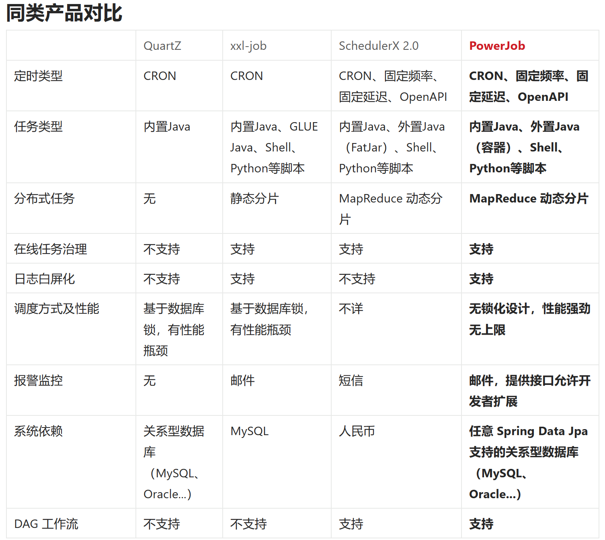

# 定时器

## 1. 定时实现方案

1. while 循环执行 thread 线程，线程调用 sleep 睡眠
2. Timer 和 TimerTask， 简单无门槛，一般也没人用
3. 线程池，Executors.newScheduledThreadPool，底层 ScheduledThreadPoolExecutor
4. @Schedule 注解，一般集成于项目中，小任务很方便
5. Quartz
6. XXL-Job 是一个分布式任务调度平台，用于在分布式系统中进行任务调度和管理。XXL-Job提供了可视化的任务管理界面、任务的动态添加、修改、删除等功能。它支持分布式部署，并提供了任务执行日志、任务运行状态等监控功能。XXL-Job是为了解决分布式系统中任务调度的问题而设计的，适合于大规模分布式系统中的定时任务调度。
7. Elastic-Job 是当当网在2015年开源的一个分布式调度解决方案 ，和 XXL-Job 功能相似，以 jar 包形式提供分布式任务的协调服务， 由两个相互独立的子项目 Elastic-Job-Lite 和 Elastic-Job-Cloud 组成。
8. Saturn，Saturn 是唯品会在 github 开源的一款分布式任务调度产品。它是基于当当 elastic-job 来开发的，其上完善了一些功能和添加了一些新的 feature。
9. PowerJob 的设计目标为企业级的分布式任务调度平台，即成为公司内部的任务调度中间件。整个公司统一部署调度中心 powerjob-server，旗下所有业务线应用只需要依赖 powerjob-worker 即可接入调度中心获取任务调度与分布式计算能力。

## 2. 框架对比

> 该截图来自 [PowerJob 官方文档](https://www.yuque.com/powerjob/guidence/intro)




### 2.1 @Schedule 和 Quartz

都能基于 cron 表达式执行定时任务，但明显 Quartz 框架的能力更强，他可以对任务进行增删改查的操作。

### 2.2 Quartz 和 XXL-Job

XXL-Job 是一个轻量级分布式任务调度平台，支持可视化页面对任务进行 CRUD 操作，底层基于 Quartz 实现并支持集群部署实现高可用 HA。

### 2.3 XXL-Job 和 PowerJob

- PowerJob 支持更多的定时信息配置，XXL-Job 仅支持 cron
- PowerJob 支持设置任务的生命周期，XXL-Job 不支持
- PowerJob 可以更好的查看执行器的机器信息（其中内存为 JVM 内存），XXL-Job 不支持
- 工作流支持：XXL-Job 支持父子任务执行，PowerJob 可以支持多级，甚至可以针对条件判断选择执行
- cpu 使用对比：PowerJob 整体占用较多，但 CPU 占用率并不高，可以忽略不计
- JVM 堆内存对比：因为 PowerJob 有更多的功能，相应的资源消耗也会更多，XXL-Job 峰值约为250M，PowerJob 峰值约为700M，且 PowerJob 内存占用长期大于 XXL-Job


**总结**

PowerJob 有后发优势 调度任务配置更加灵活，截至目前仍在维护，功能更全面，但相应的内存占用约为 XXL-Job 的2-3倍。但 XXL-Job 用户量会比 PowerJob 庞大，内存占用较小。

结合实际业务以及服务器资源空闲情况 考虑是否需要使用到灵活配置特性，如服务器资源紧张，在可预见范围内，仅需要基本的定时任务执行功能，推荐 xxl-job，如服务器资源不紧张，为后续项目灵活性考虑，可选择powerjob。


## 3. cron 表达式

Cron表达式（CronExpression）用于定义时间规则，是一个字符串，一般有两种表达：

1. 秒 分 小时 日 月 星期 年(可选)
2. 秒 分 小时 日 月 星期

其中，年份为可选的，所以一般表达式为6-7个域，每个域以空格分开。其中的星期除了可以使用英文缩写，也可以用数字1-7数字来表示，注意1表示的是星期日，7表示的星期六。

```shell
# 秒 0-59  / 每隔几秒钟   - 在几到几秒钟   * 每秒钟   , 几和几秒钟
# 分 0-59  / 每隔几分钟   - 在几到几分钟   * 每分钟   , 几和几分钟
# 时 0-23  / 每隔几小时   - 在几到几小时   * 每小时   , 几和几小时
# 日 1-31  / 每隔几天     - 在几到几天     * 每天     , 几和几天   ? 不确定日期，由于和周一起使用，就相互排斥   C   L 最后一日   W 只有日期有，表示最近的工作日   LW 这个月的最后一周的工作日
# 月 1-12  / 每隔几月     - 在几到几月     * 每月     , 几和几月
# 周 1-7   / 每隔几周     - 在几到几周     * 每周     , 几和几周   ? 不确定日期，由于和周一起使用，就相互排斥   C   L 星期六，6L表示每个月的最后一个星期五  # 只有星期有，比如6#3表示本月第三周的星期五  
# 年 1970-2099 / 每隔几年   - 在几到几年   * 每年   , 几和几年
```

**示例**

0 0 * * * ?	                每小时0分0秒运行
0 0 1 * * ?	                每天01:00:00运行
0 0 1 * * ? *	            每天01:00:00运行，同上
0 0 1 * * ? 2021	        2021年每天01:00:00运行
0 * 10 * * ?	            每天10点-11点之间每分钟运行一次，开始于10:00:00，结束于10:59:00
0 0/5 10 * * ?	            每天10点-11点之间每5分钟运行一次，开始于10:00:00，结束于10:59:00
0 0/5 10,15 * * ?	        每天10点-11点之间每5分钟运行一次，每天15点-16点之间每5分钟运行一次
0 0-10 10 * * ?	            每天10:00-10:10之间每分钟运行
0 10 1 ? * MON-FRI	        每周一，二，三，四，五的1:10分运行
0 10 1 1 * ?	            每月1日的1:10分运行
0 10 1 L * ?	            每月最后一天1:10分运行
0 10 1 ? * 6L	            每月最后一个星期五1:10分运行
0 10 1 ? * 6#3	            每月第3个星期五1:10分运行


## 4. 分布式微服务架构下，为什么不推荐使用 Quartz

Quartz 支持分布式集群部署，但是没有可视化界面，人工干预调度任务非常困难。

Quartz 集群是通过数据库表来感知其他节点的存在的，各个节点之间不直接通信，只有使用持久化的 JobStore 才能完成 Quartz 集群，而且每个节点都必须分享同一个数据库。


锁机制

目前 Quartz 实现分布式任务调度用的是库表行级锁机制，其原理是利用 qrtz_locks 表保证某个节点只能有一个任务线程获得该行级锁，如果有其他节点想执行同样的任务需要等之前线程释放锁，否则处于等待状态。

也就是说，Quartz 的分布式集群原理是利用数据库锁来保证操作的顺序性，但是这里有个致命的问题：如果程序中有大量的短周期任务(比如订单处理、库存处理等)需要频繁处理，就会存在各节点的线程抢占数据库锁，从而导致大量线程处于等待状态， 其任务调度的性能将大大受限于业务。
