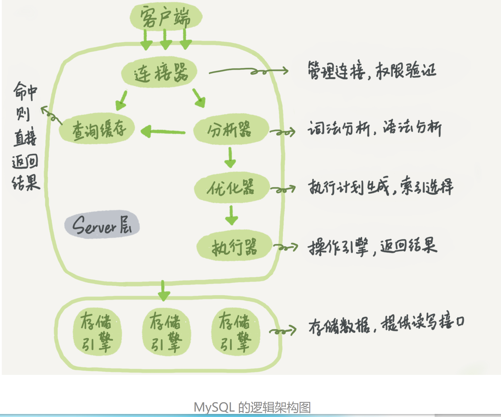

## 1. 安装（5.7.31）

### 1.1 windows(zip)

windows 系统下 mysql 安装有两种方式: msi 直接安装和 zip 解压缩安装，本章节详细讲解 zip 包方式

1. 解压，在根目录下新建 my.ini 配置文件
2. 管理员身份运行进入 cmd 命令行，然后进入 bin 目录，执行初始化命令：mysqld --initialize-insecure --user=mysql --console
3. 创建服务，可以不写服务名，默认是 mysql，如果安装多个服务，可以起不同的名字； mysqld --install [服务名]
4. 配置环境变量
5. 启动 net start [mysql]
6. 登录后修改密码

> **说明：**
>
> - 初始化时，可以使用命令（mysqld --verbose --help）查看参数配置，--initialize-insecure 标识初始化时创建 root 用户，无密码
> - 启动/停止服务命令：net start/stop [服务名]
> - 如果使用 zip 包安装多个版本 mysql，则第一个安装之后，不需要设置环境变量，否则第二次执行 mysqld 初始化时，不知道使用哪个 mysqld；如果第二个版本的安装成功，但启动失败，尝试重启电脑后，卸载重新安装即可
> - 如果卸载，zip 包安装方式在控制面板是找不到的，删除服务时，使用命令 sc delete [服务名]
> - 默认只能使用 localhost 连接，如果需要使用 ip 连接，则修改 root 账号的 host 信息：update user set host='%' where user='root';

### 1.2 linux

### 1.3 docker

```sh
[root@localhost mysql]# tree
.
├── conf
│   └── my.cnf
├── data
├── init
│   └── init.sql
└── mysql-stack.yml

2 directories, 3 files

[root@localhost mysql]# cat conf/my.cnf
[mysqld]
user=mysql
default-storage-engine=INNODB
character-set-server=utf8mb4
lower_case_table_names=1
sql_mode=STRICT_TRANS_TABLES,NO_ZERO_IN_DATE,NO_ZERO_DATE,ERROR_FOR_DIVISION_BY_ZERO,NO_AUTO_CREATE_USER,NO_ENGINE_SUBSTITUTION
innodb_log_file_size=256M
max_allowed_packet=1000M
max_connections=200
character-set-server=utf8
default-storage-engine=INNODB
innodb_buffer_pool_size=64M
net_read_timeout=600
net_write_timeout=600
[client]
default-character-set=utf8mb4
[mysql]
default-character-set=utf8mb4

[root@localhost mysql]# cat mysql-stack.yml
version: '3.8'
services:
  mysql:
    image: mysql:5.7.31
    environment:
      - TZ=Asia/Shanghai                # 设置时区为Asia/Shanghai
      - MYSQL_ROOT_PASSWORD=root        # root用户密码
    volumes:
      - "./data:/var/lib/mysql"         # 挂载数据
      - "./conf/my.cnf:/etc/my.cnf"     # 挂载配置文件
      - "./init:/docker-entrypoint-initdb.d/"       # 挂载初始化sql
    command:
      --default-authentication-plugin=mysql_native_password
    deploy:
      replicas: 1                       # 制定容器数量
      restart_policy:
        condition: on-failure
      resources:
        limits:
          cpus: "8"                     # 20%的内存可用处理时间
          memory: 4096M                 # 内存
      update_config:
        parallelism: 1                  # 每次启动一个容器一份服务
        delay: 5s                       # 更新一组容器之间的等待时间
        monitor: 10s                    # 单次更新多长时间后没有结束则判定更新失败
        max_failure_ratio: 0.1          # 更新时能容忍的最大失败率
        order: start-first              # 更新顺序为新任务启动优先
    ulimits:                            # 解决mysql占用内存过大的bug
      nproc: 65535
      nofile:
        soft: 20000
        hard: 40000
    ports:
      - 3306:3306
    networks:
      - mysql-net
networks:
  mysql-net:
    external: true

[root@localhost mysql]# cat init/init.sql
use mysql;
ALTER USER 'root'@'%' IDENTIFIED WITH mysql_native_password BY 'root';
grant all privileges on *.* to root@'%' identified by 'root' with grant option;
flush privileges;


[root@localhost mysql]# docker network create --driver overlay mysql-net
[root@localhost mysql]# docker stack deploy -c mysql-stack.yml mysql
```

### 1.4 my.ini、my.cnf 配置文件

```ini
[mysqld]
# 设置3306端口
port=3306
# 设置mysql的安装目录
basedir=D:\Database\mysql-5.7.31\mysql-5.7.31
# 设置mysql数据库的数据的存放目录
datadir=D:\Database\mysql-5.7.31\mysql-5.7.31\Data
# 允许最大连接数
max_connections=200
# 允许连接失败的次数。这是为了防止有人从该主机试图攻击数据库系统
max_connect_errors=10
# 服务端使用的字符集默认为UTF8
character-set-server=utf8
# 创建新表时将使用的默认存储引擎
default-storage-engine=INNODB
# 默认使用“mysql_native_password”插件认证
default_authentication_plugin=mysql_native_password
# 设置默认时区
default-time-zone=+8:00
# 严格sql模式(strict mode)
# ONLY_FULL_GROUP_BY: 对于GROUP BY聚合操作,如果在SELECT中的列,没有在GROUP BY中出现,那么这个SQL是不合法的,因为列不在GROUP BY从句中
# NO_AUTO_VALUE_ON_ZERO: 该值影响自增长列的插入。默认设置下，插入0或NULL代表生成下一个自增长值。如果希望插入的值为0,而该列又是自增长的,那么这个选项就有用了
# STRICT_TRANS_TABLES: 在该模式下，如果一个值不能插入到一个事务表中，则中断当前的操作,对非事务表不做限制
# NO_ZERO_IN_DATE: 在严格模式下,不允许日期和月份为零
# NO_ZERO_DATE: 设置该值,不允许插入零日期,插入零日期会抛出错误而不是警告。
# NO_AUTO_CREATE_USER: 禁止GRANT创建密码为空的用户
# NO_ENGINE_SUBSTITUTION: 如果需要的存储引擎被禁用或未编译，那么抛出错误。不设置此值时，用默认的存储引擎替代，并抛出一个异常
# ERROR_FOR_DIVISION_BY_ZERO: 在INSERT或UPDATE过程中,如果数据被零除,则产生错误而非警告。如果未给出该模式,那么数据被零除时MySQL返回NULL
sql_mode=ONLY_FULL_GROUP_BY,STRICT_TRANS_TABLES,NO_ZERO_IN_DATE,NO_ZERO_DATE,ERROR_FOR_DIVISION_BY_ZERO,NO_AUTO_CREATE_USER,NO_ENGINE_SUBSTITUTION

[mysql]
# 设置mysql客户端默认字符集
default-character-set=utf8
[client]
default-character-set=utf8
user=root
password='db12#$'
port=3306
```

## 2. 函数

### 2.1 字符函数

```sql
1. concat() -- 连接字符串
2. length() -- 字符串的字节个数（utf-8 时，一个汉字三个字节）
3. upper()/lower() ucase()/lcase()     -- 转换大小写
4. substr() substring() -- 截取子串
5. instr()              -- 子串第一次出现的索引位置，如果不存在，返回 0
6. ifnull(a1,a2)        -- 如果为 null 则替换成某个值 两个参数，
7. lpad/rpad            -- 左/右边填充
8. replace()            -- 替换
9. trim()               -- 去掉首尾空格，trim('a' from 'aaddda')去掉首尾的a
10. strcmp()            -- 比较两个字符串的大小，如果两个字符串相等返回0，如果第一个参数根据当前的排序小于第二个参数顺序则返回-1，否则返回1。
11. left()/right()      -- 从左/右截取子串，和substr类似
12. substring_index()   -- 通过关键字截取，第三个参数为关键字出现的次数，可以为负，负数表示倒数截取后边的字符串，如果关键字不存在，则返回整个字符串
13. +号
/* 运算符，两个操作数都为数值型，则做加法运算，只要其中一方为字符型，试图将字符型数值转换成数值型，
如果转换成功，则继续做加法运算，如果转换失败，则将字符型数值转换成 0；只要其中一方为 null，则结果肯定为 null */
```

### 2.2 数学函数

```sql
1. round() -- 四舍五入
2. ceil()  -- 向上取整
3. floor() -- 向下取整
4. truncate() -- 截断几位小数，直接截取，不四舍五入
5. format()   -- 四舍五入，返回类型为字符串，但是返回结果每超过三位会自动加逗号分隔；因此用的比较少，format(param,2)等同于 convert(param,decimal(12,2))或 cast(param as decimal(12,2))
6. mod()   -- 取模
7. rand()  -- 获取随机数，0-1 的小数
8. abs()   -- 绝对值
9. least() -- 返回列表中的最小值，取某几列的最小值，横向求最小，也就是一行记录求最小
10. grealest()  -- 返回列表中的最大值，列表必须是相同类型，也可以是一个表的同一行、不同列的值进行比较，如果有一个为 null，则返回 null
11. convent()   -- 类型转换，用来获取一个类型的值，并产生另一个类型的值
12. cast()      -- 和convent作用类似，语法不同，cast(value as type)
```

### 2.3 日期函数

```sql
1. now()/current_timestamp()  -- 获取当前日前时间(yyyy-MM-dd HH:mm:ss)
2. curdate()/current_date()   -- 当前日期
3. curtime()/current_time()   -- 当前时间
4. year(date)      -- 年，接受date参数，并返回日期的年份
5. month()     -- 月
6. monthname() -- 英文月份
7. day()
8. hour()
9. minute()
10. second()
11. str_to_date() -- 将字符串格式的日期转换为date，转换失败则为null，str_to_date('23-1-1982', '%d-%m-%Y')
12. date_format() -- 日期格式化，将日期转换成字符串
13. datediff()    -- 两个日期相差多少天
-- `update_time` timestamp default current_timestamp on update current_timestamp comment '更新时间‘
```

### 2.4 分组函数

> 分组函数，又称为聚合函数、统计函数、组函数，用作统计使用，且都忽略 null 值。

如果要进行数据的统计并且出现(每\各)，就一定要使用分组 group by，对组信息如果要进行条件过滤就要使用 having

```sql
1. sum()    -- 求和
2. min()    -- 最小值
3. max()    -- 最大值
4. avg()    -- 平均值
5. conut()  -- 计算个数，常用的count(*)、count(1)

/*
1. sum、avg 一般用于处理数值型，max、min、count 可以处理任何类型；
2. 和分组函数一同查询的字段要求是 group by 后的字段；
3. 可以和 distinct 一同使用，比如 sum(distinct xxx);
*/
```

### 2.5 其他函数

```sql
-- if() 函数，三个参数，等同于java的三目运算符
if(expr1, expr2, expr3)

-- case-when 两种用法：
-- 1. case 后边跟参数，则判断条件只能用该参数，相当于java中的switch
SELECT *, CASE xxx
WHEN 'xxx' THEN 'xxx'
WHEN 'xxxx' THEN 'xxxx'
END FROM [tableName];
-- 2. case 后边没有参数，直接是when，相当于if() else if()
SELECT *, CASE
WHEN 'xxx' THEN 'xxx'
WHEN 'xxxx' THEN 'xxxx'
END FROM [tableName];
```

## 3. 基础（库、表、约束、数据类型、变量、视图）

**sql** 结构化查询语言（Structured Query Language），是关系型数据库当中所使用的一种数据库语言；按功能不同分为四种:

- DDL: 数据声明语言（Data Definition Language） create declare alter
- DML: 数据操纵语言（Data Manipulation Language） update delete insert
- DQL: 数据查询语言（Data Query Language） show desc select from where group by having order by
- TCL: 事务控制语言（Transaction Control Language）rollback 事务回滚，commit 事务提交；修改 set @@autocommit=0

### 3.1 库

```sql
-- 展示所有数据库/表/引擎/变量
show databases/tables/engines/variables
-- 创建数据库，默认字符集为 utf8
create database if not exists [<name>] [character set 字符集（gbk、utf8）]
-- 使用数据库
use [<name>]
-- 查看当前数据库名、在登录状态查看版本，mysql --version是在非登录状态查看、显示系统时间
select database();
select version();
select now();
select user();
select md5("xxx");
select password("xxx");		-- 加密字符串
```

### 3.2 表

```sql
-- 可以查询其他库的所有表
 show tables from [<databaseName>];
-- 查看表结构
desc [<tableName>]
-- 删除库/表
drop database/table if exists [<tableName>]

-- 修改表结构，CHANGE COLUMN 字段重命名，改变数据类型，移动位置；MODIFY COLUMN 可以做CHANGE所有事，除了重命名字段。
alter table [<tableName>] add|drop|modify|change column 列名 [列类型 约束];
alter table [<tableName>] change column field field2;

-- 将表1中的数据插入到新表2中，创建表并拷贝数据
CREATE TABLE 表2
SELECT * FROM xxx.表1


INSERT INTO tableA SELECT * FROM tableB;


-- 根据表1创建表2
CREATE TABLE 表2 LIKE xxx.表1

-- 将表1重命名为表2
ALTER TABLE 表1 RENAME TO 表2;

-- 创建表
create table if not exists `[<tableName>]` (
	`id` bigint(20) unsigned auto_increment COMMENT '主键id',
	`field` varchar(10) not null COMMENT '姓名',
	`no` char(18) not null COMMENT '身份证号',
	`gender` bigint(1) default 0 COMMENT '性别：0-未知，1-男，2-女',
  `base_id` bigint COMMENT '主表id',
  primary key(`id`) using btree,
  unique uk_no (`no`),              -- 唯一约束，可以替换成：constraint uk_no unique(`no`)
  constraint fk_b_a foreign key(`base_id`) references a(`id`);    -- 外键约束
) COMMENT='名称';

-- 增
insert into [<tableName>] (field1, field2, ...) values (value1, value2, ...);
-- 删
delete from [<tableName>] where [condition];
truncate table [<tableName>]          -- 截取，可恢复
drop table if exists [<tableName>]    -- 删除整张表
-- 改
update [<tableName>] set field1 = value1, field2 = value2 where condition;
-- 查
```

### 3.3 约束

约束是对表中的数据进行相应的规则，以保证数据的正确和有效。约束按照添加的位置可以分为列级约束和表级约束；

- 列级约束：所有约束语法上都支持，但外键约束不会生效；
- 表级约束：除了非空、默认，其他的都支持，格式：[constraint 约束名] 约束类型(字段名)

  |          |   添加位置   |       支持的约束类型       |   是否可以起约束名   |
  | :------: | :----------: | :------------------------: | :------------------: |
  | 列级约束 |  某列的后面  | 语法都支持，但外键没有效果 |        不可以        |
  | 表级约束 | 所有列的下面 | 默认和非空不支持，其他支持 | 可以（主键没有效果） |

1. 主键约束（PRIMARY KEY）定义表的时候，要求为每一张表都要指定一个主键；可以是表的一列或多列组成的一组；
2. 唯一约束（UNIQUE）
3. 非空约束（NOT NULL）
4. 默认约束（DEFAULT）
5. 检查约束（CHECK）mysql 中不支持，可以通过枚举类型或触发器来约束， 枚举类型 enum('男','女')
6. 外键约束（FOREIGN KEY）对于添加外键约束的表叫参照表(从表)(子表)，对于引用数据的表叫被参照表(主表)(父表)，主表的关联列必须是一个 key（一般是主键或唯一）；插入数据时，先插入主表，再插入从表；删除数据时，先删除从表，再删除主表。
7. 自增长（AUTO_INCREMENT），只能添加到数值型、且是一个 key 的列，一个表中最多只能有一个；可以通过 SET auto_increment_increment=3 设置步长，也可以通过 手动插入值，设置起始值。
8. 无符号（UNSIGNED），从 0 开始，无负数
9. 填充 0（zerofill），表示用 0 填充

主键和唯一键对比：

|        | 保证唯一性 | 是否允许为空 | 一个表中可以有多少个 | 是否允许组合 |
| :----: | :--------: | :----------: | :------------------: | ------------ |
|  主键  |     √      |      ×       |     至多有 1 个      | √            |
| 唯一键 |     √      |      √       |      可以有多个      | √            |

```sql
-- 添加、删除约束
alter table [<tableName>] modify column 字段名 字段类型 新约束;
alter table [<tableName>] add [constraint 约束名] 约束类型(字段名) [外键的引用];

-- 删除主键、唯一、外键约束
alter table [<tableName>] drop primary key;
alter table [<tableName>] drop index field;
alter table [<tableName>] drop foreign key fk_b_a;

-- 外键约束增加的四个选项
on delete restrict on update restrict    -- 拒绝删除修改父表当中子表引用的数据
on delete no action on update no action  -- 不允许删除修改父表当中子表引用的数据(默认)
on delete cascade on update cascade      -- 级联修改删除
on delete set null on update set null    -- 设置为 null
```

### 3.4 数据类型

1. 整型：bit、tinyint、smallint、mediumint、int、bigint
2. 浮点型：float、double
3. 定点型：decimal
4. 字符型：char varchar、tinytext、text、mediumtext、longtext、tinyblob、blob、mediumblob、longblob
5. 日期类型：date、datetime、time、year、timestamp、
6. 其他：json、binary、varbinary、enum、set、geometry、point、multipoint、linestring、multilinestring、polygon、geometrycollection ...

| 类型      | 字节 | 有符号最小值 | 有符号最大值 | 无符号最小值 | 有符号最大值 |
| --------- | ---- | ------------ | ------------ | ------------ | ------------ |
| tinyint   | 1    | -128         | 127          | 0            | 255          |
| smallint  | 2    | -32768       | 32767        | 0            | 65535        |
| mediumint | 3    | -8388608     | 8388607      | 0            | 16777215     |
| int       | 4    | -2147483648  | 2147483647   | 0            | 4294967295   |
| bigint    | 8    | -2^63        | 2^63 -1      | 0            | 2^64 - 1     |

- 整数类型后边括号里边的数值 M，就是指字段的显示宽度（配合 ZEROFILL 可以看出效果），如果不写 M，则默认为类型的最大显示宽度；显示宽度与类型可包含的值范围无关。比如设置 TINYINT(1)时，可以插入-1。
- 定点型后边括号包含两个值，（M，D），M 总位数、D 小数位数，小数点和（负数） -符号不计入 M，如果 D 省略，则默认值为 0.如果 M 省略，则默认值为 10。M 的范围是 1 到 65。D 范围为 0 到 30，且不得大于 M。
- 当 MySQL 将值存储在超出列数据类型允许范围的数值列中时，结果取决于当时生效的 SQL 模式：如果启用了严格的 SQL 模式，则 MySQL 会根据 SQL 标准拒绝带有错误的超出范围的值，并且插入失败；
  如果未启用限制模式，MySQL 会将值截断到列数据类型范围的相应端点，并存储结果值，并产生一个警告。
- binary 和 varbinary 用于保存较短的二进制，enum 用于保存枚举，set 用于保存集合
- 较长的文本：text、blob(较大的二进制)
- 较短得文本：char、varchar

| 类型       | M 值含义                     | 定长           | 空间消耗 | 效率 |
| ---------- | ---------------------------- | -------------- | -------- | ---- |
| char(M)    | 最大字符数，可省略，默认为 1 | 固定长度的字符 | 比较耗费 | 高   |
| varchar(M) | 最大字符数，不可以省略       | 可变长度的字符 | 比较节省 | 低   |

### 3.4 变量

> mysql 的变量分为两种：系统变量和用户变量；系统变量由系统定义，而不是用户定义，属于服务器层面；用户变量是下边所说的自定义变量，分为局部变量和用户变量。
>
> 注意：全局变量需要添加 global 关键字，会话变量需要添加 session 关键字，如果不写，默认会话级别。

**系统变量**

1. **全局变量**：全局变量影响服务器整体操作。当服务器启动时，它将所有全局变量初始化为默认值。这些默认值可以在选项文件中或在命令行中指定的选项进行更改。要想更改全局变量，必须具有 SUPER 权限。全局变量作用于 server 的整个生命周期，但是不能跨重启。即重启后所有设置的全局变量均失效。要想让全局变量重启后继续生效，需要更改相应的配置文件。
2. **会话变量**：服务器为每个连接的客户端维护一系列会话变量。在客户端连接时，使用相应全局变量的当前值对客户端的会话变量进行初始化。设置会话变量不需要特殊权限，但客户端只能更改自己的会话变量，而不能更改其它客户端的会话变量。会话变量的作用域与用户变量一样，仅限于当前连接。当当前连接断开后，其设置的所有会话变量均失效。

**自定义变量**

3. **局部变量**：一般用在 sql 语句块中，比如存储过程的 begin/end。其作用域仅限于该语句块，在该语句块执行完毕后，局部变量就消失了。
4. **用户变量**：用户变量的作用域要比局部变量要广。用户变量可以作用于当前整个连接，但是当当前连接断开后，其所定义的用户变量都会消失。

```sql
-- 系统变量（全局/会话）
show [global|session] variables like '%xxx%';   -- 查看满足条件的系统变量，如果查看所有不需要过滤即可
select @@[global|session.]系统变量名;            -- 查询指定的变量的值，ON=1，OFF=0
-- 赋值（两种方式）
set global|session 系统变量名 = 值;
set @@[global|session.]系统变量名 = 值;

-- 用户变量
set @变量名 = 值;               -- 四种赋值方式
set @变量名 := 值;
select @变量名 := 值;
select 字段 into @变量名 from 表;
select @变量名;                 -- 查询
select concat("xxx", @变量名);  -- 使用

-- 局部变量，仅在定义它的begin...end块中有效，常应用在begin...end中的第一句话
declare 变量名 类型;            -- 声明赋值，
set @变量名 = 值;
declare 变量名 类型 [DEFAULT 值];
select * into 变量名 from [tableName] where xxx ='xx';


-- 常用操作
-- 1. 解决中文乱码
show variables like 'character%';
show create database [<name>];                 -- 查看字符编码
set xxx utf8;
ALTER DATABASE [<name>] CHARACTER SET utf8;    -- 更改库的字符集
-- 删除库/表
drop database/table if exists [<name>]
-- 2. 修改事务autocommit模式
show variables like 'autocommit'；
set global autocommit = 1
-- 3. 修改事务隔离级别
SET @@session.tx_isolation = 'read-uncommitted';
-- 4. 开启sql执行的资源消耗情况统计，用于性能分析，调优
set global profiling = 1;    -- show profiles; show profile cpu,block io for query {id};
```

### 3.5 视图

```sql
-- 创建或修改视图
create or replace view [<viewName>] as 查询语句;
alter view [<viewName>] as 查询语句;
-- 删除视图（支持批量）
drop view [<viewName>], ...;
-- 查看视图
desc [<viewName>];
show create view [<viewName>];
-- 插入，和插入表数据一致
insert into [<viewName>] values();
-- 修改
update [<viewName>] set field = 'value' where condition;
-- 删除
delete from [<viewName>] where condition;

-- 具备以下特点的视图不允许更新
  /*
  包含以下关键字的sql语句：分组函数、distinct、group  by、having、union或者union all
  常量视图
  select中包含子查询
  join
  from一个不能更新的视图
  where子句的子查询引用了from子句中的表 */
```

## 4. 查询

> select 查询列表 from [tableName]中的查询列表可以是表中的字段、常量值、表达式、函数

### 4.1 常用查询条件

```sql
1. > < = != <> >= <=       -- 条件筛选
2. and or not && || !      -- 逻辑表达式，常用的是and、or、not
3. like   not like         -- 模糊查询，like时，_表示任意一个字符，%表示0个或任意多个
4. between and   not between and   -- 区间查询
5. in                      -- 包含查询
6. is null   is not null   -- 是否为null
```

### 4.2 查询关键字

```sql
1. distinct      -- 去重
2. as            -- 起别名，as可省略
3. having        -- 对组信息进行按条件过滤，和where子句不同，where子句对行过滤
4. order by ASC/DESC  -- 对查询结果排序
5. limit         -- 分页，有两个参数，第一个是偏移索引，从0开始，第二个是分页的大小，如果第一个为0，可省略；
                 -- 常用分页参数：pageSize和currentPage，limit (currentPage-1)*pageSize, pageSize
6. offset        -- 和limit搭配使用，指要偏移的数量；
                 -- select * from table limit 4 offset 9; 表示从跳过九条记录，从第十个开始取四条记录
```

### 4.3 连接查询

1. 按照功能分类

- 笛卡尔积
- 内连接，内连接查询结果的记录数等于两张表当中满足条件的记录数，连接 n 个表至少需要 n-1 个连接条件
  - 等值连接
  - 非等值连接
  - 自连接：特殊的等值连接，将一张表看成多张表，用起别名的方式连接查询
- 外连接，外连接可以查询出两张表当中满足条件的记录和其中一张表当中不满足条件的记录
  - 左外连接
  - 右外连接
  - 全外连接
- 交叉连接

2. 按照年代分类

- sql92 标准
  - 笛卡尔积
  - 内连接：笛卡尔积的基础上，使用 where 添加连接条件
  - 外连接也支持，但是不常用
- sql99 标准
  - 内连接 （inner join） 其中 inner 可省略，
    - 等值连接
      - 自然连接 （natural inner join） 是一种特殊的等值连接，他要求两个关系表中进行连接的必须有相同的属性列（名字相同），按照两张表当中相同列名的条件进行连接，无须添加连接条件，并且在结果中消除重复的属性列；如果多张表当中没有相同的列名就是笛卡尔连接
      - inner join xx using(); using 和 on 的区别在于需要连接的两个表的属性名相同的时候使用 using 和 on 效果一样，而属性名不同的时候必须使用 on
      - inner join xx on
    - 非等值连接
    - 自连接
  - 外连接
    - 左外连接 （left outer join） outer 可省略
    - 右外连接 （rignt outer join）outer 可省略
    - 全外连接 （full outer join） outer 可省略，等于 left join 和 right join 的并集，查询结果当中既有两张表当中满足连接条件的记录，也有两张表当中不满足连接条件的记录；**mysql 不支持，mysql 的全外连接可以使用 union 关键字将左连接和右链接的结果合并**
  - 交叉连接 （cross join）

```sql
-- 1. 笛卡尔积和交叉连接: 将查询的多张表直接连接起来构成一张新表，新表的记录数刚好等于连接表的记录的乘积
select * from 表1,表2,表3...      -- 92写法
select * from 表1 cross join 表2  -- 99写法，交叉连接

-- sql92 标准，常用的是内连接，外连接基本上不用
select * from 表1, 表2 where 表1.xxx = 表2.xxx                   -- 等值连接，在笛卡尔积的基础上，条件相等的值
select * from 表1, 表2 where 表1.xxx between 表2.xxx and 表2.xxx -- 非等值连接，表的连接条件使用>、>=、 <、<=、!=、any等，比如查询员工的工资和工资级别
select * from 表1 a, 表1 b where a.xxx = b.xxx                   -- 自连接

-- sql99 标准
select * from 表1 join 表2 on 表1.xxx = 表2.xxx        -- 等值连接 on
select * from 表1 join 表2 using(相同的字段名)          -- 等值连接 using
select * from 表1 natural join 表2                     -- 自然连接
select * from 表1 inner join 表2 on 表1.xxx between 表2.xxx and 表2.xxx   -- 非等值连接
select * from 表1 left join 表2 on 表1.xxx = 表2.xxx   -- 左连接

-- 集合运算，纵向合并两个表的数据，取并集
-- 进行对结果取并集运算时，要确保两个结果集有相同的列数和列的数据类型，列名可以不一致
union all   -- 没有进行去重和排序，查询效率高
union       -- 直接合并，进行数据的排序和去重，查询效率低
```

### 4.4 子查询

```sql
-- 含义：出现在其他语句中的select语句，称为子查询或内查询；外部的查询语句，称为主查询或外查询
-- 分类：（结果集的行列数不同）
	标量子查询（结果集只有一行一列） --单个值
	列子查询  （结果集只有一列多行） -- 一列值
	行子查询  （结果集有一行多列）   -- 一行值
	表子查询  （结果集一般为多行多列） -- 一般为多列多行
-- 位置
select
		仅仅支持标量子查询
from                  -- 一张表
		支持表子查询
where/having          -- 常用，带=any >any <any >all <all的子查询子查询的记录数可以是一个或者多个，没有限制
		标量子查询         -- 嵌套 > < = != 子查询的结果只能有一条记录；between...and之间需要嵌套一个select语句，在and之后也要嵌套一个select，且这两个select语句查询的记录只有一条
		列子查询           -- 嵌套带 in 运算符，子查询的结果可以有多条记录，且是一列
		行子查询
exists（相关子查询）   -- 结果：1或0
		表子查询

inner join left outer join right outer join 后面可以嵌套 select 语句，也可以在 on 后面的连接条件当中嵌套 select 语句
```

### 4.5 执行顺序



每一个操作都会产生一张虚拟的表，这个虚拟的表作为一个处理的输入，只是这些虚拟的表对用户来说是透明的，但是只有最后一个虚拟的表才会被作为结果返回。

```sql
/*
执行顺序:
   1. FROM  ->  对from后边的表以及关联查询的表计算笛卡尔积，产生虚表VT1；
   2. ON    ->  对虚表VT1进行ON条件筛选，将符合条件的行记录到虚表VT2；
   3. JOIN  ->  如果指定外连接，那么保留表中未匹配的行作为外部行添加到虚表VT2中，产生VT3；
   4. WHERE ->  对虚表VT3进行where条件筛选过滤，将符合条件的行记录到虚表VT4；
   5. GROUP BY  ->  对虚表VT4的记录进行分组操作，产生VT5；
   6. HAVING    ->  对虚表VT5进行having过滤，将符合条件的记录到VT6；
   7. SELECT    ->  查询
   8. DISTINCT  ->  去重
   9. ORDER BY  ->  排序
   10. LIMIT    ->  分页
*/
SELECT
	DISTINCT 查询列表
FROM
	表1
<JOIN_TYPE> JOIN 表2 ON 关联条件
WHERE
	对行进行过滤的条件表达式
GROUP BY
	表的列名
HAVING
	对组进行过滤的条件表达式（可以为组函数）
ORDER BY
	列名 ASC/DESC
LIMIT
	[offset] pageSize
offset
  显示条目的起始索引（起始索引从0开始）
```

## 5. 备份

**几种方式**

<div style="color:red">

1. 使用 navicat/dbeaver 等数据库连接工具；
2. mysqldump 命令；
3. 该方式只备份数据，而不是 sql 语句，效率高；select 查询语句 into outfile 'filename'; load data infile 'filename' into table tableName

4. 将需要备份的表复制一份：create table tableName select \* from tableName;

</div>

```sql
-- 2. mysqldump
/*
  导出（不需要登录）
	 --column-statistics=0 解决版本不兼容问题，新版的 mysqldump 默认启用了一个新标志，作用是禁用它
	 databases 只导出一个数据库的几张表
	 -t 只导出表数据
	 -d 只导出表结构
   --quick，-q  该选项用于转储大的表。它强制mysqldump从服务器一次一行地检索表中的行而不是检索所有行并在输出前将它缓存到内存中
*/
mysqldump --column-statistics=0 -u username -h ip -p database>D:\xxx.sql    -- 导出数据库，结尾不能加；，要不然就报错！！！
mysqldump -u username -h ip -p databases table1 table2>D:\xxx.sql           -- 导出表结构和内容
-- 导入
mysql -u root -h ip -p  -- 登录
use database            -- 选择对应的数据库，或者创建数据库 create table 数据库名 character set 字符集
source D:\xxx.sql       -- 载入

-- 3. select into outfile   /   load data infile into table
/*
  可选参数（默认值）：
    FIELDS TERMINATED BY ' '         字段分隔
    [OPTIONALLY] ENCLOSED BY ''      字段用什么字符包起来，如果使用了OPTIONALLY，则只有CHAR和VERCHAR被包
    ESCAPED BY ''                    当需要转义时用什么作为转义字符
    LINES TERMINATED BY ' '          每行记录之间用什么分隔
  注意事项
    1. 输出文件在指定目录下存在的话就会报错，需要先删除再试；
    2. 遇到报错 The MySQL server is running with the --secure-file-priv option so it cannot execute this statement ，则需要设置变量secure_file_priv的值
*/
select * from <tableName> into outfile 'D:/download/a.txt';
load data infile 'D:/download/a.txt' into table <tableName>;
```

## 6. 事务

**ACID 特性**

| 特性   | 英文        | 解释                                                       |
| ------ | ----------- | ---------------------------------------------------------- |
| 原子性 | Atomicity   | 是不可分割的最小操作单位，要么同时成功，要么同时失败；     |
| 一致性 | Consistency | 一个事务执行会使数据从一个一致性状态变换到另一个一致性状态 |
| 隔离性 | Isolation   | 一个事务的执行不受其他事务的干扰，是相互独立的             |
| 持久性 | durability  | 一个事务一旦提交，数据表的数据将持久化的保存               |

**隔离级别**

> 多个事务之间是隔离的，相互独立的，但是如果多个事务操作同一批数据，则会引发一些问题，设置不同的隔离级别，就可以解决这些问题。
>
> **mysql 中默认 第三个隔离级别 repeatable read；oracle 中默认第二个隔离级别 read committed**

|                  |          | 脏读 | 不可重复读 | 幻读 |
| ---------------- | -------- | ---- | :--------: | ---- |
| read-uncommitted | 读未提交 | ×    |     ×      | ×    |
| read-committed   | 读已提交 | √    |     ×      | ×    |
| repeatable-read  | 可重复读 | √    |     √      | ×    |
| serializable     | 串行化   | √    |     √      | √    |

1. 脏读：一个事务读取到另一个事务中没有提交的数据

   【举例】：A 给 B 发 1000 块钱，手一抖打了 10000，这个钱已经打到 B 的户口，但是事务还没有提交，这时 B 查下卡，发现多了 9000，兴奋坏了，但是 A 及时发现，马上回滚差点提交的事务，将数字改回 1000 再提交。

2. 不可重复读（虚读）：在同一个事务中两次读取到的数据不一样；通常针对数据更新（UPDATE）操作

   【举例】：A 拿着卡去购物，卡里有 1000 块钱，当 A 买单时（事务开启），收费系统事先检测到他的卡里有 1000，就在这个时候，A 的妻子要把钱全部拿出来买首饰，并提交。当收费系统准备扣款时，再检测卡里的金额，发现已经没钱了（第二次检测金额当然要等待 A 的妻子转出金额事务提交完），A 就会很郁闷，钱哪去了。

3. 幻读：一个事务操作（DML）数据表中所有的记录，另一个事务添加了一条数据，则第一个事务查询不到自己的修改；幻读是针对数据插入（INSERT）操作来说的

   【举例】：A 去消费，花了 1 千元，A 的妻子去查看他今天的消费记录（全表扫描 FTS，妻子事务开启），看到确实是花了 1 千元，就在这时，A 又花了 1 千元买了一个机械键盘，即新增 INSERT 了一条消费记录，并提交。当妻子打印消费记录清单时（妻子事务提交），发现花了 2 千元，似乎出现了幻觉，这就是幻读。

   【举例】：假设事务 A 对某些行的内容作了更改，但是还未提交，此时事务 B 插入了与事务 A 更改前的记录相同的记录行，并且在事务 A 提交之前先提交了，而这时，在事务 A 中查询，会发现好像刚刚的更改对于某些数据未起作用，但其实是事务 B 刚插入进来的，让用户感觉很魔幻，感觉出现了幻觉，这就叫幻读。

在实现上，数据库里面会创建一个视图，访问的时候以视图的逻辑结果为准。在“可重复读”隔离级别下，这个视图是在事务启动时创建的，整个事务存在期间都用这个视图。
在“读提交”隔离级别下，这个视图是在每个 SQL 语句开始执行的时候创建的。这里需要注意的是，“读未提交”隔离级别下直接返回记录上的最新值，没有视图概念；而“串行化”隔离级别下直接用加锁的方式来避免并行访问。

```sql
-- 查看隔离级别
select @@tx_isolation;
show variables like 'transaction_isolation';
-- 设置隔离级别
-- 方式1：隔离级别不用引号括起来，也无需增加段横杠
set [session | global] transaction isolation level {read uncommitted | read committed | repeatable read | serializable}
-- 方式2：赋值的方式，需要使用等号连接
set [session | global] transaction_isolation = 'read-uncommitted';
-- 查询当前有多少事务正在运行
select * from information_schema.innodb_trx;

start transaction;    -- 开启事务
rollback;             -- 回滚
commit;               -- 提交
savepoint 节点名;      -- 设置保存点
rollback to 节点名;    -- 回滚到保存点位置
```

## 7. 日志

**redo log（重做日志）**

redo log 是 InnoDB 引擎特有的日志

酒店掌柜有一个粉板，专门用来记录客人的赊账记录。如果赊账的人不多，那么他可以把顾客名和账目写在板上。但如果赊账的人多了，粉板总会有记不下的时候，这个时候掌柜一定还有一个专门记录赊账的账本。

在 MySQL 中，如果每一次的更新操作都需要写进磁盘，然后磁盘也要找到对应的那条记录，然后再更新，整个过程 IO 成本、查找成本都很高。为了解决这个问题，
MySQL 的设计者就用了类似酒店掌柜粉板的思路来提升更新效率。而粉板和账本配合的整个过程，其实就是 MySQL 里经常说到的 WAL 技术，WAL 的全称
是 Write-Ahead Logging，它的关键点就是先写日志，再写磁盘，也就是先写粉板，等不忙的时候再写账本。

有了 redo log，InnoDB 就可以保证即使数据库发生异常重启，之前提交的记录都不会丢失，这个能力称为 crash-safe。

**binlog（归档日志）**

bin log 是 Server 层自己的日志

**区别**

1. redo log 是 InnoDB 引擎特有的；binlog 是 MySQL 的 Server 层实现的，所有引擎都可以使用。
2. redo log 是物理日志，记录的是“在某个数据页上做了什么修改”；binlog 是逻辑日志，记录的是这个语句的原始逻辑，比如“给 ID=2 这一行的 c 字段加 1 ”。
3. redo log 是循环写的，空间固定会用完；binlog 是可以追加写入的。“追加写”是指 binlog 文件写到一定大小后会切换到下一个，并不会覆盖以前的日志。

**执行流程**

1. 执行器先找引擎取 ID=2 这一行。ID 是主键，引擎直接用树搜索找到这一行。如果 ID=2 这一行所在的数据页本来就在内存中，就直接返回给执行器；否则，需要先从磁盘
   读入内存，然后再返回。
2. 执行器拿到引擎给的行数据，把这个值加上 1，比如原来是 N，现在就是 N+1，得到新的一行数据，再调用引擎接口写入这行新数据。
3. 引擎将这行新数据更新到内存中，同时将这个更新操作记录到 redo log 里面，此时 redo log 处于 prepare 状态。然后告知执行器执行完成了，随时可以提交事务。
4. 执行器生成这个操作的 binlog，并把 binlog 写入磁盘。
5. 执行器调用引擎的提交事务接口，引擎把刚刚写入的 redo log 改成提交（commit）状态，更新完成。

## 8. 用户、权限

```sql
-- 1. 查询用户
select user, host from mysql.user;

/*
-- 2. 创建用户
    主机地址：指定创建用户在那台主机上登录，如需在所有的主机上登录，则设置成通配符 %，% 需要加引号；如本地，则设置成localhost
*/
create user <username>;
create user 'username'@'host' identified by '密码';

-- 3. 删除用户
drop user 'username'@'host';

-- 4. 设置、更改用户密码
set password = 'password';                       -- 修改当前登录的密码
set password for '用户名'@'主机地址'='password';
alter user 'root'@'localhost' identified with mysql_native_password by '123456';

/*
-- 5. 给用户授权
    privileges：用户的操作权限，all表示所有权限，其他权限包括 select、insert、update、delect、alter、create
    databasename.tablename：数据库名.表名，*.*表示所有数据库的所有表
*/
GRANT all privileges ON databasename.tablename TO 'username'@'host';

--6. 刷新权限，授权结束后，需要刷新权限
flush privileges;

-- 将某个用户设置为次级管理员（可以授权）
GRANT privileges ON databasename.tablename TO 'username'@'host' with grant option

-- 7. 查看授权信息
show grants

-- 8. 撤销用户权限
revoke privileges on databasename.tablename from 'username'@'host'
```

## 10. 三大范式和 er 图

**关系型数据库设计原则**

第一范式：确保每列的原子性（每个表当中必须有一个主键列），如果每列都是不可再分的最小数据单元，也称为最小的原子单元，则满足第一范式。
例如用户表（姓名、性别、地址），地址列可以分（分为国家、省、市、区），也可以不分，需要根据实际情况决定。

第二范式：确保表中的每列都和主键相关。是在第一范式的基础上更进一层，除了主键以外的其它列，都依赖于该主键，则满足第二范式。

第三范式：目标是确保每列都和主键列直接相关，而不是间接相关。在第二范式的基础上更进一层，如果一个关系满足第二范式，并且除了主键以外的其它列之间没有依赖关系，则满足第三范式。

**E-R 图**

Entity-Relation 实体关系图；在需求当中，抽离出该项目当中所有的实体对象，分析出这样的属性(数据)

- 使用矩形表示实体
- 使用椭圆表示属性
- 使用菱形表示实体之间关系 n\m 表示多,1 表示 1

常用绘制 E-R 图的工具：微软 visio、亿图、EDraw、Smind

## 11. 索引

索引在提供查询速度的同时，会降低增删改的速度；索引存储了指定列数据值的指针，根据指定的排序顺序对这些指针排序

**优点**

- 通过创建唯一索引可以保证数据库表中每一行数据的唯一性。
- 可以给所有的 MySQL 列类型设置索引。
- 可以大大加快数据的查询速度，这是使用索引最主要的原因。
- 在实现数据的参考完整性方面可以加速表与表之间的连接。
- 在使用分组和排序子句进行数据查询时也可以显著减少查询中分组和排序的时间

**缺点**

- 创建和维护索引组要耗费时间，并且随着数据量的增加所耗费的时间也会增加。
- 索引需要占磁盘空间，除了数据表占数据空间以外，每一个索引还要占一定的物理空间。如果有大量的索引，索引文件可能比数据文件更快达到最大文件尺寸。
- 当对表中的数据进行增加、删除和修改的时候，索引也要动态维护，这样就降低了数据的维护速度。

### 11.1 分类

1.  普通索引 index
2.  唯一索引 unique // 索引列的值必须唯一，但允许有空值（注意和主键不同）。如果是组合索引，则列值的组合必须唯一，创建方法和普通索引类似
3.  主键索引 primary key

    - 主键是一种约束，一张表只能有一个主键；唯一索引是一种索引，一张表可以创建多个唯一索引
    - 主键创建后一定包含一个唯一索引，唯一索引不一定是主键，
    - 主键不能为 null，唯一索引可以为 null
    - 主键可以作为外键，但是唯一索引不行

4.  全文索引
5.  外键索引
6.  联合索引 最左前缀：对多个字段同时建立的索引，有顺序，

    - 建立这样的索引相当于建立了索引 a、ab、abc 三个索引。
    - 覆盖索引，真正的实际应用中，覆盖索引是主要的提升性能的优化手段之一
    - 索引列越多，通过索引筛选出来的数据越少

      最左匹配原则。(A,B,C) 这样 3 列，mysql 会首先匹配 A，然后再 B，C.

    如果用(B,C)这样的数据来检索的话，就会找不到 A 使得索引失效。如果使用(A,C)这样的数据来检索的话，就会先找到所有 A 的值然后匹配 C，此时联合索引是失效的。

7.  覆盖索引

    - select 的数据列只用从索引中就能够取得，不必从数据表中读取，换句话说查询列要被所使用的索引覆盖

    主键索引名为 pk*字段名；唯一索引名为 uk*字段名；普通索引名则为 idx*字段名。
    说明：pk* 即 primary key；uk* 即 unique key；idx* 即 index 的简称。

8.  索引下推

    - 在 MySQL 5.6 之前，只能从 ID3 开始一个个回表。到主键索引上找出数据行，再对比字段值。
    - 而 MySQL 5.6 引入的索引下推优化（index condition pushdown)， 可以在索引遍历过程中，对索引中包含的字段先做判断，直接过滤掉不满足条件的记录，减少回表次数。

### 11.2 聚集索引和非聚集索引

1. 聚集索引：索引中键值的逻辑顺序决定了表中相应行的物理顺序。

2. 非聚集索引：索引中索引的逻辑顺序与磁盘上行的物理存储顺序不同。

当 mysql 查询时，使用非聚簇索引（也叫二级索引，辅助索引） 查到相应的叶子节点获取主键值，然后通过 主键索引（聚簇索引） 再查到相应的数据行信息，找到主键后通过聚簇索引 找到相应数据行的过程叫做回表。

当需要回表的数据越多，二级索引+回表到聚簇索引查找的代价就越大。而且当需要回表的数量巨大时，mysql 会认为全表扫描的性能会比使用二级索引的性能更好，从而放弃使用二级索引。

InnoDB 在选择聚集索引的优先级上符合以下顺序：通过主键聚集数据，如果没有定义主键，innodb 会选择非空唯一索引作为聚集索引。如果以上条件都不满足，innodb 会隐式的定义一个 6 字节 rowid 来作为聚簇索引。

### 11.3 常用语法

```sql
-- 查看索引
show index from [<table_name>];
-- 添加索引
-- 如果是CHAR，VARCHAR类型，length可以小于字段实际长度；如果是BLOB和TEXT类型，必须指定 length。
CREATE INDEX index_name ON table_name (column_name ...);
ALTER table table_name ADD INDEX index_name(column_name ...);

CREATE TABLE mytable(
`id` INT NOT NULL,
`username` VARCHAR(16) NOT NULL,
INDEX [index_name] (username(length))
);

-- 删除索引
ALTER TABLE table_name DROP INDEX index_name;
DROP INDEX  index_name ON table_name;
```

### 11.4 索引失效

```sql
like    -- like "%xxx%" 不会使用索引，而like "xxx%"会使用索引

```

#### 11.5 explain

> 是查看优化器如何决定执行查询的主要方法

#### 11、面试必问

```shell
# 1、truncate、delete、drop区别：
	都表示删除、
	类型不同：delete属于dml，数据处理语言，而其他两个属于ddl，数据声明语言
	回滚：delete可回滚，其他两个不可以
	删除内容：delete删除某些行或所有行，drop删除表结构，truncate只删除所有数据
	删除速度：drop最快，下来是truncate，最后是delete
# 2、
```

#### 工作问题汇总

1. 删除为 null 的值时，不能使用 where xxx = NULL；而是使用 where xxx is NULL；
2. 查询树形结构数据时（一张表中存储），可以设置一个字段为 ancestors,存放父类的 id 集合，最后用 find_in_set 函数，一次查询即可，不需要遍历查询
3. mysql 在存储 json 时，默认按照 key 的字段长度做排序，以便获取更好的存储性能，目前不支持自定义顺序 json，可以将字段设置为 test 结构类型，然后用第三方工具序列化

```

```

1、复制旧 mysql 的 data 文件夹中的数据库到新 mysql 的 data 文件夹内。

2、删掉旧的“ib_logfile\*”等日志文件，重启 MySQL 后会自动生成新的日志文件的。

3、复制旧的“ibdata1”文件到新的目录，替换掉。

4、确保“ibdata1”文件不是只读属性

1. 在表中建立索引，优先考虑 where，group by 使用到的字段。
2. 尽量避免使用 select\*，返回无用字段会降低查询效率。
3. 尽量避免使用 in 和 not in，会导致数据库引擎放弃索引进行全表扫描。如果是连续数值可以用 between 代替，如果是子查询，可以用 exists 代替。
4. 尽量避免使用 or，
5. 尽量避免在地段开头模糊查询，尽量在字段后面使用模糊查询。
6. 尽量避免进行 null 值的判断，可以给字段添加默认值。
7. 尽量避免在 where 条件中等号的左侧进行表达式函数操作，可以将表达式函数移到等号右侧。
8. 当数据量大时，避免使用 where 1=1 的条件。

## 12. Mysql8 新特性

1. 查询缓存直接弃用，在 MySQL8 之前版本，可以通过系统变量 query_cache_type 来查看是否开启

## 12. 常见操作

### 12.1 查看被哪些客户端连接，对于空闲连接则关闭

> 一个处于空闲状态的连接被服务端主动断开后，这个客户端并不会马上知道，等到客户端在发起下一个请求的时候，
> 才会收到这样的报错：ERROR 2013 (HY000): Lost connection to MySQL server during query

```sql
show processlist;       -- 查看客户端连接
select @@wait_timeout;  -- 查看空闲连接最大的等待时间
kill connection [id]    -- 杀死连接
show variables like 'max_connections';   -- 查看mysql允许最大的连接数
-- MySQL 5.7 版本实现了 mysql_reset_connection() 函数的接口，注意这是接口函数不是命令，那么当客户端执行了一个很大的操作后，在代码里调用 mysql_reset_connection 函数来重置连接，达到释放内存的效果。
```

### 12.2
