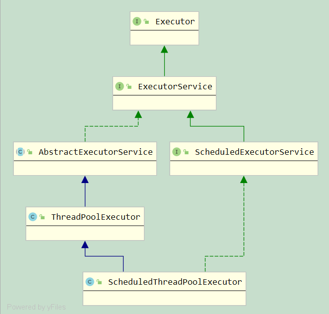

# java.util.concurrent -> 并发编程中常用的实用类。

## 线程池

### 最大线程 di

## 四大函数式接口

### 1. Consumer<T>

    void accept(T t);

### 2. Supplier<T>

    T get();

### 3. Fuction<T, R>

    R apply(T t);

### 4. Predicate<T>

    boolean test(T t)

## Future 和 CompletableFuture

### 1.Future

1. 使用 Future 获得异步执行结果时，这两种方法都不是很好，因为主线程也会被迫等待
   - 调用阻塞方法 get()，会阻塞
   - 轮询看 isDone()是否为 true，表示任务完成

### 2.CompletableFuture

1. 在 Java8 中，CompletableFuture 提供了非常强大的 Future 的扩展功能，可以帮助我们简化异步编程的复杂性，并且提供了函数式编程的能力，可以通过回调的方式处理计算结果，也提供了转换和组合 CompletableFuture 的方法
2. 它可能代表一个明确完成的 Future，也有可能代表一个完成阶段（ CompletionStage ），它支持在计算完成以后触发一些函数或执行某些动作。
3. 它实现了 Future 和 CompletionStage 接口

#### 1.构造器

CompletableFuture completable = new CompletableFuture();
