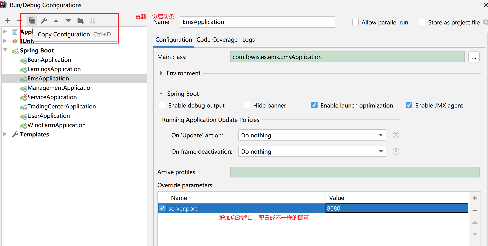
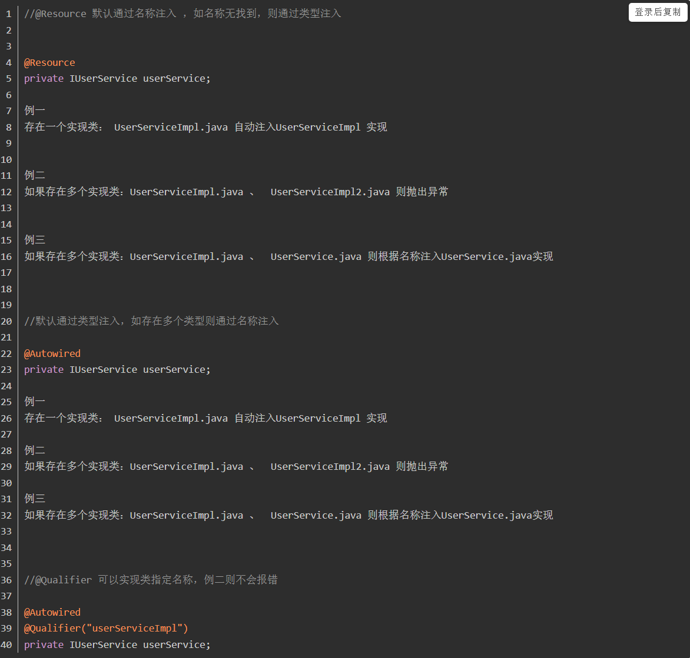

# Spring

## 1.Spring AOP

> 执行顺序：around before、before、目标方法、around after、after、returning

1. 环绕通知 (@Around) 方法执行前后都通知（优先级最高的通知）
2. 前置通知 (@Before) 方法执行之前执行
3. 后置通知 (@After) : 又称之为最终通知(finally)
4. 返回通知 (@AfterReturning) 方法 return 之后执行
5. 异常通知 (@AfterThrowing) 方法出现异常之后执行

## 2.Spring 序列化

> 在 java 中，一切皆对象，所有对象的状态信息转为存储或传输的形式，都需要序列化，通常建议：程序创建的每个 JavaBean 类都实现 Serializeable 接口。

1. 序列化：将对象写入到 IO 流中
2. 反序列化；从 IO 流中读取对象
3. 意义：序列化机制允许将实现序列化的 Java 对象转换位字节序列，这些字节序列可以保存在磁盘上，或通过网络传输，以达到以后恢复成原来的对象。序列化机制使得对象可以脱离程序的运行而独立存在。
4. 使用场景：所有可在网络上传输的对象都必须是可序列化的，比如 RMI（remote method invoke,即远程方法调用），传入的参数或返回的对象都是可序列化的，否则会出错；所有需要保存到磁盘的 java 对象都必须是可序列化的。

### 2.1 实体序列化：实现 Serializable 接口

- Serializable 接口是一个标记接口，不用实现任何方法。一旦实现了此接口，该类的对象就是可序列化的
- 序列化版本号 serialVersionUID，private static final long serialVersionUID 的序列化版本号，只有版本号相同，即使更改了序列化属性，对象也可以正确被反序列化回来。
- 序列化版本号可自由指定，如果不指定，JVM 会根据类信息自己计算一个版本号，这样随着 class 的升级，就无法正确反序列化；不指定版本号另一个明显隐患是，不利于 jvm 间的移植，可能 class 文件没有更改，但不同 jvm 可能计算的规则不一样，这样也会导致无法反序列化。
- 反序列化并不会调用构造方法。反序列的对象是由 JVM 自己生成的对象，不通过构造方法生成。
- 一个可序列化的类的成员不是基本类型，也不是 String 类型，那这个引用类型也必须是可序列化的；否则，会导致此类不能序列化
- 所有保存到磁盘的对象都有一个序列化编码号，当程序试图序列化一个对象时，会先检查此对象是否已经序列化过，只有此对象从未（在此虚拟机）被序列化过，才会将此对象序列化为字节序列输出。如果此对象已经序列化过，则直接输出编号即可。而不会将同一对象序列化多次
- 使用 transient 关键字选择不需要序列化的字段。

### 2.2 序列化

1. 序列化：将对象保存到磁盘中，或允许在网络中直接传输对象，对象序列化机制允许把内存中的 java 对象抓换成平台无关的二进制，从而可以持久的保存在磁盘，或者在网络中传输
2. 反序列化：程序一旦获取序列化的对象，则二进制流都可以恢复成原来的。

`Jackson2JsonRedisSerializer`：需要指明序列化的类 Class，可以使用 Obejct.class，反序列化带泛型的数组类会报转换异常，解决办法存储以 JSON 字符串存储，用 Jackson2，将对象序列化成 Json。这个 Serializer 功能很强大，但在现实中，是否需要这样使用，要多考虑。一旦这样使用后，要修改对象的一个属性值时，就需要把整个对象都读取出来，再保存回去；在 Redis 中保存的内容，比 Java 中多了一对双引号。
`GenericJackson2JsonRedisSerializer`：比 `Jackson2JsonRedisSerializer` 效率低，占用内存高。
GenericJacksonRedisSerializer 反序列化带泛型的数组类会报转换异常，解决办法存储以 JSON 字符串存储。
GenericJacksonRedisSerializer 和 Jackson2JsonRedisSerializer 都是以 JSON 格式去存储数据，都可以作为 Redis 的序列化方式

`StringRedisSerializer`：对 String 数据进行序列化。在 Java 和 Redis 中保存的内容是一样的

`JdkSerializationRedisSerializer`：jdk 序列化，对于 Key-Value 的 Value 来说，是在 Redis 中是不可读的。对于 Hash 的 Value 来说，比 Java 的内容多了一些字符。

`OxmSerializer`:使用 SpringO/X 映射的编排器和解排器实现序列化，用于 XML 序列化

`GenericToStringSerializer`：使用 Spring 转换服务进行序列化。在网上没有找到什么例子，使用方法和 StringRedisSerializer 相比，StringRedisSerializer 只能直接对 String 类型的数据进行操作，如果要被序列化的数据不是 String 类型的，需要转换成 String 类型，例如：String.valueOf()。但使用 GenericToStringSerializer 的话，不需要进行转换，直接由 String 帮我们进行转换。但这样的话，也就定死了序列化前和序列化后的数据类型，例如：template.setValueSerializer(new GenericToStringSerializer<Long>(Long.class));

``

## 3.注解@SuppressWarnings

> java.lang.SuppressWarnings 是 J2SE5.0 中标准的 Annotation 之一。可以标注在类、字段、方法、参数、构造方法，以及局部变量上

1. `作用`:告诉编译器忽略指定的警告，不用在编译完成后出现警告信息。
2. `使用`

```java
@SuppressWarnings(“”)
@SuppressWarnings({})
@SuppressWarnings(value={})

@SuppressWarnings(value={"unchecked", "rawtypes"})      // 抑制多类型的警告
@SuppressWarnings("unchecked")                          // 抑制单类型的警告
@SuppressWarnings("all")                                // 抑制所有类型的警告
```

## 4.注解@PostConstruct 和@PreDestroy

1. @PostConstruct：修饰的方法会在服务器加载 Servlet 的时候运行，并且只会被服务器调用一次，类似于 Servlet 的 init()方法。被@PostConstruct 修饰的方法会在构造函数之后，init()方法之前运行。

2. @PreDestroy：修饰的方法会在服务器卸载 Servlet 的时候运行，并且只会被服务器调用一次，类似于 Servlet 的 destroy()方法。被@PreDestroy 修饰的方法会在 destroy()方法之后运行，在 Servlet 被彻底卸载之前。

## 5.valid、validated

> @Valid 是 javax.validation.Valid 包下的。@Validated 是 javax.validation 里的。是@Valid 的一次封装。是 Spring 提供的校验机制使用。

1.  区别只要体现在分组，注解地方，嵌套验证等功能上

    - 分组：@Validated 提供了分组功能，在入参验证时，根据不同的分组采用不同的验证机制。@valid 没有

      - 定义一个分组类（或接口）
      - 在校验注解上添加 groups 属性指定分组
      - Controller 方法的@Validated 注解添加分组类

    - 注解使用地方：
      - @validated 可以用在类型、方法和方法参数上。但是不能用在成员属性字段上
      - @valid 可以用在方法、构造函数、方法参数和成员属性（字段）上；两者是否能用于成员属性（字段）上直接影响能否提供嵌套验证的功能
    - 嵌套验证 - @Validated：用在方法入参上无法单独提供嵌套验证功能。不能用在成员属性（字段）上，也无法提示框架进行嵌套验证。能配合嵌套验证注解@Valid 进行嵌套验证。 - @Valid：用在方法入参上无法单独提供嵌套验证功能。能够用在成员属性（字段）上，提示验证框架进行嵌套验证。能配合嵌套验证注解@Valid 进行嵌套验证。

空检查

@NotEmpty：用在集合类上面；不能为 null，而且长度必须大于 0
@NotBlank： 用在 String 上面；只能作用在 String 上，不能为 null，而且调用 trim()后，长度必须大于 0
@NotNull：用在基本类型上；不能为 null，但可以为 empty。

长度检查
@Size(min=,max=)：验证对象（Array,Collection,Map,String）长度是否在给定的范围之内
不要错用了异常类型，比如在 int 上不可用@size
@Length(min=, max=) ： 只适用于 String 类型

Booelan 检查
@AssertTrue： 验证 Boolean 对象是否为 true
@AssertFalse： 验证 Boolean 对象是否为 false

日期检查
@Past： 验证 Date 和 Calendar 对象是否在当前时间之前
@Future： 验证 Date 和 Calendar 对象是否在当前时间之后
@Pattern： 验证 String 对象是否符合正则表达式的规则

其他验证：
@Vaild 递归验证，用于对象、数组和集合，会对对象的元素、数组的元素进行一一校验
@Email 用于验证一个字符串是否是一个合法的右键地址，空字符串或 null 算验证通过
@URL(protocol=,host=,port=,regexp=,flags=) 用于校验一个字符串是否是合法 URL

数值检查
建议使用在 Stirng,Integer 类型，不建议使用在 int 类型上，因为表单值为"" 时无法转换为 int，但可以转换为 Stirng 为"",Integer 为 null
@Min: 验证 Number 和 String 对象是否大等于指定的值
@Max: 验证 Number 和 String 对象是否小等于指定的值
@DecimalMax: 被标注的值必须不大于约束中指定的最大值. 这个约束的参数是一个通过 BigDecimal 定义的最大值的字符串表示.小数存在精度
@DecimalMin: 被标注的值必须不小于约束中指定的最小值. 这个约束的参数是一个通过 BigDecimal 定义的最小值的字符串表示.小数存在精度
@Digits: 验证 Number 和 String 的构成是否合法
@Digits(integer=,fraction=): 验证字符串是否是符合指定格式的数字，interger 指定整数精度，fraction 指定小数精度。

注解 校验功能
@AssertFalse 必须是 false
@AssertTrue 必须是 true
@DecimalMax 小于等于给定的值
@DecimalMin 大于等于给定的值
@Digits 可设定最大整数位数和最大小数位数
@Email 校验是否符合 Email 格式
@Future 必须是将来的时间
@FutureOrPresent 当前或将来时间
@Max 最大值
@Min 最小值
@Negative 负数（不包括 0）
@NegativeOrZero 负数或 0
@NotBlank 不为 null 并且包含至少一个非空白字符
@NotEmpty 不为 null 并且不为空
@NotNull 不为 null
@Null 为 null
@Past 必须是过去的时间
@PastOrPresent 必须是过去的时间，包含现在
@PositiveOrZero 正数或 0
@Size 校验容器的元素个数

## 6. @Mapper 和@MapperScan

> @Mapper 注解的的作用 -->直接在 Mapper 类上面添加注解@Mapper
>
> 1. 为了把 mapper 这个 DAO 交给 Spring 管理 ；
> 2. 为了不再写 mapper 映射文件 ,通过注解来写 sql；
> 3. 为了给 mapper 接口 自动根据一个添加@Mapper 注解的接口生成一个实现类

> 使用@MapperScan 可以指定要扫描的 Mapper 类的包的路径

## 7. import 注解

`作用在类上，通过快速导入的方式将实例加入到springIOC容器中`

1. 直接导入 class 数组
2. 实现 ImportSelector 接口的实现类

> 是 spring 导入外部配置的核心接口，在 springboot 的自动化配置和@Enablexxx（功能性注解）中起到了决定性的作用。
> ImportSelector 接口中，selectImports()方法作用是：选择并返回需要导入的类的名称；返回一个字符串数组，当在@Configuration 标注的 Class 上使用@Import 引入了一个 ImportSelector 实现类后，会把实现类中返回的 Class 名称都定义为
> DeferredImportSelector 接口集成 ImportSelector，延迟选择性导入，在装载 bean 时，需要等所有的@Configuration 都执行完毕后才会进行装载。

3. 实现 ImportBeanSelector 接口

```java
// 方式1
@Import({**.class,***.class})  // 导入的bean的全限定名
public class Test{}

// 方式2
// spring 底层使用较多，像Enablexxx等都是通过这种方式实现的。
public class ImportSee implements ImportSelector {
    @Override
    public String[] selectImports(AnnotationMetadata importingClassMetadata) {
        return new String[]{"com.company.module.类名"};
    }
}

// 方式3
// mybatis中的@MapperScan注解，就是基于这种方式实现注入Spring IOC容器的。
```

## 8. IOC 注入方式

1. 通过@CompentScan +@Controller @Service @Respository @compent ，springboot 默认扫描，无需@ComponentScan，

**适合场景**：自己写的组件可以通过这种方式来进行加载到容器中。

2. 通过@Bean 的方式来导入组件

**适合场景**: 适用于导入第三方组件的类

3. 通过@Import 来导入组件

**适合场景**：导入组件的 id 为全路径，用处最多的是其他框架整合 Spring 时，使用@Import 注解导入整合类。

## 9. 事件监听- 观察者设计模式

`为了系统业务逻辑之间的解耦，提高可扩展性以及可维护性。`

1.  实现事件机制方式：EventObject、EventListener 和 Source

    - EventObject：java.util.EventObjet 是事件状态对象的基类，他封装了事件源以及和事件相关的信息，所有的 java 事件类都集成该类

    - Eventlistener：是一个标记接口，里边没有方法，所有的监听器监听该接口，事件监听注册在事件源上，当事件源的属性和状态改变的时候，调用相应监听器内的回调方法

    - Source：事件源并不需要实现和继承任何接口和类，他是事件最初发生的地方，因为事件源需要注册事件监听器，所有事件源内需要有相应的盛放事件监听器的容器。

> `实现方式：`
>
> 1. 事件 event extends ApplicationEvent ApplicationContext 或者 ApplicationEventPublisher
>
> 2. 监听器 implements ApplicationListener<T>，重写 onApplicationEvent 方法，该方法参数可以为 Object、也可以为自定义事件 event
>
>    使用注解@EventListener
>
> 3. 注册监听 SpringApplication.addListener(Listener 对象) 或者使用注解@Component SpringApplicationBuilder.listeners(…)
>
> 4. 发布事件 ApplicationContext 接口 继承 接口 ApplicationEventpublisher 事件发布器
>
> `扩展`
>
> 1. ApplicationEventMulticaster 是事件机制中的事件广播器，默认实现 SimpleApplicationEventMulticaster
> 2. ApplicationContext 本身担任监听器注册表的角色，在其子类 AbstractApplicationContext 中就聚合了事件广播器 ApplicationEventMulticaster 和事件监听器 ApplicationListnener，并且提供注册监听器的 addApplicationListnener 方法
> 3. Spring 中，事件源不强迫继承 ApplicationEvent 接口的，也就是可以直接发布任意一个对象类。但内部其实是使用 PayloadApplicationEvent 类进行包装了一层
>
> `spring自带的监听器`
>
> 1. ApplicationStartingEvent：springboot 启动开始的时候执行的事件
>
> 2. ApplicationEnvironmentPreparedEvent spring boot 对应**Enviroment**已经准备完毕，但此时上下文 context 还没有创建。在该监听中获取到 ConfigurableEnvironment 后可以对配置信息做操作，例如：修改默认的配置信息，增加额外的配置信息等等。
>
> 3. ApplicationPreparedEvent：spring boot 上下文 context 创建完成，但此时 spring 中的 bean 是没有完全加载完成的。在获取完上下文后，可以将上下文传递出去做一些额外的操作。值得注意的是：**在该监听器中是无法获取自定义 bean 并进行操作的。**
>
> 4. ApplicationReadyEvent：springboot 加载完成时候执行的事件。
>
> 5. ApplicationFailedEvent：spring boot 启动异常时执行事件。
>
>    > `默认情况下，监听事件都是同步执行的。在需要异步处理时，可以在方法上加上@Async进行异步化操作`

## 10. cron 表达式

```shell
# CronExpression用于定义时间规则，该表达式由6个空格分隔的时间字段组成：秒 分 时 日 月 周 年(可选)
# 秒 0-59  / 每隔几秒钟 - 在几到几秒钟 * 每秒钟 , 几和几秒钟
# 分 0-59  / 每隔几分钟 - 在几到几分钟 * 每分钟 , 几和几分钟
# 时 0-23  / 每隔几小时 - 在几到几小时 * 每小时 , 几和几小时
# 日 1-31  / - * , ? 不确定日期，由于和周一起使用，就相互排斥 L 最后一日 W 只有日期有，表示最近的工作日 LW 这个月的最后一周的工作日 C
# 月 1-12 / - * ,
# 周 1-7  / - * , ? 6L 每个月的最后一个星期五 L C  # 只有星期有，6#3 本月第三周的星期五
# 年 1970-2099
```

## 11. EasyExcel

### 11.1 导出

```java
// 获取ExcelWriter实例
ExcelWriter excelWriter = EasyExcel.write(pathName).build;
//内容样式策略
WriteCellStyle contentWriteCellStyle = new WriteCellStyle();
//垂直居中,水平居中
contentWriteCellStyle.setVerticalAlignment(VerticalAlignment.CENTER);
contentWriteCellStyle.setHorizontalAlignment(HorizontalAlignment.CENTER);
contentWriteCellStyle.setBorderLeft(BorderStyle.THIN);
contentWriteCellStyle.setBorderTop(BorderStyle.THIN);
contentWriteCellStyle.setBorderRight(BorderStyle.THIN);
contentWriteCellStyle.setBorderBottom(BorderStyle.THIN);
//设置 自动换行
contentWriteCellStyle.setWrapped(true);
// 字体策略
WriteFont contentWriteFont = new WriteFont();
// 字体大小
contentWriteFont.setFontHeightInPoints((short) 12);
// 字体加粗
//        contentWriteFont.setBold(true);
contentWriteCellStyle.setWriteFont(contentWriteFont);
//头策略使用默认
WriteCellStyle headWriteCellStyle = new WriteCellStyle();
// 字体不加粗，默认加粗
//        WriteFont headWriteFont = new WriteFont();
//        headWriteFont.setBold(false);
//        headWriteCellStyle.setWriteFont(headWriteFont);
//修改背景色
//        headWriteCellStyle.setFillForegroundColor(IndexedColors.CORNFLOWER_BLUE.getIndex());
// 获取WriterSheet
WriteSheet writeSheet = EasyExcel.writerSheet(sheetNo, sheetName)
        .registerWriteHandler(new HorizontalCellStyleStrategy(headWriteCellStyle, contentWriteCellStyle))
        .head(BasicElectricity.class)
        .build();
// 执行
excelWriter.write(list, writeSheet);
excelWriter.finish();
```

### 11.2 导入

```java
// 该导入是同步导入、还可以使用自定义监听器实现接口的方式完成
List<BasicElectricity> list = EasyExcel.read(fileName)
    .sheet(0)
    .head(***.class)
    .headRowNumber(1)
    .doReadSync();
// 使用注解@ExcelProperty()标注实体类，遇到类型转换时，实现Converter<BigDecimal>接口。
```

### 11.3 日期处理

```java
public static Date getDate(int days) {
		Calendar c = Calendar.getInstance();
		c.set(1900, 0, 1);
		c.add(Calendar.DATE, days - 2);
		return c.getTime();
	}

	public static Date getTime(Date date, double ditNumber) {
		Calendar c = Calendar.getInstance();
		int mills = (int) (Math.round(ditNumber * 24 * 3600));
		int hour = mills / 3600;
		int minute = (mills - hour * 3600) / 60;
		int second = mills - hour * 3600 - minute * 60;
		c.setTime(date);
		c.set(Calendar.HOUR_OF_DAY, hour);
		c.set(Calendar.MINUTE, minute);
		c.set(Calendar.SECOND, second);
		return c.getTime();
	}

public static void main(String[] args) throws java.lang.Exception {
		// SimpleDateFormat s = new SimpleDateFormat("yyyy-MM-dd hh:mm:ss");
		// System.out.println(s.format(43188.468333)); Excel数字时间

		int days = 43188;
		double ditNumber = 0.468333;
		Date date =new DateConvert().getDate(days);
		Date dateTime = new DateConvert().getTime(date, ditNumber);
		SimpleDateFormat sdf = new SimpleDateFormat("yyyy-MM-dd HH:mm:ss");
		System.out.println(sdf.format(dateTime));
               //输出：2018-03-29 11:14:24

}
```

## 12. pom 中 scpoe 标签

1. 默认值为 complie，compile 表示被依赖项目需要参与当前项目的编译，springboot 多模块相互依赖中有用到
2. test，表示依赖项目仅仅参与测试相关的工作，包括测试代码的编译，执行。
3. runtime，表示被依赖项目无需参与项目的编译，不过后期的测试和运行周期需要其参与，与 compile 相比，跳过了编译而已。例如 JDBC 驱动，适用运行和测试阶段
4. provided，打包的时候可以不用包进去，别的设施会提供
5. system，从参与度来说，和 provided 相同，不过被依赖项不会从 maven 仓库下载，而是从本地文件系统拿。需要添加 systemPath 的属性来定义路径

## 13. CollectionUtils 工具类

> `取交集intersection、并集union、差集subtract、补集disjunction、`

<dependency>
    <groupId>org.apache.commons</groupId>
    <artifactId>commons-collections4</artifactId>
    <version>4.3</version>
</dependency>

## 14. idea 同时启动多个相同项目

原理：启动 jar 时，增加配置参数（端口）
jar -jar xxx.jar --server.port=8080



## 15. Resource 和 Autowire



## 16. @AliasFor 使用规则

@AliasFor 表示别名，它可以注解到自定义注解的两个属性上，表示这两个互为别名，也就是说这两个属性其实同一个含义。

- 用到注解 属性上，表示两个属性互相为别名，互相为别名的属性值必须相同，若设置成不同，则会报错
- 若自定义注解有一个属性，且该属性命名上为了体现其含义，所以有些复杂，这样调用方必须每次使用自定义注解的时候，都必须写明 属性 ，然后设置，这样会比较负责；
- 同时若自定义注解继承了另一个注解，要想让调用方能够设置继承过来的属性值，就必须在自定义注解中重新定义一个属性，同时声明该属性是父注解某个属性的别名。注解是可以继承的，但是注解是不能继承父注解的属性的,也就是说,我在类扫描的时候,拿到的注解的属性值,依然是父注解的属性值,而不是你定义的注解的属性值，所以此时可以在子注解对应的属性上加上@AliasFor
