## 1. 启动流程源码解析

### 1.1 **创建 SpringApplication 对象**

SpringApplication 的初始化模块，即创建对象实例，作用是收集加载资源，比如应用上下文初始化类、监听器。

```java
/**
 * 创建一个 SpringApplication 实例
 *
 * @param resourceLoader the resource loader to use
 * @param primarySources the primary bean sources
 */
public SpringApplication(ResourceLoader resourceLoader, Class<?>... primarySources) {
    this.resourceLoader = resourceLoader;
    // 断言主配置类是否为空
    Assert.notNull(primarySources, "PrimarySources must not be null");
    // 将主配置类作为primarySources属性存储起来
    this.primarySources = new LinkedHashSet<>(Arrays.asList(primarySources));
    // 根据classpath推断是否是一个web应用，枚举类型
    this.webApplicationType = WebApplicationType.deduceFromClasspath();
    // 设置初始化器（Initializer），从类路径下找到META‐INF/spring.factories配置的所有ApplicationContextInitializer
    // 说明：SpringFactoriesLoader 类似于ServiceLoader，采用SPI机制，查找配置文件的内容
    setInitializers((Collection) getSpringFactoriesInstances(ApplicationContextInitializer.class));
    // 设置监听器（Listener），从类路径下找到META‐INF/spring.factories配置的所有ApplicationListener
    setListeners((Collection) getSpringFactoriesInstances(ApplicationListener.class));
    // 从多个配置类中找到有main方法的主配置类
    this.mainApplicationClass = deduceMainApplicationClass();
}
```

### 1.2 **运行 run() 方法**

启动方案，其中包括启动流程的监听模块、加载配置环境模块、及核心的创建上下文环境模块。

自动化配置模块。该模块作为 springboot 自动配置核心。

```java
/**
 * 运行spring应用程序，创建并刷新一个新的 {@link ApplicationContext}.
 *
 * @param args the application arguments  其中包括命令行参数
 * @return a running {@link ApplicationContext}
 */
public ConfigurableApplicationContext run(String... args) {
    // 计时工具，启动计时器
    StopWatch stopWatch = new StopWatch();
    stopWatch.start();
    ConfigurableApplicationContext context = null;
    Collection<SpringBootExceptionReporter> exceptionReporters = new ArrayList<>();
    configureHeadlessProperty();
    /*
        获取监听器：
            1. 使用SPI机制从类路径下META‐INF/spring.factories获取SpringApplicationRunListener的子类EventPublishingRunListener，
            并实例化；在实例化时，会把所有ApplicationListener对象都添加到initialMulticaster广播器里面；
            2. SpringApplicationRunListeners对象包括所有的SpringApplicationRunListener对象（实例化时传入进去的）；
        作用：
            在不同的时点发布不同类型的事件时，只需要调用其对应方法即可（根据事件类型找到对应的listener去发布事件）；
        说简单点，就是在SpringBoot启动初始化的过程中可以通过SpringApplicationRunListener接口回调来让用户在启动的各个流程中可以加入自己的逻辑。
    */
    SpringApplicationRunListeners listeners = getRunListeners(args);
    // 发布应用程序开始启动事件（ApplicationStartingEvent）
    listeners.starting();
    try {
        // 封装命令行参数
        ApplicationArguments applicationArguments = new DefaultApplicationArguments(args);
        /*
            准备应用上下文环境、完成后调用listeners.environmentPrepared()方法，
            通过广播的方式广播事件ApplicationEnvironmentPreparedEvent
        */
        ConfigurableEnvironment environment = prepareEnvironment(listeners, applicationArguments);
        // 配置忽略的bean信息
        configureIgnoreBeanInfo(environment);
        // 是否打印Banner内容（图片或文字），可通过配置文件配置或在classpath路径下定义默认值
        Banner printedBanner = printBanner(environment);
        // 创建ApplicationContext容器，决定创建web的ioc还是普通的ioc
        context = createApplicationContext();
        exceptionReporters = getSpringFactoriesInstances(SpringBootExceptionReporter.class,
                new Class[] { ConfigurableApplicationContext.class }, context);
        /*
            1. 准备容器，将environment保存到ioc中；
            2. applyInitializers()方法，回调之前保存的所有的ApplicationContextInitializer的initialize方法
            3. 回调所有的SpringApplicationRunListener的contextPrepared()；
        将之前通过@EnableAutoConfiguration获取的所有配置以及其他形式的ioc容器配置加载到已经准备完毕的ApplicationContext
            4. 回调所有的SpringApplicationRunListener的contextLoaded()；
        */
        prepareContext(context, environment, listeners, applicationArguments, printedBanner);
        // 刷新容器；ioc容器初始化（如果是web应用还会创建嵌入式的Tomcat）；
        // Spring注解版扫描，创建，加载所有组件的地方；（配置类，组件，自动配置）
        refreshContext(context);
        // 从ioc容器中获取所有的ApplicationRunner和CommandLineRunner进行回调
        // ApplicationRunner先回调，CommandLineRunner再回调
        afterRefresh(context, applicationArguments);
        // 停止计时器
        stopWatch.stop();
        if (this.logStartupInfo) {
            new StartupInfoLogger(this.mainApplicationClass).logStarted(getApplicationLog(), stopWatch);
        }
        listeners.started(context);
        callRunners(context, applicationArguments);
    }
    catch (Throwable ex) {
        handleRunFailure(context, ex, exceptionReporters, listeners);
        throw new IllegalStateException(ex);
    }

    try {
        // 发布应用程序running事件
        listeners.running(context);
    }
    catch (Throwable ex) {
        // 处理运行异常，主要是通过异常报告器，解析运行时产生的异常，然后解析成容易阅读和方便排查问题的文本，然后打印
        handleRunFailure(context, ex, exceptionReporters, null);
        throw new IllegalStateException(ex);
    }
    // 整个SpringBoot应用启动完成以后返回启动的ioc容器；
    return context;
}
```

### 1.3 自动装配

SpringBoot 启动时，加载主配置类，会扫描引用 jar 包中的 META-INF/spring.factories 文件，将文件中的配置的类型信息加载到 spring 容器，并执行类中定义的各种操作。

**注解详情**

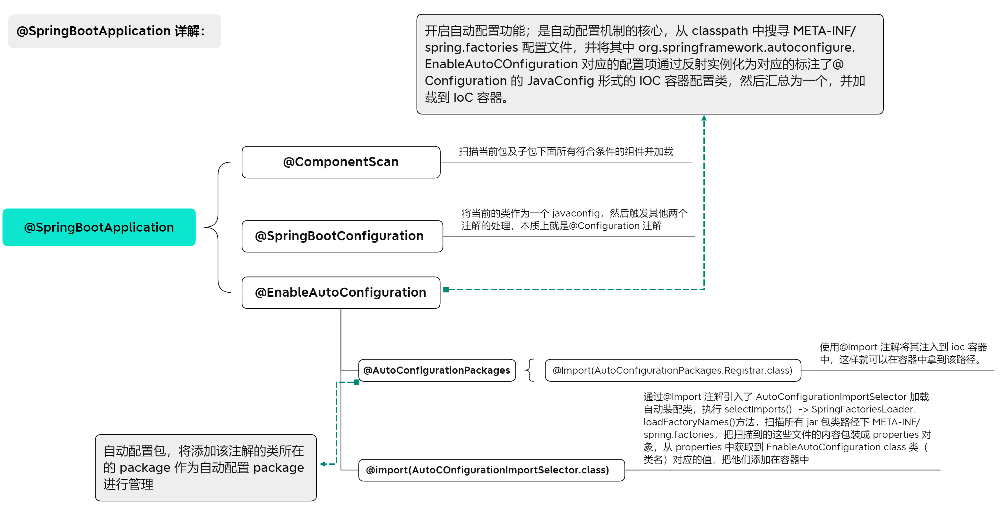

` springboot 查看自动配置是否生效：通过在配置文件启用 debug=ture 属性，在控制台打印自动配置报告，这样子就可以看到哪些自动配置生效。`

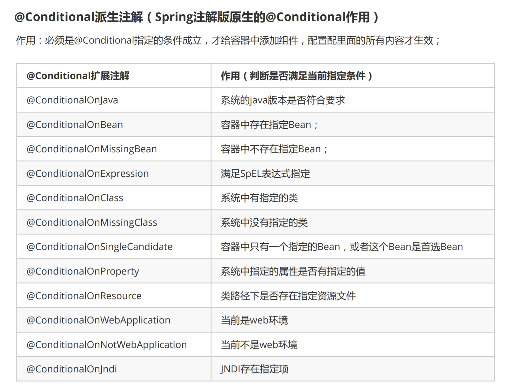

**SpringFactoriesLoader 详解**

借助于 Spring 框架原有的一个工具类：SpringFactoriesLoader 的支持，@EnableAutoConfiguration 可以智能的自动配置功效才得以大功告成！

SpringFactoriesLoader 属于 Spring 框架私有的一种扩展方案，是 Spring 的工厂加载器，其主要功能就是从指定的配置文件 META-INF/spring.factories 加载配置，加载工厂类。配合@EnableAutoConfiguration 使用的话，它更多是提供一种配置查找的功能支持，即根据@EnableAutoConfiguration 的完整类名 org.springframework.boot.autoconfigure.EnableAutoConfiguration 作为查找的 Key,获取对应的一组@Configuration 类

该对象提供了 loadFactoryNames 方法，入参为 factoryClass 和 classLoader 即需要传入工厂类名称和对应的类加载器，方法会根据指定的 classLoader，加载该类加器搜索路径下的指定文件，即 spring.factories 文件；传入的工厂类为接口，而文件中对应的类则是接口的实现类，或最终作为实现类。

## 2. 配置文件

#### 编写规范

```yml
# 普通的值
#字符串默认不用加上单引号或者双引号；双引号不会转义字符串里边的特殊字符，特殊字符会作为本身想表示的意思，单引号会转义特殊字符，特殊字符最终只是一个普通的字符串数据
name: "zhangsan \n lisi"        # 输出:zhangsan 换行 lisi
name: 'zhangsan \n lisi'        # 输出:zhangsan \n lisi

# map
person:
  name: zhangsan
  age: 18
person: {name: zhangsan,age: 18}        # 行内写法

# list、set
pets:
  - cat
  - dog
  - pig
pets: [cat,dog,pig]                     # 行内写法

# yml支持多文档块，使用---分割

# 激活指定profile，命令行参数--spring.profiles.active=dev，虚拟机参数-Dspring.profile.active=dev
spring:
  profiles:
    active: dev

# 随机数 ${random.value}、${random.int}、${random.long}、${random.int(10)}、${random.int[1024,65536]}
name: zhangsan${random.uuid}
age: ${random.int}
dogNmae: ${name:zhangsan1}_dog      # 指定默认值，使用:指定默认值
```

#### 加载顺序

1.  SpringBoot 启动会扫描以下位置的 application.properties 或 application.yml 文件作为默认配置文件，优先级由高到底，高优先级的配置会覆盖低优先级的配置

    - -file:./config
    - -file:./
    - -classpath:/config/
    - -classpath:/

2.  `使用命令行参数（spring.config.location）的形式，启动项目的时候来指定配置文件的新位置；指定配置文件和默认加载的这些配置文件共同起作用形成互补配置`

3.  SpringBoot 也可以从以下位置加载配置； 优先级从高到低；高优先级的配置覆盖低优先级的配置，所有的配置会形成互补配置

    - 命令行参数，所有的配置都可以在命令行上进行指定，比如：java -jar xxx.jar --server.port=8087 --server.context-path=/abc 多个配置用空格分开， --配置项=值
    - 来自 java:comp/env 的 JNDI 属性
    - Java 系统属性 System.getProperties()
    - 操作系统环境变量
    - RandomValuePropertySource 配置的 random.\*属性值，由 jar 包外向 jar 包内进行寻找；优先加载带 profile
    - jar 包外部的 application-{profile}.properties 或 application.yml(带 spring.profile)配置文件
    - jar 包内部的 application-{profile}.properties 或 application.yml(带 spring.profile)配置文件
      再来加载不带 profile
    - jar 包外部的 application.properties 或 application.yml(不带 spring.profile)配置文件
    - jar 包内部的 application.properties 或 application.yml(不带 spring.profile)配置文件
    - @Configuration 注解类上的@PropertySource
    - 通过 SpringApplication.setDefaultProperties 指定的默认属性

#### 配置文件值注入

[博客链接](https://www.cnblogs.com/dxiaodang/p/14433339.html) https://www.cnblogs.com/dxiaodang/p/14433339.html

```xml
<!-- 导入配置文件处理器，配置文件进行绑定就会有提示 -->
<dependency>
    <groupId>org.springframework.boot</groupId>
    <artifactId>spring‐boot‐configuration‐processor</artifactId>
    <optional>true</optional>
</dependency>
```

**@importResource**

SpringBoot 里面没有 Spring 的配置文件，我们自己编写的配置文件，也不能自动识别；想让 Spring 的配置文件生效，需要使用@ImportResource 标注在一个配置类上。比如：

```java
// 导入Spring的配置文件让其生效
@ImportSource(locations={"calsspath:bean.xml"})
```

```xml
<?xml version="1.0" encoding="UTF‐8"?>
<beans xmlns="http://www.springframework.org/schema/beans"
       xmlns:xsi="http://www.w3.org/2001/XMLSchema‐instance"
       xsi:schemaLocation="http://www.springframework.org/schema/beans
http://www.springframework.org/schema/beans/spring‐beans.xsd">
    <bean id="helloService" class="com.atguigu.springboot.service.HelloService"></bean>
</beans>
```

**@EnableConfigurationProperties**

用来开启 ConfigurationProperties 注解配置；如果不使用的话，@ConfigurationProperties 加入注解的类上加@Component 也是可以交于 springboot 管理

**ConfigurationProperties**

是 springboot 的注解，用于把主配置文件中配置属性设置到对应的 Bean 属性上

```java
// 方式1：ConfigurationProperties + Component作用于类上
@ConfigurationProperties
@ConfigurationProperties(prefix="xxx")
@Componment
public class Person {
    private String name;
}
// 方式2：ConfigurationProperties + Bean作用在配置类的bean方法上
public class Person {
    private String name;
}
@Configuration
public class PersonConf{
    @Bean
    @ConfigurationProperties(prefix="xxx")
    public Person person(){
        return new Person();
    }
}
// 方式3：ConfigurationProperties注解到普通类、 EnableConfigurationProperties定义为bean
@ConfigurationProperties(prefix="xxx")
public class Person {
    private String name;
}

@Configuration
@EnableConfigurationProperties（xxx.class） // 直接加到启动类也可以
public class PersonConf{
}
```

**@Value 和 Environment**

```java
// @Value作用属性上
@RestController
@RequestMapping("/db")
public class TestController {
    @Value("${person.name}")
    private String name;

    @GetMapping("/person")
    public String parsePerson() {
        return name;
    }
}

// 使用自带的Environment对象
@RestController
@RequestMapping("/db")
public class TestController {
    @Autowired
    private Environment environment;

    @GetMapping("/person")
    public String parsePerson() {
        return environment.getProperty("person.name");
    }
}
```

**PropertySource**

是 spring 的注解，用于加载指定的属性文件的配置到 Spring 的 Environment 中。可以配合 @Value、Environment、@ConfigurationProperties 使用；`@PropertySource 注解不支持 yml、yaml`

```java
// 方式1：@Configuration + @PropertySource + Environment

// 方式2：@Configuration + @PropertySource + @Value

// 方式3：@Configuration + @PropertySource + @ConfigurationProperties
// @Component 标注实体类，则@PropertySource 放在哪都可以，（可以放在实体类上，也可以放在配置类上）；如果使用 Bean 方式注入对象，PropertySource({"classpath:/student.properties"}) //此时只能放在配置类加载
@Configuration
@ConfigurationProperties(prefix = "remote", ignoreUnknownFields = false)
@PropertySource("classpath:config/remote.properties")
@Data
public class RemoteProperties {
private String uploadFilesUrl;
private String uploadPicUrl;
}
```

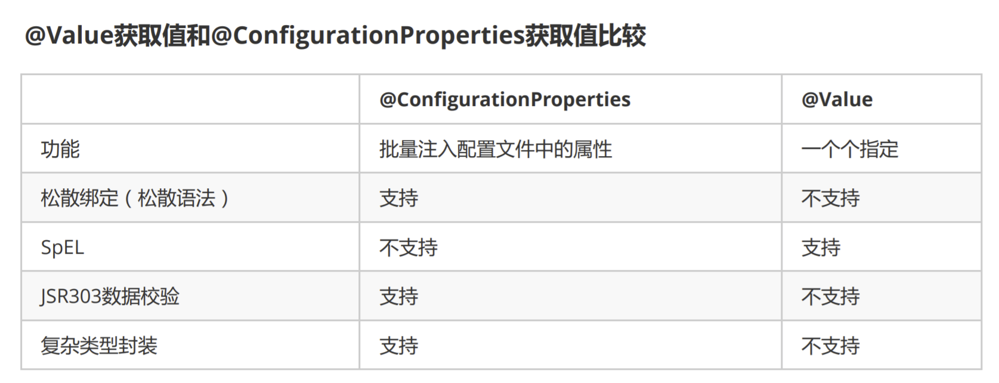

## 3. 日志

`SpringBoot选用SLF4j和logback，而底层Spring框架，默认是用JCL`

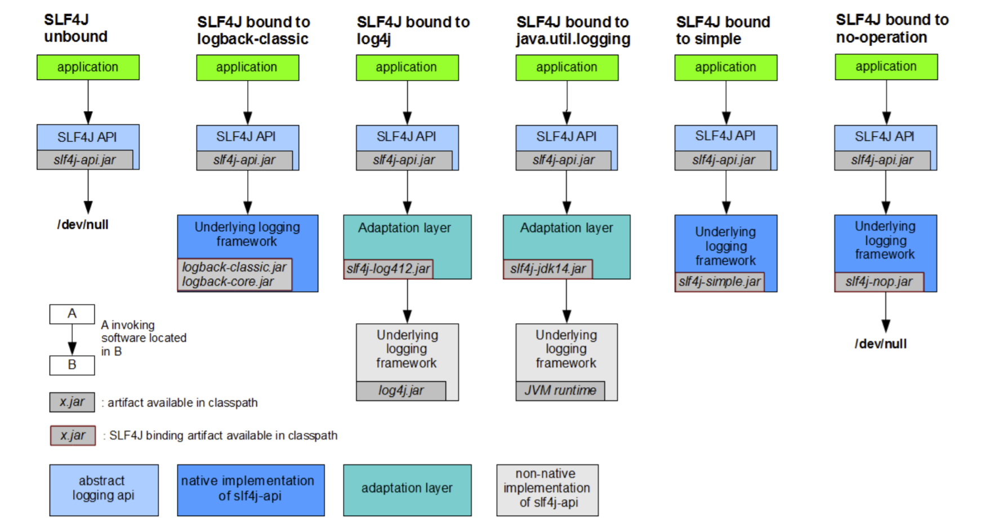

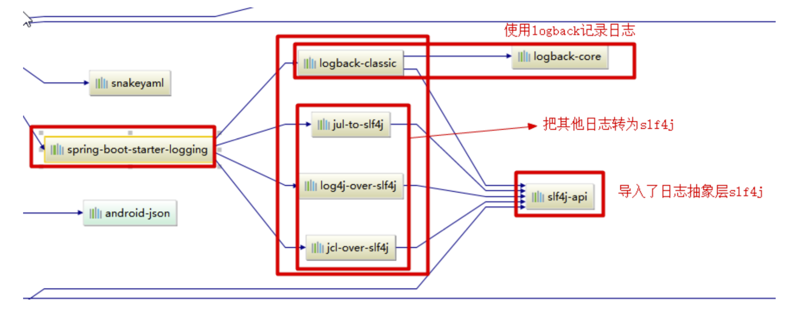

## 4. 自定义 starter

> 自定义 starter 命名规范：xxx-spring-boot-starter

1. 新建项目，pom 中引入相关依赖
2. 新建配置类 xxxProperties，写好配置项和默认的配置值，指明配置项前缀
3. 新建自动装配类 Configuration，使用@Configuration 和@Bean 来进行自动装配
4. 新建 spring.factories 文件，指定 starter 的自动装配类

## 5. restTemplate

##### 1. 基本介绍

RestTemplate 是 Spring 提供的，用于访问 Rest 服务的同步客户端，提供了一些简单的模板方法 API；底层支持多种 Http 客户端类库，因为 RestTemplate 只是对其他的 HTTP 客户端的封装，其本身并没有实现 HTTP 相关的基础功能，底层实现可以按需配置；常用的有：

- SimpleClientHttpRequestFactory，默认配置，对应的 JDK 自带的 HttpURLConnection，不支持 Http 协议的 Patch 方法，也无法访问 Https 请求；
- HttpComponentsClientHttpRequestFactory，对应的是 Apache 的 HttpComponents（注：Apache 的 HttpClient 是前身，后边改名为 Components）；
- OkHttp3ClientHttpRequestFactory，对应的是 OkHttp。

如果向查看所有的 http 客户端类库，可以找下 ClientHttpRequestFactory 接口的实现类：

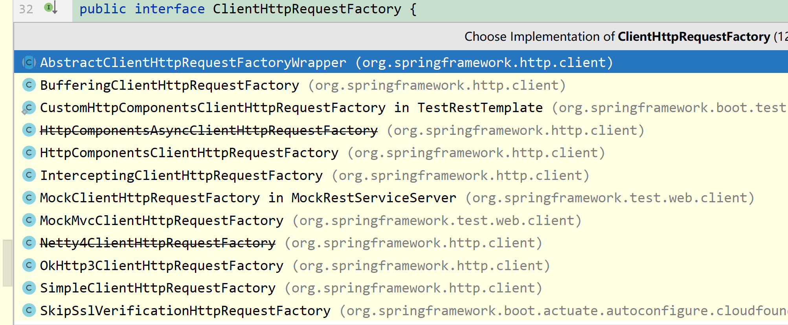

**RestTemplate、Apache 的 HttpClient、OkHttp 比较：**

- RestTemplate 提供了多种便捷访问远程 Http 服务的方法，能够大大提高客户端的编写效率；
- HttpClient 代码复杂，还得操心资源回收等。代码很复杂，冗余代码多，不建议直接使用；
- okhttp 是一个高效且开源的第三方 HTTP 客户端类库，常用于 android 中请求网络，是安卓端最火热的轻量级框架；允许所有同一个主机地址的请求共享同一个 socket 连接，连接池减少请求延时；透明的 GZIP 压缩减少响应数据的大小，缓存响应内容，避免一些完全重复的请求。

##### 2. 常用方法分析及举例

> 这一块主要讲一些常用的方法及参数、对于一些重载的方法，其实原理都差不多。

###### 2.1. get 请求

**说明：** 除了 getForEntity 和 getForObject 外，使用 exchange()也可以，前两个是基于它实现的，此处不做介绍


参数包括请求 url、响应类型的 class、请求参数

- url：String 字符串或者 URI 对象；常用字符串
- 响应对象的 class 实例
  - getForEntity() ==> 响应为 ResponseEntity<T>，其中包括请求的响应码和 HttpHeaders
  - getForObject() ==> 响应为传入的 class 对象，只包括响应内容
- 请求参数：替换 url 中的占位符，可以使用可变长的 Object，也可以使用 Map；如果没有，可以不填 ==其中 object 是按照占位符的顺序匹配的，map 是根据 key 匹配，如果匹配不上，就报错==

```java
// 不带参数的
String url = "localhost:8001/test/method";
Object object = restTemplate.getForObject(url, Object.class);

// 带参数的，使用@PathVariable接收
String url = "localhost:8001/test/method/{param1}";
Object object = restTemplate.getForObject(url, Object.class, "param");
// 带参数的，使用@Requestparam接收
String url = "localhost:8001/test/method?param={dd}";
ResponseEntity<Object> result = restTemplate.getForObject(url, Object.class, "param");
```

###### 2.2. post 请求

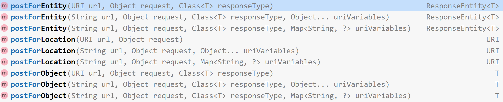

参数和 get 请求的相比，就多了第二个参数（Object request），如果使用最后一个参数传参时，和 get 请求类似，request 设置为 null 就可以，如果使用第二个参数传参时，就需要考虑 request 的类型，request 参数类型必须是实体对象、MultiValueMap、HttpEntity 对象的的一种，其他不可以！！！

- `实体对象传参时，被请求的接口方法上必须使用@RequestBody，接收参数为实体或者 Map；`
- `HttpEntity 传参时，取决于 HttpEntity 对象的第一个参数，可以为任何类型，包括 HashMap；`
- `MultiValueMap 传参时，接收参数使用注解@RequestBody 时，使用一个 String 类型、名称随意，使用@RequestParam 时，使用对应个数的 String 类型字符串，名称必须和 map 中的 key 相同；推荐使用@RequestParam`

```java
// 使用MultiValueMap传参
String url = "localhost:8001/test/method";
MultiValueMap<String, String> map= new LinkedMultiValueMap<>();		// 不能使用HashMap，源码中会讲！
map.add("param1", "string1");
map.add("param2", "string2");
ResponseEntity<String> response = restTemplate.postForEntity(url, map , String.class );
// 使用HttpEntity传参
String url = "localhost:8001/test/method";
HttpHeaders headers = new HttpHeaders();
headers.setContentType(MediaType.APPLICATION_JSON);
headers.add(HttpHeaders.CONTENT_ENCODING, StandardCharsets.UTF_8.toString());
headers.add(HttpHeaders.ACCEPT, MediaType.APPLICATION_JSON_VALUE);
String string = "param";
HttpEntity<String> entity = new HttpEntity<String>(string,headers);
String result = restTemplate.postForObject(url, entity, String.class);
```

##### 3. springboot 中使用 restTemplate 步骤

1. 导入 jar 包

```xml
<!-- springboot web依赖  -->
<dependency>
    <groupId>org.springframework.boot</groupId>
	<artifactId>spring-boot-starter-web</artifactId>
</dependency>
```

2. 编写配置
   使用默认的 SimpleClientHttpRequestFactory，也就是 java JDK 自带的 HttpURLConnection；

```java
@Configuration
public class RestTemplateConfig {
        @Bean
        public RestTemplate restTemplate(@Qualifier("simpleClientHttpRequestFactory") ClientHttpRequestFactory factory){
            return new RestTemplate(factory);
        }

        @Bean
        public ClientHttpRequestFactory simpleClientHttpRequestFactory(){
            SimpleClientHttpRequestFactory factory = new SimpleClientHttpRequestFactory();
            factory.setReadTimeout(5000);
            factory.setConnectTimeout(5000);
            return factory;
        }
}
```

3. Service 层调用

```java
@Service
public class TestService implements ITestService {
    @Autowired
    RestTemplate restTemplate;

    @Override
    public ResultVo test() throws Exception {
        try {
            String url = "http://localhhost:9001/test/demo1";
            ResponseEntity<Object> objectResponseEntity = restTemplate.postForEntity(url, null, Object.class);
            if( 200 == objectResponseEntity.getStatusCodeValue()){
                return ResultVo.success();
            }
            return ResultVo.error();
        } catch (Exception e) {
            throw new Exception("调用接口失败," + e.getMessage());
        }
    }
}
```

##### 4. 源码分析(postForEntity 为例)

<sapn style="color:red">思考重点:</sapn>

<sapn style="color:red"> 1. 第二个参数为什么不能直接使用 HashMap，而只能使用 MultiValueMap？</sapn>

<sapn style="color:red"> 2. 接收参数时，怎么合理的使用@RequestBody 和@RequestParam？</sapn>

<sapn style="color:red"> 3. restTemplate 底层默认使用的是 SimpleClientHttpRequestFactory，为什么不支持调用 Https 接口？</sapn>

1. 依次进入方法：postForEntity() -> httpEntityCallback -> HttpEntityRequestCallback

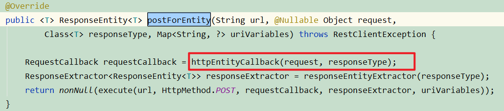

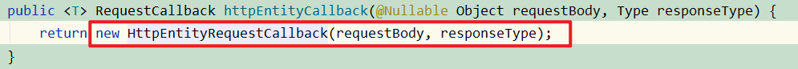

2. requestBody 参数，会判断类型是否是 HttpEntity，如果不是，则创建一个 HttpEntity 类将 requestBody 参数传入，然后查看 HttpEntity 构造器，具体做了什么？


3. 可以看到，三个构造方法，上边两个调用的是最下边一个；第一个传入的是泛型，也就是传入的 Object 对象，第二个传入的是 MultiValueMap，这个值是存放 Headers 的，所有只需要关注这个泛型，在哪块使用的

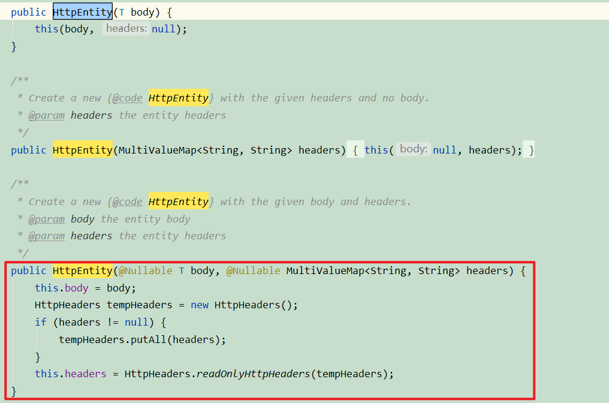

4. 回到 postForEntity()方法中，找到调用请求的方法 execute，点进去发现是调用方法 doExecute(...)；

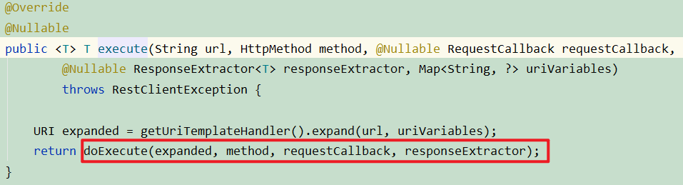

5. 在 doExecute()中
   - 首先使用请求的 url 和 method(post 或者 get)构造出一个 ClientHttpRequest
   - requestCallback.doWithRequest 将之前的 requestBody、requestHeader 放入此 ClientHttpRequest 中；
   - 调用 request 的 execute 方法获得 response，调用 handleResponse 方法处理 response 中存在的 error
   - 使用 ResponseExtractor 的 extraData 方法将返回的 response 转换为某个特定的类型；
   - 最后关闭 ClientHttpResponse 资源，这样就完成了发送请求并获得对应类型的返回值的全部过程。

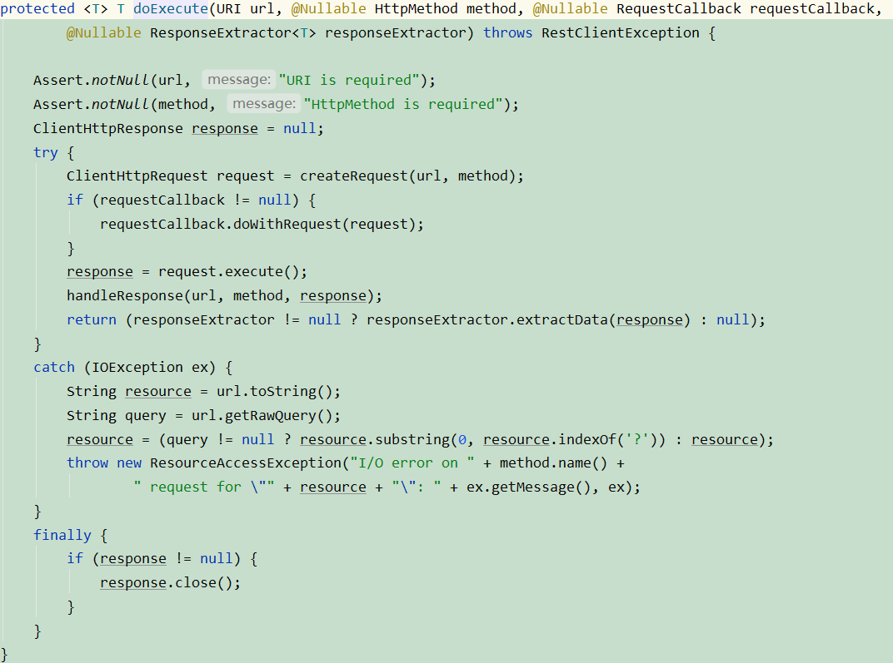

6. 进入方法 getRequestFactory() -> getRequestFactory()可以发现，通过 this.requestFactory 初始化了 SimpleClientHttpRequestFactory();通过方法 createRequest(url, method) -> openConnection()发现创建了 HttpURLConnection 连接，因此默认使用的 restTemplate 是无法访问 Https 接口的

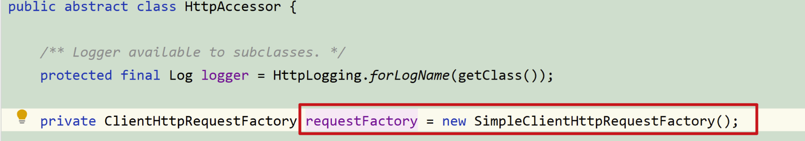

7. 进入方法 doWithRequest(request)可以发现，程序会执行第一个 else 中的逻辑，根据传入的参数，判断 requestBodyClass、requestBodyType 和 MediaType；
   - 如果第二个参数为 HashMap 或者 MultiValueMap 时，MediaType 为 null；
   - 如果是 HttpEntity 时，requestBodyClass 为对应参数的类型，MediaType 为封装 HttpHeaders 中的 ContentType 值

接下来会遍历所有的 HttpMessageConverter，这些对象在 RestTemplate 的构造函数中被初始化

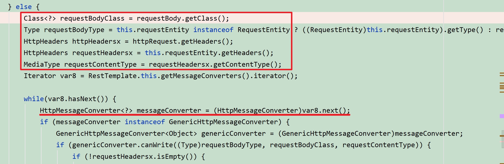

8. 在遍历过程中判断是否可以写入，如果能写入则执行写入操作并返回；判断 MessageConvertor 是否为 GenericHttpMessageConverter 的子类，是因为写入的方式不同；在这些 MessageConvertor 中只有 GsonHttpMessageConverter 是 GenericHttpMessageConverter 的子类，且排在最后；因此，遍历过程中会先判断前六个 convertor，能写入则执行写入，最后才是 GsonHttpMessageConvertor。分析所有的 HTTPMessageConvertor，可以发现

   - MultiValueMap 子类的数据会被 AllEncompassingFormHttpMessageConverter 处理，将 MediaType 置为 application/x-www-form-urlencoded、将 request 中的 key value 通过&=拼接并写入到 body 中，接收时，可以为@RequestParam、也可以为@RequestBody ==Http 协议中，如果不指定 Content-Type，则默认传递的参数就是 application/x-www-form-urlencoded 类型==

   - HashMap 类型的数据会被 GsonHTTPMessageConvertor 处理，将 MediaType 置为 application/json;charset=UTF-8、将 request 转成 json 并写入到 body 中，==因此，第二个参数设置为 HashMap 时，无法设置 ContentType 值，所有第二个参数无法使用 HashMap！但是可以使用 HttpEntity 对象，将 HashMap 存放在 HttpEntity 对象里边，接收参数时，使用@RequestBody==

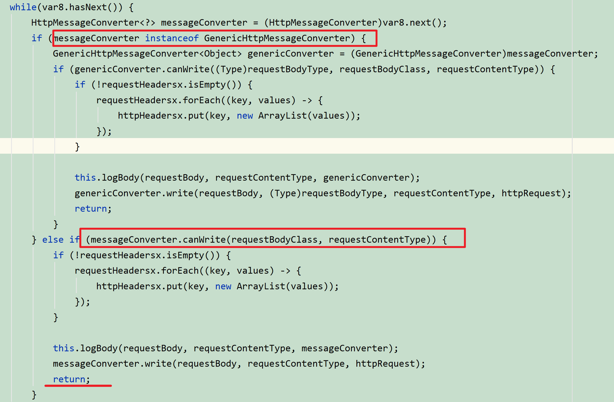

<br>

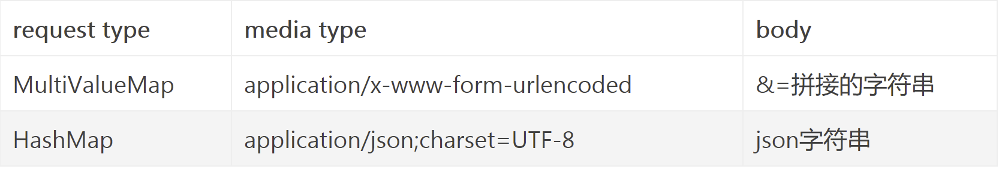

##### 5. restTemplate 访问 Https 接口

`restTemplate 底层默认使用的是 SimpleClientHttpRequestFactory，是基于 HttpURLConnection，是不支持调用 Https 接口的，可以修改为 HttpComponentsClientHttpRequestFactory`

```java
public class RestTemplateConfig {
  @Bean
  public RestTemplate getRestTemplate() throws KeyStoreException, NoSuchAlgorithmException, KeyManagementException {
        SSLContext sslContext = new SSLContextBuilder().loadTrustMaterial(null, new TrustStrategy() {
            @Override
            public boolean isTrusted(X509Certificate[] arg0, String arg1) throws CertificateException {
                return true;
            }
        }).build();

        SSLConnectionSocketFactory csf = new SSLConnectionSocketFactory(sslContext,
                new String[]{"TLSv1"},
                null,
                NoopHostnameVerifier.INSTANCE);

        CloseableHttpClient httpClient = HttpClients.custom()
                .setSSLSocketFactory(csf)
                .build();

        HttpComponentsClientHttpRequestFactory requestFactory = new HttpComponentsClientHttpRequestFactory();

        requestFactory.setHttpClient(httpClient);
        return new RestTemplate(requestFactory);
    }
}

```

## 6. 异步和定时

#### 1. TaskExecutor 任务执行器 与 TaskScheduler 任务调度器

- 任务执行器：多线程执行异步任务
- 任务调度器：定时任务多线程调度，定义一个自定义的任务调度线程池
- 对于更细粒度的控制，可以实现 SchedulingConfigurer 或 AsyncConfigurer 接口
  - springboot 默认线程池配置，可以实现 AsyncConfigurer 接口，该接口中有配置线程池和异常处理的方法；
  - SchedulingConfigurer 接口

#### 2. 异步（注解和接口）

> @Async 标注异步方法，@EnableAsync 开启异步执行调用，可以直接标注在启动类、也可以写在自定义配置类上
>
> 1. 不能再同类中调用，因为实现的方式是动态代理
> 2. 异步执行类需要被 spring 管理，且使用注入的方法获取实例进行调用，不能使用 new
> 3. 异步方法不能使用 static 修饰
> 4. 需要扫码配置类，@Configuration

```java
@Configuration
@EnableAsync//开启异步
public class ThreadPoolConfig {
    @Bean("logThread")
    public TaskExecutor taskExecutor() {
        ThreadPoolTaskExecutor executor = new ThreadPoolTaskExecutor();
        // 设置核心线程数
        executor.setCorePoolSize(4);
        // 设置最大线程数
        executor.setMaxPoolSize(8);
        // 设置队列容量
        executor.setQueueCapacity(100);
        // 设置线程活跃时间（秒）
        executor.setKeepAliveSeconds(60);
        // 设置默认线程名称
        executor.setThreadNamePrefix("home.bus.logThread-");
        // 设置拒绝策略
        executor.setRejectedExecutionHandler(new ThreadPoolExecutor.CallerRunsPolicy());
        // 等待所有任务结束后再关闭线程池
        executor.setWaitForTasksToCompleteOnShutdown(true);
        return executor;
    }
}

/**
 * @description: 异步线程池配置 AsyncConfigurer在applicationContext早期初始化，如果需要依赖于其它的bean，尽可能的将它们声明为lazy
 */
@EnableAsync
@Configuration
@EnableConfigurationProperties(AsyncThreadPoolProperties.class)
public class AsyncThreadPoolAutoConfiguration implements AsyncConfigurer {
    @Autowired
    private AsyncThreadPoolProperties asyncThreadPoolProperties;
    /**
     * 定义线程池
     * 使用{@link java.util.concurrent.LinkedBlockingQueue}(FIFO）队列，是一个用于并发环境下的阻塞队列集合类
     * ThreadPoolTaskExecutor不是完全被IOC容器管理的bean,可以在方法上加上@Bean注解交给容器管理,这样可以将taskExecutor.initialize()方法调用去掉，容器会自动调用
     * @return
     */
    @Bean("asyncTaskExecutor")
    @Override
    public Executor getAsyncExecutor() {
        //Java虚拟机可用的处理器数
        int processors = Runtime.getRuntime().availableProcessors();
        //定义线程池
        ThreadPoolTaskExecutor taskExecutor = new ThreadPoolTaskExecutor();
        //核心线程数
        taskExecutor.setCorePoolSize(Objects.nonNull(asyncThreadPoolProperties.getCorePoolSize()) ? asyncThreadPoolProperties.getCorePoolSize() : processors);
        //线程池最大线程数,默认：40000
        taskExecutor.setMaxPoolSize(Objects.nonNull(asyncThreadPoolProperties.getMaxPoolSize()) ? asyncThreadPoolProperties.getMaxPoolSize() : 40000);
        //线程队列最大线程数,默认：80000
        taskExecutor.setQueueCapacity(Objects.nonNull(asyncThreadPoolProperties.getMaxPoolSize()) ? asyncThreadPoolProperties.getMaxPoolSize() : 80000);
        //线程名称前缀
        taskExecutor.setThreadNamePrefix(StringUtils.isNotEmpty(asyncThreadPoolProperties.getThreadNamePrefix()) ? asyncThreadPoolProperties.getThreadNamePrefix() : "Async-ThreadPool-");
        //线程池中线程最大空闲时间，默认：60，单位：秒
        taskExecutor.setKeepAliveSeconds(asyncThreadPoolProperties.getKeepAliveSeconds());
        //核心线程是否允许超时，默认:false
        taskExecutor.setAllowCoreThreadTimeOut(asyncThreadPoolProperties.isAllowCoreThreadTimeOut());
        //IOC容器关闭时是否阻塞等待剩余的任务执行完成，默认:false（必须设置setAwaitTerminationSeconds）
        taskExecutor.setWaitForTasksToCompleteOnShutdown(asyncThreadPoolProperties.isWaitForTasksToCompleteOnShutdown());
        //阻塞IOC容器关闭的时间，默认：10秒（必须设置setWaitForTasksToCompleteOnShutdown）
        taskExecutor.setAwaitTerminationSeconds(asyncThreadPoolProperties.getAwaitTerminationSeconds());
        /**
         * 拒绝策略，默认是AbortPolicy
         * AbortPolicy：丢弃任务并抛出RejectedExecutionException异常
         * DiscardPolicy：丢弃任务但不抛出异常
         * DiscardOldestPolicy：丢弃最旧的处理程序，然后重试，如果执行器关闭，这时丢弃任务
         * CallerRunsPolicy：执行器执行任务失败，则在策略回调方法中执行任务，如果执行器关闭，这时丢弃任务
         */
        taskExecutor.setRejectedExecutionHandler(new ThreadPoolExecutor.AbortPolicy());
        //初始化
        //taskExecutor.initialize();
        return taskExecutor;
    }
    /**
     * 异步方法执行的过程中抛出的异常捕获
     *
     * @return
     */
    @Override
    public AsyncUncaughtExceptionHandler getAsyncUncaughtExceptionHandler() {
        return (throwable, method, objects) -> {
            String msg = StringUtils.EMPTY;
            if (ArrayUtils.isNotEmpty(objects) && objects.length > 0) {
                msg = StringUtils.join(msg, "参数是：");
                for (int i = 0; i < objects.length; i++) {
                    msg = StringUtils.join(msg, objects[i], CharacterUtils.ENTER);
                }
            }
            if (Objects.nonNull(throwable)) {
                msg = StringUtils.join(msg, PrintExceptionInfo.printErrorInfo(throwable));
            }
            LoggerUtils.error(method.getDeclaringClass(), msg);
        };
    }
}
```

#### 3. 定时（注解和接口）

> 定时的几种实现方式：
>
> 1. while 循环执行 thread 线程，线程调用 sleep 睡眠
> 2. Timer 和 TimerTask， 简单无门槛，一般也没人用
> 3. 线程池，Executors.newScheduledThreadPool，底层 ScheduledThreadPoolExecutor；
> 4. spring 自带的 springtask（@Schedule），一般集成于项目中，小任务很方便
> 5. Quartz，开源工具 Quartz，分布式集群开源工具，以下两个分布式任务应该都是基于 Quartz 实现的，可以说是中小型公司必选，当然也视自身需求而定
> 6. 分布式任务 XXL-JOB，是一个轻量级分布式任务调度框架，支持通过 Web 页面对任务进行 CRUD 操作，支持动态修改任务状态、暂停/恢复任务，以及终止运行中任务，支持在线配置调度任务入参和在线查看调度结果。
> 7. 分布式任务 Elastic-Job，是一个分布式调度解决方案，由两个相互独立的子项目 Elastic-Job-Lite 和 Elastic-Job-Cloud 组成。定位为轻量级无中心化解决方案，使用 jar 包的形式提供分布式任务的协调服务。支持分布式调度协调、弹性扩容缩容、失效转移、错过执行作业重触发、并行调度、自诊。
> 8. 分布式任务 Saturn，Saturn 是唯品会在 github 开源的一款分布式任务调度产品。它是基于当当 elastic-job 来开发的，其上完善了一些功能和添加了一些新的 feature。目前在 github 上开源大半年，470 个 star。Saturn 的任务可以用多种语言开发比如 python、Go、Shell、Java、Php。其在唯品会内部已经发部署 350+个节点，每天任务调度 4000 多万次。同时，管理和统计也是它的亮点。
>
> @Schedule 注解：
>
> `核心属性是cron，代表定时任务的触发计划表达式，@Scheduled(cron="seconds minutes hours day month week")；也可以使用fixedRate、fixedDelay、initialDelay`
>
> 默认是单线程；是静态执行的，执行周期都是固定写死的；开启多个任务，任务执行时机会受上一次任务执行时间的影响
>
> `解决办法：定时任务多线程任务调度器：定义一个自定义的任务调度线程池TaskSchedule`

```java
@Configuration
@ComponentScan
public class SchedulerConfig{
    @Bean
    public TaskScheduler taskScheduler() {
        ThreadPoolTaskScheduler taskScheduler = new ThreadPoolTaskScheduler();
        taskScheduler.setPoolSize(5);
        taskScheduler.initialize();
        return taskScheduler;
    }
}

@Configuration      //1.主要用于标记配置类，兼备Component的效果。
@EnableScheduling   // 2.开启定时任务
public class SaticScheduleTask {
    //3.添加定时任务
    @Scheduled(cron = "0/5 * * * * ?")
    //或直接指定时间间隔，例如：5秒
    //@Scheduled(fixedRate=5000)
    private void configureTasks() {
        System.err.println("执行静态定时任务时间: " + LocalDateTime.now());
    }
}


// SchedulingConfigurer
// 通过将cron对象数据持久化，调用的时候，获取时间周期。
@Override
public void configureTasks(ScheduledTaskRegistrar taskRegistrar) {
    taskRegistrar.addTriggerTask(
        //1.添加任务内容(Runnable)
        () -> System.out.println("执行动态定时任务: " + LocalDateTime.now().toLocalTime()),
        //2.设置执行周期(Trigger)
        triggerContext -> {
            //2.1 从数据库获取执行周期
            String cron = cronMapper.getCron();
            //2.2 合法性校验.
            if (StringUtils.isEmpty(cron)) {
                // Omitted Code ..
            }
            //2.3 返回执行周期(Date)
            return new CronTrigger(cron).nextExecutionTime(triggerContext);
        }
    );
}
```

## 7. 常见问题

#### 1. SpringBoot 切换版本后，Junit 报错

`springboot 2.2 版本之前使用 JUnit4(org.junit.junit.Test)，之后版本使用 JUnit5(org.junit.juniter.api.Test)，由于初始化创建springboot时，版本高于2.2，导致引入包为jupiter；而改为低版本时，需要手动导JUnit5或者使用Junit4测试单元`

```xml
<dependency>
    <groupId>org.springframework.boot</groupId>
    <artifactId>spring-boot-starter-test</artifactId>
    <scope>test</scope>
    <exclusions>
    	<exclusion>
    		<groupId>org.junit.vintage</groupId>
    		<artifactId>junit-vintage-engine</artifactId>
    	</exclusion>
    </exclusions>
</dependency>
<dependency>
    <groupId>org.junit.jupiter</groupId>
    <artifactId>junit-jupiter</artifactId>
    <version>5.6.2</version>
    <scope>test</scope>
</dependency>
```

| 2.2 版本之前                             | 2.2 版本之后                                                                                   |
| ---------------------------------------- | ---------------------------------------------------------------------------------------------- |
| JUnit4(org.junit.junit.Test)             | JUnit(org.junit.juniter.api.Test)                                                              |
| 需要使用注解@RunWith(SpringRunner.class) | @ExtendWith(SpringExtension.class)                                                             |
|                                          | 支持 lambda 表达式                                                                             |
| 测试引擎：vintage-engine                 | 测试引擎：juniter-engine                                                                       |
|                                          | org.junit.jupiter.api.Assertions 包的 stratic 方法<br />assertTrue、assertFalse、assertNotNull |

#### 4. 多模块整合

> 问题汇总：
>
> 1. 打包时需使用：mvn clear package -Dmaven.test.skip=true 忽略测试进行打包，测试代码不会影响项目发布，但是会影响项目打包
> 2. 执行 jar 时指定配置文件：java -jar xxx.jar -Dspring.profiles.active=prod 或者--spring.profiles.active=dev;一个是命令行参数、一个是 jvm 参数

    --spring.config.location        加载本地配置文件
    --server.port=8080              指定端口

> 3. 项目打包报错：Non-resolvable parent POM for demo:demo-base:0.0.1-SNAPSHOT: Could not find artifact demo:demo:pom:0.0.1-SNAPSHOT and 'parent.relativePath' points at no local POM
>    - 删除<parent></parent>标签的这句 <relativePath/> <!-- lookup parent from repository -->
> 4. 报错信息截取：Unsatisfied dependency expressed through field 'baseMapper'; nested exception is org.springframework.beans.factory.NoSuchBeanDefinitionException: No qualifying bean
>    `未扫描到Mapper；解决方法：springboot启动类上加 @MapperScan注解或者在mapper接口上添加@Mapper注解，@Mapper 一定要有，否则 Mybatis 找不到 mapper；@Repository 可有可无，可以消去依赖注入的报错信息。@MapperScan > 可以替代 @Mapper`
> 5. 多启动类配置文件读取报错：`启动类使用：spring.profiles.active=dev,dao,service，在service模块，增加配置文件application-service.yml`
> 6. 编译错误：maven-surefire-plugin:2.22.2:test (default-test) on project earnings: There are test failures.
>    `会生成错误文件，打开排查--->`

```java
// 未找到合适的驱动类，由于资源文件未设置成Resources root
java.lang.IllegalStateException: Failed to load ApplicationContext
Caused by: org.springframework.beans.factory.BeanCreationException: Error creating bean with name 'dataSource' defined in class path resource [com/alibaba/druid/spring/boot/autoconfigure/DruidDataSourceAutoConfigure.class]: Invocation of init method failed; nested exception is org.springframework.boot.autoconfigure.jdbc.DataSourceProperties$DataSourceBeanCreationException: Failed to determine a suitable driver class
Caused by: org.springframework.boot.autoconfigure.jdbc.DataSourceProperties$DataSourceBeanCreationException: Failed to determine a suitable driver class
```

1. 创建一个 project，并删除 src 目录，修改 pom 文件的打包方式为 pom
   <packaging>pom</packaging>
2. 创建多个 module，并添加相互之间的依赖，将父工程改为 project
3. 在父模块中添加<modules></modules>标签
4. 修改启动类的包名，使启动类放在上一层，为了扫描同目录以及子目录下边的所有文件 (`SpringbootApplication默认扫描本包以及子包的所有实例；如果还需扫描其他包下的实例，使用@ComponentScan注解`)
5. 默认关闭 test 单元测试

```xml
<!-- maven-compiler-plugin 是用于在编译（compile）阶段加入定制化参数，比如指定java jdk版本号，以及bootclasspath；
而 spring-boot-maven-plugin 是用于 spring boot 项目的打包（package）阶段，两者没什么关系。 -->
<!--  -->
<build>
	<plugins>
		<plugin>
			<groupId>org.apache.maven.plugins</groupId>
			<artifactId>maven-compiler-plugin</artifactId>
			<version>3.1</version>
			<configuration>
				<source>${java.version}</source>
				<target>${java.version}</target>
                <encoding>UTF-8</encoding>
			</configuration>
		</plugin>
        <!-- maven里执行测试用例的插件，不显示配置就会用默认配置。这个插件的surefire:test命令会默认绑定maven执行的test阶段。 -->
		<plugin>
			<groupId>org.apache.maven.plugins</groupId>
			<artifactId>maven-surefire-plugin</artifactId>
			<version>2.19.1</version>
			<configuration>
				<skipTests>true</skipTests>    <!--默认关掉单元测试 -->
			</configuration>
		</plugin>
	</plugins>
</build>
```

#### 5. spring-boot-maven-plugin 插件

> maven 中的 classfier 标签，在打包的使用起别名，为了生成一个普通 jar，一个可执行 jar，可执行 jar 的后缀为 xxx-exec.jar
>
> 如果只需要普通 jar 包，就不需要启动类和打包插件，直接当成 maven 工程，直接可以用，`注意点(切记)：不能使用spring-boot-maven-plugin插件打包`

```xml
<plugin>
 <groupId>org.springframework.boot</groupId>
 <artifactId>spring-boot-maven-plugin</artifactId>
 <configuration>
 	<classifier>exec</classifier>
 </configuration>
</plugin>
```

#### 6. 单元测试异步执行问题

springboot 单元测试中测试异步线程，发现异步线程没有执行?

观察日志发现，主线程执行完毕，springboot 线程池关闭，这时才明白，虽是单元测试，却走的一个完整的 springboot 生命周期，主线程执行时间短，springboot 运行结束，线程池关闭.

解决办法：在 springboot 单元测试中，测试异步方法时，在主线程增加 Thread.sleep(),等待子线程执行结束后结束主线程，在实际环境中，springboot 一直运行中，故不会出现这种情况。

#### 7. 传参

```java
// @PathVariable 获取路径参数，比如url/{id}   	--一般用在GET，DELETE，PUT方法
// @RequestParam 获取查询参数，比如url/name=xxx  --一般在PUT，POST中比较常用
@GetMapping("/demo/{id}")
public void demo(@PathVariable(name = "id") String id, @RequestParam(name = "name") String name) {
    System.out.println("id="+id);
    System.out.println("name="+name);
}
// @RequestBody  使用map或者实体类接受参数，
// 无注解，使用form表单发送post请求，使用实体接受参数
使用@Valid对参数进行校验
在使用对象进行参数接收时，我们可以对参数进行校验，假设我们需要用户输入的密码是整数型且在000000至999999之间的数值，我们可以对属性passWord加上如下注解：

@Max(value = 999999,message = "超过最大数值")
@Min(value = 000000,message = "密码设定不正确")
private String passWord;

// 请求头参数以及cookie
	@RequestHeader
	@CookieValue
@GetMapping("/demo3")
public void demo3(HttpServletRequest request) {
    System.out.println(request.getHeader("myHeader"));
    for (Cookie cookie : request.getCookies()) {
        if ("myCookie".equals(cookie.getName())) {
            System.out.println(cookie.getValue());
        }
    }
}
@GetMapping("/demo3")
public void demo3(@RequestHeader(name = "myHeader") String myHeader,
        @CookieValue(name = "myCookie") String myCookie) {
    System.out.println("myHeader=" + myHeader);
    System.out.println("myCookie=" + myCookie);
}

使用 defaultValue 给参数指定个默认值。

```

#### 8. 测试连接数据库

> 必须导入 spring-boot-starter-jdbc 包，如果时整合 mybatis 或 mybatisplus 时，就不需要导入了，因为它们底层都依赖 spring-boot-starter-jdbc 的

#### 9. RestController 和 Controller

1. @Controller 注解

   - 在对应的方法上，视图解析器可以解析 return 的 jsp,html 页面，并且跳转到相应页面；若返回 json 等内容到页面，则需要加@ResponseBody 注解

2. @RestController 注解
   - 相当于@Controller+@ResponseBody 两个注解的结合，返回 json 数据不需要在方法前面加@ResponseBody 注解了，但使用@RestController 这个注解，就不能返回 jsp,html 页面，视图解析器无法解析 jsp,html 页面

#### 10. @RestControllerAdvice 和 @ControllerAdvice

- @RestControllerAdvice 注解包含了@ControllerAdvice 注解和@ResponseBody 注解

- 当自定义类加注解@RestControllerAdvice 或 ControllerAdvice+RequestBody 时，方法返回 json 数据。

- 通常和 @ExceptionHandler 配合使用，用于处理全局异常情况

#### 11. spring cache + caffeine

1. @CacheConfig：主要用于配置该类中会用到的一些共用的缓存配置
2. @Cacheable：主要方法返回值加入缓存，同时在查询时，会先从缓存中取，若不存在才再发起对数据的访问
3. @CachePut：配置于函数上，能够根据参数定义条件进行缓存，与@Cacheable 不同的是，每次回真实调用函数，所以主要用于数据新增和修改操作上
4. @CacheEvict:配置于函数上，通常用在删除方法上，用来从缓存中移除对应数据
5. @Caching:配置于函数上，组合多个 Cache 注解使用。

@EnableCaching：开启缓存功能
@Cacheable：定义缓存，用于触发缓存
@CachePut：定义更新缓存，触发缓存更新
@CacheEvict：定义清楚缓存，触发缓存清除
@Caching：组合定义多种缓存功能
@CacheConfig：定义公共设置，位于 class 之上

##### 11.1 导入依赖：

```xml
 <dependency>
    <groupId>org.springframework.boot</groupId>
    <artifactId>spring-boot-starter-cache</artifactId>
</dependency>

<dependency>
    <groupId>com.github.ben-manes.caffeine</groupId>
    <artifactId>caffeine</artifactId>
</dependency>
```

##### 11.2 yml 配置 通过 yaml 文件配置的方式不够灵活，无法实现多种缓存策略，所以现在一般使用 javaconfig 的形式进行配置。

```yaml
spring:
  cache:
    cache-names: caffeineChche
    type: caffeine
    caffeine:
      spec: initialCapacity=50,maximumSize=500,expireAfterWrite=5s

# Caffeine 配置说明
initialCapacity=[integer]: 初始的缓存空间大小
maximumSize=[long]: 缓存的最大条数
maximumWeight=[long]: 缓存的最大权重
expireAfterAccess=[duration]: 最后一次写入或访问后经过固定时间过期
expireAfterWrite=[duration]: 最后一次写入后经过固定时间过期
refreshAfterWrite=[duration]: 创建缓存或者最近一次更新缓存后经过固定的时间间隔，刷新缓存
weakKeys: 打开 key 的弱引用
weakValues：打开 value 的弱引用
softValues：打开 value 的软引用
recordStats：开发统计功能
# 注意

expireAfterWrite 和 expireAfterAccess 同事存在时，以 expireAfterWrite 为准。
maximumSize 和 maximumWeight 不可以同时使用
weakValues 和 softValues 不可以同时使用
```

##### 11.3 开启缓存 @EnableCaching

##### 11.4 使用

#### 12 RequestBodyAdvice 和 ResponseBodyAdvice

对@RequestBody 的参数进行各种处理，例如加解密、打印日志，这些东西我们可以用到 RequestBodyAdvice 和 ResponseBodyAdvice 来对请求前后进行处理，本质上他俩都是 AOP

1. supports:返回 true 代表开启支持，false 不支持。
2. beforeBodyRead:body 读取前进行处理。
3. afterBodyRead:body 读取后进行处理。
4. handleEmptyBody:body 为空时处理。

5. supports:返回 true 代表开启支持，false 不支持。
6. beforeBodyWrite:body 返回给页面参数之前处理。

> 对 controller 结果二次封装，在 spring 中，我们需要实现 HandlerMethodReturnValueHandler 接口，这并不会有任何问题；在使用 SpringBoot 的情况下，SpringBoot 对返回值的处理，默认就是 HandlerMethodReturnValueHandler，我们写的 HandlerMethodReturnValueHandler 无法直接生效，如果非要使用 HandlerMethodReturnValueHandler，那么只能想办法替换掉默认的

#### 13 拦截器

1. 实现方式
   - 定义一个类，实现 org.springframework.web.servlet.HandlerInterceptor 接口
   - 继承已实现了 HandlerInterceptor 接口的类，例如 org.springframework.web.servlet.handler.HandlerInterceptorAdapter 抽象类。
2. 添加 Interceptor 拦截器到 WebMvcConfigurer 配置器中
   - 以前一般继承 org.springframework.web.servlet.config.annotation.WebMvcConfigurerAdapter 类，不过 SrpingBoot 2.0 以上 WebMvcConfigurerAdapter 类就过时了。有以下 2 中替代方法：
     - 直接实现 org.springframework.web.servlet.config.annotation.WebMvcConfigurer 接口。（推荐）
     - 继承 org.springframework.web.servlet.config.annotation.WebMvcConfigurationSupport 类。但是继承 WebMvcConfigurationSupport 会让 SpringBoot 对 mvc 的自动配置失效。不过目前大多数项目是前后端分离，并没有对静态资源有自动配置的需求，所以继承 WebMvcConfigurationSupport 也未尝不可。
