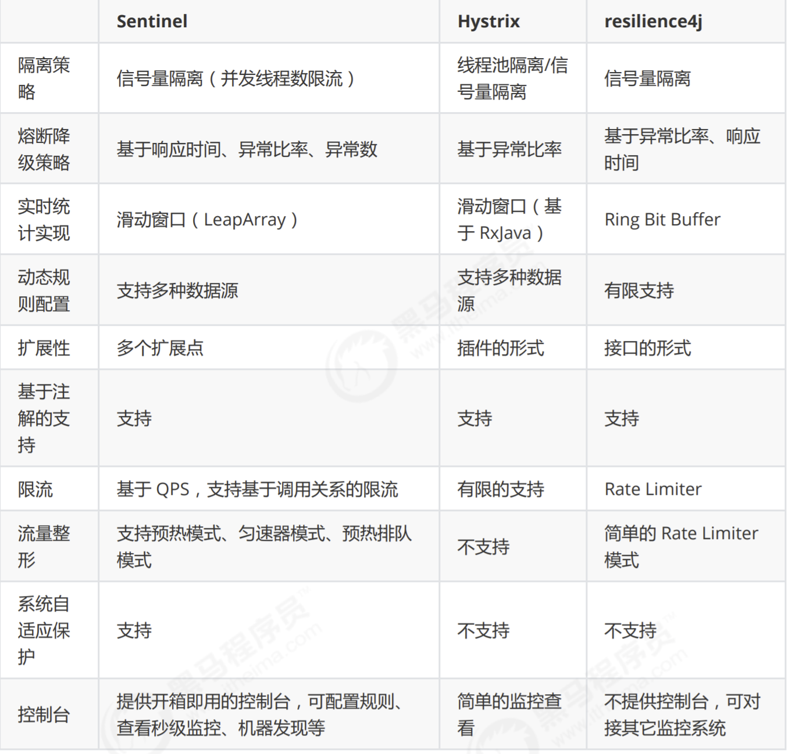

# spring-cloud-alibaba

## 1. Nacos

## 2. Sentinel 分布式系统的流量防卫兵

> Hystrix 迁移到 Sentinel：https://github.com/alibaba/Sentinel/wiki/Guideline:-%E4%BB%8E-Hystrix-%E8%BF%81%E7%A7%BB%E5%88%B0-Sentinel
>
> Sentinel 以流量为切入点，从流量控制、熔断降级、系统负载保护等多个维度保护服务的稳定性
> `使用 Sentinel 来进行熔断保护，主要分为几个步骤:`

1. 定义资源：可以是任何东西，一个服务，服务里的方法，甚至是一段代码
2. 定义规则：流量控制规则、熔断降级规则、系统保护规则、来源访问控制规则和 热点参数规则；所有规则都可以在内存态中动态地查询及修改，修改之后立即生效
3. 检验规则是否生效

### 2.1 分类

1. dashboard
2. Sentinel 核心库，核心库不依赖 Dashboard，但是结合 Dashboard 可以取得最好的效果

### 2.2 Senetinel 与 Hystrix 对比



### 2.3 dashboard 管理控制台

1. 下载 sentinel-dashboard.jar 包并启动

```shell
java -Dserver.port=8080 -Dcsp.sentinel.dashboard.server=localhost:8080 -Dproject.name=sentinel-dashboard -jar sentinel-dashboard.jar

-Dsentinel.dashboard.auth.username=sentinel # 用于指定控制台的登录用户名为 sentinel；
-Dsentinel.dashboard.auth.password=123456   # 用于指定控制台的登录密码为 123456；如果省略这两个参数，默认用户和密码均为 sentinel；
-Dserver.servlet.session.timeout=7200       # 用于指定 Spring Boot 服务端 session 的过期时间，如 7200 表示 7200 秒；60m 表示 60 分钟，默认为 30 分钟；
```

2. 客户端服务接入到控制台

（1） 引入 JAR 包

```xml
<dependency>
    <groupId>com.alibaba.csp</groupId>
    <artifactId>sentinel-transport-simple-http</artifactId>
</dependency>
```

（2）配置启动参数

```yaml
spring:
  cloud:
    sentinel:
      transport:
        dashboard: localhost:8080
```

3.  查看机器列表以及健康情况
    默认情况下 Sentinel 会在客户端首次调用的时候进行初始化，开始向控制台发送心跳包。也可以配置 sentinel.eager=true，取消 Sentinel 控制台懒加载。

### 2.4 基于 Sentinel 的服务保护(openfeign)

1. 引入 jar 包

```xml
<dependency>
  <groupId>com.alibaba.cloud</groupId>
  <artifactId>spring-cloud-alibaba-dependencies</artifactId>
  <version>2.1.0.RELEASE</version>
  <type>pom</type>
  <scope>import</scope>
</dependency>

<dependency>
  <groupId>com.alibaba.cloud</groupId>
  <artifactId>spring-cloud-starter-alibaba-sentinel</artifactId>
</dependency>

<dependency>
  <groupId>org.springframework.cloud</groupId>
  <artifactId>spring-cloud-starter-openfeign</artifactId>
</dependency>
```

2. 开启 OpenFeign 对 Sentinel 的支持

```yaml
feign:
  sentinel:
    enabled: true
```

3. 配置 FeignClient

   - 和使用 Hystrix 的方式基本一致，需要配置 FeignClient 接口以及通过 fallback 指定熔断降级方法

4. 配置熔断降级方法

   - 实现自定义接口，在接口的实现类中编写熔断降级方法
   - `独立使用时的操作：`在需要被保护的方法上使用@SentinelResource 注解进行熔断配置，@SentinelResource(value="order",blockHandler = "orderblockHandler",fallback = "orderfallback")
     在需要被保护的方法上使用@SentinelResource 注解进行熔断配置。与 Hystrix 不同的是，Sentinel 对抛出异常和熔断降级做了更加细致的区分，通过 blockHandler 指定熔断降级方法，通过 fallback 指定触发异常执行的降级方法

## 3. Gateway

> 是 Spring 官方基于 Spring 5.0，Spring Boot 2.0 和 Project Reactor 等技术开发的网关，旨在为微服务架构提供一种简单而有效的统一的 API 路由管理方式，统一访问接口。Spring Cloud Gateway 作为 Spring Cloud 生态系中的网关，目标是替代 Netflix ZUUL，其不仅提供统一的路由方式，并且基于 Filter 链的方式提供了网关基本的功能，例如：安全，监控/埋点，和限流等。它是基于 Nttey 的响应式开发模式。
> Spring Cloud Gateway 的 RPS 是 Zuul 的 1.6 倍

1. 路由（route） 路由是网关最基础的部分，路由信息由一个 ID、一个目的 URL、一组断言工厂和一组 Filter 组成。如果断言为真，则说明请求 URL 和配置的路由匹配。
2. 断言（predicates） Java8 中的断言函数，Spring Cloud Gateway 中的断言函数输入类型是 Spring5.0 框架中的 ServerWebExchange。Spring Cloud Gateway 中的断言函数允许开发者去定义匹配来自 Http Request 中的任何信息，比如请求头和参数等。
3. 过滤器（filter） 一个标准的 Spring webFilter，Spring Cloud Gateway 中的 Filter 分为两种类型，分别是 Gateway Filter 和 Global Filter。过滤器 Filter 可以对请求和响应进行处理。

### 3.1 使用

1. 引入 jar 包

```xml
<dependency>
    <groupId>org.springframework.cloud</groupId>
    <artifactId>spring-cloud-starter-gateway</artifactId>
</dependency>
```

2. 编写配置

```yaml
server:
  port: 8080 #服务端口
spring:
  application:
    name: api-gateway #指定服务名
  cloud:
    gateway:
      routes:
        - id: product-service # 路由ID，保持唯一
          uri: http://127.0.0.1:9002 # 目标url服务地址
          predicates: # 路由条件，Predicate 接受一个输入参数，返回一个布尔值结果。该接口包含多种默认方法来将 Predicate 组合成其他复杂的逻辑（比如：与，或，非）。
            - Path=/product/**
            # filters：过滤规则，暂时没用。


# 与eureka配合使用
spring:
  application:
    name: api-gateway #指定服务名
  cloud:
    gateway:
      routes:
      - id: product-service
        uri: lb://shop-service-product    # uri以 lb: //开头（lb代表从注册中心获取服务），后面接的就是你需要转发到的服务名称
        predicates:
        - Path=/product-service/**
        filters:
        - RewritePath=/product-service/(?<segment>.*), /$\{segment}
```

### 3.2 过滤器
