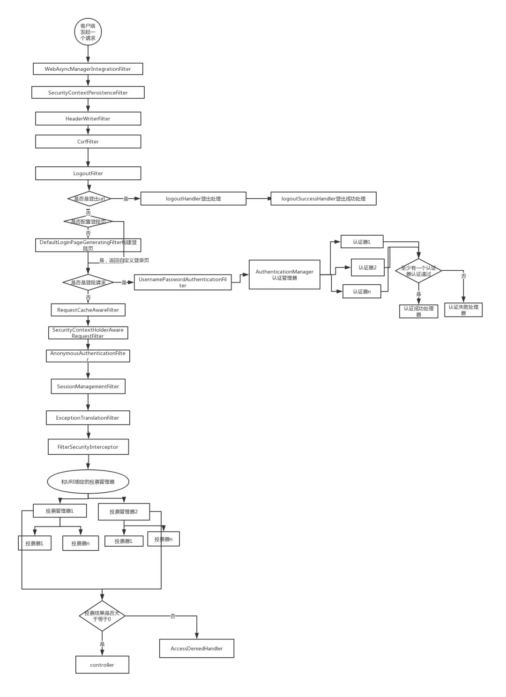

# spring-boot-starter-security

用户填入用户名密码后，与数据库里存储的用户信息进行比对，如果通过，则认证成功，传统的方法是在认证通过后，创建 sesstion，并给客户端返回 cookie。
我们采用 JWT 来处理用户名密码的认证。区别在于，认证通过后，服务器生成一个 token，将 token 返回给客户端，客户端以后的所有请求都需要在 http 头中指定该 token。 服务器接收的请求后，会对 token 的合法性进行验证。

## 一、Maven 依赖

```xml
<dependency>
    <groupId>org.springframework.boot</groupId>
    <artifactId>spring-boot-starter-security</artifactId>
    <version>${spring-boot.version}</version>
</dependency>
```

## 二、流程分析

### 1. 登录和权限控制基础逻辑

<!-- - LoginSession
    > 登录Session; 提供基础的登录能力和退出能力。登录能力调用后会返回用户唯一token标志 -->

- UserDetailsService
  > 处理用户信息获取逻辑，默认登录逻辑，自定义时，需要实现该接口，然后数据库查询用户信息做比较，处理自定义登录逻辑。
- UserDetails
  > 处理用户校验逻辑，实体类实现它
- PasswordEncoder
  > 密码加密，默认的实现为 BCryptPasswordEncoder（常用）
- 自定义登录成功处理器
  > 实现 AuthenticationSuccessHandler 接口，重写方法，方法中有个变量，重写即可
- 自定义 403 页面
  > 实现 accessDeniedHandler 接口
  > 
- 自定义配置类，实现 WebSecurityConfigurerAdapter

```java
@Configuration
public class SecurityConfig extends WebSecurityConfigurerAdapter {
    // 配置PasswordEncoder
    @Bean
    public PasswordEncoder passwordEncoder() {
        return new CryptPasswordEncoder();
    }

    @Override
    protected void configure(HttpSecurity http) throws Exception {
        System.out.println("BrowserSecurityConfig");
        http.formLogin() // 表单登录，
                .loginPage("/login.html") //  自定义登录页面，（注：重写后，默认的登录页面就不存在了）
                .loginProcessingUrl("/login") // 处理登录请求的URL，必须和from表单的请求一致，不走controller，而是使用默认的登录逻辑，然后走到自定义的UserDetailsService的实现类！！！
                .successForwardUrl("/toIndex")      // 登录成功后调转的页面，POST请求，无法直接跳转到静态页面。（前后端分离的项目，需要在前台处理）
                .successHandler(new xxxHandle("aaa.html"))
                .failureForwardUrl("/toError");     // 登录失败后调转的页面，POST请求,要放行，因为未认证
                .usernameParameter("userName")      // 自定义用户密码名称
                .passwordParameter("passWord");
                .and()
                .authorizeRequests() // 对请求做授权，所有请求必须认证之后才能访问，必须登录
                .antMatchers("/login.html").permitAll() // 登录页面不需要认证（常用） 重点：antMachers()必须放在anyRequest()前边，要不然不生效
                .antMatchers("/page1/**").hasRole("LEVEL1")     // 基于角色认证
                .antMatchers("/page2/**").hasRole("LEVEL2")
                .antMatchers("/page3/**").hasRole("LEVEL3");
                .anyRequest().authenticated() // 任何请求，都需要身份认证
                .and().csrf().disable(); // 暂时将防护跨站请求伪造的功能置为不可用，
        http.exceptionHandling().accessDeniedHandler("注入的handler");
        http.logout.logoutSuccessUrl("/login.html")
    }
}
// permitAll()  允许所有
// dengAll()    禁止所有
// anonymous    匿名，和permitAll差不多，很少用，电商，商品详情不需要登录可以查看的
// rememberMe   记住我
// authenticated    认证
// fullyAuthenticated   全认证（用户密码必须输入的登录）
// .antMatchers("/page1/**").hasRole("LEVEL1")
// hasAuthority("admin")   基于权限认证
// hasAnyAuthority("admin"，"ddd")  多个
// hasRole("LEVEL3");       基于角色认证，不需要加ROLE_开头
// hasIpAddress("192.168.100.167")  基于ip认证
// access(hasRole('abc'))     基于access的权限控制，是上边的底层实现，也可以自定义access()
```

### 2. 基于注解的实现

- @EnableGlobalMethodSecurity(prePostEnabled = true, securedEnabled = true)
  > 默认不可用，通过该注解开启
- @Secured
  > 专门判断用户是否具有角色，可以写在方法或类上，参数以 ROLE\_ 开头
- @PreAuthorize(access 表达式)\PostAuthorize
  > Pre 访问的类或方法执行前判断权限，而 Post 在执行之后，所以 Post 基本不用
  > 允许与 ROLE\_ 开头。

### 3. rememberMe

- 需要数据库

```java
@Bean
public PersistentTokenRepository persistentTokenRepository(){
    JdbcTokenRepositoryImpl jdbcTokenRepository = new JdbcTokenRepositoryImpl();
    jdbcTokenRepository.setDataSource(dataSource);
    // 自动建表，第一次启动开启，后边就应该关闭
    jdbcTokenRepository.setCreateTableOnStartup(true);
    return jdbcTokenRepository;
}

http.rememberMe()
        // 设置数据源
        .tokenRepository(persistentTokenRepository())
        // 默认两周，单位为s
        .tokenValiditySeconds(60)
        // 自定义登录逻辑
        .userDetailsService("xxx");
```

### 3. csrf

    > 跨站请求伪造，网络协议，ip地址，端口只要有一个不同，都是跨域请求

### 4. Oauth2 协议

    >

## 三、springboot 集成 security 步骤

### 3.1 导入依赖

### 3.2 认证实现

#### 3.2.1 方案一

自定义登录逻辑：需要编写登录接口，在接口中调用 authenticationManager.authenticate()方法，返回 Authenticatio 对象，最后根据 Authentication 的 getPrincipal()方法获取 User 对象，根据 User 对象封装 token，然后返回。
其中 authenticate()方法中会调用 UserDetailsSercice 接口里边的 loadUserByUsername()方法，该方法会做一些校验，可以自定义实现类，重写方法，完成校验。
User 对象是 UserDetails 接口的实现类，也可以自定义实现类， 完成可配置的 User Bean 对象。
还需要在配置文件重新命名 loginPage()和表单提交的 username 和 password，并且注入 AuthenticationManager。

```java
@Api(tags = "登录模块")
@RestController
@RequestMapping("/dbs")
public class SysLoginController {

    @Autowired
    private SysLoginService loginService;

    @ApiOperation("登录")
    @PostMapping("/login")
    public ResultVo login(LoginModel loginModel) {
        String token = loginService.login(loginModel);
        Map<String, String> data = new HashMap<>(1);
        data.put(Constants.TOKEN, token);
        return ResultVo.success(data);
    }

}

@Service
public class SysLoginService {
    @Autowired
    private AuthenticationManager authenticationManager;

    public String login(LoginModel loginModel) {
        final String account = loginModel.getAccount();
        final String password = loginModel.getPassword();
        Authentication authenticate = authenticationManager.authenticate(new UsernamePasswordAuthenticationToken(account, password));
        User user = (User) authenticate.getPrincipal();
        // 根据user生成token
        return JwtUtils.createToken(user);
    }
}

public class CustomUserDetails implements UserDetails {
    //TODO 重写方法
}

@Configuration
@EnableGlobalMethodSecurity(prePostEnabled = true, securedEnabled = true)
public class SecurityConfig extends WebSecurityConfigurerAdapter {
    @Override
    protected void configure(HttpSecurity http) throws Exception {
        http.formLogin()
                .loginPage("/login.html")
                .loginProcessingUrl("/login")
                .usernameParameter("account")
                .passwordParameter("password");
    }

    /**
    * 自定义登录逻辑时，需要使用AuthenticationManager，解决无法直接注入 AuthenticationManager
    * @return
    * @throws Exception
    */
    @Bean
    @Override
    public AuthenticationManager authenticationManagerBean() throws Exception {
        return super.authenticationManagerBean();
    }
}
```

#### 3.2.2 方案二

使用 security 自带的登录逻辑，只需要在返回的时候，将 token 加入到 response 中，具体实现：创建一个 UsernamePasswordAuthenticationFilter 的实现类，重写
successfulAuthentication()方法，用户成功登录后，该方法被调用，在该方法中加入我们的 token
而且还需要将自定义的类加入到配置中。 .addFilter(new JwtLoginFilter(authenticationManager()))

```java
/**
 * 自定义JWT登录过滤器
 * 验证用户名密码正确后，生成一个token，并将token返回给客户端
 * 该类继承自UsernamePasswordAuthenticationFilter，重写了其中的2个方法
 * attemptAuthentication ：接收并解析用户凭证。
 * successfulAuthentication ：用户成功登录后，这个方法会被调用，我们在这个方法里生成token。
 */
public class JwtLoginFilter extends UsernamePasswordAuthenticationFilter {

    @Override
    protected void successfulAuthentication(HttpServletRequest request, HttpServletResponse response, FilterChain chain, Authentication authResult) throws IOException, ServletException {
        // 根据request获取User对象
        User user = new ObjectMapper().readValue(request.getInputStream(), User.class);
        // 将token放入到response
        return JwtUtils.createToken(user);
        response.addHeader("Authorization", "Bearer " + token);
        super.successfulAuthentication(request, response, chain, authResult);
    }
}
```

### 3.3 权限控制

1. 配置文件实现：url 路径权限，通过在配置文件 configure()方法中，增加扩展即可。
2. 注解控制权限，使用@EnableGlobalMethodSecurity(prePostEnabled = true,securedEnabled = true)开启，
   @PreAuthorize：方法执行前进行权限检查
   @PostAuthorize：方法执行后进行权限检查
   @Secured：类似于 @PreAuthorize

   - 实现 UserDetailService，重写 loadUserByUsername(String userName)方法。根据 userName 来实现自己的业务逻辑返回 UserDetails 的实现类，需要自定义 User 类实现 UserDetails，比较重要的方法是 getAuthorities()，用来返回该用户所拥有的权限

3. 过滤器注解，过滤函数 @PreFilter 和 @PostFilter
4. 动态权限，主要通过重写拦截器和决策器来实现
   - 通过自定义 filter 重写 spring security 拦截器，实现动态过滤用户权限，
   - 通过自定义 filter 重写 spring security 拦截器，实现自定义参数来检验用户，并且过滤权限。

# springboot security 权限控制 -- @PreAuthorize 的使用

> security 鉴权方式有两种配置，1、配置文件中配置；2、使用注解标注；他们都是基于 acess 表达式，如果需要自定义逻辑的鉴权认证，只需要自定义 access 表达式即可。本文只选取注解的方式，来讲解默认的 access 和自定义的 access 表达式。

## 1. 注解使用前提条件：

注解默认不可用，通过开启注解：在配置类中开启注解 @EnableGlobalMethodSecurity(prePostEnabled = true, securedEnabled = true)

- @Secured：专门判断用户是否具有角色，可以写在方法或类上，参数以 ROLE\_ 开头
- @PreAuthorize\PostAuthorize： PreAuthorize 访问的类或方法执行前判断权限，而 PostAuthorize 在执行之后，Post 基本不用；允许与 ROLE\_ 开头。

1.

## 鉴权的具体实现说明

1. 通过 UserDetail 的 getAuthorities()，将对应用户的权限返回给 security。通过 security 的 access 表达式进行权限认证
2.


