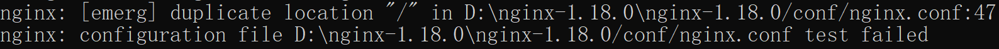
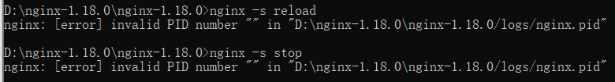

## 概念及特点

1. 是一个高性能的 HTTP 和反向代理服务器，
2. 占用内存小，专为性能优化而开发，
3. 可以作为静态页面的 web 服务器，
4. 反向代理，负载均衡，动静分离，高可用集群

## 反向代理

正向代理：客户端必须设置正向代理服务器的 ip 和端口

是指以代理服务器来接受 Internet 上的连接请求，然后将请求转发给内部的网络上的服务器，并将服务器上得到的结果返回给 internet 上请求连接的客户端，此时代理服务器对外就表现为一个服务器。

## 动静分离

为了加快网站的解析速度，可以把动态页面和静态页面由不同的服务器来解析，加快解析速度。降低原来单个服务器的压力。

## Linux 安装

官网：<http://nginx.org/en/download.html>

1. 安装 PCRE 包：PCRE 作用是让 Nginx 支持 Rewrite 功能

2. 安装 openssl、zlib：安装编译工具和库文件

   yum -y install make zlib zlib-devel gcc-c++ libtool openssl openssl-devel

3. 安装 nginx：拷包、解压 tar -xvf \*\*\*、./configure、make && make install

## Linux 防火墙

```shell
# 查看开放的端口号
firewall-cmd --list-all
# 设置开放的端口号
firewall-cmd --add-service=http –permanent
firewall-cmd --add-port=80/tcp --permanent
# 重启防火墙
firewall-cmd –reload
```

## nginx 命令

```shell
cd /usr/local/nginx/sbin    # 安装路径
./nginx     nginx -v   # 查看版本
./nginx      start nginx   # 启动
./nginx -s reload    nginx -s reload  # 重载
./nginx -s stop      nginx -x stop  # 停止
./nginx -t     nginx -t    # 查看配置文件是否正确
upstream        # 配置负载均衡
```

## 配置文件

1. 全局块：设置一些影响 nginx 服务器整体运行的配置指令
2. event 块
3. http 块(server 部分)

```shell
# 全局块：会设置一些影响 nginx 服务器整体运行的配置指令，主要包括配置运行 Nginx 服务器的用户（组）、允许生成的 worker process 数，进程 PID存放路径、日志存放路径和类型以及配置文件的引入等。
#user  nobody;
# 服务器并发处理服务的关键配置，不考虑硬件软件设备的制约，值越大，并发处理量越多。
worker_processes  1;

#error_log  logs/error.log;
#error_log  logs/error.log  notice;
#error_log  logs/error.log  info;

#pid        logs/nginx.pid;

events {
 # 每个word process可以同时支持的最大连接数
    worker_connections  1024;
}


http {
    include       mime.types;
    default_type  application/octet-stream;

    #log_format  main  '$remote_addr - $remote_user [$time_local] "$request" '
    #                  '$status $body_bytes_sent "$http_referer" '
    #                  '"$http_user_agent" "$http_x_forwarded_for"';

    #access_log  logs/access.log  main;

    sendfile        on;
    #tcp_nopush     on;

    #keepalive_timeout  0;
    keepalive_timeout  65;

    #gzip  on;

 # 配置负载均衡
 upstream myserver{
  server 127.0.0.1:8080;
  server 127.0.0.1:8081;
 }
 # 使用upstream实现负载均衡
 # nginx分配服务器策略：
 # 轮询（默认）：每次请求按时间顺序逐一分配到不同的后端服务器，如果后端服务器down掉，能自动剔除，如果在恢复，也会添加进来
 # weight权重，默认为1，权重越高，被分配的客户端越多，权重不能设置为0
 # ip_hash：每个请求按访问ip的hash结果分配，这样每个访客固定访问一个后端服务器
 # fair（第三方）：按照后端服务器的响应时间来分配请求，响应时间短的优先分配
 #upstream myfirst {
 # server localhost:8080 weight=10;
 # server localhost:8099 weight=1;
 #}


 # 和虚拟主机密切相关，每个server相当于一个虚拟主机；而每个 server 块也分为全局 server 块，以及可以同时包含多个 locaton 块。
    server {
        listen       31943; # nginx监听端口，默认为80
        server_name  localhost;  # 监听的ip地址

        #charset koi8-r;

        #access_log  logs/host.access.log  main;
  # 配置反向代理1, 反向代理tomcat
  location / {
   root   html;
   index  index.html index.htm;
   try_files $uri $uri/ /index.html;
   proxy_pass http://127.0.0.1:8080
  }
  # 配置反向代理2-调转到不同的url
  location ~ /dangbo/ {
   proxy_pass http://127.0.0.1:8082
        }

  location / {
   proxy_pass http://myserver;
   proxy_set_header Host $host;
            proxy_set_header X-Real-IP $remote_addr;
            proxy_connect_timeout 600;
            proxy_read_timeout 600;
            proxy_send_timeout 600;
  }

  # 实现动静分离，访问静态资源
  location /code/ {
   root D:/;
   autoindex on;
   autoindex_exact_size off;            //关闭详细文件大小统计，让文件大小显示MB，GB单位，默认为b；
  }


  location / {
   root   html;
      index  index.html index.htm;
   try_files $uri $uri/ /index.html;
  }
  location /admin {
   alias  html/;
      index  admin.html admin.htm;
   try_files $uri $uri/ /admin.html;
  }

        #error_page  404              /404.html;

        # redirect server error pages to the static page /50x.html
        #
        error_page   500 502 503 504  /50x.html;
        location = /50x.html {
            root   html;
        }
    }
}


http{
    server {
        listen 8080;
        server_name localhost;
        location /user { # 可以填其他的, 可以是正则等, 这个没有细看(自行百度~)
            # 路径要和对应服务的路径相同, 比如localhost:8001/user
            # 通过8080/user端口访问的这个路径, 会一直对应在8001/user这个路径下,
            # 再比如, 想访问8080/user/login的时候, 对应8001/user/login
            proxy_pass http://localhost:8001;
            # 如果8001后边不加/，默认转发到http://localhost:8081/user;
            # 如果8001后边加/，默认代理到http://localhost:8081/  -> 相当于绝对跟路径，则nginx不会把location中匹配的路径部分代理走。
        }
    }
}

# 分析：
location后边的path路径     proxy_pass 代理的url
 后边有/      port/                   代理到port/，且path（后边不带/）无法访问，404，页面可以自动加上/
 后边有/      port(后边没有/)   访问path/或者path都会报失败
 #后边有/      port/xxx/      代理到prot/xxx{/}     正确
 后边有/      port/xxx       代理到port/xxx      报错，404
 后边无/      port/       http://localhost:8081/
 #后边无/      port        代理到port/path/    目前使用最多的。
 后边无/      port/xxx/      代理到port/xxx{/}  正确
 后边无/      port/xxx       代理到port/xxx     正确。
```

[proxy_pass 反向代理配置中 url 后面加不加/的说明](https://www.cnblogs.com/kevingrace/p/6566119.html)

[Nginx 反向代理和缓存服务器功能说明和简单实现](https://www.cnblogs.com/kevingrace/p/5839698.html)

## 负载均衡策略

1. 轮询（默认） 每个请求按时间顺序逐一分配到不同的后端服务器，如果后端服务器 down 掉，能自动剔除。

2. weight weight 代表权重默认为 1,权重越高被分配的客户端越多

3. ip_hash 每个请求按访问 ip 的 hash 结果分配，这样每个访客固定访问一个后端服务器

4. fair（第三方） 按后端服务器的响应时间来分配请求，响应时间短的优先分配。

## 动静分离

针对前后端分离的项目：将静态文件独立成单独的域名，放在独立的服务器上。

​ 可以使用 autoindex on 显示目录下的所有文件。

```shell
# 实现动静分离，访问静态资源，root为绝对路径。
location /code/ {
    root D:/;
    autoindex on;
}
```

## 配置高可用集群

> Keepalived+Nginx 高可用集群（主从模式）
>
> 需要使用 keepalived 实现高可用、用来配置虚拟 ip，设置心跳检测解决静态路由的单点故障问题

## nginx 工作原理

1. master
2. worker：多个，如果一个出现问题，其他 worker 独立的，都是进行争抢，实现请求过程，能够保证服务不中断
3. 可以实现热部署，nginx -s reload。
4. 连接数 worker_connection：一次请求占用 2 个或者 4 个连接数。

## Nginx 集成 swagger

```shell
location ~* ^(/v2|/webjars|/swagger-resources|/swagger-ui.html){
       proxy_set_header Host $host;
       proxy_set_header  X-Real-IP  $remote_addr;
       proxy_set_header X-Forwarded-For $remote_addr;
       #proxy_set_header Host $host:$server_port;
       proxy_set_header X-Forwarded-Proto $scheme;
       proxy_set_header X-Forwarded-Port $server_port;
       proxy_pass http://10.18.66.66:8600; # 后端服务地址
}
```

## 问题汇总

> 1. 配置多个 location，报错：重复配置 location，路径指定相同，
>
> 解决办法：只保留一个 location 或者修改其中一个 location 指定的路径
>
> 
>
> 2. 无效的 PID：nginx 未启动
>
> 
>
> 3. location 中每个 url 之后需要添加英文分号；不管位置在哪，和 json 不太一样，json 最后一个不需要分号
> 4. 使用正则表达式之后，proxy_pass 中 url 不能追加
> 5. nginx: [emerg] CreateDirectory() "D:\nginx-1.18.0\nginx-1.18.0/temp/client_body_temp" failed (3: The system cannot find the path specified)
>
> nginx 问题，需要重新安装或解压
>
> 6. nginx: [emerg] "proxy_pass" cannot have URI part in location given by regular expression, or inside named location, or inside "if" statement, or inside "limit_except" block in D:\nginx-1.18.0\nginx-1.18.0/conf/nginx.conf:95
>
> nginx: [emerg] "proxy_pass"不能有 URI 部分在正则表达式给出的位置中，或在 named location 中，或在"if"语句中，或在"limit_except"块中

## 实例 1：代理前端静态页面

```shell
# 将前端服务打包后，拷贝到html目录下：如果包含项目目录，root配置需要改为xxx/html
#try_files 按照指定的顺序查找文件，并使用第一个找到的文件进行请求处理，last表示匹配不到就内部直接匹配最后一个。
location / {
 root xxx/html
 try_files $uri $uri/  /index.html last
 index index.thml index.htm
}
```

## keepalived

### 1. 是什么

起初是专为 LVS 负载均衡软件设计的，用来管理并监控 LVS 集群系统中各个服务节点状态，后来又加入了可以实现高可用的 VRRP 功能，因此，keepalived 除了能够管理 LVS 软件外，还可以作为其他服务的高可用解决方案软件，比如 nginx、Haproxy、Mysql

### 2. 原理

vrrp：虚拟路由器冗余协议，通过该协议实现高可用功能，vrrp 的目的是为了解决静态路由单点故障问题的，能够保证当个别节点宕机时，整个网路可以不间断的运行。

在 Keepalived 服务正常工作时，主 Master 节点会不断地向备节点发送（多播的方式）心跳消息，用以告诉备 Backup 节点自己还活看，当主 Master 节点发生故障时，就无法发送心跳消息，备节点也就因此无法继续检测到来自主 Master 节点的心跳了，于是调用自身的接管程序，接管主 Master 节点的 IP 资源及服务。而当主 Master 节点恢复时，备 Backup 节点又会释放主节点故障时自身接管的 IP 资源及服务，恢复到原来的备用角色。

Keepalived 高可用对之间是通过 VRRP 进行通信的， VRRP 是遑过竞选机制来确定主备的，主的优先级高于备，因此，工作时主会优先获得所有的资源，备节点处于等待状态，当主挂了的时候，备节点就会接管主节点的资源，然后顶替主节点对外提供服务。

在 Keepalived 服务对之间，只有作为主的服务器会一直发送 VRRP 广播包,告诉备它还活着，此时备不会枪占主，当主不可用时，即备监听不到主发送的广播包时，就会启动相关服务接管资源，保证业务的连续性.接管速度最快可以小于 1 秒。

### 3. 作用

- 管理 LVS 负载均衡软件
- 实现 LVS 集群节点的健康检查中
- 作为系统网络服务的高可用性（failover）

### 4. 修改 Keepalived 配置文件

(1) MASTER 节点配置文件（192.168.50.133）

```yaml
# vi /etc/keepalived/keepalived.conf
! Configuration File for keepalived
global_defs {
 ## keepalived 自带的邮件提醒需要开启 sendmail 服务。 建议用独立的监控或第三方 SMTP
 router_id liuyazhuang133 ## 标识本节点的字条串，通常为 hostname
}
## keepalived 会定时执行脚本并对脚本执行的结果进行分析，动态调整 vrrp_instance 的优先级。如果脚本执行结果为 0，并且 weight 配置的值大于 0，则优先级相应的增加。如果脚本执行结果非 0，并且 weight配置的值小于 0，则优先级相应的减少。其他情况，维持原本配置的优先级，即配置文件中 priority 对应的值。
vrrp_script chk_nginx {
 script "/etc/keepalived/nginx_check.sh" ## 检测 nginx 状态的脚本路径
 interval 2 ## 检测时间间隔
 weight -20 ## 如果条件成立，权重-20
}
## 定义虚拟路由， VI_1 为虚拟路由的标示符，自己定义名称
vrrp_instance VI_1 {
 state MASTER ## 主节点为 MASTER， 对应的备份节点为 BACKUP
 interface eth0 ## 绑定虚拟 IP 的网络接口，与本机 IP 地址所在的网络接口相同， 我的是 eth0
 virtual_router_id 33 ## 虚拟路由的 ID 号， 两个节点设置必须一样， 可选 IP 最后一段使用, 相同的 VRID 为一个组，他将决定多播的 MAC 地址
 mcast_src_ip 192.168.50.133 ## 本机 IP 地址
 priority 100 ## 节点优先级， 值范围 0-254， MASTER 要比 BACKUP 高
 nopreempt ## 优先级高的设置 nopreempt 解决异常恢复后再次抢占的问题
 advert_int 1 ## 组播信息发送间隔，两个节点设置必须一样， 默认 1s
 ## 设置验证信息，两个节点必须一致
 authentication {
  auth_type PASS
  auth_pass 1111 ## 真实生产，按需求对应该过来
 }
 ## 将 track_script 块加入 instance 配置块
 track_script {
  chk_nginx ## 执行 Nginx 监控的服务
 } #
 # 虚拟 IP 池, 两个节点设置必须一样
 virtual_ipaddress {
  192.168.50.130 ## 虚拟 ip，可以定义多个
 }
}
```

(2) BACKUP 节点配置文件（192.168.50.134）

```properties
# vi /etc/keepalived/keepalived.conf
! Configuration File for keepalived
global_defs {
 router_id liuyazhuang134
}
vrrp_script chk_nginx {
 script "/etc/keepalived/nginx_check.sh"
 interval 2
 weight -20
}
vrrp_instance VI_1 {
 state BACKUP
 interface eth1
 virtual_router_id 33
 mcast_src_ip 192.168.50.134
 priority 90
 advert_int 1
 authentication {
  auth_type PASS
  auth_pass 1111
 }
 track_script {
  chk_nginx
 }
 virtual_ipaddress {
  192.168.50.130
 }
}
```

### 5. 编写 nginx 状态检测脚本

```yaml
# vi /etc/keepalived/nginx_check.sh
#!/bin/bash
A=`ps -C nginx –no-header |wc -l`
if [ $A -eq 0 ];then
/usr/local/nginx/sbin/nginx
sleep 2
if [ `ps -C nginx --no-header |wc -l` -eq 0 ];then
killall keepalived
fi
fi
```

### 6. 启动 Keepalived

```shell
# service keepalived start
Starting keepalived: [ OK ]

[root@lb02 ~]# /etc/init.d/keepalived start
Starting keepalived:                                       [  OK  ]
```

### 7. 脑裂

## root 和 alias 区别

**在 location /中配置 root，在 location /other 中配置 alias。**

**root 会根据完整的 URI 请求来映射，也就是/path/uri**

**alias 会把 location 后面配置的路径丢弃掉，把当前匹配到的目录指向到指定的目录**

## nginx 配置安全证书 ssl

```bash
# 1. 先检查是否安装Nginx SSL模块，如果安装了，跳过2、3步；出现 configure arguments: –with-http_ssl_module, 则已安装
nginx -V
# 2. 安装基础支持包
yum -y install openssl openssl-devel
# 3. 安装ssl模块
cd /home/nginx-1.10.2
../configure --prefix=/usr/local/nginx --with-http_ssl_module
make  # 编译
make install
# 4. 配置服务器
新建cert文件夹，将pem与key文件拷贝进来
server {
   listen 443;#监听443端口（https默认端口）,ssl(Secure Sockets Layer)
   server_name www.xxx.com; #填写绑定证书的域名
   ssl on;
   ssl_certificate xxx.pem;  # pem文件的路径
   ssl_certificate_key xxx.key; # key文件的路径
   ssl_session_timeout 5m;  # 缓存有效期
   ssl_protocols TLSv1 TLSv1.1 TLSv1.2; # 按照这个协议配置
   ssl_ciphers ECDHE-RSA-AES128-GCM-SHA256:HIGH:!aNULL:!MD5:!RC4:!DHE; # 安全链接可选的加密协议
   ssl_ciphers ECDHE-RSA-AES128-GCM-SHA256:ECDHE:ECDH:AES:HIGH:!NULL:!aNULL:!MD5:!ADH:!RC4;  # 阿里云
   ssl_prefer_server_ciphers on;
   location / {
     root  xxx ; #填写你的你的站点目录
     index index.php index.html index.htm;
   }
}

server {
listen       80;
server_name  www.xxx.com; #填写绑定证书的域名
rewrite ^/(.*) https://$server_name permanent;
}
```
