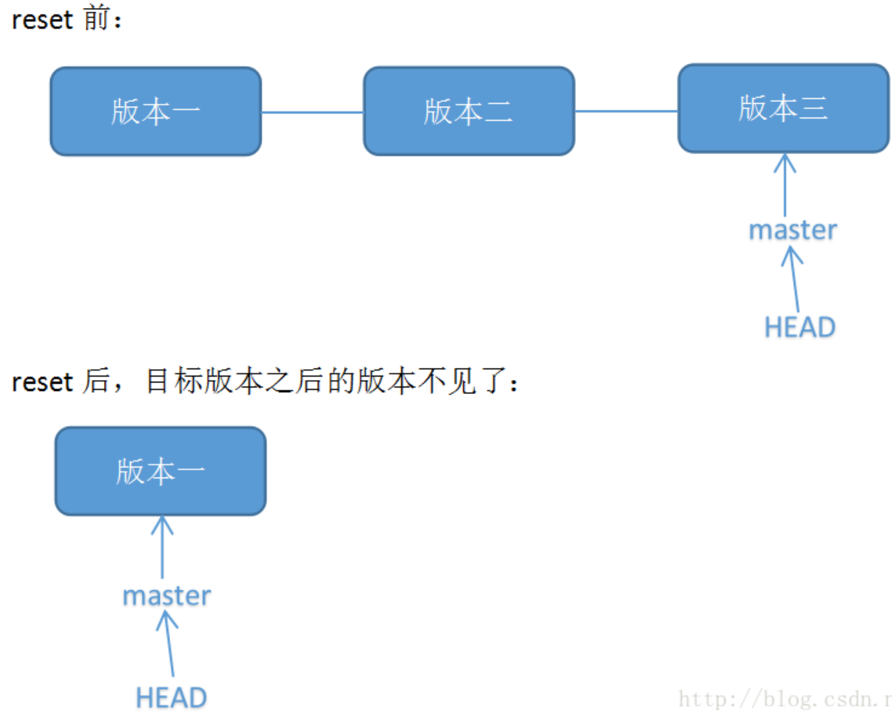

## 初始配置

```bash
# 1. 设置用户密码邮箱
git config --global user.name = 'dangbo'
git config -- global user.email = '1456131152@qq.com'

# 2. 配置公钥
ssh-keygen -t rsa -C 'email 地址'

# 3. 查看配置，配置都是保存在本地配置文件（.gitconfig）中，默认在当前用户的根目录
git config -l
```

## 基本操作

### 克隆

```bash
# 1. 默认分支(master)克隆
git clone <remote_url>
# 2. 指定分支克隆
git clone -b 远端分支名称 <remote_url>
# 3. idea 工具(http 协议)克隆
点击 VCS -> 选择 Get from version control
```

### 分支


```bash
# 1. 查看远端分支信息：
git remote show origin
git remote -vv

# 2. 创建分支
git branch 分支名称
# 3. 切换分支
git checkout 分支名称
# 4. 创建并切换分支
git checkout -b 分支名称

# 6. 本地分支和远端分支相关联，当远端新建分支时，本地也有分支时，相关联
git branch --set-upstream-to=origin/<远端分支名> 本地分支名
# 7. 远端新建（已有）分支，本地创建同名的分支开发任务，如果本地没有远程仓库对应的分支，但是又想拉取，就需要使用该命令，而不能使用git checkout -b 分支名
git checkout -t origin/dev
# 8. 远端新建（已有）分支，本地创建不同名的分支开发
git checkout -b 本地分支 远端分支

# 9. 删除远端分支
git push origin --delete 分支名
# 10. 删除分支
git branch -d 分支名
# 11. 强制删除分支
git branch -D 分支名
# 12. 初始化init仓库之后，关联远端仓库
git remote add <name> url

# 13. 重新设置远端仓库
git remote set-url origin xxxxx.git    # 覆盖的形式
git remote rm origin       # 先删后加
git remote add origin xxxxx.git

--allow-unrelated-histories       把两段不相干的 分支进行强行合并
```

### push 报错

1. 强制推送（名称不一致）：git push -u origin 本地分支:远程分支

   > git push -u origin master
   > 这种方式无需确保远端相应分支存在，因为不存在的话，会自动创建该分支并与本地分支进行关联
   > git push -u origin master -f 强制推送

2. 设置 upStream：git push --set-upstream 远端名称 远端分支

### 查看改动

```bash
git diff fileName  	# 对比工作目录和缓存区之间的不同
git diff --staged	# 暂存区和上一此提交之间的不同
git diff HEAD 		# 显示工作目录和上一次提交之间的不同，
git log    			# 查看提交记录，该记录只包含作者，日期，提交信息
git log -p 			# 查看每个commit的改动细节，包括改动文件每一行的细节
git log --stat 		# 查看改动了哪些文件
git show commit 	# 查看具体的改动内容

```

### 版本回退

`方式一：reset(不推荐)---> 重置到这个版本 ，通过移动head指针，reset之后，后边的版本就不存在了`

> 如果是多人协作，别人本地分支的版本是最新的，当别人再次 push 时，就会被重新填充，使用于回退自己本地仓库

 

```bash
git log 						         # 查看要回退的版本号
git reset --hard 版本号 		   # 版本号
git push -f -u origin develop  	# 强制push到对应的远程分支

git reset --mixed ：此为默认方式，不带任何参数的 git reset，即是这种方式，它回退到某个版本， 只保留源码，回退 commit 和 add 信息
git reset --soft：回退到某个版本， 只回退了 commit 的信息 。如果还要提交，直接 commit 即可
git reset --hard：彻底回退到某个版本，本地的源码也会变为上一个版本的内容，慎用！
```

`方式二：revert（推荐）---> 还原此版本做出的变更，只针对某一个版本`

> 不会把版本往前回退，而是生成一个新的版本。所以，你只需要让别人更新一下代码就可以了，你之前操作的提交记录也会被保留下来
>
> 适用场景： 如果我们想撤销之前的某一版本，但是又想保留该目标版本后面的版本，记录下这整个版本变动流程，就可以用这种方法。


```shell
git log 						# 找到误提交之前的版本号
git revert -n 版本号			  # 恢复
git commit -m "提交"
git push 推送到远程
```

### tag

> tag 是 git 版本库的一个标记，指向某个 commit 的指针
>
> tag 主要用于发布版本的管理，一个版本发布之后，我们可以为 git 打上 v.1.0.1...这样的标签。

tag 和 branch 区别

1. tag 对应某次 commit，是一个点，是不可移动的
2. branch 对应一系列 commit，是很多点连成的一根线，有一个 HEAD 指针，是可以依靠 HEAD 指针移动的。

```bash
# 1. 创建tag，基于本地当前分支的最后一个commit创建的tag
git tag <tagName>          # 创建本地tag
git push origin <origin>   # 推送到远程仓库
git push origin --tags     # 若存在很多未推送的本地标签，一次全部推送

# 2. 创建tag，基于某一个commit id创建的tag
git tag -a <tagName> <commitId> -m
git push origin <origin>

# 3. 查看标签
git show <tagName>      # 查看本地某个tag的详细信息
git tag
git tag -l              # 查看本地所有tag
git ls-remote --tags origin   # 查看远程所有的tag

# 4. 删除标签
git tag -d <tagName>    # 删除本地tag
git push origin :refs/tags/<tagName>   # 删除远程分支

# 5. 检出标签，先从远端仓库拉取代码，然后查看标签，最后检出对应标签的代码
git checkout <tagName>

# 6. 查看tag在哪个分支
git branch --contains tags/<tag>
```

### 合并分支

```bash
# 将开发分支代码合并到master
# 1. 进入要合并的分支
git checkout master
git pull
# 2. 查看所有分支是否都pull下来了
git branch -a
# 3. 使用merge合并开发分支
git merge 分支名
# 4. 查看合并之后的状态
git status
# 5. 有冲突的话，通过IDE解决冲突
# 6. 解决冲突之后，将冲突文件提交到暂存区
git add 冲突文件
# 7. 提交merge之后的结果
git commit
# 8.本地仓库代码提交到远程仓库
git push
```
