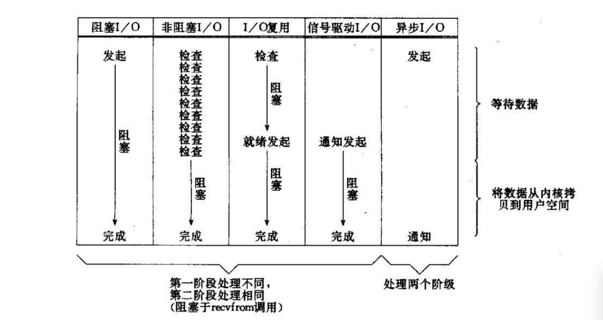

## 1. 并发和并行

- 并发是指**一个处理器**同时处理多个任务。
- 并行是指**多个处理器**或者是多核的处理器同时处理多个不同的任务。

并发是逻辑上的同时发生（simultaneous），而并行是物理上的同时发生。并行在多处理器系统中存在，而并发可以在单处理器和多处理器系统中都存在，并发能够在单处理器系统中存在是因为并发是并行的假象，并行要求程序能够同时执行多个操作，而并发只是要求程序假装同时执行多个操作（每个小时间片执行一个操作，多个操作快速切换执行）。

`并行(parallel)：`指在同一时刻，有多条指令在多个处理器上同时执行。就好像两个人各拿一把铁锨在挖坑，一小时后，每人一个大坑。所以无论从微观还是从宏观来看，二者都是一起执行的。

`并发(concurrency)：`指在同一时刻只能有一条指令执行，但多个进程指令被快速的轮换执行，使得在宏观上具有多个进程同时执行的效果，但在微观上并不是同时执行的，只是把时间分成若干段，使多个进程快速交替的执行。这就好像两个人用同一把铁锨，轮流挖坑，一小时后，两个人各挖一个小一点的坑，要想挖两个大一点得坑，一定会用两个小时。

## 2. 五种 IO 模型

1. BIO（Blocking I/O），同步阻塞 IO

BIO 是传统的 Java io 编程，其相关的类和接口在 java.io 包下。实现模式为一个连接一个线程，即当有客户端连接时，服务器端需为其单独分配一个线程，如果该连接不做任何操作就会造成不必要的线程开销。

一般使用多线程，主要原因在于 socket.accept()、socket.read()、socket.write()三个主要函数都是同步阻塞的，当一个连接在处理 I/O 的时候，系统是阻塞的，如果是单线程的话必然就挂死在那里；
但 CPU 是被释放出来的，开启多线程，就可以让 CPU 去处理更多的事情。其实这也是所有使用多线程的本质：

- 利用多核。
- 当 I/O 阻塞系统，但 CPU 空闲的时候，可以利用多线程使用 CPU 资源。

现在的多线程一般都使用线程池，可以让线程的创建和回收成本相对较低。在活动连接数不是特别高（小于单机 1000）的情况下，这种模型是比较不错的，可以让每一个连接专注于自己的 I/O 并且编程模型简单，
也不用过多考虑系统的过载、限流等问题。但面对十万甚至百万级连接的时候，传统的 BIO 模型是无能为力的。

2. NIO（new I/O、non-blocking I/O）同步非阻塞 IO

NIO 的相关类都放在 java.nio 包或其子包下，并对原先 java.io 包中许多类进行了改写。

同步非阻塞 IO 是在应用调用 recvfrom 读取数据时，如果该缓冲区没有数据的话，就会直接返回一个 EWOULDBLOCK 错误，不会让应用一直等待中。在没有数据的时候会即刻返回错误标识，那也意味着如果应用要读取数据就需要**不断的调用 recvfrom 请求**，直到读取到它数据要的数据为止。

**三大核心**

    1. 缓冲区（Buffer）

    NIO 是面向缓冲区, 或者说是面向块编程的。在 NIO 的 IO 传输中，数据会先读入到缓冲区，当需要时再从缓冲区写出，这样减少了直接读写磁盘的次数，提高了 IO 传输的效率。

    缓冲区(buffer)本质上是一个可以读写数据的内存块，即在内存空间中预留了一定的存储空间，这些存储空间用来缓冲输入和输出的数据，这部分预留的存储空间就叫缓冲区。

    2. 通道（Channel）

    在 NIO 程序中服务器端和客户端之间的数据读写不是通过流，而是通过通道来读写的。通道类似于流，都是用来读写数据的，但它们之间也是有区别的：

    - 通道是双向的，即可以读也可以写，而流是单向的，只能读或写

    - 通道可以实现异步读写数据

    - 通道可以从缓冲区读数据，也可以把数据写入缓冲区

    3. 选择器（Selector）

    在 NIO 程序中，可以用选择器 Selector 实现一个选择器处理多个通道，即一个线程处理多个连接。只要把通道注册到 Selector 上，就可以通过 Selector 来监测通道，如果通道有事件发生，便获取事件通道然后针对每个事件进行相应的处理。这样，只有在通道(连接)有真正的读/写事件发生时，才会进行读写操作，大大减少了系统开销，并且不必为每个连接创建单独线程，就不用去维护过多的线程。

4. 多路复用 IO

   - 为什么会产生多路复用 IO？

     因为当有多个网络连接，连接到某个进程的时候，我们想要监听这些 socket 接口，并当这些接口有数据返回的时候，进行处理。一种解决方案就是，对于每一个 socket 接口，我们都开辟一个线程来侦听，处理。这样做的局限就是，当连接数变大的时候（成千上万），那么我们就要创建多个线程变量。创建线程变量开销很大，而且，线程切换的开销也会变大。所以我们就寻求一种，**单线程的情况下监听多个 socket 接口的方式**，所以就会有多路复用 IO 的诞生。

     本质上还是同步非阻塞 IO，但是将阻塞放在了 select 上

5. 信号驱动 IO，继续改良复用 IO，思想是发出请求后等你数据准备好了就通知我

6. 异步 IO

   异步 IO 需要更强的操作系统支持；当用户线程收到通知时，数据已经被内核读取完毕，**并放在了用户线程指定的缓冲区内**，内核在 IO 完成后通知用户线程直接使用即可。

   
