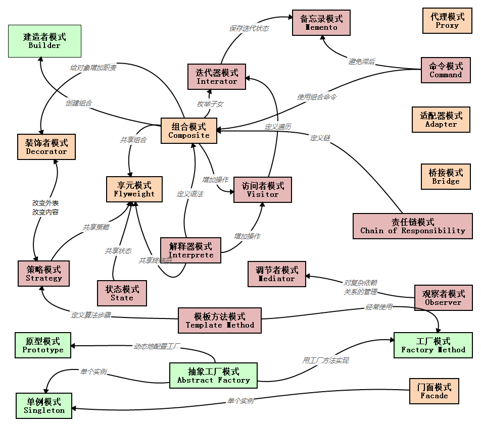

# 设计模式

## 1. 关系图

| 分类   | 设计模式                                                                                                                                                                                                                                                                           |
| ------ | ---------------------------------------------------------------------------------------------------------------------------------------------------------------------------------------------------------------------------------------------------------------------------------- |
| 创建型 | 单例模式（Singleton）、抽象工厂模式（AbstractFactory）、工厂方法模式（FactoryMethod）、建造者模式（Builder）、原型模式（Prototype）                                                                                                                                                |
| 结构型 | 适配器模式(Adapter)、桥接模式（Bridge）、组合模式（Composite）、装饰器模式（Decorator）、门面模式（Facade）、享元模式（Flyweight）、代理模式（Proxy）                                                                                                                              |
| 行为型 | 解释器模式（Interpreter）、模板方法模式（TemplateMethod）、责任链模式（ChainofResponsibility）、命令模式（Command）、迭代器模式（Iterator）、调解者模式（Mediator）、备忘录模式（Memento）、观察者模式（Observer）、状态模式（State）、策略模式（Strategy）、访问者模式（Visitor） |

## 2. 六大原则

1. 开闭原则（OpenClosePrinciple）

   开闭原则就是说对扩展开放，对修改关闭。在程序需要进行拓展的时候，不能去修改原有的代码，实现一个热插拔的效果。所以一句话概括就是：
   为了使程序的扩展性好，易于维护和升级。想要达到这样的效果，我们需要使用接口和抽象类，后面的具体设计中我们会提到这点。

2. 里氏代换原则（LiskovSubstitutionPrinciple）
   是面向对象设计的基本原则之一。里氏代换原则中说，任何基类可以出现的地方，子类一定可以出现。LSP 是继承复用的基石，只有当衍生类可以替换掉基类，软件单位的功能不受到影响时，基类才能真正被复用，而衍生类也能够在基类的基础上增加新的行为。里氏代换原则是对“开-闭”原则的补充。实现“开-闭”原则的关键步骤就是抽象化。而基类与子类的继承关系就是抽象化的具体实现，所以里氏代换原则是对实现抽象化的具体步骤的规范。

3. 依赖倒转原则（DependenceInversionPrinciple）

   这个是开闭原则的基础，具体内容：针对接口编程，依赖于抽象而不依赖于具体。

4. 接口隔离原则（InterfaceSegregationPrinciple）

   这个原则的意思是：使用多个隔离的接口，比使用单个接口要好。还是一个降低类之间的耦合度的意思，从这儿我们看出，其实设计模式就是一个软件的设计思想，从大型软件架构出发，为了升级和维护方便。所以上文中多次出现：降低依赖，降低耦合。

5. 迪米特法则（最少知道原则）（DemeterPrinciple）

   为什么叫最少知道原则，就是说：一个实体应当尽量少的与其他实体之间发生相互作用，使得系统功能模块相对独立。

6. 合成复用原则（CompositeReusePrinciple）

   原则是尽量使用合成/聚合的方式，而不是使用继承。
