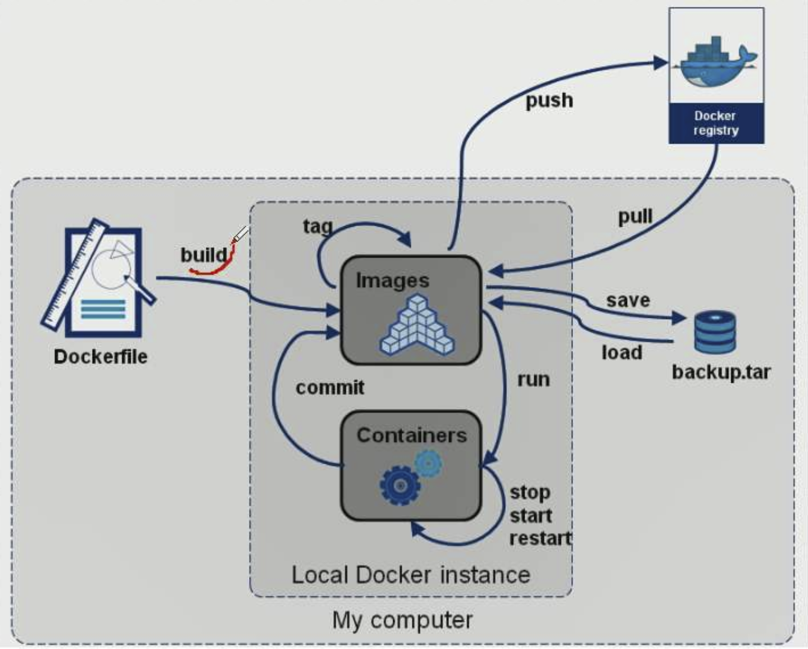
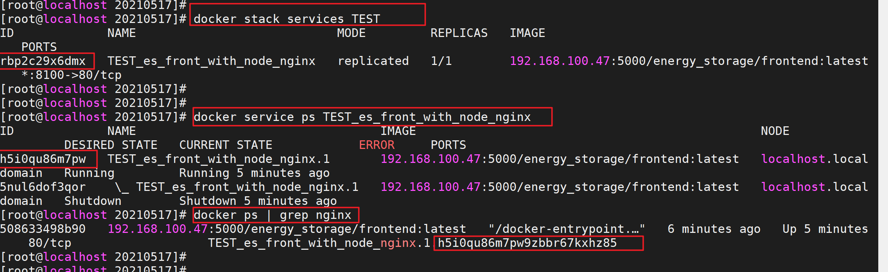
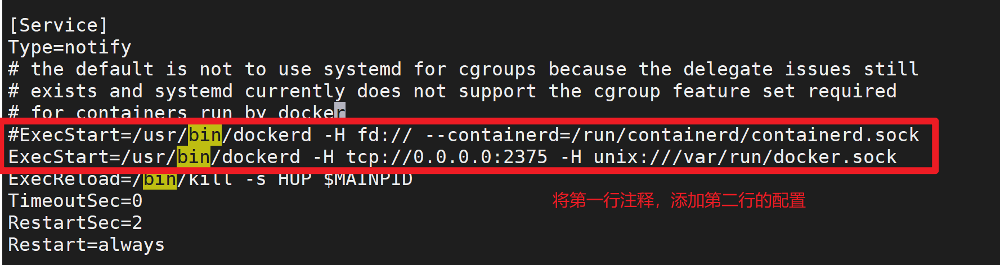
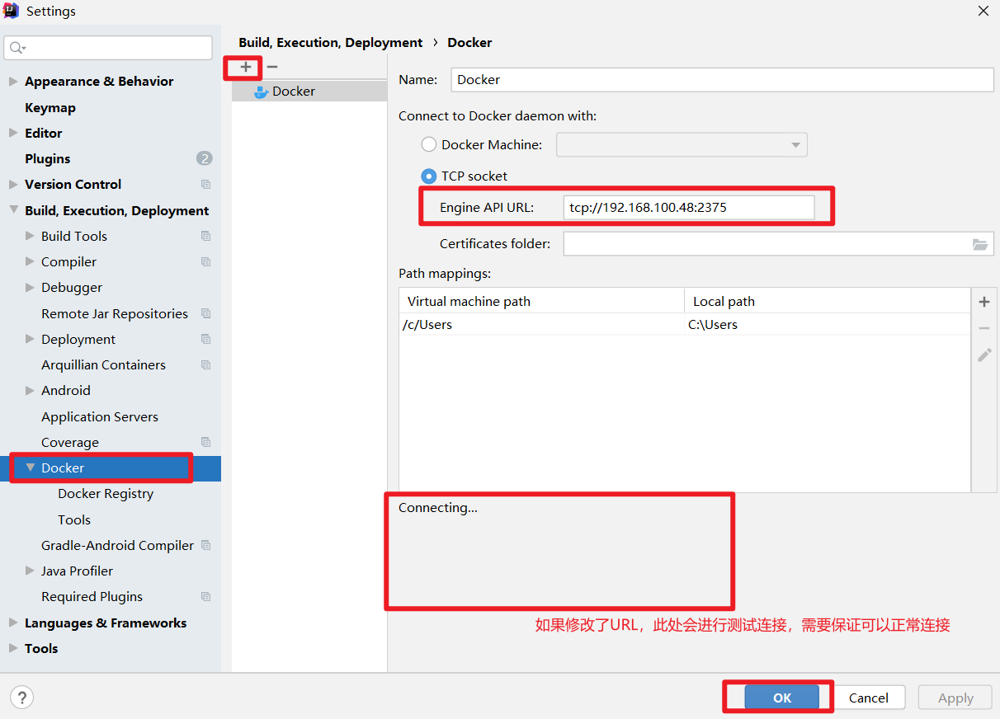

# docker

## 1. 概念

Docker 是一个开源的应用容器引擎，让开发者可以打包他们的应用以及依赖包到一个可移植的容器中，然后发布到任何流行的 Linux 机器上，也可以实现虚拟化。容器是完全使用沙盒机制，相互之间不会有任何接口(类似 iPhone 的 app)。几乎没有性能开销,可以很容易地在机器和数据中心中运行。最重要的是,他们不依赖于任何语言、框架或包装系统。

- 联合文件系统 UnionFs ：是一种分层、轻量级并且高性能的文件系统，他支持对文件系统的修改作为一次提交来一层层的叠加，同时可以将不同目录挂载到同一个虚拟文件系统下

- 分层技术

- 镜像 images ：镜像是一种轻量级、可执行的独立软件包，用来打包软件运行环境和基于运行环境开发的软件，他包含运行某个软件所需的所有内容，包括代码、运行时库、环境变量和配置文件。

  所有的应用，直接打包 docker 镜像，就可以直接跑起来！`Docker 镜像都是只读的，当容器启动时，一个新的可写层加载到镜像的顶部！`

- 容器 container

- 仓库 repository

- 服务 services

- docker 为什么比 jvm 快

  - docker 比 jvm 有更少的抽象层
  - docker 利用的是宿主机内核，而 jvm 需要客户操作系统 os，所以说，新建一个容器的时候，docker 不需要像虚拟机一样重新加载一个操作系统的内核，避免引导，虚拟机加载 Guest OS ，是分钟级别的，而 docker 是不需要这个过程的。

  

## 2. 安装

```shell
# 1、卸载旧版本，\表示换行
sudo yum remove docker \
                        docker-client \
                        docker-client-latest \
                        docker-common \
                        docker-latest \
                        docker-latest-logrotate \
                        docker-logrotate \
                        docker-engine
sudo yum remove docker-ce docker-ce-cli containerd.io
sudo rm -rf /var/lib/docker
# 2、安装依赖包
sudo yum install -y yum-utils
# 3、设置镜像的仓库、更新yum软件包索引
yum-config-manager --add-repo http://mirrors.aliyun.com/docker-ce/linux/centos/docker-ce.repo
yum makecache fast
# 4、安装docker相关的源 docker-ce 社区 ee 企业版
yum install docker-ce docker-ce-cli containerd.io   # docker的默认工作路径：/var/lib/docker，--installroot=[file]指定安装位置
# 5、启动docker
systemctl start docker
service docker start
# 6、查看是否安装成功
docker version
# 7、 配置镜像加速器
vim /etc/docker/daemon.json
{
	registry-mirrors:["***"]
}
sudo systemctl daemon-reload
sudo systemctl restart docker
# 8、docker run hello-world
```

## 3. 基础命令

```shell
# 1. 帮助命令
docker verison/info/--help

# 2. 镜像
docker search <name>     # 搜索
# 默认情况下会从docker hub拉取镜像文件，也可以从私有仓库地址拉取镜像。私有仓库地址类似一个URL，但是没有协议头http:// （docker与各个仓库地址默认以https://来通信，除非该仓库地址允许以不安全的链接方式访问）
docker pull <name>       # docker pull 192.168.100.79:5000/xxx:latest
docker images            # 列出所有镜像，-a 包括隐藏的中间镜像
docker rmi -f <imageId...>            # 删除指定镜像，可以多个
docker rmi -f $(docker images -aq)    # 删除所有镜像
docker history <imageId> 	            # 查看镜像分层信息
docker login                          # 登录
docker push                           # 推送
docker tag SOURCE_IMAGE[:TAG] TARGET_IMAGE[:TAG]    # 创建一个引用原镜像的镜像，重命名，打tag

# 3. 容器
docker run -it --name=xxx -p xx:xx <images>
	# --name='name' 容器名
	# -d 后台方式运行，（常见的坑）后台运行时可以会导致服务停止，因为容器使用后台运行，就必须要有一个前台进程，docker发现没有应用，就会自动停止。
	# -it 使用交互方式运行，进入容器查看分区
	# -p 指定端口      格式： -p ip:主机端口:容器端口
	# -P 随机分配端口
  # -e 环境配置，比如mysql设置密码 -e MYSQL_ROOT_PASSWORD=123456
  # --restart  重启策略，重启是由Docker守护进程完成的；no默认策略，容器退出时不重启容器、on-failure容器非正常退出时才会重启、on-failure:3 容器非正常退出时最多重启三次、always容器退出时总是重启、unless-stopped容器退出时总是重启，但不考虑Docker守护进程启动时就已经停止了的容器
exit 			      	# 直接容器停止并退出
Ctrl + P + Q      # 容器不停止退出
docker ps 		  	# 列出所有运行的容器，-a 列出停止的容器，-n 显示最近创建的容器(包括所有状态)
docker rm -f <containerId>       # 删除指定容器
docker rm -f $(docker ps -aq)    # 删除所有容器，等同于 docker ps -aq | xargs docker rm
docker start <containerId>       # 启动容器
docker restart <containerId>     # 重启容器
docker stop <containerId>        # 停止当前正在运行的容器
docker kill <containerId>        # 强制停止当前容器
docker exec -it <containerId> /bin/bash		# 进入容器后开启一个新的终端，可以在里面操作(常用)
docker attach <containerId>				      	# 进入容器正在执行的终端，不会启动新的进程

docker logs -f -t --tail 20 <container>	  # 查看日志 -f 滚动输出、-t 展示时间、--tail 最后的20行。
docker logs <container> >> log_error.txt  # 日志写到文件中。
docker inspect xxxx			                  # 查看容器/镜像元数据，比如日志文件路径等
docker top 容器id 	                      # 查看容器中的进程信息

docker cp [r] 容器id :容器内路径 目的地主机路径           # 容器内拷贝到宿主机上，-r 递归拷贝
docker commit -m="描述信息" -a="作者" 容器id  镜像名:TAG	# 提交容器成为一个新的副本(镜像)

docker save 镜像id xxx.tar  # 将仓库中的镜像导出成tar格式的文件
docker load -i xxx.tar      # 将tar格式的镜像文件导入到本地镜像仓库
docker image prune          # 删除所有未被 tag 标记和未被容器使用的镜像（既没有标签名也没有容器引用的镜像），-a 删除所有未被容器使用的镜像
# 监控容器资源消耗
docker stats [OPTIONS] [CONTAINER...]   # 默认情况下，每隔1s刷新一次输出内容，--no-stream 只输出当前状态（输出一次），--format 按照自定义格式输出，table或json
docker stats --no-stream --format "table {{.Name}}\t{{.ID}}\t{{.CPUPerc}}\t{{.MemUsage}}\t{{.NetIO}}\t{{.BlockIO}}\t{{.MemPerc}}\t{{.PIDs }}"
docker stats --no-stream --format "{\"container\":\"{{.Container}}\"}"
```

## 4. 容器数据卷

```shell
数据可以持久化
# -v 挂载
# volumn
匿名挂载  -v 容器内路径!
具名挂载  -v 卷名:容器内路径
docker volume ls  # 查询
# 通过 -v 容器内路径： ro rw 改变读写权限
docker run -d -P --name nginx05 -v juming:/etc/nginx:ro nginx
~~~~~~~~~~~~~~~~~~~~~~~~~~~~~~~~~~~~~~~~~~~~~~~~~~~~~~~~~~~~~~~~~~~~~~~~~~~~~~~~~~~~~~~~~~~~~~~

# eg: nginx
-v /etc/local/nginx/html:/usr/share/nginx/html
-v /etc/local/nginx/conf/nginx.conf:/etc/nginx/nginx.conf
-v /etc/local/nginx/logs:/var/log/nginx/
```

## 5. dockerFile



- 编写 dockerFile 文件，名字可以随便 建议 Dockerfile
- docker build 构建成为一个镜像
- docker run 运行镜像
- docker push 发布镜像（dockerhub、阿里云仓库）

```shell
FROM			    # 基础镜像，一切从这里开始构建
MAINTAINER		# 镜像作者 dangbo<1456131152@qq.com>
RUN				    # 镜像构建的时候需要运行的命令
ADD				    # 步骤，tomcat镜像，这个tomcat压缩包！添加内容 添加同目录
WORKDIR			  # 镜像的工作目录
VOLUME		  	# 挂载的目录
EXPOSE		  	# 保留端口配置
CMD			    	# 指定这个容器启动的时候要运行的命令，只有最后一个会生效，可被替代。
ENTRYPOINT		# 指定这个容器启动的时候要运行的命令，可以追加命令
ONBUILD		  	# 当构建一个被继承 DockerFile 这个时候就会运行ONBUILD的指令，触发指令。
COPY		    	# 类似ADD，将我们文件拷贝到镜像中
ENV			    	# 构建的时候设置环境变量！

FROM centos
MAINTAINER dangbo<1456131152@qq.com>
EMV MYPATH /usr/local
WORKDIR $MYPATH
RUN yum -y install vim
RUN yum -y install net-tools

EXPOSE 80

CMD echo $MYPATH
CMD echo "-----end----"
CMD /bin/bash

# 2.通过这个文件构建镜像
# 命令 docker build -f 文件路径 -t 镜像名:[tag] .
docker build -f mydockerfile-centos -t mycentos:0.1 .

Successfully built 4af56313b71a
Successfully tagged mycentos:0.1

# 3.测试运行
```

## 6. 网络

```shell
# 我们直接启动的命令
docker run -d -P --name tomcat01 tomcat
docker run -d -P --name tomcat01 --net bridge tomcat

# docker0特点：默认，域名不能访问，--link可以打通连接

# 我们可以自定义一个网络
# --driver bridge
# --subnet 192.168.0.0/16    子网
# --gateway 192.168.0.1      网关
[root@AlibabaECS ~]# docker network create --driver bridge --subnet 192.168.0.0/16 --gateway 192.168.0.1 mynet
dd7c8522864cb87c332d355ccd837d94433f8f10d58695ecf278f8bcfc88c1fc
[root@AlibabaECS ~]# docker network ls
NETWORK ID          NAME                DRIVER              SCOPE
04038c2f1d64        bridge              bridge              local
81476375c43d        host                host                local
dd7c8522864c        mynet               bridge              local
64ba38c2cb2b        none                null                local

```

## 7. docker-compose

Docker Compose 负责实现对 Docker 容器集群的快速编排。将所管理的容器分为三层，分别是工程（project）、服务（service）、容器（container），运行目录下的所有文件（docker-compose.yml）组成一个工程，一个工程包含多个服务，每个服务中定义了容器运行的镜像、参数、依赖，一个服务可包括多个容器实例。

**安装**

```shell
# 下载docker-compose文件，如果报错，直接到官网下载，之后将名称改为docker-compose即可
curl -L https://github.com/docker/compose/releases/download/1.18.0/docker-compose-`uname -s`-`uname -m` -o /usr/local/bin/docker-compose
# 赋予权限
chmod +x /usr/local/bin/docker-compose
# 查看版本，用来检查安装是否成功
docker-compose version
```

**常用命令**

```shell
# 执行命令，是针对项目工程而言的，必须在对应的目录下执行
docker-compose build [options] [SERVICE...]				# 构建或重新构建服务，–force-rm删除构建过程中的临时容器
docker-compose config [SERVICE]                   # 验证Compose文件格式是否正确
docker-compost up -d [options] [SERVICE...]	      # 部署一个Compose应用，默认读取 docker-compose.yaml/yml 文件，-f 指定其他文件名，-d 应用在后台启动

docker-compose ls                                 # 列出所有项目
docker-compose ps	[SERVICE...]				            # 列出项目中目前的所有容器


docker-compose stop [options] [SERVICE...]        # 停止Compose应用相关的服务容器，如果不加参数和服务名，则停止所有的服务容器
docker-compose start [options] [SERVICE...]  			# 启动已经存在的服务容器
docker-compose restart [options] [SERVICE...]			# 重启项目中的服务
docker-compose down [options] [SERVICE...]        # 停止和删除容器、网络，–rmi all/local删除所有或镜像名为空的镜像 -v 删除卷
docker-compose rm [options] [SERVICE...] 		      # 删除所有（停止状态的）服务容器，-f 强制删除，推荐先执行stop停止容量，再删除
docker-compose logs	[options] [SERVICE...]				# 查看服务容器日志的输出
docker-compose kill                       	      # 通过发送SIGKILL信号来强制停止服务容器，-s指定发送的信号

docker-compose port SERVICE PRIVATE_PORT          # 显示某个容器端口所映射的公共端口
```

**区别**

|          | docker stack                                                                                                                | docker-compose                                                                                                                    |
| -------- | --------------------------------------------------------------------------------------------------------------------------- | --------------------------------------------------------------------------------------------------------------------------------- |
| 开发语言 | go 语言                                                                                                                     | python 语言                                                                                                                       |
| 支持版本 | 只支持 version3 以上版本                                                                                                    | 都可以                                                                                                                            |
| 安装     | Swarm 模式已经在 1.12 中集成到 Docker Engine 中，docker stack 是 swarm mode 的一部分, 即使是单机使用, 也需要一个 swarm 节点 | 需要额外的安装                                                                                                                    |
| 命令     | docker stack deploy -c docker-compose.yml serviceName                                                                       | docker-compose up -d -f docker-compose.yml                                                                                        |
| 作用     | 适合于迭代开发、测试和 快速验证原型                                                                                         | 适用于开发、测试环境的容器编排工具                                                                                                |
| 区别     | 通过 deploy，构建服务，不支持 build，无法使用 stack 命令构建 build 新镜像，它是需要镜像是预先已经构建好的。                 | 通过 build，构建服务;更适合于开发场景，不支持 deploy，所以在 yml 中使用 deploy 就会报错，可以是镜像，也可以和 Dockerfile 配合使用 |

## 8. docker stack

stack 和 compose 作用大体相同，都能操纵 compose.yml 文件中定义的 services、volumes 、networks 资源

- docker-compose 更像是被定义为单机容器编排工具；

- docker stack 被定义为适用于生产环境的编排工具，强化了（复制集、 容器重启策略、回滚策略、服务更新策略）等生产特性；docker stack 几乎能做 docker-compose 所有的事情 （生产部署 docker stack 表现还更好），docker stack 是进阶 docker swarm 的必经之路，docker stack 可认为是单机上的负载均衡部署； 可认为是多节点集群部署（docker swarm）的特例。

**常用命令**

```bash
# 部署stack
docker stack deploy -c stackFile路径 service名 --with-registry-auth  # -c 路径，--with-registry-auth 向swarm代理发送Registry认证详细信息
# 查询stack列表
docker stack ls
# 查询stack服务列表
docker stack services <stack_name>名称
# 查询某个服务中的容器运行状态
docker service ps <service_name>名称
# stack删除
docker stack rm <stack_name>名称
# 重启某个服务
docker service update --force <service_name>名称
# 移除stack(下面所有的service会被移除)
docker stack down xxx
```



**举例**

```yaml
version: '3.2'

services:
  reverse_proxy:
    image: dockersamples/atseasampleshopapp_reverse_proxy
    ports:
      - '80:80'
      - '443:443'
    secrets:
      - source: revprox_cert
        target: revprox_cert
      - source: revprox_key
        target: revprox_key
    networks:
      - front-tier

  database:
    image: dockersamples/atsea_db
    environment:
      POSTGRES_USER: gordonuser
      POSTGRES_DB_PASSWORD_FILE: /run/secrets/postgres_password
      POSTGRES_DB: atsea
    networks:
      - back-tier
    secrets:
      - postgres_password
    deploy:
      placement:
        constraints:
          - 'node.role == worker'

  appserver:
    image: dockersamples/atsea_app
    networks:
      - front-tier
      - back-tier
      - payment
    deploy:
      replicas: 2
      update_config:
        parallelism: 2
        failure_action: rollback
      placement:
        constraints:
          - 'node.role == worker'
      restart_policy:
        condition: on-failure
        delay: 5s
        max_attempts: 3
        window: 120s
    secrets:
      - postgres_password

  visualizer:
    image: dockersamples/visualizer:stable
    ports:
      - '8001:8080'
    stop_grace_period: 1m30s
    volumes:
      - '/var/run/docker.sock:/var/run/docker.sock'
    deploy:
      update_config:
        failure_action: rollback
      placement:
        constraints:
          - 'node.role == manager'

  payment_gateway:
    image: dockersamples/atseasampleshopapp_payment_gateway
    secrets:
      - source: staging_token
        target: payment_token
    networks:
      - payment
    deploy:
      update_config:
        failure_action: rollback
      placement:
        constraints:
          - 'node.role == worker'
          - 'node.labels.pcidss == yes'

networks:
  front-tier:
  back-tier:
  payment:
    driver: overlay
    driver_opts:
      encrypted: 'yes'

secrets:
  postgres_password:
    external: true
  staging_token:
    external: true
  revprox_key:
    external: true
  revprox_cert:
    external: true
```

## 9. 私有仓库（registry）

Docker 官方提供了公共的镜像仓库（Docker Hub），但是从安全和效率等方面考虑，在大多数公司都会部署私有环境内的 Registry。其实 Docker 官方也提供了一个私有镜像仓库 docker Registry，安装部署容易，安装一个 Registry 容器就可以使用。但是 Registry 缺点比较明显：

1. 没有图形界面
2. 没有项目管理
3. 没有用户权限控制
4. 看不到镜像操作记录

目前比较常见的有几种：Harbor、hyper/docker-registry-web UI 展示、portainer 可视化管理，最常用的是 Harbor，他是由 VMware 公司开源的企业级的 Docker Registry 管理项目，它以 Docker 公司开源的 Registry 为基础，帮助用户迅速搭建一个企业级的 docker Registry 服务；Harbor 提供了如下功能：

1. 基于角色的访问控制(Role Based Access Control)
2. 基于策略的镜像复制(Policy based image replication)
3. 镜像的漏洞扫描(Vulnerability Scanning)
4. AD/LDAP 集成(LDAP/AD support)
5. 镜像的删除和空间清理(Image deletion & garbage collection)
6. 友好的管理 UI(Graphical user portal)
7. 审计日志(Audit logging)
8. RESTful API
9. 部署简单(Easy deployment)

**registry**

```shell
# 拉取、启动、测试
docker pull registry
docker run -it --name registry -p 5000:5000 -v /usr/local/registry/:/var/lib/registry registry:latest
http://{ip}:5000/v2             # 正常情况时，会返回 {}
http://{ip}:5000/v2/_catalog    # 所有的镜像
docker tag <sourceImage:tag> <targerImage:tag> # 将原镜像重命名，因为如果要将镜像push到私有仓库，就必须按照格式命名：ip:port/imageName:tag
docker push <targerImage:tag>
# 使用hyper/docker-registry-web
docker pull hyper/docker-registry-web
docker run -d -p 5001:8080 --name regisry-web --link registry -e registry_url=http://registry:5000/v2 -e registry_name=localhost:5000 hyper/docker-registry-web:latest
```

**horbar**

- [安装 docker-compose](#7-docker-compose)
- 官网下载 harbor
- ./install.sh
- 开机自启动 docker-compose start

## 10. IDEA 集成 Docker 的远程访问

1. 修改 docker 配置文件并重启：
   - 配置文件：`/lib/systemd/system/docker.service`
   - 重启命令：`systemctl restart docker`
   - 命令：`ExecStart=/usr/bin/dockerd -H tcp://0.0.0.0:2375 -H unix:///var/run/docker.sock`



2. 防火墙开启 2375 端口

3. 远程测试自验：http://docker 宿主机 ip:2375/version
4. idea 配置 docker



## 11. gitlab 集成 cicd

1. 仓库根目录 创建一个.gitlab-ci.yml 文件
2. 安装 gitlab-runner

## 12. Reids 集群实战部署

```shell
#先创建一个redis的网卡
docker network create --driver bridge --subnet 192.167.0.0/16 --gateway 192.167.0.1 redis
#编写创建redis配置的脚本
for port in $(seq 1 6); \
do \
mkdir -p /mydata/redis/node-${port}/conf
touch /mydata/redis/node-${port}/conf/redis.conf
cat <<EOF>>/mydata/redis/node-${port}/conf/redis.conf
port 6379
bind 0.0.0.0
cluster-enabled yes
cluster-config-file nodes.conf
cluster-node-timeout 5000
cluster-announce-ip 192.167.0.1${port}
cluster-announce-port 6379
cluster-announce-bus-port 16379
appendonly yes
EOF
done
#启动redis集群
for port in $(seq 1 6); \
do \
docker run -p 637${port}:6379 -p 1637${port}:16379 --name=redis-${port} -v /mydata/redis/node-${port}/data:/data -v /mydata/redis/node-${port}/conf/redis.conf:/etc/redis/redis.conf -d --net redis --ip 192.167.0.1${port} redis:5.0.9-alpine3.11 redis-server /etc/redis/redis.conf
done


docker run -p 6371:6379 -p 16371:16379 --name=redis-1 -v /mydata/redis/node-1/data:/data -v /mydata/redis/node-1/conf/redis.conf:/etc/redis/redis.conf -d --net redis --ip 192.167.0.11 redis:5.0.9-alpine3.11 redis-server /etc/redis/redis.conf
#创建集群
docker exec -it redis-1 /bin/sh
redis-cli --cluster create 192.167.0.11:6379 192.167.0.12:6379 192.167.0.13:6379 192.167.0.14:6379 192.167.0.15:6379 192.167.0.16:6379 --cluster-replicas 1
```
